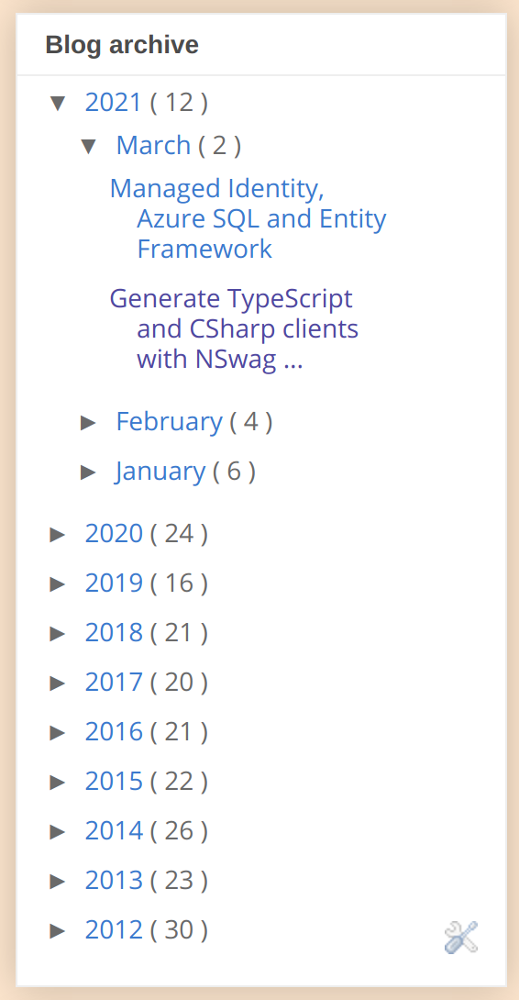

# blog.johnnyreilly.com

This repo contains the source code for John Reilly's blog. It is published to two locations:

- https://blog.johnnyreilly.com - which is hosted on Blogger and lived there for a long time
- https://blog.priou.co.uk - an experimental deployment of the blog to GitHub Pages using [Docusaurus](https://v2.docusaurus.io/)

GitHub Actions do the publication.

## Migrating to Docusauras permanently?

This blog has lived on Blogger since it began. Docusaurus represents a modern way forward which is "blog as code" by default. This appeals to my sensibilities. There's a number of things to consider before I would make the move.  Let's go through them:

- [x] If I migrate across, I'd a custom domain working with GitHub Pages. This is possible; this blog was helpful: https://deanattali.com/blog/multiple-github-pages-domains/ 

  This has now been tested with https://blog.priou.co.uk https://github.com/johnnyreilly/blog.johnnyreilly.com/pull/11

- [x] Analytics - I should start using Google Analytics to track traffic.

  Done.

- [x] RSS feeds - [Blogger](https://blog.johnnyreilly.com/rss.xml) provides an RSS feed. Docusaurus should too.

  [Docusaurus](https://blog.priou.com/rss.xml) has one too. People who subscribe to the current feed would be disrupted by moving.  I can give a personal heads up but it will have an impact on traffic in the short term at least.  I think that's probably okay.

- [x] Redirects - I'd like to create redirects from old URLs to the new ones. So from https://blog.johnnyreilly.com/2021/03/managed-identity-azure-sql-and-entity.html to the new URL. This could work: https://v2.docusaurus.io/docs/api/plugins/@docusaurus/plugin-client-redirects

  Implemented here: https://github.com/johnnyreilly/blog.johnnyreilly.com/pull/14

- [x] Docusaurus doesn't have an equivalent for Bloggers "Blog Archive". This is really valuable for discovering older blog posts quickly.  I'd like this to exist prior to making the move.  I often dive back into older posts and so value it.  A screenshot of the Blogger one is below - the code for the "recent posts" functionality in Docusaurus which seems to be the closest thing to this can be found here: https://github.com/facebook/docusaurus/blob/master/packages/docusaurus-plugin-content-blog/src/index.ts

  I've managed to roll my own for now. https://github.com/johnnyreilly/blog.johnnyreilly.com/pull/18

  

- [ ] Comments - My comments are on Disqus and so should be portable. However, there doesn't seem to be a mechanism for Disqus in Docusaurus as yet. Maybe it's fine to live without.