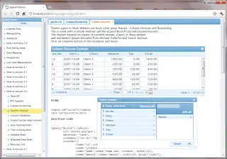
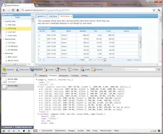

The year was 2010 (not really that long ago I know) and the project that I was working on was sorely in need of a new grid component. It was an [ASP.NET WebForms](http://www.asp.net/web-forms) project and for some time we'd been using what was essentially a glorified [datagrid](http://msdn.microsoft.com/en-us/library/system.web.ui.webcontrols.datagrid.aspx) which had a few extra features implemented to allow us to change column order / columns displayed / copy contents to clipboard etc. Our grid worked perfectly fine - it gave us the functionality we needed. However, it looked pretty terrible, and had some "quirky" approaches in place for supporting IE and Firefox side by side. Also, at the time we were attempting to make our app seem new and exciting again for the users. The surprising truth is that users seem to be more impressed with a visual revamp than with new or amended functionality. So I was looking for something which would make them sit up and say "oooh - isn't it pretty!". Unfortunately the nature of the organisation I was working for was not one that lended itself to paying for components. They were occasionally willing to do that but the hoops that would have to be jumped through first, the forms that would need to be signed in triplicate by people that had nearly nothing to do with the project made that an unattractive prospect. So I began my search initially looking at the various open source offerings that were around. As a minimum I was looking for something that would do what our home-grown component did already (change column order / columns displayed / copy contents to clipboard etc) but hopefully in a "nicer" way. Also, I had long been unhappy with the fact that to get our current grid to render results we did a \***full postback**\* to the server and re-rendered the whole page. Pointless! Why should you need to do all this each time when you only wanted to refresh the data? Instead I was thinking about using an [Ajax](http://en.wikipedia.org/wiki/Ajax_%28programming%29) approach; a grid that could just get the data that it needed and render it to the client. This seemed to me a vastly "cleaner" solution - why update a whole screen when you only want to update a small part of it? Why not save yourself the trouble of having to ensure that all other screen controls are persisted just as you'd like them after the postback? I also thought it was probably something that would scale better as it would massively reduce the amount of data moving backwards and forwards between client and server. No need for a full page life cycle on the server each time the grid refreshes. Just simple data travelling down the pipes of web. With the above criteria in mind I set out on my Google quest for a grid. Quite soon I found that there was a component out there which seemed to do all that I wanted and far more besides. It was called [jqGrid](http://www.trirand.com/blog/):

<!--truncate-->

Oooh look at the goodness! It had both column re-ordering and column choosing built in!: This was a \***very promising sign**\*! Now it's time for me to demonstrate my ignorance. According to the website this grid component was a "jQuery plugin". At the time I read this I had no idea what jQuery was at all - let alone what a plugin for it was. Anyway, I don't want to get diverted so let's just say that reading this lead to me getting an urgent education about some of the client side aspects of the modern web that I had been previously unaware of. I digress. This component did exactly what I wanted in terms of just sending data down the pipe. jqGrid worked with a whole number of possible data sources; XML, Array but the most exciting for me was obviously [JSON](http://www.json.org/). Take a look a the grid rendered below and the JSON that powered it (all from a simple [GET](http://www.trirand.com/blog/jqgrid/server.php?q=2&_search=false&nd=1326531357333&rows=10&page=1&sidx=id&sord=desc) request):

As you can see from the above screenshot, the grid has populated itself using the results of a web request. The only information that has gone to the server are the relevant criteria to drive the search results. The only information that has come back from the server is the data needed to drive the grid. Simple. Beautiful. I loved it and I wanted to use it. So I did! I had to take a few steps that most people thinking about using a grid component probably wont need to. First of all I had to write an ASP.Net WebForms wrapper for jqGrid which could be implemented in a similar way to our current custom datagrid. This was because, until the users were convinced that the new grid was better than the old both had to co-exist in the project and the user would have the option to switch between the two. This WebForms wrapper plugged into our old school XML column definition files and translated them into JSON for the grid. It also took [datasets](http://msdn.microsoft.com/en-us/library/system.data.dataset.aspx) (which drove our old grid) and translated them into jqGrid-friendly JSON. I wanted to power the jqGrid using WebMethods on ASPX's. After a little digging I found [Dave Ward of Encosia's post](http://encosia.com/using-jquery-to-directly-call-aspnet-ajax-page-methods/) which made it very simple (and in line with this I switched over from [GET](http://en.wikipedia.org/wiki/GET_%28HTTP%29#Request_methods) requests to [POSTs](http://en.wikipedia.org/wiki/POST_%28HTTP%29)). Finally I wrote some custom javascript which added a button to jqGrid which, if clicked, would copy the contents of the jqGrid to the clipboard (this was the only bit of functionality that didn't appear to be implemented out of the box with jqGrid). I think I'm going to leave it there for now but I just wanted to say that I think jqGrid is a fantastic component and it's certainly made my life better! It's: - well supported, there is lots on [StackOverflow](http://stackoverflow.com/questions/tagged/jqgrid) and the like about it

- there are regular [releases / upgrades](http://www.trirand.com/blog/)
- there are good online [demonstrations](http://trirand.com/blog/jqgrid/jqgrid.html) and [documentation](http://www.trirand.com/jqgridwiki/doku.php)

I think Tony Tomov (the man behind jqGrid) has come up with something truly brilliant. It's worth saying that the equally brilliant jQueryUI team are in the process of writing an official [jQuery UI grid component](http://wiki.jqueryui.com/w/page/34246941/Grid) which uses jqGrid as one of its inspirations. However, this is still a long way from even a "zero feature" release. In the meantime jqGrid is continuing to go from strength to strength and as such I heartily recommend it. Finally, you can take a look at jqGrid's source on [GitHub](https://github.com/tonytomov/jqGrid).
