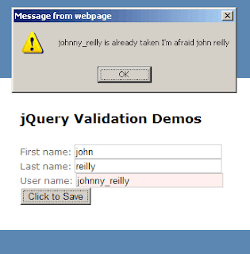

Just recently I have been particularly needing to make use of remote / server-side validation in my ASP.NET MVC application and found that the unobtrusive way of using this seemed to be rather inadequately documented (of course it's possible that it's well documented and I just didn't find the resources). Anyway I've rambled on much longer than I intended to in this post so here's the TL;DR:

<!--truncate-->

- You \***can**\* use remote validation driven by unobtrusive data attributes
- Using remote validation you can supply \***multiple**\* parameters to be evaluated
- It is possible to block validation and force it to be re-evaluted - although using a slightly hacky method which I document here. For what it's worth I acknowledge up front that this is \***not**\* an ideal solution but it does seem to work. I really hope there is a better solution out there and if anyone knows about it then please get in contact and let me know.

Off we go... So, jQuery unobtrusive validation; clearly the new cool right?

I'd never been particularly happy with the validation that I had traditionally been using with ASP.NET classic. It worked... but it always seemed a little... clunky? I realise that's not the most well expressed concern. For basic scenarios it seemed fine, but I have recollections of going through some pain as soon as I stepped outside of the basic form validation. Certainly when it came to validating custom controls that we had developed it never seemed entirely straightforward to get validation to play nice.

Based on this I was keen to try something new and the opportunity presented itself when we started integrating MVC into our classic WebForms app. (By the way if you didn't know that MVC and ASP.NET could live together in perfect harmony, well, they can! And a good explanation on how to achieve it is offered by Colin Farr [here](http://www.britishdeveloper.co.uk/2011/05/convert-web-forms-mvc3-how-to.html).)

Jörn Zaefferer came out with the [jQuery validation plug-in](http://bassistance.de/jquery-plugins/jquery-plugin-validation/) way back in 2006. And mighty fine it is too. Microsoft (gor' bless 'em) really brought something new to the jQuery validation party when they came out with their unobtrusive javascript validation library along with MVC 3. What this library does, in short, is allows for jQuery validation to be driven by `data-val-*` attributes alone as long as the [jquery.validate.js](http://ajax.aspnetcdn.com/ajax/jquery.validate/1.9/jquery.validate.js) and [jquery.validate.unobtrusive.js](http://ajax.aspnetcdn.com/ajax/mvc/3.0/jquery.validate.unobtrusive.js) libraries are included in the screen (I have assumed you are already including jQuery). I know; powerful stuff!

A good explanation of unobtrusive validation is given by Brad Wilson [here](http://bradwilson.typepad.com/blog/2010/10/mvc3-unobtrusive-validation.html).

Anyway, to my point: what about remote validation? That is to say, what about validation which needs to go back to the server to perform the necessary tests? Well I struggled to find decent examples of how to use this. Those that I did find seemed to universally be php examples; not so useful for an ASP.NET user. Also, when I did root out an ASP.NET example there seemed to be a fundamental flaw. Namely, if remote validation hadn't been triggered and completed successfully then the submit could fire anyway. This seems to be down to the asynchronous nature of the test; ie because it is \***not**\* synchronous there is no "block" to the submit. And out of the box with unobtrusive validation there seems no way to make this synchronous. I could of course wire this up manually and simply side-step the restrictions of unobtrusive validation but that wasn't what I wanted.

\*\*\*Your mission John, should you decide to accept it, is this: <u>block the submit until remote validation has completed successfully</u>

. As always, should you or any of your I.M. Force be caught or killed, the Secretary will disavow any knowledge of your actions.\*\*\*

So that's what I wanted to do. Make it act like it's synchronous even though it's asynchronous. Bit horrible but I had a deadline to meet and so this is my pragmatic solution. There may be better alternatives but this worked for me.

First of all the HTML:

```html
<form
  action="/Dummy/ValidationDemo.mvc/SaveUser"
  id="ValidationForm"
  method="post"
>
  First name:
  <input
    data-val="true"
    data-val-required="First Name required"
    id="FirstName"
    name="FirstName"
    type="text"
    value=""
  />

  Last name:
  <input
    data-val="true"
    data-val-required="Last Name required"
    id="LastName"
    name="LastName"
    type="text"
    value=""
  />

  User name:
  <input
    id="UserName"
    name="UserName"
    type="text"
    value=""
    data-val="true"
    data-val-required="You must enter a user name before we can validate it remotely"
    data-val-remote="&amp;#39;UserNameInput&amp;#39; is invalid."
    data-val-remote-additionalfields="*.FirstName,*.LastName"
    data-val-remote-url="/Dummy/ValidationDemo/IsUserNameValid"
  />

  <input
    id="SaveMyDataButton"
    name="SaveMyDataButton"
    type="button"
    value="Click to Save"
  />
</form>
```

I should mention that on my actual page (a cshtml partial view) the HTML for the inputs is generated by the use of the [InputExtensions.TextBoxFor](http://msdn.microsoft.com/en-us/library/system.web.mvc.html.inputextensions.textboxfor.aspx) method which is lovely. It takes your model and using the validation attributes that decorate your models properties it generates the relevant jQuery unobtrusive validation data attributes so you don't have to do it manually.

But for the purposes of seeing what's "under the bonnet" I thought it would be more useful to post the raw HTML so it's entirely clear what is being used. Also there doesn't appear to be a good way (that I've yet seen) for automatically generating Remote validation data attributes in the way that I've found works. So I'm manually specifying the `data-val-remote-*` attributes using the htmlAttributes parameter of the TextBoxFor ([using "\_" to replace "-"](http://stackoverflow.com/questions/4844001/html5-data-with-asp-net-mvc-textboxfor-html-attributes) obviously).

Next the JavaScript that performs the validation:

```js
$(document).ready(function () {
  var intervalId = null,
    //
    // DECLARE FUNCTION EXPRESSIONS
    //

    //======================================================
    // function that triggers update when remote validation
    // completes successfully
    //======================================================
    pendingValidationComplete = function () {
      var i, errorList, errorListForUsers;
      var $ValidationForm = $('#ValidationForm');
      if ($ValidationForm.data('validator').pendingRequest === 0) {
        clearInterval(intervalId);

        //Force validation to present to user
        //(this will *not* retrigger remote validation)
        if ($ValidationForm.valid()) {
          alert('Validation has succeeded - you can now submit');
        } else {
          //Validation failed!
          errorList = $ValidationForm.data('validator').errorList;
          errorListForUsers = [];
          for (i = 0; i < errorList.length; i++) {
            errorListForUsers.push(errorList[i].message);
          }

          alert(errorListForUsers.join('\r\n'));
        }
      }
    },
    //======================================================
    // Trigger validation
    //======================================================
    triggerValidation = function (evt) {
      //Removed cached values where remote is concerned
      // so remote validation is retriggered
      $('#UserName').removeData('previousValue');

      //Trigger validation
      $('#ValidationForm').valid();

      //Setup interval which will evaluate validation
      //(this approach because of remote validation)
      intervalId = setInterval(pendingValidationComplete, 50);
    };

  //
  //ASSIGN EVENT HANDLERS
  //
  $('#SaveMyDataButton').click(triggerValidation);
});
```

And finally the Controller:

```cs
public JsonResult IsUserNameValid(string UserName,
                                  string FirstName,
                                  string LastName)
{
  var userNameIsUnique = IsUserNameUnique(UserName);
  if (userNameIsUnique)
    return Json(true, JsonRequestBehavior.AllowGet);
  else
    return Json(string.Format(
                  "{0} is already taken I'm afraid {1} {2}",
                  UserName, FirstName, LastName),
                JsonRequestBehavior.AllowGet);
}

private bool IsUserNameUnique(string potentialUserName)
{
  return false;
}
```

So what happens here exactly? Well it's like this:

1. The user enters their first name, last name and desired user name and hits the "Click to Save" button.
2. This forces validation by first removing any cached validation values stored in `previousValue` data attribute and then triggering the `valid` method. Disclaimer: I KNOW THIS IS A LITTLE HACKY. I would have expected there would be some way in the API to manually re-force validation. Unless I've missed something there doesn't appear to be. ([And the good citizens of Stack Overflow would seem to concur.](http://stackoverflow.com/a/3797712/761388)) I would guess that the underlying assumption is that if nothing has changed on the client then that's all that matters. Clearly that's invalid for our remote example given that a username could be "claimed" at any time; eg in between people first entering their username (when validation should have fired automatically) and actually submitting the form. Anyway - this approach seems to get us round the problem.
3. When validation takes place the IsUserNameValid action / method on our controller will be called. It's important to note that I have set up a method that takes 3 inputs; UserName, which is supplied by default as the UserName input is the one which is decorated with remote validation attributes as well as the 2 extra inputs of FirstName and LastName. In the example I've given I don't actually need these extra attributes. I'm doing this because I know that I have situations in remote validation where I \***need**\* to supply multiple inputs and so essentially I did it here as a proof of concept. The addition of these 2 extra inputs was achieved through the use of the `data-val-remote-additionalfields` attribute. When searching for documentation about this I found absolutely <u>none</u>

. I assume there is some out there - if anyone knows then I'd very pleased to learn about it. I only learned about it in the end by finding an example of someone using this out in the great wide world and understanding how to use it based on their example. To understand how the `data-val-remote-additionalfields` attribute works you can look at jquery.validate.unobtrusive.js. If you're just looking to get up and running then I found that the following works: `data-val-remote-additionalfields="*.FirstName,*.LastName"` You will notice that: - Each parameter is supplied in the format _\*.[InputName]_ and inputs are delimited by ","'s - Name is a <u>required</u>

attribute for an input if you wish it to be evaluated with unobtrusive validation. (Completely obvious statement I realise; I'm writing that sentence more for my benefit than yours) - Finally, our validation always fails. That's deliberate - I just wanted to be clear on the approach used to get remote unobtrusive validation with extra parameters up and running. 4. Using `setInterval` we intend to trigger the `pendingValidationComplete` function to check if remote validation has completed every 50ms - again I try to avoid setInterval wherever possible but this seems to be the most sensible solution in this case. 5. When the remote request finally completes (ie when `pendingRequest` has a value of 0) then we can safely proceed on the basis of our validation results. In the example above I'm simply alerting to the screen based on my results; this is \***not**\* advised for any finished work; I'm just using this mechanism here to demonstrate the principle.

Validation in action:



Well I've gone on for far too long but I am happy to have an approach that does what I need. It does feel like a slightly hacky solution and I expect that there is a better approach for this that I'm not aware of. As much as anything else I've written this post in the hope that someone who knows this better approach will set me straight. In summary, this works. But if you're aware of a better solution then please do get in contact - I'd love to know!

**PS:**Just in case you're in the process of initially getting up and running with unobtrusive validation I've listed below a couple of general helpful bits of config etc:

The following setting is essential for Application_Start in Global.asax.cs:

```cs
DataAnnotationsModelValidatorProvider.AddImplicitRequiredAttributeForValueTypes = false;
```

The following settings should be used in your Web.Config:

```xml
<appSettings>
  <add key="ClientValidationEnabled" value="true" />
  <add key="UnobtrusiveJavaScriptEnabled" value="true "/>
</appSettings>
```

My example used the following scripts:

```html
<script src="Scripts/jquery-1.7.1.js"></script>
<script src="Scripts/jquery.validate.js"></script>
<script src="Scripts/jquery.validate.unobtrusive.js"></script>
<script src="Scripts/ValidationDemo.js"></script>
```
