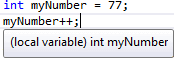
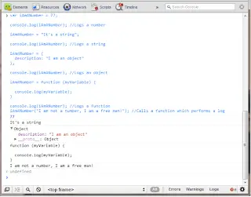

## Update

The speed of change makes fools of us all. Since I originally wrote this post all of 3 weeks ago Visual Studio 11 beta has been released and the issues I was seeking to solve have pretty much been resolved by the new innovations found therein. It's nicely detailed in [@carlbergenhem](http://www.twitter.com/carlbergenhem)'s blog post: [My Top 5 Visual Studio 11 Designer Improvements for ASP.NET 4.5 Development](https://blogs.telerik.com/blogs/posts/12-03-26/my-top-5-visual-studio-11-designer-improvements-for-asp-net-4-5-development.aspx). I've left the post in place below but much of what I said (particularly with regard to Hungarian Notation) I've now moved away from. That was originally my intention anyway so that's no bad thing. The one HN artefact that I've held onto is using "$" as a prefix for jQuery objects. I think that still makes sense. I would have written my first line of JavaScript in probably 2000. It probably looked something like this: `alert('hello world')`. I know. Classy. As I've mentioned before it was around 2010 before I took JavaScript in any way seriously. Certainly it was then when I started to actively learn the language. Because up until this point I'd been studiously avoiding writing any JavaScript at all I'd never really given thought to forms and conventions. When I wrote any JavaScript I just used the same style and approaches as I used in my main development language (of C#). By and large I have been following the .net naming conventions which are ably explained by Pete Brown [here](http://10rem.net/articles/net-naming-conventions-and-programming-standards---best-practices). Over time I have started to move away from this approach. Without a deliberate intention to do so I have found myself adopting a different style for my JavaScript code as compared with anything else I write. I wouldn't go so far as to say I'm completely happy with the style I'm currently using. But I find it more helpful than not and thought it might be worth talking about. It was really 2 things that started me down the road of "rolling my own" convention: dynamic typing and the lack of safety nets. Let's take each in turn....

<!--truncate-->

### 1\. Dynamic typing

Having grown up (in a development sense) using compiled and strongly-typed languages I was used to the IDE making it pretty clear what was what through friendly tooltips and the like:



JavaScript is loosely / dynamically typed ([occasionally called "untyped" but let's not go there](http://stackoverflow.com/questions/9154388/does-untyped-also-mean-dynamically-typed-in-the-academic-cs-world)). This means that the IDE can't easily determine what's what. So no tooltips for you sunshine. ### 2\. The lack of safety nets / running with scissors

Now I've come to love it but what I realised pretty quickly when getting into JavaScript was this: you are running with scissors. If you're not careful and you don't take precautions it can bloody quickly. If I'm writing C# I have a lot of safety nets. Not the least of which is "does it compile"? If I declare an integer and then subsequently try to assign a string value to it <u>it won't let me</u>

. But JavaScript is forgiving. Some would say too forgiving. Let's do something mad:

```js
var iAmANumber = 77;

console.log(iAmANumber); //Logs a number

iAmANumber = "It's a string";

console.log(iAmANumber); //Logs a string

iAmANumber = {
  description: 'I am an object',
};

console.log(iAmANumber); //Logs an object

iAmANumber = function (myVariable) {
  console.log(myVariable);
};

console.log(iAmANumber); //Logs a function
iAmANumber('I am not a number, I am a free man!'); //Calls a function which performs a log
```

Now if I were to attempt something similar in C# fuggedaboudit but JavaScript; no I'm romping home free:



Now I'm not saying that you should ever do the above, and thinking about it I can't think of a situation where you'd want to (suggestions on a postcard). But the point is it's possible. And because it's possible to do this deliberately, it's doubly possible to do this accidentally. My point is this: it's easy to make bugs in JavaScript. ## What ~~Katy~~ Johnny Did Next

I'd started making more and more extensive use of JavaScript. I was beginning to move in the direction of using the [single-page application](http://en.wikipedia.org/wiki/Single-page_application) approach (_although more in the sense of giving application style complexity to individual pages rather than ensuring that entire applications ended up in a single page_). This meant that whereas in the past I'd had the occasional 2 lines of JavaScript I now had a multitude of functions which were all interacting in response to user input. All these functions would contain a number of different variables. As well as this I was making use of jQuery for both Ajax purposes and to smooth out the DOM inconsistencies between various browsers. This only added to the mix as variables in one of my functions could be any one of the following: - a number

- a string
- a boolean
- a date
- an object
- an array
- a function
- a jQuery object - not strictly a distinct JavaScript type obviously but treated pretty much as one in the sense that it has a particular functions / properties etc associated with it

As I started doing this sort of work I made no changes to my coding style. Wherever possible I did \***exactly**\* what I would have been doing in C# in JavaScript. And it worked fine. Until.... Okay there is no "until" as such, it did work fine. But what I found was that I would do a piece of work, check it into source control, get users to test it, release the work into Production and promptly move onto the next thing. However, a little way down the line there would be a request to add a new feature or perhaps a bug was reported and I'd find myself back looking at the code. And, as is often the case, despite the comments I would realise that it wasn't particularly clear why something worked in the way it did. (Happily it's not just me that has this experience, paranoia has lead me to ask many a fellow developer and they have confessed to similar) When it came to bug hunting in particular I found myself cursing the lack of friendly tooltips and the like. Each time I wanted to look at a variable I'd find myself tracking back through the function, looking for the initial use of the variable to determine the type. Then I'd be tracking forward through the function for each subsequent use to ensure that it conformed. Distressingly, I would find examples of where it looked like I'd forgotten the type of the variable towards the end of a function (for which I can only, regrettably, blame myself). Most commonly I would have a situation like this:

```js
var tableCell = $('#ItIsMostDefinitelyATableCell'); //I jest ;-)

/* ...THERE WOULD BE SOME CODE DOING SOMETHING HERE... */

tableCell.className = 'makeMeProminent'; //Oh dear - not good.
```

You see what happened above? I forgot I had a jQuery object and instead treated it like it was a standard DOM element. Oh dear. ## Spinning my own safety net; Hungarian style

After I'd experienced a few of the situations described above I decided that steps needed to be taken to minimise the risk of this. In this case, I decided that "steps" meant [Hungarian notation](http://en.wikipedia.org/wiki/Hungarian_notation). I know. I bet you're wincing right now. For those of you that don't remember HN was pretty much the standard way of coding at one point (although at the point that I started coding professionally it had already started to decline). It was adopted in simpler times long before the modern IDE's that tell you what each variable is became the norm. Back when you couldn't be sure of the types you were dealing with. In short, kind of like my situation with JavaScript right now. There's not much to it. By and large HN simply means having a lowercase prefix of 1-3 characters on all your variables indicating type. It doesn't solve all your problems. It doesn't guarantee to stop bugs. But because each instance of the variables use implicitly indicates it's type it makes bugs more glaringly obvious. This means when writing code I'm less likely to misuse a variable (eg `iNum = "JIKJ"`) because part of my brain would be bellowing: "that just looks wrong... pay better attention lad!". Likewise, if I'm scanning through some JavaScript and searching for a bug then this can make it more obvious. Here's some examples of different types of variables declared using the style I have adopted:

```js
var iInteger = 4;
var dDecimal = 10.5;
var sString = 'I am a string';
var bBoolean = true;
var dteDate = new Date();
var oObject = {
  description: 'I am an object',
};
var aArray = [34, 77];
var fnFunction = function () {
  //Do something
};
var $jQueryObject = $('#ItIsMostDefinitelyATableCell');
```

Some of you have read this and thought "hold on a minute... JavaScript doesn't have integers / decimals etc". You're quite right. My style is not specifically stating the type of a variable. More it is seeking to provide a guide on how a variable should be used. JavaScript does not have integers. But oftentimes I'll be using a number variable which i will only ever want to treat as an integer. And so I'll name it accordingly. ## Spinning a better safety net; DOJO style

I would be the first to say that alternative approaches are available. And here's one I recently happened upon that I rather like the look of: look 2/3rds down at the parameters section of [the DOJO styleguide](http://dojotoolkit.org/community/styleGuide) Essentially they advise specifying parameter types through the use of prefixed comments. See the examples below:

```js
function(/*String*/ foo, /*int*/ bar)...
```

or

```js
function(/_String?_/ foo, /_int_/ bar, /_String[]?_/ baz)...
```

I really rather like this approach and I'm thinking about starting to adopt it. It's not possible in Hungarian Notation to be so clear about the purpose of a variable. At least not without starting to adopt all kinds of kooky conventions that take in all the possible permutations of variable types. And if you did that you'd really be defeating yourself anyway as it would simply reduce the clarity of your code and make bugs more likely. ## Spinning a better safety net; unit tests

Despite being quite used to writing unit tests for all my server-side code I have not yet fully embraced unit testing on the client. Partly I've been holding back because of the variety of JavaScript testing frameworks available. I wasn't sure which to start with. But given that it is so easy to introduce bugs into JavaScript I have come to the conclusion that it's better to have some tests in place rather than none. Time to embrace the new. ## Conclusion

I've found using Hungarian Notation useful whilst working in JavaScript. Not everyone will feel the same and I think that's fair enough; within reason I think it's generally a good idea to go with what you find useful. However, I am giving genuine consideration to moving to the DOJO style and moving back to my more standard camel-cased variable names instead of Hungarian Notation. Particularly since I strive to keep my functions short with the view that ideally each should 1 thing well. Keep it simple etc... And so in a perfect world the situation of forgetting a variables purpose shouldn't really arise... I think once I've got up and running with JavaScript unit tests I may make that move. Hungarian Notation may have proved to be just a stop-gap measure until better techniques were employed...
