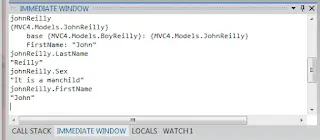

Yes the title of this post is \***painfully**\* verbose. Sorry about that. Couple of questions for you: - Have you ever liked the way you can have base classes in C# which can then be inherited and subclassed <u>in a different file / class</u>

<!--truncate-->

?

- Have you ever thought; gosh it'd be nice to do something like that in JavaScript...
- Have you then looked at JavaScripts prototypical inheritance and thought "right.... I'm sure it's possible but this going to end up like [War and Peace](http://en.wikipedia.org/wiki/War_and_Peace)"
- Have you then subsequently thought "and hold on a minute... even if I did implement this using the prototype and split things between different files / modules wouldn't I have to pollute the global scope to achieve that? And wouldn't that mean that my code was exposed to the vagaries of any other scripts on the page? Hmmm..."
- [Men! Are you skinny? Do bullies kick sand in your face?](http://www.thrillingdetective.com/eyes/oxford.html) (Just wanted to see if you were still paying attention...)

## The Problem

Well, the above thoughts occurred to me just recently. I had a situation where I was working on an MVC project and needed to build up quite large objects within JavaScript representing various models. The models in question were already implemented on the server side using classes and made extensive use of inheritance because many of the properties were shared between the various models. That is to say we would have models which were implemented through the use of a class inheriting a base class which in turn inherits a further base class. With me? Good. Perhaps I can make it a little clearer with an example. Here are my 3 classes. First BaseReilly.cs:

```cs
public class BaseReilly
{
    public string LastName { get; set; }

        public BaseReilly()
        {
            LastName = "Reilly";
        }
    }
```

Next BoyReilly.cs (which inherits from BaseReilly):

```cs
public class BoyReilly : BaseReilly
{
    public string Sex { get; set; }

    public BoyReilly()
        : base()
    {
        Sex = "It is a manchild";
    }
}
```

And finally JohnReilly.cs (which inherits from BoyReilly which in turn inherits from BaseReilly):

```cs
public class JohnReilly : BoyReilly
{
    public string FirstName { get; set; }

    public JohnReilly()
        : base()
    {
        FirstName = "John";
    }
}
```

Using the above I can create myself my very own "JohnReilly" like so:

```cs
var johnReilly = new JohnReilly();
```

And it will look like this:



I was looking to implement something similar on the client and within JavaScript. I was keen to ensure [code reuse](http://en.wikipedia.org/wiki/Code_reuse). And my inclination to keep things simple made me wary of making use of the [prototype](http://bonsaiden.github.com/JavaScript-Garden/#object.prototype). It is undoubtedly powerful but I don't think even the mighty [Crockford](http://javascript.crockford.com/prototypal.html) would consider it "simple". Also I had the reservation of exposing my object to the global scope. So what to do? I had an idea.... ## The Big Idea

For a while I've been making use explicit use of the [Observer pattern](http://en.wikipedia.org/wiki/Observer_pattern) in my JavaScript, better known by most as the publish/subscribe (or "PubSub") pattern. There's a million JavaScript libraries that facilitate this and after some experimentation I finally settled on [higgins](https://github.com/phiggins42/bloody-jquery-plugins/blob/master/pubsub.js) implementation as it's simple and I saw a [JSPerf](http://jsperf.com/pubsubjs-vs-jquery-custom-events/11) which demonstrated it as either the fastest or second fastest in class. Up until now my main use for it had been to facilitate loosely coupled GUI interactions. If I wanted one component on the screen to influence anothers behaviour I simply needed to get the first component to publish out the relevant events and the second to subscribe to these self-same events. One of the handy things about publishing out events this way is that with them you can also include data. This data can be useful when driving the response in the subscribers. However, it occurred to me that it would be equally possible to pass an object when publishing an event. \*\*<u>And the subscribers could enrich that object with data as they saw fit.</u>

\*\* Now this struck me as a pretty useful approach. It's not rock solid secure as it's always possible that someone could subscribe to your events and get access to your object as you published out. However, that's pretty unlikely to happen accidentally; certainly far less likely than someone else's global object clashing with your global object. ## What might this look like in practice?

So this is what it ended up looking like when I turned my 3 classes into JavaScript files / modules. First BaseReilly.js:

```js
$(function () {
  $.subscribe('PubSub.Inheritance.Emulation', function (obj) {
    obj.LastName = 'Reilly';
  });
});
```

Next BoyReilly.js:

```js
$(function () {
  $.subscribe('PubSub.Inheritance.Emulation', function (obj) {
    obj.Sex = 'It is a manchild';
  });
});
```

And finally JohnReilly.js:

```js
$(function () {
  $.subscribe('PubSub.Inheritance.Emulation', function (obj) {
    obj.FirstName = 'John';
  });
});
```

If the above scripts have been included in a page I can create myself my very own "JohnReilly" in JavaScript like so:

```js
var oJohnReilly = {}; //Empty object

$.publish('PubSub.Inheritance.Emulation', [oJohnReilly]); //Empty object "published" so it can be enriched by subscribers

console.log(JSON.stringify(oJohnReilly)); //Show me this thing you call "JohnReilly"
```

And it will look like this:


And it works. Obviously the example I've given above it somewhat naive - in reality my object properties are driven by GUI components rather than hard-coded. But I hope this illustrates the point. This technique allows you to simply share functionality between different JavaScript files and so keep your codebase tight. I certainly wouldn't recommend it for all circumstances but when you're doing something as simple as building up an object to be used to pass data around (as I am) then it works very well indeed. ## A Final Thought on Script Ordering

A final thing that maybe worth mentioning is script ordering. The order in which functions are called is driven by the order in which subscriptions are made. In my example I was registering the scripts in this order:

```html
<script src="/Scripts/PubSubInheritanceDemo/BaseReilly.js"></script>
<script src="/Scripts/PubSubInheritanceDemo/BoyReilly.js"></script>
<script src="/Scripts/PubSubInheritanceDemo/JohnReilly.js"<>/script>
```

So when my event was published out the functions in the above JS files would be called in this order: 1. BaseReilly.js 2. BoyReilly.js 3. JohnReilly.js

If you were so inclined you could use this to emulate inheritance in behaviour. Eg you could set a property in `BaseReilly.js` which was subsequently overridden in `JohnReilly.js` or `BoyReilly.js` if you so desired. I'm not doing that myself but it occurred as a possibility. ## PS

If you're interested in learning more about JavaScript stabs at inheritance you could do far worse than look at Bob Inces in depth StackOverflow [answer](http://stackoverflow.com/a/1598077/761388).

```

```
