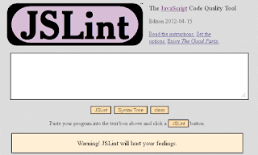
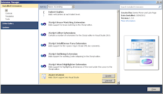

As I've started making greater use of JavaScript to give a richer GUI experience the amount of JS in my ASP.NET apps has unsurprisingly ballooned. If I'm honest, I hadn't given much consideration to the code quality of my JavaScript in the past. However, if I was going to make increasing use of it (and given the way the web is going at the moment I'd say that's a given) I didn't think this was tenable position to maintain. A friend of mine works for [Coverity](http://www.coverity.com/) which is a company that provides tools for analysing code quality. I understand, from conversations with him, that their tools provide static analysis for compiled languages such as C++ / C# / Java etc. I was looking for something similar for JavaScript. Like many, I have read and loved [Douglas Crockford's "JavaScript: The Good Parts"](http://www.amazon.com/JavaScript-Good-Parts-Douglas-Crockford/dp/0596517742); it is by some margin the most useful and interesting software related book I have read.So I was aware that Crockford had come up with his own JavaScript code quality tool called [JSLint](http://www.jslint.com/). JSLint is quite striking when you first encounter it:

<!--truncate-->

It's the "Warning! JSLint will hurt your feelings." that grabs you. And it's not wrong. I've copied and pasted code that I've written into JSLint and then gasped at the reams of errors JSLint would produce. I subsequently tried JSLint-ing various well known JS libraries (jQuery etc) and saw that JSLint considered they were thoroughly problematic as well. This made me feel slightly better. It was when I started examining some of the "errors" JSLint reported that I took exception. Yes, I took exception to exceptions! (I'm \***very**\* pleased with that!) Here's a few of the errors generated by JSLint when inspecting [jquery-1.7.2.js](http://ajax.googleapis.com/ajax/libs/jquery/1.7.2/jquery.js): - `Problem at line 16 character 10: Expected exactly one space between 'function' and '('.`

- `Problem at line 25 character 1: Expected 'var' at column 13, not column 1.`
- `Problem at line 31 character 5: Unexpected dangling '_' in '_jQuery'.`

JSLint is, much like it's creator, quite opinionated. Which is no bad thing. Many of Crockfords opinions are clearly worth their salt. It's just I didn't want all of them enforced upon me. As you can see above most of these "problems" are essentially complaints about a different style rather than bugs or potential issues. Now there are options in JSLint that you can turn on and off which looked quite promising. But before I got to investigating them I heard about [JSHint](http://www.jshint.com), brainchild of Anton Kovalyov and Paul Irish. In their own words: _JSHint is a fork of JSLint, the tool written and maintained by Douglas Crockford. The project originally started as an effort to make a more configurable version of JSLint—one that doesn't enforce one particular coding style on its users—but then transformed into a separate static analysis tool with its own goals and ideals._ This sounded right up my alley! So I thought I'd repeat my jQuery test. Here's a sample of what JSHint threw back at me, with its default settings in place: - `Line 230: return num == null ? Expected '===' and instead saw '=='. `

- `Line 352: if ( (options = arguments[ i ]) != null ) { Expected '!==' and instead saw '!='. `
- `Line 354: for ( name in options ) { The body of a for in should be wrapped in an if statement to filter unwanted properties from the prototype. `

These were much more the sort of "issues" I was interested in. Plus it seemed there was plenty of scope to tweak my options. Excellent. This was good. The icing on my cake would have been a plug-in for Visual Studio which would allow me to evaluate my JS files from within my IDE. Happily the world seems to be full of developers doing good turns for one another. I discovered an extension for VS called [JSLint for Visual Studio 2010](http://jslint4vs2010.codeplex.com/):

This was an extension that provided either JSLint \***or**\* JSHint evaluation as you preferred from within Visual Studio. Fantastic! With this extension in play you could add JavaScript static code analysis to your compilation process and so learn of all the issues in your code at the same time, whether they lay in C# or JS or [insert language here]. You could control how JS problems were reported; as warnings, errors etc. You could straightforwardly exclude files from evaluation (essential if you're reliant on a number of 3rd party JS libraries which you are not responsible for maintaining). You could cater for predefined variables; allow for jQuery or DOJO. You could simply evaluate a single file in your solution by right clicking it and hitting the "JS Lint" option in the context menu. And it was simplicity itself to activate and deactivate the JSHint / JSLint extension as required. For a more exhaustive round up of the options available I advise taking a look here: [http://jslint4vs2010.codeplex.com](http://jslint4vs2010.codeplex.com/). I would heartily recommend using JSHint if you're looking to improve your JS code quality. I'm grateful to Crockford for making JSHint possible by first writing JSLint. For my part though I think JSHint is the more pragmatic and useful tool and likely to be the one I stick with. For interest (and frankly sheer entertainment value at the crotchetiness of Crockford) it's definitely worth having a read up on how JSHint came to pass: - [http://anton.kovalyov.net/2011/02/20/why-i-forked-jslint-to-jshint/](http://anton.kovalyov.net/2011/02/20/why-i-forked-jslint-to-jshint/)

- [http://badassjs.com/post/3364925033/jshint-an-community-driven-fork-of-jslint](http://badassjs.com/post/3364925033/jshint-an-community-driven-fork-of-jslint)
