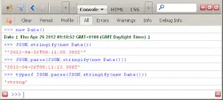

I've so named this blog post because it shamelessly borrows from the fine work of others: Sebastian Markbåge and Nathan Vonnahme. Sebastian wrote a blog post documenting a good solution to the ASP.NET JavaScriptSerializer DateTime problem at the tail end of last year. However, his solution didn't get me 100% of the way there when I tried to use it because of a need to support IE 8 which lead me to use Nathan Vonnahme's ISO 8601 JavaScript Date parser. I thought it was worth documenting this, hence this post, but just so I'm clear; the hard work here was done by Sebastian Markbåge and Nathan Vonnahme and not me. Consider me just a curator in this case. The original blog posts that I am drawing upon can be found here: 1. [http://blog.calyptus.eu/seb/2011/12/custom-datetime-json-serialization/](http://blog.calyptus.eu/seb/2011/12/custom-datetime-json-serialization/) and here: 2. [http://n8v.enteuxis.org/2010/12/parsing-iso-8601-dates-in-javascript/](http://n8v.enteuxis.org/2010/12/parsing-iso-8601-dates-in-javascript/)

<!--truncate-->

## DateTime, JSON, JavaScript Dates....

Like many, I've long been frustrated with the quirky DateTime serialisation employed by the `System.Web.Script.Serialization.JavaScriptSerializer` class. When serialising DateTimes so they can be JSON.parsed on the client, this serialiser uses the following approach: (from MSDN) [_Date object, represented in JSON as "\/Date(number of ticks)\/". The number of ticks is a positive or negative long value that indicates the number of ticks (milliseconds) that have elapsed since midnight 01 January, 1970 UTC."_](http://msdn.microsoft.com/en-us/library/system.web.script.serialization.javascriptserializer.aspx) Now this is not particularly helpful in my opinion because it's not human readable (at least not this human; perhaps [Jon Skeet](http://stackoverflow.com/users/22656/jon-skeet)...) When consuming your data from web services / PageMethods using [jQuery.ajax](http://api.jquery.com/jQuery.ajax/) you are landed with the extra task of having to convert what were DateTimes on the server from Microsofts string Date format (eg `"\/Date(1293840000000)\/"`) into actual JavaScript Dates. It's also unhelpful because it's divergent from the approach to DateTime / Date serialisation used by a native JSON serialisers:



Just as an aside it's worth emphasising that one of the limitations of JSON is that the JSON.parsing of a JSON.stringified date will \***not**\* return you to a JavaScript Date but rather an ISO 8601 date string which will need to be subsequently converted into a Date. Not JSON's fault - essentially down to the absence of a Date literal within JavaScript. ## Making JavaScriptSerializer behave more JSON'y

Anyway, I didn't think there was anything I could really do about this in an ASP.NET classic / WebForms world because, to my knowledge, it is not possible to swap out the serialiser that is used. JavaScriptSerializer is the only game in town. (Though I am optimistic about the future; given the announcement that I first picked up on Rick Strahl's blog that [Json.NET was going to be adopted as the default JSON serializer for ASP.NET Web API](http://www.west-wind.com/weblog/posts/2012/Mar/09/Using-an-alternate-JSON-Serializer-in-ASPNET-Web-API); what with Json.NET having out-of-the-box [ISO 8601 support](http://james.newtonking.com/archive/2009/02/20/good-date-times-with-json-net.aspx). I digress...) Because it can make debugging a much more straightforward process I place a lot of value on being able to read the network traffic that web apps generate. It's much easier to drop into Fiddler / FireBug / Chrome dev tools etc and watch what's happening there and then instead of having to manually process the data separately first so that you can understand it. I think this is nicely aligned with the [KISS principle](http://en.wikipedia.org/wiki/KISS_principle). For that reason I've been generally converting DateTimes to ISO 8601 strings on the server before returning them to the client. A bit of extra overhead but generally worth it for the gains in clarity in my opinion. So I was surprised and delighted when I happened upon [Sebastian Markbåge's blog post](http://blog.calyptus.eu/seb/2011/12/custom-datetime-json-serialization/) which provided a DateTime JavaScriptConverter that could be plugged into the JavaScriptSerializer. You can see the code below (or on Sebastian's original post with a good explanation of how it works):

```cs
using System;
using System.Collections;
using System.Collections.Generic;
using System.Web.Script.Serialization;

namespace MyNamespace
{
  /// <summary>
  /// A custom DateTime JavaScriptConverter courtesy of these good folks: http://blog.calyptus.eu/seb/2011/12/custom-datetime-json-serialization/
  /// Using this forces DataTimes to be serialised as ISO 8601 rather "\/Date(1249335477787)\/" style
  /// </summary>
  public class DateTimeJavaScriptConverter : JavaScriptConverter
  {
    public override object Deserialize(IDictionary<string, object> dictionary, Type type, JavaScriptSerializer serializer)
    {
      return new JavaScriptSerializer().ConvertToType(dictionary, type);
    }

    public override IDictionary<string, object> Serialize(object obj, JavaScriptSerializer serializer)
    {
      if (!(obj is DateTime)) return null;
      return new CustomString(((DateTime)obj).ToUniversalTime().ToString("O"));
    }

    public override IEnumerable<Type> SupportedTypes
    {
      get { return new[] { typeof(DateTime) }; }
    }

    private class CustomString : Uri, IDictionary<string, object>
    {
      public CustomString(string str)
        : base(str, UriKind.Relative)
      {
      }

      void IDictionary<string, object>.Add(string key, object value) { throw new NotImplementedException(); }
      bool IDictionary<string, object>.ContainsKey(string key) { throw new NotImplementedException(); }
      ICollection<string> IDictionary<string, object>.Keys { get { throw new NotImplementedException(); } }
      bool IDictionary<string, object>.Remove(string key) { throw new NotImplementedException(); }
      bool IDictionary<string, object>.TryGetValue(string key, out object value) { throw new NotImplementedException(); }
      ICollection<object> IDictionary<string, object>.Values { get { throw new NotImplementedException(); } }
      object IDictionary<string, object>.this[string key]
      {
        get { throw new NotImplementedException(); }
        set { throw new NotImplementedException(); }
      }
      void ICollection<KeyValuePair<string, object>>.Add(KeyValuePair<string, object> item) { throw new NotImplementedException(); }
      void ICollection<KeyValuePair<string, object>>.Clear() { throw new NotImplementedException(); }
      bool ICollection<KeyValuePair<string, object>>.Contains(KeyValuePair<string, object> item) { throw new NotImplementedException(); }
      void ICollection<KeyValuePair<string, object>>.CopyTo(KeyValuePair<string, object>[] array, int arrayIndex) { throw new NotImplementedException(); }
      int ICollection<KeyValuePair<string, object>>.Count { get { throw new NotImplementedException(); } }
      bool ICollection<KeyValuePair<string, object>>.IsReadOnly { get { throw new NotImplementedException(); } }
      bool ICollection<KeyValuePair<string, object>>.Remove(KeyValuePair<string, object> item) { throw new NotImplementedException(); }
      IEnumerator<KeyValuePair<string, object>> IEnumerable<KeyValuePair<string, object>>.GetEnumerator() { throw new NotImplementedException(); }
      IEnumerator IEnumerable.GetEnumerator() { throw new NotImplementedException(); }
    }
  }
}
```

Using this converter meant that a DateTime that previously would have been serialised as `"\/Date(1293840000000)\/"` would now be serialised as `"2011-01-01T00:00:00.0000000Z"` instead. This is entirely agreeable because 1. it's entirely clear what a `"2011-01-01T00:00:00.0000000Z"` style date represents and 2. this is more in line with native browser JSON implementations and `&lt;statingTheObvious&gt;`consistency is a good thing.`&lt;/statingTheObvious&gt;`

## Getting your web services to use the ISO 8601 DateTime Converter

Sebastian alluded in his post to a `web.config` setting that could be used to get web services / pagemethods etc. implementing his custom DateTime serialiser. This is it:

```xml
<configuration>
  <system.web.extensions>
    <scripting>
      <webServices>
        <!--
          This line of config means that when a JavaScriptSerializer is used by a web service / page method
          it will automatically register the DateTimeJavaScriptConverter to use.  To use the converter directly in code you would need to enter the below:

          var serializer = new System.Web.Script.Serialization.JavaScriptSerializer();
          serializer.RegisterConverters(new JavaScriptConverter[] { new DateTimeJavaScriptConverter() });

        -->
        <jsonSerialization>
          <converters>
            <add name="DateTimeJavaScriptConverter" type="MyNamespace.DateTimeJavaScriptConverter"/>
          </converters>
        </jsonSerialization>

      </webServices>
      <scriptResourceHandler enableCompression="false" enableCaching="true"/>
    </scripting>
  </system.web.extensions>
</configuration>
```

With this in place your web services / page methods will happily be able to serialise / deserialise ISO style date strings to your hearts content. ## What no ISO 8601 date string Date constructor?

As I mentioned earlier, Sebastian's solution didn't get me 100% of the way there. There was still a fly in the ointment in the form of IE 8. Unfortunately IE 8 doesn't have JavaScript [Date constructor that takes ISO 8601 date strings](https://developer.mozilla.org/en/JavaScript/Reference/Global_Objects/Date/parse). This lead me to using Nathan Vonnahme's ISO 8601 JavaScript Date parser, the code of which is below (or see his original post [here](http://n8v.enteuxis.org/2010/12/parsing-iso-8601-dates-in-javascript/)):

```js
//===============================================================================
// Parse ISO 8601 Date Format date string and return a date - equivalent to https://developer.mozilla.org/en/JavaScript/Reference/Global_Objects/Date/parse
// Found here: n8v.enteuxis.org/2010/12/parsing-iso-8601-dates-in-javascript/
//===============================================================================
function parseISO8601Date(s) {
  // parenthese matches:
  // year month day    hours minutes seconds
  // dotmilliseconds
  // tzstring plusminus hours minutes
  var re =
    /(\d{4})-(\d\d)-(\d\d)T(\d\d):(\d\d):(\d\d)(\.\d+)?(Z|([+-])(\d\d):(\d\d))/;

  var d = [];
  d = s.match(re);

  // "2010-12-07T11:00:00.000-09:00" parses to:
  //  ["2010-12-07T11:00:00.000-09:00", "2010", "12", "07", "11",
  //     "00", "00", ".000", "-09:00", "-", "09", "00"]
  // "2010-12-07T11:00:00.000Z" parses to:
  //  ["2010-12-07T11:00:00.000Z",      "2010", "12", "07", "11",
  //     "00", "00", ".000", "Z", undefined, undefined, undefined]

  if (!d) {
    throw "Couldn't parse ISO 8601 date string '" + s + "'";
  }

  // parse strings, leading zeros into proper ints
  var a = [1, 2, 3, 4, 5, 6, 10, 11];
  for (var i in a) {
    d[a[i]] = parseInt(d[a[i]], 10);
  }
  d[7] = parseFloat(d[7]);

  // Date.UTC(year, month[, date[, hrs[, min[, sec[, ms]]]]])
  // note that month is 0-11, not 1-12
  // see https://developer.mozilla.org/en/JavaScript/Reference/Global_Objects/Date/UTC
  var ms = Date.UTC(d[1], d[2] - 1, d[3], d[4], d[5], d[6]);

  // if there are milliseconds, add them
  if (d[7] > 0) {
    ms += Math.round(d[7] * 1000);
  }

  // if there's a timezone, calculate it
  if (d[8] != 'Z' && d[10]) {
    var offset = d[10] * 60 * 60 * 1000;
    if (d[11]) {
      offset += d[11] * 60 * 1000;
    }
    if (d[9] == '-') {
      ms -= offset;
    } else {
      ms += offset;
    }
  }

  return new Date(ms);
}
```

With this in place I could parse ISO 8601 Dates just like anyone else. Great stuff. `parseISO8601Date("2011-01-01T00:00:00.0000000Z")` would give me a JavaScript Date of `Sat Jan 1 00:00:00 UTC 2011`. Obviously in the fullness of time the parseISO8601Date solution should no longer be necessary because [EcmaScript 5 specifies an ISO 8601 date string constructor](http://es5.github.com/#x15.9.3.2). However, in the interim Nathan's solution is a lifesaver. Thanks again both to Sebastian Markbåge and Nathan Vonnahme who have both generously allowed me use their work as the basis for this post. ## PS And it would have worked if it wasn't for that pesky IE 9...

Subsequent to writing this post I thought I'd check that IE 9 had implemented a JavaScript Date constructor that would process an ISO 8601 date string like this: `new Date("2011-01-01T00:00:00.0000000Z")`. It hasn't. Take a look:


This is slightly galling as the above code works dandy in Firefox and Chrome. As you can see from the screenshot you can get the JavaScript IE 9 Date constructor to play nice by trimming off the final 4 "0"'s from the string. Frustrating. Obviously we can still use Nathan's solution but it's a shame that we can't use the native support. Based on what I've read [here](http://msdn.microsoft.com/en-us/library/az4se3k1.aspx#Roundtrip) I think it would be possible to amend Sebastians serializer to fall in line with IE 9's pendantry by changing this:

```cs
return new CustomString(((DateTime)obj).ToUniversalTime()
  .ToString(<b>"O"</b>)
);
```

To this:

```cs
return new CustomString(((DateTime)obj).ToUniversalTime()
  .ToString(<b>"yyyy'-'MM'-'dd'T'HH':'mm':'ss'.'fffzzz"</b>)
);
```

I've held off from doing this myself as I rather like Sebastian's idea of being able to use Microsoft's Round-trip ("O", "o") Format Specifier. And it seems perverse that we should have to move away from using Microsoft's Round-trip Format Specifier purely because of (Microsoft's) IE! But it's a possibility to consider and so I put it out there. I would hope that MS will improve their JavaScript Date constructor with IE 10. A missed opportunity if they don't I think. ## PPS Just when you thought is over... IE 9 was right!

Sebastian got in contact after I first published this post and generously pointed out that, contrary to my expectation, IE 9 technically had the correct implementation. According to the [EMCAScript standard](http://es5.github.com/#x15.9.1.15) the Date constructor should not allow more than millisecond precision. In this case, Chrome and Firefox are being less strict - not more correct. On reflection this does rather make sense as the result of a `JSON.stringify(new Date())` never results in an ISO date string to the 10 millionths of a second detail. Sebastian has himself stopped using Microsoft's Round-trip ("O", "o") Format Specifier in favour of this format string: ```cs
return new CustomString(((DateTime)obj).ToUniversalTime()

.ToString(<b>"yyyy-MM-ddTHH:mm:ss.fffZ"</b>)

);

```

 This results in date strings that comply perfectly with the ECMAScript spec. I suspect I'll switch to using this also now. Though I'll probably leave the first part of the post intact as I think the background remains interesting. Thanks again Sebastian!
```
