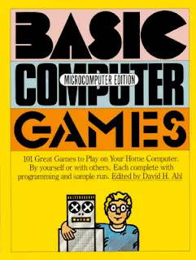

Inspired by [Hanselmans post on how he got started in programming](http://www.hanselman.com/blog/SheLetMeTakeTheComputerHomeHowDidYouGetStartedInComputersAndProgramming.aspx) I thought I'd shared my own tale about how it all began... I grew up the 80's just outside London. For those of you of a different vintage let me paint a picture. These were the days when "Personal Computers", as they were then styled, were taking the world by storm. Every house would be equipped with either a ZX Spectrum, a Commodore 64 or an Amstrad CPC. These were 8 bit computers which were generally plugged into the family television and spent a good portion of their time loading games like [Target: Renegade](http://en.wikipedia.org/wiki/Target:_Renegade) from an audio cassette. But not in our house; we didn't have a computer. I remember mournfully pedalling home from friends houses on a number of occasions, glum as I compared my lot with theirs. Whereas my friends would be spending their evenings gleefully battering their keyboards as they thrashed the life out of various end-of-level bosses I was reduced to \***wasting**\* my time reading. That's right Enid Blyton - you were second best in my head. Then one happy day (and it may have been a Christmas present although I'm not certain) our family became the proud possessors of an [Amstrad CPC 6128](http://en.wikipedia.org/wiki/Amstrad_CPC):

<!--truncate-->

Glory be! I was going to play so many games! I would have such larks! My evenings would be filled with pixelated keyboard related destruction! Hallelujah!! But I was wrong. I had reckoned without my father. For reasons that I've never really got to the bottom of Dad had invested in the computer but not in the games. Whilst I was firmly of the opinion that these 2 went together like Lennon and McCartney he was having none of it. "You can write your own son" he intoned and handed over a manual which contained listings for games:

And that's where it first began really. I would spend my evenings typing the Locomotive Basic listings for computer games into the family computer. Each time I started I would be filled with great hopes for what might result. Each time I tended to be rewarded with something that looked a bit like this:

I'm not sure that it's possible to learn to program by osmosis but if it is I'm definitely a viable test case. I didn't become an expert Locomotive Basic programmer (was there ever such a thing?) but I did undoubtedly begin my understanding of software.... Thanks Dad!
