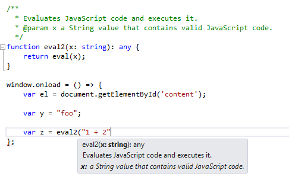

## Days of Yore

<!--truncate-->

It was my first job. The web was alive and well at this point but still very much in it's infancy. Newspapers had only recently moved on from calling it "the information superhighway". No-one was doing _real_ programming for the web - the desktop was where it was at.

As for me, I was writing call centre software. It was all very exciting. Here was the idea: the phone on your desk would start ringing and through the magic of [TAPI](http://en.wikipedia.org/wiki/Telephony_Application_Programming_Interface) our app would be presented with the telephone number of the dialer. It would then look up that telephone number in the appropriate CRM application and pop the callers details on the screen. You'd pick up the phone and bellow "why hello Mr Jones!" and either impress the caller with your incredible fore-knowledge of who had rung you or perhaps terrify them with our [Brave New Orwellian World](http://en.wikipedia.org/wiki/Nineteen_Eighty-Four).

My job was to work out how to call into the APIs of the various CRM applications / databases being used and extract the relevant information. So it goes without saying that I have spent a lot of time with badly documented APIs. Or in fact _undocumented_ APIs. I know pain my friend...

Hours and days were spent debugging and walking APIs just to find out what they could do and what information they exposed. This, I need hardly say, was dull and tedious work. Having spent longer than I care to remember with no more information on an API than method names has left its mark on me. I am consequently keener than your average dev on documentation and intellisense. When you've stared at the coalface of the [Lotus Notes](http://en.wikipedia.org/wiki/IBM_Notes) API for 2 weeks with only Dephi 3 as your constant companion you'd feel the same way too. (This was [before the days of Google](http://en.wikipedia.org/wiki/AltaVista) and actually being able to find stuff on the internet.)

If you can convey information about the API that you're building then I'd say you're duty-bound to do so. Or at least that it's good manners.

## Definitely Intellisensed

When I started getting involved with the [Definitely Typed project](https://github.com/DefinitelyTyped) my focus was on giving good Intellisense. Where there was documentation for an API I wanted to get that popping in front of users when they hit the "." key:



As the above screenshot demonstrates [TypeScript supports Intellisense](https://devblogs.microsoft.com/typescript/announcing-typescript-0-8-2/) through a slightly tweaked implementation of [JSDoc](http://en.wikipedia.org/wiki/JSDoc):

> With 0.8.2, the TypeScript compiler and tools now support JSDoc comments.
>
> In the TypeScript implementation, because types are already part of the system, we allow the JSDoc type annotation to be elided, as in the example above.
>
> You can now document a variety of language constructs (including classes, modules, interfaces, and functions) with comments that become part of the information displayed to the user. We’ve also started extending lib.d.ts, the default JS and DOM API library, with JSDoc comments.

Partly as an exercise in getting better acquainted with TypeScript and partly responding to my instinctive need to have nicely documented APIs I decided to start adding JSDoc comments to the world's most popular typings file [`jquery.d.ts`](https://github.com/borisyankov/DefinitelyTyped/blob/master/jquery/jquery.d.ts).

## Why `jquery.d.ts`?

Well a number of reasons:

1. I used `jquery.d.ts` already myself and I'm a firm believer in [eating your own dogfood](https://en.wikipedia.org/wiki/Eating_your_own_dog_food)
2. jQuery is well documented. I needed a source of information to power my JSDoc and <a href="//api.jquery.com">api.jquery.com</a> had my back.
3. `jquery.d.ts` was widely used. Given how ubiquitous jQuery has become this typing file was unsurprisingly the most popular in the world. That was key for me as I wanted feedback - if I was making a mess of the typings I wanted someone to pitch in and tell me.

Just to digress once more, points #2 and #3 turned out to be of particular note.

Concerning point #2, I did find the occasional [error](https://github.com/borisyankov/DefinitelyTyped/pull/1471#issuecomment-31204115) or [inconsistency](https://github.com/borisyankov/DefinitelyTyped/pull/1835#issuecomment-37533088) in the jQuery API documentation. These were definitely the exception rather than the rule though. And thanks to the very helpful [Dave Methvin](https://github.com/dmethvin) these actually lead to [minor improvements to the jQuery API documentation](https://github.com/jquery/api.jquery.com/pull/460).


Concerning point #3 I did indeed get feedback. As well as enriching `jquery.d.ts` with JSDoc goodness I also found myself fixing slight errors in the typings. Here and there I would find examples where `jquery.d.ts` was out of line the with API documentation. Where this was the case I would amend the typings to bring them into line - trying to make `jquery.d.ts` entirely API-compliant. This was <a href="https://github.com/borisyankov/DefinitelyTyped/issues/1499">not always popular</a>. But despite the heat it generated I think it ended up leading to a better typing file. I'm again grateful for Dave Methvin's thoughtful contributions.

## Turning API documentation into JSDoc

I wanted to take an example of API documentation and demonstrate how that can be applied to a typing file with particular focus on how JSDoc comments can be created to drive Intellisense. So let's take everyone's favourite jQuery method: `val`. The documentation of `val` can be found here: [api.jquery.com/val](http://api.jquery.com/val)

By the way, check out the \*_entirely_\* intuitive URL. Now you've clocked just how straightforward that is you've probably a fair idea how you could find pretty much any jQuery documentation you might need without recourse to Google. Brilliant!

Let's take a look at what `val` looked like [before JSDoc](https://github.com/borisyankov/DefinitelyTyped/blob/c98eebb13724b5156f12318b68fc2d875ca6e4a3/jquery/jquery.d.ts#L364-L368) in the first version of the typing available on GitHub. (By the way, remember the original `jquery.d.ts`[ came out of the TypeScript team](https://typescript.codeplex.com/sourcecontrol/latest#samples/jquery/jquery.d.ts)):

```ts
val(): any;
val(value: string[]): JQuery;
val(value: string): JQuery;
val(value: number): JQuery;
val(func: (index: any, value: any) => any): JQuery;
```

And now let's look at `jquery.d.ts`[after JSDoc](https://github.com/borisyankov/DefinitelyTyped/blob/c259dba094121a389b41c573d5000dda7bdf2092/jquery/jquery.d.ts#L1494-L1545):

```ts
/**
 * Get the current value of the first element in the set of matched elements.
 */
val(): any;
/**
 * Set the value of each element in the set of matched elements.
 *
 * @param value A string of text or an array of strings corresponding to the value of each matched element to set as selected/checked.
 */
val(value: string): JQuery;
/**
 * Set the value of each element in the set of matched elements.
 *
 * @param value A string of text or an array of strings corresponding to the value of each matched element to set as selected/checked.
 */
val(value: string[]): JQuery;
/**
 * Set the value of each element in the set of matched elements.
 *
 * @param func A function returning the value to set. this is the current element. Receives the index position of the element in the set and the old value as arguments.
 */
val(func: (index: number, value: string) => string): JQuery;
/**
 * Set the value of each element in the set of matched elements.
 *
 * @param func A function returning the value to set. this is the current element. Receives the index position of the element in the set and the old value as arguments.
 */
val(func: (index: number, value: string[]) => string): JQuery;
/**
 * Set the value of each element in the set of matched elements.
 *
 * @param func A function returning the value to set. this is the current element. Receives the index position of the element in the set and the old value as arguments.
 */
val(func: (index: number, value: number) => string): JQuery;
/**
 * Set the value of each element in the set of matched elements.
 *
 * @param func A function returning the value to set. this is the current element. Receives the index position of the element in the set and the old value as arguments.
 */
val(func: (index: number, value: string) => string[]): JQuery;
/**
 * Set the value of each element in the set of matched elements.
 *
 * @param func A function returning the value to set. this is the current element. Receives the index position of the element in the set and the old value as arguments.
 */
val(func: (index: number, value: string[]) => string[]): JQuery;
/**
 * Set the value of each element in the set of matched elements.
 *
 * @param func A function returning the value to set. this is the current element. Receives the index position of the element in the set and the old value as arguments.
 */
val(func: (index: number, value: number) => string[]): JQuery;
```

Many changes yes? Let's break it down a little.

## 1. You have 20 seconds to comply (with the API)

The first thing to note is the `number` setter method:

```ts
val(value: number): JQuery;
```

Let's have a look at the jQuery documentation for the simple setter:

> ## [`.val( value )`](http://api.jquery.com/val/#val-value)
>
> <div><strong>value</strong></div>
>
> <div>Type: <a href="http://api.jquery.com/Types/#String">String</a> or <a href="http://api.jquery.com/Types/#Array">Array</a></div>
>
> <div>A string of text or an array of strings corresponding to the value of each matched element to set as selected/checked.</div>

See the problem? There is \*_no_\* `number` setter. The typings are wrong. So let's remedy this:

```ts
<strike>val(value: number): JQuery;</strike>
```

## 2. `String` and `Array of String` setters

The documentation states that we have setters which accept `String` and `Array of String`. These are already modeled in the existing typings by the `string` and `string[]` overloads:

```ts
val(value: string[]): JQuery;
    val(value: string): JQuery;
```

So let's enrich these typings with some JSDoc:

```ts
/**
 * Set the value of each element in the set of matched elements.
 *
 * @param value A string of text or an array of strings corresponding to the value of each matched element to set as selected/checked.
 */
val(value: string): JQuery;
/**
 * Set the value of each element in the set of matched elements.
 *
 * @param value A string of text or an array of strings corresponding to the value of each matched element to set as selected/checked.
 */
val(value: string[]): JQuery;
```

If you look you can see we've added a related JSDoc style comment block prior to each overload. The first part of the comment (_"Set the value of..."_) is the overarching Intellisense that is displayed. Each of the `@param` statements represents each of the parameters and it's associated comment. By comparing the [API documentation](http://api.jquery.com/val/#val-value) to the JSDoc it's pretty clear how the API has been transformed into useful JSDoc.

It's worth noting that I could have taken the choice to customise the `@param value` comments based on the overload I was JSDoc-ing. Arguably it would have been more useful to have something like this instead:

```ts
/**
     * Set the value of each element in the set of matched elements.
     *
     * @param value A string of text <strike>or an array of strings</strike> corresponding to the value of each matched element to set as selected/checked.
     */
    val(value: string): JQuery;
    /**
     * Set the value of each element in the set of matched elements.
     *
     * @param value <strike>A string of text or</strike> an array of strings corresponding to the value of each matched element to set as selected/checked.
     */
    val(value: string[]): JQuery;
```

After some pondering I decided not to take this approach, just to maintain that close relationship between `jquery.d.ts` and [api.jquery.com](http://api.jquery.com/). It's open to debate how useful that relationship actually is so I thought I'd just highlight this as a choice I made.

## 3. Getter

The jQuery documentation for the getter looks like this:

> [`.val()`](http://api.jquery.com/val/#val)
>
> Returns: <a href="http://api.jquery.com/Types/#String">String</a> or <a href="http://api.jquery.com/Types/#Number">Number</a> or <a href="http://api.jquery.com/Types/#Array">Array</a>
>
> **Description: **Get the current value of the first element in the set of matched elements.

So the `val()` overload can return a `string`, a `number` or a `string[]`. Unfortunately there is no real way to model that in TypeScript at present due to the absence of ["union types"](https://typescript.codeplex.com/workitem/1364). Union types are being [discussed at present](https://typescript.codeplex.com/discussions/543598#PostDetailsCell_1239340) but in TypeScript v1.0 world the only viable approach is returning the `any` type. This implies `val()` returns any possible JavaScript value from `boolean` to `Function` and straight on 'til morning. So clearly this isn't accurate but importantly it also allows for the possibility of `val()` returning `string`, `number` or `string[]`.

The final getter typing with JSDoc applied ends up looking like this:

```ts
/**
     * Get the current value of the first element in the set of matched elements.
     */
    val(): any;
```

As you can see the _"Get the current value..."_ from the API docs has been used as the overarching Intellisense that is displayed for the getter.

## 4. The `Function` setter

Finally we're going to take a look at the `Function` setter which is documented as follows:

> [`.val( function(index, value) )`](http://api.jquery.com/val/#val-functionindex--value)
>
> `function(index, value)`
>
> <div>Type: <a href="http://api.jquery.com/Types/#Function">Function</a>()</div>
>
> <div>A function returning the value to set. <code>this</code> is the current element. Receives the index position of the element in the set and the old value as arguments.</div>

If you cast your eyes back to the original typings for the `Function` setter you'll see they look like this:

```ts
val(func: (index: any, value: any) => any): JQuery;
```

This is a good start but it's less accurate than it could be in a number of ways:

1. `index` is a `number` \- we needn't keep it as an `any`
2. `value` is the old value - we know from our getter that this can be a `string`, `number` or `string[]`. So we can lose the `any` in favour of overloads which specify different types for `value` in each.
3. The return value of the function is the value that should be set. We know from our other setters that the possible types allowed here are `string` and `string[]`. (And yes I'm as puzzled as you are that the getter can return a `number` but the setter can't set one.) That being the case it makes sense for us to have overloads with functions that return both `string` and `string[]`

So, we've got a little tidy up to do for #1 and extra overloads to add for #2 and #3. We're going to replace the single `Function` setter with 3 overloads to cater for #2. Then for #3 we're going to take each of the 3 overloads we've just created and make 2 overloads place of each to handle the different return types. This will lead us with the grand total of 6 overloads to model our `Function` setter!

```ts
/**
     * Set the value of each element in the set of matched elements.
     *
     * @param func A function returning the value to set. this is the current element. Receives the index position of the element in the set and the old value as arguments.
     */
    val(func: (index: number, value: string) => string): JQuery;
    /**
     * Set the value of each element in the set of matched elements.
     *
     * @param func A function returning the value to set. this is the current element. Receives the index position of the element in the set and the old value as arguments.
     */
    val(func: (index: number, value: string[]) => string): JQuery;
    /**
     * Set the value of each element in the set of matched elements.
     *
     * @param func A function returning the value to set. this is the current element. Receives the index position of the element in the set and the old value as arguments.
     */
    val(func: (index: number, value: number) => string): JQuery;
    /**
     * Set the value of each element in the set of matched elements.
     *
     * @param func A function returning the value to set. this is the current element. Receives the index position of the element in the set and the old value as arguments.
     */
    val(func: (index: number, value: string) => string[]): JQuery;
    /**
     * Set the value of each element in the set of matched elements.
     *
     * @param func A function returning the value to set. this is the current element. Receives the index position of the element in the set and the old value as arguments.
     */
    val(func: (index: number, value: string[]) => string[]): JQuery;
    /**
     * Set the value of each element in the set of matched elements.
     *
     * @param func A function returning the value to set. this is the current element. Receives the index position of the element in the set and the old value as arguments.
     */
    val(func: (index: number, value: number) => string[]): JQuery;
```

A cursory glance shows that each of the overloads above shares the same JSDoc. Each has the _"Set the value..."_ from the API docs as the overarching Intellisense that is displayed for the `Function` setter. And each has the same `@param func` comment as well.

## It could be you...

This post is much longer than I ever intended it to be. But I wanted to show how easy it is to create typings with JSDoc to drive Intellisense. For no obvious reason people generally don't make a great deal of use of JSDoc when creating typings. Perhaps the creators have no good source of documentation (a common problem). Or perhaps people are not even aware it's a possibility - they don't know about the TypeScript support of JSDoc. In case it's the latter I think this post was worth writing.
