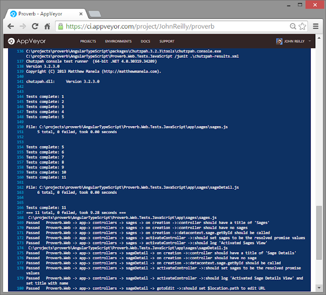

## With a little help from Chutzpah...

 [AppVeyor](http://www.appveyor.com) (if you're not aware of it) is a Continuous Integration provider. If you like, it's plug-and-play CI for .NET developers. It's lovely. And what's more it's ["free for open-source projects with public repositories hosted on GitHub and BitBucket"](http://www.appveyor.com/pricing). Boom! I recently hooked up 2 of my GitHub projects with AppVeyor. It took me all of... 10 minutes. If that? It really is \***that**\* good.

But.... There had to be a "but" otherwise I wouldn't have been writing the post you're reading. For a little side project of mine called [Proverb](https://github.com/johnnyreilly/Proverb) there were C# unit tests and there were JavaScript unit tests. And the JavaScript unit tests weren't being run... No fair!!!

[Chutzpah](https://chutzpah.codeplex.com/) is a JavaScript test runner which at this point runs QUnit, Jasmine and Mocha JavaScript tests. I use the [Visual Studio extension](http://visualstudiogallery.msdn.microsoft.com/f8741f04-bae4-4900-81c7-7c9bfb9ed1fe) to run Jasmine tests on my machine during development. I've also been able to use [Chutzpah for CI purposes with Visual Studio Online / Team Foundation Server](http://icanmakethiswork.blogspot.com/2014/03/the-surprisingly-happy-tale-of-visual.html). So what say we try and do the triple and make it work with AppVeyor too?

## NuGet me?

In order that I could run Chutzpah I needed Chutzpah to be installed on the build machine. So I had 2 choices:

1. Add Chutzpah direct to the repo
2. Add the [Chutzpah Nuget package](http://www.nuget.org/packages/chutzpah) to the solution


Unsurprisingly I chose #2 - much cleaner.

## Now to use Chutzpah

Time to dust down the PowerShell. I created myself a "before tests script" and added it to my build. It looked a little something like this:

```ps
# Locate Chutzpah

$ChutzpahDir = get-childitem chutzpah.console.exe -recurse | select-object -first 1 | select -expand Directory

# Run tests using Chutzpah and export results as JUnit format to chutzpah-results.xml

$ChutzpahCmd = "$($ChutzpahDir)\chutzpah.console.exe $($env:APPVEYOR_BUILD_FOLDER)\AngularTypeScript\Proverb.Web.Tests.JavaScript /junit .\chutzpah-results.xml"
Write-Host $ChutzpahCmd
Invoke-Expression $ChutzpahCmd

# Upload results to AppVeyor one by one

$testsuites = [xml](get-content .\chutzpah-results.xml)

$anyFailures = $FALSE
foreach ($testsuite in $testsuites.testsuites.testsuite) {
    write-host " $($testsuite.name)"
    foreach ($testcase in $testsuite.testcase){
        $failed = $testcase.failure
        $time = $testsuite.time
        if ($testcase.time) { $time = $testcase.time }
        if ($failed) {
            write-host "Failed   $($testcase.name) $($testcase.failure.message)"
            Add-AppveyorTest $testcase.name -Outcome Failed -FileName $testsuite.name -ErrorMessage $testcase.failure.message -Duration $time
            $anyFailures = $TRUE
        }
        else {
            write-host "Passed   $($testcase.name)"
            Add-AppveyorTest $testcase.name -Outcome Passed -FileName $testsuite.name -Duration $time
        }

    }
}

if ($anyFailures -eq $TRUE){
    write-host "Failing build as there are broken tests"
    $host.SetShouldExit(1)
}
```

What this does is:

1. Run Chutzpah from the installed NuGet package location, passing in the location of my Jasmine unit tests. In the case of my project there is a `chutzpah.json` file in the project which dictates how Chutzpah should run the tests. Also, [the JUnit flag is also passed](https://chutzpah.codeplex.com/wikipage?title=Command%20Line%20Options&referringTitle=Documentation) in order that Chutzpah creates a `chutzpah-results.xml` file of test results in the JUnit format.
2. We iterate through test results and tell AppVeyor about the the test passes and failures using the [Build Worker API](http://www.appveyor.com/docs/build-worker-api).
3. If there have been any failed tests then we fail the build. If you look [here](https://ci.appveyor.com/project/JohnReilly/proverb/build/1.0.17) you can see a deliberately failed build which demo's that this works as it should.


That's a wrap - We now have CI which includes our JavaScript tests! That's right we get to see beautiful screens like these:




## Thanks to...

Thanks to Dan Jones, whose comments on [this discussion](http://help.appveyor.com/discussions/questions/390-running-jasmine-on-appveyor#comment_34433599) provided a number of useful pointers which moved me in the right direction. And thanks to Feador Fitzner who has generously [said AppVeyor will support JUnit in the future](http://help.appveyor.com/discussions/questions/495-integrating-chutzpah-into-appveyor#comment_34447202) which may simplify use of Chutzpah with AppVeyor even further.


