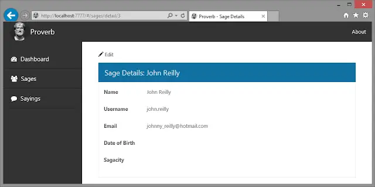

Anyone who reads my blog will know that I have been long in the habit of writing unit tests for my C# code. I'm cool like that. However, it took me a while to get up and running writing unit tests for my JavaScript code. I finally [got there](../2014-03-17-the-surprisingly-happy-tale-of-visual/index.md) using a combination of Jasmine 2.0 and Chutzpah. (Jasmine being my test framework and Chutzpah being my test runner.)

<!--truncate-->

I'm getting properly into the habit of testing my JavaScript. I won't pretend it's been particularly fun but I firmly believe it will end up being useful... That's what I tell myself during the long dark tea-times of the soul anyway.

I have a side project called [Proverb](https://github.com/johnnyreilly/Proverb). It doesn't do anything in particular - for the most part it's a simple application that displays the collected wise sayings of a team that I used to be part of. There's not much to it - a bit of CRUD, a dashboard. Not much more. Because of the project's simplicity it's ideal to use Proverb's underlying idea when trying out new technologies / frameworks. [The best way to learn is to do](http://en.wikipedia.org/wiki/Paul_Halmos). So if I want to learn "X", then building Proverb using "X" is a good way to go.

I digress already. I had a version of Proverb built using a combination of [AngularJS and TypeScript](https://github.com/johnnyreilly/Proverb/tree/master/AngularTypeScript). I had written the Angular side of Proverb without any tests. Now I was able to write JavaScript tests for my Angular code that's just what I set out to do. It should prove something of a of [Code Kata](<http://en.wikipedia.org/wiki/Kata_(programming)>) too.

Whilst I'm at it I thought it might prove helpful if I wrote up how I approached writing unit tests for a single Angular controller. So here goes.

## What I'm Testing

I have an Angular controller called `sagesDetail`. It powers this screen:



`sagesDetail` is a very simple controller. It does these things:

1. Load the "sage" (think of it as just a "user") and make it available on the controller so it can be bound to the view.
2. Set the view title.
3. Log view activation.
4. Expose a `gotoEdit` method which, when called, redirects the user to the edit screen.

The controller is written in TypeScript and looks like this:

### sagesDetail.ts

```ts
module controllers {
  'use strict';

  var controllerId = 'sageDetail';

  interface sageDetailRouteParams extends ng.route.IRouteParamsService {
    id: string;
  }

  class SageDetail {
    log: loggerFunction;
    sage: sage;
    title: string;

    static $inject = ['$location', '$routeParams', 'common', 'datacontext'];
    constructor(
      private $location: ng.ILocationService,
      private $routeParams: sageDetailRouteParams,
      private common: common,
      private datacontext: datacontext,
    ) {
      this.sage = undefined;
      this.title = 'Sage Details';

      this.log = common.logger.getLogFn(controllerId);

      this.activate();
    }

    // Prototype methods

    activate() {
      var id = parseInt(this.$routeParams.id, 10);
      var dataPromises: ng.IPromise<any>[] = [
        this.datacontext.sage
          .getById(id, true)
          .then((data) => (this.sage = data)),
      ];

      this.common
        .activateController(dataPromises, controllerId, this.title)
        .then(() => {
          this.log('Activated Sage Details View');
          this.title = 'Sage Details: ' + this.sage.name;
        });
    }

    gotoEdit() {
      this.$location.path('/sages/edit/' + this.sage.id);
    }
  }

  angular.module('app').controller(controllerId, SageDetail);
}
```

When compiled to JavaScript it looks like this:

### sageDetail.js

```js
var controllers;
(function (controllers) {
  'use strict';

  var controllerId = 'sageDetail';

  var SageDetail = (function () {
    function SageDetail($location, $routeParams, common, datacontext) {
      this.$location = $location;
      this.$routeParams = $routeParams;
      this.common = common;
      this.datacontext = datacontext;
      this.sage = undefined;
      this.title = 'Sage Details';

      this.log = common.logger.getLogFn(controllerId);

      this.activate();
    }
    // Prototype methods
    SageDetail.prototype.activate = function () {
      var _this = this;
      var id = parseInt(this.$routeParams.id, 10);
      var dataPromises = [
        this.datacontext.sage.getById(id, true).then(function (data) {
          return (_this.sage = data);
        }),
      ];

      this.common
        .activateController(dataPromises, controllerId, this.title)
        .then(function () {
          _this.log('Activated Sage Details View');
          _this.title = 'Sage Details: ' + _this.sage.name;
        });
    };

    SageDetail.prototype.gotoEdit = function () {
      this.$location.path('/sages/edit/' + this.sage.id);
    };
    SageDetail.$inject = ['$location', '$routeParams', 'common', 'datacontext'];
    return SageDetail;
  })();

  angular.module('app').controller(controllerId, SageDetail);
})(controllers || (controllers = {}));
//# sourceMappingURL=sageDetail.js.map
```

## Now for the Tests

I haven't yet made the move of switching over my Jasmine tests from JavaScript to TypeScript. (It's on my list but there's only so many things you can do at once...) For that reason the tests you'll see here are straight JavaScript. Below you will see the tests for the `sageDetail` controller.

I have put very comments in the test code to make clear the intent to you, dear reader. Annotated the life out of them. Naturally I wouldn't expect a test to be so heavily annotated in a typical test suite - and you can be sure mine normally aren't!

### Jasmine tests for sageDetail.js

```js
describe('Proverb.Web -> app-> controllers ->', function () {
  // Before each test runs we're going to need ourselves an Angular App to test - go fetch!
  beforeEach(function () {
    module('app'); // module is an alias for <a href="https://docs.angularjs.org/api/ngMock/function/angular.mock.module">angular.mock.module</a>
  });

  // Tests for the sageDetail controller
  describe('sageDetail ->', function () {
    // Declare describe-scoped variables
    var $rootScope,
      getById_deferred, // deferred used for promises
      $location,
      $routeParams_stub,
      common,
      datacontext, // controller dependencies
      sageDetailController; // the controller

    // Before each test runs set up the controller using inject - an alias for <a href="https://docs.angularjs.org/api/ngMock/function/angular.mock.inject">angular.mock.inject</a>
    beforeEach(inject(function (
      _$controller_,
      _$rootScope_,
      _$q_,
      _$location_,
      _common_,
      _datacontext_,
    ) {
      // Note how each parameter is prefixed and suffixed with "_" - this an Angular nicety
      // which allows you to have variables in your tests with the original reference name.
      // So here we assign the injected parameters to the describe-scoped variables:
      $rootScope = _$rootScope_;
      $q = _$q_;
      $location = _$location_;
      common = _common_;
      datacontext = _datacontext_;

      // Our controller has a dependency on an "id" property passed on the $routeParams
      // We're going to stub this out with a JavaScript object literal
      $routeParams_stub = { id: '10' };

      // Our controller depends on a promise returned from this function: datacontext.sage.getById
      // Well strictly speaking it also uses a promise for activateController but since the activateController
      // promise just wraps the getById promise it will be resolved when the getById promise is.
      // Here we create a deferred representing the getById promise which we can resolve as we need to
      getById_deferred = $q.defer();

      // set up a spy on datacontext.sage.getById and set it to return the promise of getById_deferred
      // this allows us to #1 detect that getById has been called
      // and #2 resolve / reject our promise as our test requires using getById_deferred
      spyOn(datacontext.sage, 'getById').and.returnValue(
        getById_deferred.promise,
      );

      // set up a spy on common.activateController and set it to call through
      // this allows us to detect that activateController has been called whilst
      // maintaining existing controller functionality
      spyOn(common, 'activateController').and.callThrough();

      // set up spys on common.logger.getLogFn and $location.path so we can detect they have been called
      spyOn(common.logger, 'getLogFn').and.returnValue(
        jasmine.createSpy('log'),
      );
      spyOn($location, 'path').and.returnValue(jasmine.createSpy('path'));

      // create a sageDetail controller and inject the dependencies we have set up
      sageDetailController = _$controller_('sageDetail', {
        $location: $location,
        $routeParams: $routeParams_stub,
        common: common,
        datacontext: datacontext,
      });
    }));

    // Tests for the controller state at the point of the sageDetail controller's creation
    // ie before the getById / activateController promises have been resolved
    // So this tests the constructor (function) and the activate function up to the point
    // of the promise calls
    describe('on creation ->', function () {
      it("controller should have a title of 'Sage Details'", function () {
        // tests this code has executed:
        // this.title = "Sage Details";
        expect(sageDetailController.title).toBe('Sage Details');
      });

      it('controller should have no sage', function () {
        // tests this code has executed:
        // this.sage = undefined;
        expect(sageDetailController.sage).toBeUndefined();
      });

      it('datacontext.sage.getById should be called', function () {
        // tests this code has executed:
        // this.datacontext.sage.getById(id, true)
        expect(datacontext.sage.getById).toHaveBeenCalledWith(10, true);
      });
    });

    // Tests for the controller state at the point of the resolution of the getById promise
    // ie after the getById / activateController promises have been resolved
    // So this tests the constructor (function) and the activate function after the point
    // of the promise calls
    describe('activateController ->', function () {
      var sage_stub;
      beforeEach(function () {
        // Create a sage stub which will be used when resolving the getById promise
        sage_stub = { name: 'John' };
      });

      it('should set sages to be the resolved promise values', function () {
        // Resolve the getById promise with the sage stub
        getById_deferred.resolve(sage_stub);
        $rootScope.$digest(); // So Angular processes the resolved promise

        // tests this code has executed:
        // this.sage = data
        expect(sageDetailController.sage).toBe(sage_stub);
      });

      it("should log 'Activated Sage Details View' and set title with name", function () {
        // Resolve the getById promise with the sage stub
        getById_deferred.resolve(sage_stub);
        $rootScope.$digest(); // So Angular processes the resolved promise

        // tests this code has executed:
        // this.log("Activated Sage Details View");
        // this.title = "Sage Details: " + this.sage.name;
        expect(sageDetailController.log).toHaveBeenCalledWith(
          'Activated Sage Details View',
        );
        expect(sageDetailController.title).toBe(
          'Sage Details: ' + sage_stub.name,
        );
      });
    });

    // Tests for the gotoEdit function on the controller
    // Note that this will only be called *after* a controller has been created
    // and it depends upon a sage having first been loaded
    describe('gotoEdit ->', function () {
      var sage_stub;
      beforeEach(function () {
        // Create a sage stub which will be used when resolving the getById promise
        sage_stub = { id: 20 };
      });

      it('should set $location.path to edit URL', function () {
        // Resolve the getById promise with the sage stub
        getById_deferred.resolve(sage_stub);
        $rootScope.$digest(); // So Angular processes the resolved promise

        sageDetailController.gotoEdit();

        // tests this code has executed:
        // this.$location.path("/sages/edit/" + this.sage.id);
        expect($location.path).toHaveBeenCalledWith(
          '/sages/edit/' + sage_stub.id,
        );
      });
    });
  });
});
```
