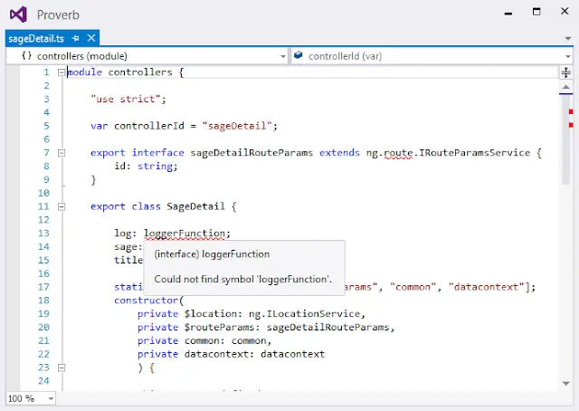

I previously attempted to migrate my Jasmine tests from JavaScript to TypeScript. The last time I tried it didn't go so well and I bailed. Thank the Lord for source control. But feeling I shouldn't be deterred I decided to have another crack at it.

<!--truncate-->

I did manage it this time... Sort of. Unfortunately there was a problem which I discovered right at the end. An issue with the TypeScript / Visual Studio tooling. So, just to be clear, this is not a blog post of "do this and it will work perfectly". On this occasion there will be some rough edges. This post exists, as much as anything else, as a record of the problems I experienced - I hope it will prove useful. Here we go:

## What to Migrate?

I'm going to use one of the test files in my my side project [Proverb](https://github.com/johnnyreilly/Proverb). It's the tests for an AngularJS controller called `sageDetail` \- I've written about it [before](../2014-09-10-unit-testing-angular-controller-with/index.md). Here it is in all it's JavaScript-y glory:

```ts
describe('Proverb.Web -> app-> controllers ->', function () {
  beforeEach(function () {
    module('app');
  });

  describe('sageDetail ->', function () {
    var $rootScope,
      getById_deferred, // deferred used for promises
      $location,
      $routeParams_stub,
      common,
      datacontext, // controller dependencies
      sageDetailController; // the controller

    beforeEach(inject(function (
      _$controller_,
      _$rootScope_,
      _$q_,
      _$location_,
      _common_,
      _datacontext_,
    ) {
      $rootScope = _$rootScope_;
      $q = _$q_;

      $location = _$location_;
      common = _common_;
      datacontext = _datacontext_;

      $routeParams_stub = { id: '10' };
      getById_deferred = $q.defer();

      spyOn(datacontext.sage, 'getById').and.returnValue(
        getById_deferred.promise,
      );
      spyOn(common, 'activateController').and.callThrough();
      spyOn(common.logger, 'getLogFn').and.returnValue(
        jasmine.createSpy('log'),
      );
      spyOn($location, 'path').and.returnValue(jasmine.createSpy('path'));

      sageDetailController = _$controller_('sageDetail', {
        $location: $location,
        $routeParams: $routeParams_stub,
        common: common,
        datacontext: datacontext,
      });
    }));

    describe('on creation ->', function () {
      it("controller should have a title of 'Sage Details'", function () {
        expect(sageDetailController.title).toBe('Sage Details');
      });

      it('controller should have no sage', function () {
        expect(sageDetailController.sage).toBeUndefined();
      });

      it('datacontext.sage.getById should be called', function () {
        expect(datacontext.sage.getById).toHaveBeenCalledWith(10, true);
      });
    });

    describe('activateController ->', function () {
      var sage_stub;
      beforeEach(function () {
        sage_stub = { name: 'John' };
      });

      it('should set sages to be the resolved promise values', function () {
        getById_deferred.resolve(sage_stub);
        $rootScope.$digest(); // So Angular processes the resolved promise

        expect(sageDetailController.sage).toBe(sage_stub);
      });

      it("should log 'Activated Sage Details View' and set title with name", function () {
        getById_deferred.resolve(sage_stub);
        $rootScope.$digest(); // So Angular processes the resolved promise

        expect(sageDetailController.log).toHaveBeenCalledWith(
          'Activated Sage Details View',
        );
        expect(sageDetailController.title).toBe(
          'Sage Details: ' + sage_stub.name,
        );
      });
    });

    describe('gotoEdit ->', function () {
      var sage_stub;
      beforeEach(function () {
        sage_stub = { id: 20 };
      });

      it('should set $location.path to edit URL', function () {
        getById_deferred.resolve(sage_stub);
        $rootScope.$digest(); // So Angular processes the resolved promise

        sageDetailController.gotoEdit();

        expect($location.path).toHaveBeenCalledWith(
          '/sages/edit/' + sage_stub.id,
        );
      });
    });
  });
});
```

## Off we go

Righteo. Let's flip the switch. `sageDetail.js` you shall go to the ball! One wave of my magic wand and `sageDetail.js` becomes `sageDetail.ts`... Alakazam!! Of course we've got to do the fiddling with the `csproj` file to include the dependent JavaScript files. (I'll be very pleased when ASP.Net vNext ships and I don't have to do this anymore....) So find this:

```xml
<TypeScriptCompile Include="app\sages\sageDetail.ts" />
```

And add this:

```xml
<Content Include="app\sages\sageDetail.js">
  <DependentUpon>sageDetail.ts</DependentUpon>
</Content>
<Content Include="app\sages\sageDetail.js.map">
  <DependentUpon>sageDetail.ts</DependentUpon>
</Content>
```

What next? I've a million red squigglies in my code. It's "could not find symbol" city. Why? Typings! We need typings! So let's begin - I'm needing the Jasmine typings for starters. So let's hit NuGet and it looks like we need [this](http://www.nuget.org/packages/jasmine.TypeScript.DefinitelyTyped/):

`Install-Package jasmine.TypeScript.DefinitelyTyped`That did no good at all. Still red squigglies. I'm going to hazard a guess that this is something to do with the fact my JavaScript Unit Test project doesn't contain the various TypeScript artefacts that Visual Studio kindly puts into the web csproj for you. This is because I'm keeping my JavaScript tests in a separate project from the code being tested. Also, the Visual Studio TypeScript tooling seems to work on the assumption that TypeScript will only be used within a web project; not a test project. Well I won't let that hold me back... Time to port the TypeScript artefacts in the web csproj over by hand. I'll take this:

```xml
<Import Project="$(MSBuildExtensionsPath32)\Microsoft\VisualStudio\v$(VisualStudioVersion)\TypeScript\Microsoft.TypeScript.Default.props" Condition="Exists('$(MSBuildExtensionsPath32)\Microsoft\VisualStudio\v$(VisualStudioVersion)\TypeScript\Microsoft.TypeScript.Default.props')" />
```

And I'll also take this

```xml
<PropertyGroup Condition="'$(Configuration)' == 'Debug'">
  <TypeScriptNoImplicitAny>True</TypeScriptNoImplicitAny>
</PropertyGroup>
<Import Project="$(MSBuildExtensionsPath32)\Microsoft\VisualStudio\v$(VisualStudioVersion)\TypeScript\Microsoft.TypeScript.targets" Condition="Exists('$(MSBuildExtensionsPath32)\Microsoft\VisualStudio\v$(VisualStudioVersion)\TypeScript\Microsoft.TypeScript.targets')" />
```

Bingo bango - a difference. I no longer have red squigglies under the Jasmine statements (`describe`, `it` etc). But alas, I do everywhere else. One in particular draws my eye...

## Could not find symbol '$q'

Once again TypeScript picks up the hidden bugs in my JavaScript:

```ts
$q = _$q_;
```

That's right it's an implicit global. Quickly fixed:

```ts
var $q = _$q_;
```

## Typings? Where we're going, we need typings...

We need more types. We're going to need the types created by our application; our controllers / services / directives etc. As well that we need the types used in the creation of the app. So the Angular typings etc. Since we're going to need to use `reference` statements to pull in the types created by our application I might as well use them to pull in the required definition files as well (eg `angular.d.ts`):

```xml
/// <reference path="../../../proverb.web/scripts/typings/angularjs/angular.d.ts" />
/// <reference path="../../../proverb.web/scripts/typings/angularjs/angular-mocks.d.ts" />
/// <reference path="../../../proverb.web/app/sages/sagedetail.ts" />
/// <reference path="../../../proverb.web/app/common/common.ts" />
/// <reference path="../../../proverb.web/app/services/datacontext.ts" />
/// <reference path="../../../proverb.web/app/services/repository.sage.ts" />
```

Now we need to work our way through the "variable 'x' implicitly has an 'any' type" messages. One thing we need to do is to amend our original sageDetails.ts file so that the `sageDetailRouteParams` interface and `SageDetail` class are exported from the controllers module. We can't use the types otherwise. Now we can add typings to our file - once finished it looks like this:

```ts
/// <reference path="../../../proverb.web/scripts/typings/angularjs/angular.d.ts" />
/// <reference path="../../../proverb.web/scripts/typings/angularjs/angular-mocks.d.ts" />
/// <reference path="../../../proverb.web/app/sages/sagedetail.ts" />
/// <reference path="../../../proverb.web/app/common/common.ts" />
/// <reference path="../../../proverb.web/app/services/datacontext.ts" />
/// <reference path="../../../proverb.web/app/services/repository.sage.ts" />
describe('Proverb.Web -> app-> controllers ->', function () {
  beforeEach(function () {
    module('app');
  });

  describe('sageDetail ->', function () {
    var $rootScope: ng.IRootScopeService,
      // deferred used for promises
      getById_deferred: ng.IDeferred<sage>,
      // controller dependencies
      $location: ng.ILocationService,
      $routeParams_stub: controllers.sageDetailRouteParams,
      common: common,
      datacontext: datacontext,
      sageDetailController: controllers.SageDetail; // the controller

    beforeEach(inject(function (
      _$controller_: any,
      _$rootScope_: ng.IRootScopeService,
      _$q_: ng.IQService,
      _$location_: ng.ILocationService,
      _common_: common,
      _datacontext_: datacontext,
    ) {
      $rootScope = _$rootScope_;
      var $q = _$q_;

      $location = _$location_;
      common = _common_;
      datacontext = _datacontext_;

      $routeParams_stub = { id: '10' };
      getById_deferred = $q.defer();

      spyOn(datacontext.sage, 'getById').and.returnValue(
        getById_deferred.promise,
      );
      spyOn(common, 'activateController').and.callThrough();
      spyOn(common.logger, 'getLogFn').and.returnValue(
        jasmine.createSpy('log'),
      );
      spyOn($location, 'path').and.returnValue(jasmine.createSpy('path'));

      sageDetailController = _$controller_('sageDetail', {
        $location: $location,
        $routeParams: $routeParams_stub,
        common: common,
        datacontext: datacontext,
      });
    }));

    describe('on creation ->', function () {
      it("controller should have a title of 'Sage Details'", function () {
        expect(sageDetailController.title).toBe('Sage Details');
      });

      it('controller should have no sage', function () {
        expect(sageDetailController.sage).toBeUndefined();
      });

      it('datacontext.sage.getById should be called', function () {
        expect(datacontext.sage.getById).toHaveBeenCalledWith(10, true);
      });
    });

    describe('activateController ->', function () {
      var sage_stub: sage;
      beforeEach(function () {
        sage_stub = {
          name: 'John',
          id: 10,
          username: 'John',
          email: 'john@',
          dateOfBirth: new Date(),
        };
      });

      it('should set sages to be the resolved promise values', function () {
        getById_deferred.resolve(sage_stub);
        $rootScope.$digest(); // So Angular processes the resolved promise

        expect(sageDetailController.sage).toBe(sage_stub);
      });

      it("should log 'Activated Sage Details View' and set title with name", function () {
        getById_deferred.resolve(sage_stub);
        $rootScope.$digest(); // So Angular processes the resolved promise

        expect(sageDetailController.log).toHaveBeenCalledWith(
          'Activated Sage Details View',
        );
        expect(sageDetailController.title).toBe(
          'Sage Details: ' + sage_stub.name,
        );
      });
    });

    describe('gotoEdit ->', function () {
      var sage_stub: sage;
      beforeEach(function () {
        sage_stub = {
          name: 'John',
          id: 20,
          username: 'John',
          email: 'john@',
          dateOfBirth: new Date(),
        };
      });

      it('should set $location.path to edit URL', function () {
        getById_deferred.resolve(sage_stub);
        $rootScope.$digest(); // So Angular processes the resolved promise

        sageDetailController.gotoEdit();

        expect($location.path).toHaveBeenCalledWith(
          '/sages/edit/' + sage_stub.id,
        );
      });
    });
  });
});
```

## So That's All Good...

Except it's not. When I run the tests using Chutzpah my `sageDetail` controller tests aren't found. My spider sense is tingling. This is something to do with the `reference` statements. They're throwing Chutzpah off. No bother, I can fix that with a quick tweak of the project file:

```xml
<PropertyGroup Condition="'$(Configuration)' == 'Debug'">
    <TypeScriptNoImplicitAny>True</TypeScriptNoImplicitAny>
    <TypeScriptRemoveComments>True</TypeScriptRemoveComments>
  </PropertyGroup>
```

The TypeScript compiler will now strip comments; which includes the `reference` statements. Now my tests are detected \***and**\* they run. Yay!

## Who Killed the TypeScript Language Service?

Yup it's dead. Whilst the compilation itself has no issues, take a look at the errors being presented for just one of the files back in the original web project:



It looks like having one TypeScript project in a solution which uses `reference` comments somehow breaks the implicit referencing behaviour built into Visual Studio for other TypeScript projects in the solution. I can say this with some confidence as if I pull out the `reference` comments from the top of the test file that we've converted then it's business as usual - the TypeScript Language Service lives once more. I'm sure you can see the problem here though: the TypeScript test file doesn't compile. All rather unsatisfactory.

I suspect that if I added `reference` comments throughout the web project the TypeScript Language Service would be just fine. But I rather like the implicit referencing functionality so I'm not inclined to do that. After reaching something of a brick wall and thinking I had encountered a bug in the TypeScript Language service I [raised an issue on GitHub](https://github.com/Microsoft/TypeScript/issues/673).

## Solutions....

Thanks to the help of [Mohamed Hegazy](https://github.com/mhegazy) it emerged that the problem was down to missing `reference` comments in my `sageDetail` controller tests. One thing I had not considered was the 2 different ways each of my TypeScript projects were working:

- Proverb.Web uses the Visual Studio implicit referencing functionality. This means that I do not need to use `reference` comments in the TypeScript files in Proverb.Web.
- Proverb.Web.JavaScript does \***not**\* uses the implicit referencing functionality. It needs `reference` comments to resolve references.

The important thing to take away from this (and the thing I had overlooked) was that Proverb.Web.JavaScript uses `reference` comments to pull in Proverb.Web TypeScript files. Those files have dependencies which are \***not**\* stated using `reference` comments. So the compiler trips up when it tries to walk the dependency tree - there are no `reference` comments to be followed! So for example, `common.ts` has a dependency upon `logger.ts`. Fixing the TypeScript Language Service involves ensuring that the full dependency list is included in the `sageDetail` controller tests file, like so:

```ts
/// <reference path="../../../proverb.web/scripts/typings/angularjs/angular.d.ts" />
/// <reference path="../../../proverb.web/scripts/typings/angularjs/angular-mocks.d.ts" />
/// <reference path="../../../proverb.web/scripts/typings/angularjs/angular-route.d.ts" />
/// <reference path="../../../proverb.web/scripts/typings/toastr/toastr.d.ts" />
/// <reference path="../../../proverb.web/scripts/typings/underscore/underscore.d.ts" />
/// <reference path="../../../proverb.web/app/sages/sagedetail.ts" />
/// <reference path="../../../proverb.web/app/common/logger.ts" />
/// <reference path="../../../proverb.web/app/common/common.ts" />
/// <reference path="../../../proverb.web/app/services/datacontext.ts" />
/// <reference path="../../../proverb.web/app/services/repositories.ts" />
/// <reference path="../../../proverb.web/app/services/repository.sage.ts" />
/// <reference path="../../../proverb.web/app/services/repository.saying.ts" />
/// <reference path="../../../proverb.web/app/app.ts" />
/// <reference path="../../../proverb.web/app/config.route.ts" />
```

With this in place you have a working solution, albeit one that is a little flaky. [An alternative solution was suggested by Noel Abrahams](https://github.com/Microsoft/TypeScript/issues/673#issuecomment-56024348) which I quote here:

> Why not do the following?
>
> - Compile Proverb.Web with --declarations and the option for combining output into a single file. This should create a Proverb.Web.d.ts in your output directory.
> - In Proverb.Web.Tests.JavaScript add a reference to this file.
> - Right-click Proverb.Web.Tests.JavaScript select "Build Dependencies" > "Project Dependencies" and add a reference to Proverb.Web.
>
> I don't think directly referencing TypeScript source files is a good idea, because it causes the file to be rebuilt every time the dependant project is compiled.

Mohamed rather liked this solution. It looks like some more work is due to be done on the TypeScript tooling to make this less headache-y in future.
