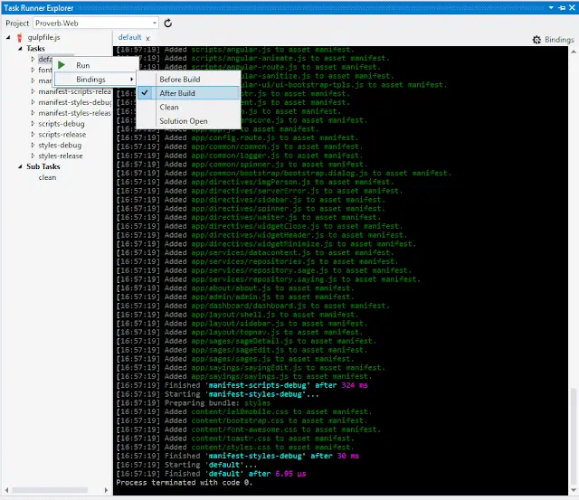

### Updated 17/02/2015: I've taken the approach discussed in this post a little further - you can see [here](../2012-10-05-using-web-optimization-with-mvc-3/index.md)

<!--truncate-->

I've used a number of tools to package up JavaScript and CSS in my web apps. [Andrew Davey's tremendous Cassette](http://getcassette.net/) has been really useful. Also good (although less powerful/magical) has been Microsoft's very own [Microsoft.AspNet.Web.Optimization](https://www.nuget.org/packages/Microsoft.AspNet.Web.Optimization/) that ships with MVC.

I was watching the [ASP.NET Community Standup from October 7th, 2014](http://youtu.be/NgbA2BxNweE?list=PL0M0zPgJ3HSftTAAHttA3JQU4vOjXFquF) and learned that the ASP.Net team is not planning to migrate [Microsoft.AspNet.Web.Optimization](https://www.nuget.org/packages/Microsoft.AspNet.Web.Optimization/) to the next version of ASP.Net. Instead they're looking to make use of JavaScript task runners like [Grunt](http://gruntjs.com/) and maybe [Gulp](http://gulpjs.com/). Perhaps you're even dimly aware that they've been taking steps to make these runners more of a first class citizen in Visual Studio, hence the recent release of the new and groovy [Task Runner Explorer](http://visualstudiogallery.msdn.microsoft.com/8e1b4368-4afb-467a-bc13-9650572db708).

Gulp has been on my radar for a while now as has Grunt. By "on my radar" what I really mean is "Hmmmm, I really need to learn this..... perhaps I could wait until the [Betamax vs VHS battles](http://en.wikipedia.org/wiki/Videotape_format_war) are done? Oh never mind, here we go...".

My understanding is that Grunt and Gulp essentially do the same thing (run tasks in JavaScript) but have different approaches. Grunt is more about configuration, Gulp is more about code. At present Gulp also has a performance advantage as it does less IO than Grunt - though I understand that's due to change in the future. But generally my preference is code over configuration. On that basis I decided that I was going to give Gulp first crack.

## Bub bye Web Optimization

I already had a project that used [Web Optimization](https://github.com/johnnyreilly/Proverb) to bundle JavaScript and CSS files. When debugging on my own machine Web Optimization served up the full JavaScript and CSS files. Thanks to the magic of source maps I was able to debug the TypeScript that created the JavaScript files too. Which was nice. When I deployed to production, Web Optimization minified and concatenated the JavaScript and CSS files. This meant I had a single HTTP request for JavaScript and a single HTTP request for CSS. This was also... nooice!

I took a copy of my existing project and created a [new repo for it on GitHub](https://github.com/johnnyreilly/Proverb-gulp). It was very simple in terms of bundling. It had a `BundleConfig` that created 2 bundles; 1 for JavaScript and 1 for CSS:

```cs
using System.Web;
using System.Web.Optimization;

namespace Proverb.Web
{
    public class BundleConfig
    {
        // For more information on bundling, visit http://go.microsoft.com/fwlink/?LinkId=301862
        public static void RegisterBundles(BundleCollection bundles)
        {
            var angularApp = new ScriptBundle("~/angularApp").Include(

                // Vendor Scripts
                "~/scripts/jquery-{version}.js",
                "~/scripts/angular.js",
                "~/scripts/angular-animate.js",
                "~/scripts/angular-route.js",
                "~/scripts/angular-sanitize.js",
                "~/scripts/angular-ui/ui-bootstrap-tpls.js",

                "~/scripts/toastr.js",
                "~/scripts/moment.js",
                "~/scripts/spin.js",
                "~/scripts/underscore.js",

                // Bootstrapping
                "~/app/app.js",
                "~/app/config.route.js",

                // common Modules
                "~/app/common/common.js",
                "~/app/common/logger.js",
                "~/app/common/spinner.js",

                // common.bootstrap Modules
                "~/app/common/bootstrap/bootstrap.dialog.js"
                );

            // directives
            angularApp.IncludeDirectory("~/app/directives", "*.js", true);

            // services
            angularApp.IncludeDirectory("~/app/services", "*.js", true);

            // controllers
            angularApp.IncludeDirectory("~/app/admin", "*.js", true);
            angularApp.IncludeDirectory("~/app/about", "*.js", true);
            angularApp.IncludeDirectory("~/app/dashboard", "*.js", true);
            angularApp.IncludeDirectory("~/app/layout", "*.js", true);
            angularApp.IncludeDirectory("~/app/sayings", "*.js", true);
            angularApp.IncludeDirectory("~/app/sages", "*.js", true);

            bundles.Add(angularApp);

            bundles.Add(new StyleBundle("~/Content/css").Include(
                "~/content/ie10mobile.css",
                "~/content/bootstrap.css",
                "~/content/font-awesome.css",
                "~/content/toastr.css",
                "~/content/styles.css"
            ));
        }
    }
}
```

I set myself a task. I wanted to be able to work in \***exactly**\* the way I was working now. But using Gulp instead of Web Optimization. I wanted to lose the BundleConfig above and remove Web Optimization from my application, secure in the knowledge that I had lost nothing. Could it be done? Read on!

## Installing Gulp (and Associates)

I fired up Visual Studio and looked for an excuse to use the Task Runner Explorer. The first thing I needed was Gulp. My machine already had Node and NPM installed so I went to the command line to install Gulp globally:

```ps
npm install gulp -g
```

Now to start to plug Gulp into my web project. It was time to make the introductions: Visual Studio meet NPM. At the root of the web project I created a `package.json` file by executing the following command and accepting all the defaults:

```ps
npm init
```

I wanted to add Gulp as a development dependency of my project: ("Development" because I only need to run tasks at development time. My app has no dependency on Gulp at runtime - at that point it's just about serving up static files.)

```ps
npm install gulp --save-dev
```

This installs gulp local to the project as a development dependency. As a result we now have a "node_modules" folder sat in our root which contains our node packages. Currently, as our `package.json` reveals, this is only gulp:

```json
"devDependencies": {
    "gulp": "^3.8.8"
  }
```

It's time to go to town. Let's install all the packages we're going to need to bundle and minify JavaScript and CSS:

```sh
npm install gulp-concat gulp-uglify gulp-rev del path gulp-ignore gulp-asset-manifest gulp-minify-css --save-dev
```

This installs the packages as dev dependencies (as you've probably guessed) and leaves us with a list of dev dependencies like this:

```json
"devDependencies": {
    "del": "^0.1.3",
    "gulp": "^3.8.8",
    "gulp-asset-manifest": "0.0.5",
    "gulp-concat": "^2.4.1",
    "gulp-ignore": "^1.2.1",
    "gulp-minify-css": "^0.3.10",
    "gulp-rev": "^1.1.0",
    "gulp-uglify": "^1.0.1",
    "path": "^0.4.9"
  }
```

## Making `gulpfile.js`

So now I was ready. I had everything I needed to replace my `BundleConfig.cs`. I created a new file called `gulpfile.js` in the root of my web project that looked like this:

```js
/// <vs AfterBuild='default' />
var gulp = require('gulp');

// Include Our Plugins
var concat = require('gulp-concat');
var ignore = require('gulp-ignore');
var manifest = require('gulp-asset-manifest');
var minifyCss = require('gulp-minify-css');
var uglify = require('gulp-uglify');
var rev = require('gulp-rev');
var del = require('del');
var path = require('path');

var tsjsmapjsSuffix = '.{ts,js.map,js}';
var excludetsjsmap = '**/*.{ts,js.map}';

var bundleNames = { scripts: 'scripts', styles: 'styles' };

var filesAndFolders = {
  base: '.',
  buildBaseFolder: './build/',
  debug: 'debug',
  release: 'release',
  css: 'css',

  // The fonts we want Gulp to process
  fonts: ['./fonts/*.*'],

  // The scripts we want Gulp to process - adapted from BundleConfig
  scripts: [
    // Vendor Scripts
    './scripts/angular.js',
    './scripts/angular-animate.js',
    './scripts/angular-route.js',
    './scripts/angular-sanitize.js',
    './scripts/angular-ui/ui-bootstrap-tpls.js',

    './scripts/toastr.js',
    './scripts/moment.js',
    './scripts/spin.js',
    './scripts/underscore.js',

    // Bootstrapping
    './app/app' + tsjsmapjsSuffix,
    './app/config.route' + tsjsmapjsSuffix,

    // common Modules
    './app/common/common' + tsjsmapjsSuffix,
    './app/common/logger' + tsjsmapjsSuffix,
    './app/common/spinner' + tsjsmapjsSuffix,

    // common.bootstrap Modules
    './app/common/bootstrap/bootstrap.dialog' + tsjsmapjsSuffix,

    // directives
    './app/directives/**/*' + tsjsmapjsSuffix,

    // services
    './app/services/**/*' + tsjsmapjsSuffix,

    // controllers
    './app/about/**/*' + tsjsmapjsSuffix,
    './app/admin/**/*' + tsjsmapjsSuffix,
    './app/dashboard/**/*' + tsjsmapjsSuffix,
    './app/layout/**/*' + tsjsmapjsSuffix,
    './app/sages/**/*' + tsjsmapjsSuffix,
    './app/sayings/**/*' + tsjsmapjsSuffix,
  ],

  // The styles we want Gulp to process - adapted from BundleConfig
  styles: [
    './content/ie10mobile.css',
    './content/bootstrap.css',
    './content/font-awesome.css',
    './content/toastr.css',
    './content/styles.css',
  ],
};

filesAndFolders.debugFolder =
  filesAndFolders.buildBaseFolder + '/' + filesAndFolders.debug + '/';
filesAndFolders.releaseFolder =
  filesAndFolders.buildBaseFolder + '/' + filesAndFolders.release + '/';

/**
 * Create a manifest depending upon the supplied arguments
 *
 * @param {string} manifestName
 * @param {string} bundleName
 * @param {boolean} includeRelativePath
 * @param {string} pathPrepend
 */
function getManifest(
  manifestName,
  bundleName,
  includeRelativePath,
  pathPrepend,
) {
  // Determine filename ("./build/manifest-debug.json" or "./build/manifest-release.json"
  var manifestFile =
    filesAndFolders.buildBaseFolder + 'manifest-' + manifestName + '.json';

  return manifest({
    bundleName: bundleName,
    includeRelativePath: includeRelativePath,
    manifestFile: manifestFile,
    log: true,
    pathPrepend: pathPrepend,
    pathSeparator: '/',
  });
}

// Delete the build folder
gulp.task('clean', function (cb) {
  del([filesAndFolders.buildBaseFolder], cb);
});

// Copy across all files in filesAndFolders.scripts to build/debug
gulp.task('scripts-debug', ['clean'], function () {
  return gulp
    .src(filesAndFolders.scripts, { base: filesAndFolders.base })
    .pipe(gulp.dest(filesAndFolders.debugFolder));
});

// Create a manifest.json for the debug build - this should have lots of script files in
gulp.task('manifest-scripts-debug', ['scripts-debug'], function () {
  return gulp
    .src(filesAndFolders.scripts, { base: filesAndFolders.base })
    .pipe(ignore.exclude('**/*.{ts,js.map}')) // Exclude ts and js.map files from the manifest (as they won't become script tags)
    .pipe(getManifest(filesAndFolders.debug, bundleNames.scripts, true));
});

// Copy across all files in filesAndFolders.styles to build/debug
gulp.task('styles-debug', ['clean'], function () {
  return gulp
    .src(filesAndFolders.styles, { base: filesAndFolders.base })
    .pipe(gulp.dest(filesAndFolders.debugFolder));
});

// Create a manifest.json for the debug build - this should have lots of style files in
gulp.task(
  'manifest-styles-debug',
  ['styles-debug', 'manifest-scripts-debug'],
  function () {
    return (
      gulp
        .src(filesAndFolders.styles, { base: filesAndFolders.base })
        //.pipe(ignore.exclude("**/*.{ts,js.map}")) // Exclude ts and js.map files from the manifest (as they won't become script tags)
        .pipe(getManifest(filesAndFolders.debug, bundleNames.styles, true))
    );
  },
);

// Concatenate & Minify JS for release into a single file
gulp.task('scripts-release', ['clean'], function () {
  return (
    gulp
      .src(filesAndFolders.scripts)
      .pipe(ignore.exclude('**/*.{ts,js.map}')) // Exclude ts and js.map files - not needed in release mode

      .pipe(concat('app.js')) // Make a single file - if you want to see the contents then include the line below
      //.pipe(gulp.dest(releaseFolder))

      .pipe(uglify()) // Make the file titchy tiny small
      .pipe(rev()) // Suffix a version number to it
      .pipe(gulp.dest(filesAndFolders.releaseFolder))
  ); // Write single versioned file to build/release folder
});

// Create a manifest.json for the release build - this should just have a single file for scripts
gulp.task('manifest-scripts-release', ['scripts-release'], function () {
  return gulp
    .src(filesAndFolders.buildBaseFolder + filesAndFolders.release + '/*.js')
    .pipe(getManifest(filesAndFolders.release, bundleNames.scripts, false));
});

// Copy across all files in filesAndFolders.styles to build/debug
gulp.task('styles-release', ['clean'], function () {
  return (
    gulp
      .src(filesAndFolders.styles)
      .pipe(concat('app.css')) // Make a single file - if you want to see the contents then include the line below
      //.pipe(gulp.dest(releaseFolder))

      .pipe(minifyCss()) // Make the file titchy tiny small
      .pipe(rev()) // Suffix a version number to it
      .pipe(
        gulp.dest(filesAndFolders.releaseFolder + '/' + filesAndFolders.css),
      )
  ); // Write single versioned file to build/release folder
});

// Create a manifest.json for the debug build - this should have a single style files in
gulp.task(
  'manifest-styles-release',
  ['styles-release', 'manifest-scripts-release'],
  function () {
    return gulp
      .src(filesAndFolders.releaseFolder + '**/*.css')
      .pipe(
        getManifest(
          filesAndFolders.release,
          bundleNames.styles,
          false,
          filesAndFolders.css + '/',
        ),
      );
  },
);

// Copy across all fonts in filesAndFolders.fonts to both release and debug locations
gulp.task('fonts', ['clean'], function () {
  return gulp
    .src(filesAndFolders.fonts, { base: filesAndFolders.base })
    .pipe(gulp.dest(filesAndFolders.debugFolder))
    .pipe(gulp.dest(filesAndFolders.releaseFolder));
});

// Default Task
gulp.task('default', [
  'scripts-debug',
  'manifest-scripts-debug',
  'styles-debug',
  'manifest-styles-debug',
  'scripts-release',
  'manifest-scripts-release',
  'styles-release',
  'manifest-styles-release',
  'fonts',
]);
```

## What `gulpfile.js` does

This file does a number of things each time it is run. First of all it deletes any `build` folder in the root of the web project so we're ready to build anew. Then it packages up files both for debug and for release mode. For debug it does the following:

1. It copies the `ts`, `js.map` and `js` files declared in `filesAndFolders.scripts` to the `build/debug` folder preserving their original folder structure. (So, for example, `app/app.ts`, `app/app.js.map` and `app/app.js` will all end up at `build/debug/app/app.ts`, `build/debug/app/app.js.map` and `build/debug/app/app.js` respectively.) This is done to allow the continued debugging of the original TypeScript files when running in debug mode.
2. It copies the `css` files declared in `filesAndFolders.styles` to the `build/debug` folder preserving their original folder structure. (So `content/bootstrap.css` will end up at `build/debug/content/bootstrap.css`.)
3. It creates a `build/manifest-debug.json` file which contains details of all the script and style files that have been packaged up:

```json
{
  "scripts": [
    "scripts/angular.js",
    "scripts/angular-animate.js",
    "scripts/angular-route.js",
    "scripts/angular-sanitize.js",
    "scripts/angular-ui/ui-bootstrap-tpls.js",
    "scripts/toastr.js",
    "scripts/moment.js",
    "scripts/spin.js",
    "scripts/underscore.js",
    "app/app.js",
    "app/config.route.js",
    "app/common/common.js",
    "app/common/logger.js",
    "app/common/spinner.js",
    "app/common/bootstrap/bootstrap.dialog.js",
    "app/directives/imgPerson.js",
    "app/directives/serverError.js",
    "app/directives/sidebar.js",
    "app/directives/spinner.js",
    "app/directives/waiter.js",
    "app/directives/widgetClose.js",
    "app/directives/widgetHeader.js",
    "app/directives/widgetMinimize.js",
    "app/services/datacontext.js",
    "app/services/repositories.js",
    "app/services/repository.sage.js",
    "app/services/repository.saying.js",
    "app/about/about.js",
    "app/admin/admin.js",
    "app/dashboard/dashboard.js",
    "app/layout/shell.js",
    "app/layout/sidebar.js",
    "app/layout/topnav.js",
    "app/sages/sageDetail.js",
    "app/sages/sageEdit.js",
    "app/sages/sages.js",
    "app/sayings/sayingEdit.js",
    "app/sayings/sayings.js"
  ],
  "styles": [
    "content/ie10mobile.css",
    "content/bootstrap.css",
    "content/font-awesome.css",
    "content/toastr.css",
    "content/styles.css"
  ]
}
```

For release our gulpfile works with the same resources but has a different aim. Namely to minimise the the number of HTTP requests, obfuscate the code and version the files produced to prevent caching issues. To achieve those lofty aims it does the following:

1. It concatenates together all the `js` files declared in `filesAndFolders.scripts`, minifies them and writes them to a single `build/release/app-{xxxxx}.js` file (where `-{xxxxx}` represents a version created by gulp-rev).
2. It concatenates together all the `css` files declared in `filesAndFolders.styles`, minifies them and writes them to a single `build/release/css/app-{xxxxx}.css` file. The file is placed in a css subfolder because of relative paths specified in the CSS file.
3. It creates a `build/manifest-release.json` file which contains details of all the script and style files that have been packaged up:

```json
{
  "scripts": ["app-95d1e06d.js"],
  "styles": ["css/app-1a6256ea.css"]
}
```

As you can see, the number of files included are reduced down to 2; 1 for JavaScript and 1 for CSS.

Finally, for both the debug and release packages the contents of the `fonts` folder is copied across wholesale, preserving the original folder structure. This is because the CSS files contain relative references that point to the font files. If I had image files which were referenced by my CSS I'd similarly need to include these in the build process.

## Task Runner Explorer gets in on the action

The eagle eyed amongst you will also have noticed a peculiar first line to our `gulpfile.js`:

```js
/// <vs AfterBuild='default' />
```

This mysterious comment is actually how the Task Runner Explorer hooks our `gulpfile.js` into the Visual Studio build process. Our "magic comment" ensures that on the `AfterBuild` event, Task Runner Explorer runs the `default` task in our `gulpfile.js`. The reason we're using the `AfterBuild` event rather than the `BeforeBuild` event is because our project contains TypeScript and we need the transpiled JavaScript to be created before we can usefully run our package tasks. If we were using JavaScript alone then that wouldn't be an issue and either build event would do.



## How do I use this in my HTML?

Well this is magnificent - we have a gulpfile that builds our debug and release packages. The question now is, how do we use it?

Web Optimization made our lives really easy. Up in my head I had a `@Styles.Render("~/Content/css")` which pushed out my CSS and down at the foot of the body tag I had a `@Scripts.Render("~/angularApp")` which pushed out my script tags. `Styles` and `Scripts` are server-side utilities. It would be very easy to write equivalent utility classes that, depending on whether we were in debug or not, read the appropriate `build/manifest-xxxxxx.json` file and served up either debug or release `style` / `script` tags.

That would be pretty simple - and for what it's worth \*\*simple is <u>good</u>

\*\*. But today I felt like a challenge. What say server side rendering had been outlawed? A draconian ruling had been passed and all you had to play with was HTML / JavaScript and a server API that served up JSON? What would you do then? (All fantasy I know... But go with me on this - it's a journey.) Or more sensibly, what if you just want to remove some of the work your app is doing server-side to bundle and minify. Just serve up static assets instead. Spend less money in Azure why not?

Before I make all the changes let's review where we were. I had a single MVC view which, in terms of bundles, CSS and JavaScript pretty much looked like this:

```html
<!doctype html>
<html>
  <head>
    <!-- ... -->
    @Styles.Render("~/Content/css")
  </head>
  <body>
    <!-- ... -->

    @Scripts.Render("~/angularApp")
    <script>
      (function () {
        $.getJSON('@Url.Content("~/Home/StartApp")').done(
          function (startUpData) {
            var appConfig = $.extend({}, startUpData, {
              appRoot: '@Url.Content("~/")',
              remoteServiceRoot: '@Url.Content("~/api/")',
            });

            angularApp.start({
              thirdPartyLibs: {
                moment: window.moment,
                toastr: window.toastr,
                underscore: window._,
              },
              appConfig: appConfig,
            });
          },
        );
      })();
    </script>
  </body>
</html>
```

This is already more a complicated example than most peoples use cases. Essentially what's happening here is both bundles are written out as part of the HTML and then, once the scripts have loaded the Angular app is bootstrapped with some configuration loaded from the server by a good old jQuery AJAX call.

After reading [an article about script loading by the magnificently funny Jake Archibald](http://www.html5rocks.com/en/tutorials/speed/script-loading/) I felt ready. I cast my MVC view to the four winds and created myself a straight HTML file:

```html
<!doctype html>
<html>
  <head>
    <!-- ... -->
  </head>
  <body>
    <!-- ... -->

    <script src="Scripts/jquery-2.1.1.min.js"></script>
    <script>
      (function () {
        var appConfig = {};
        var scriptsToLoad;

        /**
         * Handler which fires as each script loads
         */
        function onScriptLoad(event) {
          scriptsToLoad -= 1;

          // Now all the scripts are present start the app
          if (scriptsToLoad === 0) {
            angularApp.start({
              thirdPartyLibs: {
                moment: window.moment,
                toastr: window.toastr,
                underscore: window._,
              },
              appConfig: appConfig,
            });
          }
        }

        // Load startup data from the server
        $.getJSON('api/Startup').done(function (startUpData) {
          appConfig = startUpData;

          // Determine the assets folder depending upon whether in debug mode or not
          var buildFolder = appConfig.appRoot + 'build/';
          var debugOrRelease = appConfig.inDebug ? 'debug' : 'release';
          var manifestFile =
            buildFolder + 'manifest-' + debugOrRelease + '.json';
          var outputFolder = buildFolder + debugOrRelease + '/';

          // Load JavaScript and CSS listed in manifest file
          $.getJSON(manifestFile).done(function (manifest) {
            manifest.styles.forEach(function (href) {
              var link = document.createElement('link');

              link.rel = 'stylesheet';
              link.media = 'all';
              link.href = outputFolder + href;

              document.head.appendChild(link);
            });

            scriptsToLoad = manifest.scripts.length;
            manifest.scripts.forEach(function (src) {
              var script = document.createElement('script');

              script.onload = onScriptLoad;
              script.src = outputFolder + src;
              script.async = false;

              document.head.appendChild(script);
            });
          });
        });
      })();
    </script>
  </body>
</html>
```

If you very carefully compare the HTML above the MVC view that it replaces you can see the commonalities. They are doing pretty much the same thing - the only real difference is the bootstrapping API. Previously it was an MVC endpoint at `/Home/StartApp`. Now it's a Web API endpoint at `api/Startup`. Here's how it works:

1. A jQuery AJAX call kicks off a call to load the bootstrapping / app config data. Importantly this data includes whether the app is running in debug or not.
2. Depending on the `isDebug` flag the app either loads the `build/manifest-debug.json` or `build/manifest-release.json` manifest.
3. For each CSS file in the styles bundle a `link` element is created and added to the page.
4. For each JavaScript file in the scripts bundle a `script` element is created and added to the page.

It's worth pointing out that this also has a performance edge over Web Optimization as the assets are loaded asynchronously! (Yes I know it says `script.async = false` but that's not what you think it is... Go read Jake's article!)

To finish off I had to make a few tweaks to my `web.config`:

```xml
<!-- Allow ASP.Net to serve up JSON files -->
    <system.webServer>
        <staticContent>
            <mimeMap fileExtension=".json" mimeType="application/json"/>
        </staticContent>
    </system.webServer>

    <!-- The build folder (and it's child folder "debug") will not be cached.
         When people are debugging they don't want to cache -->
    <location path="build">
        <system.webServer>
            <staticContent>
                <clientCache cacheControlMode="DisableCache"/>
            </staticContent>
        </system.webServer>
    </location>

    <!-- The release folder will be cached for a loooooong time
         When you're in Production caching is your friend -->
    <location path="build/release">
        <system.webServer>
            <staticContent>
                <clientCache cacheControlMode="UseMaxAge"/>
            </staticContent>
        </system.webServer>
    </location>
```

## I want to publish, how do I include my assets?

It's time for some `csproj` trickery. I must say I think I'll be glad to see the back of project files when ASP.Net vNext ships. This is what you need:

```xml
<Target Name="AfterBuild">
    <ItemGroup>
      <!-- what ever is in the build folder should be included in the project -->
      <Content Include="build\**\*.*" />
    </ItemGroup>
  </Target>
```

What's happening here is that \*_after_\* a build Visual Studio considers the complete contents of the build folder to part of the project. It's after the build because the folder will be deleted and reconstructed as part of the build.
