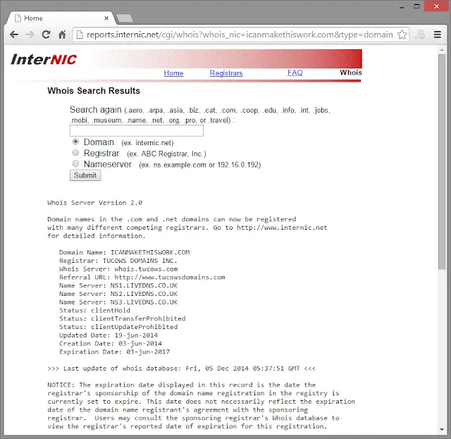
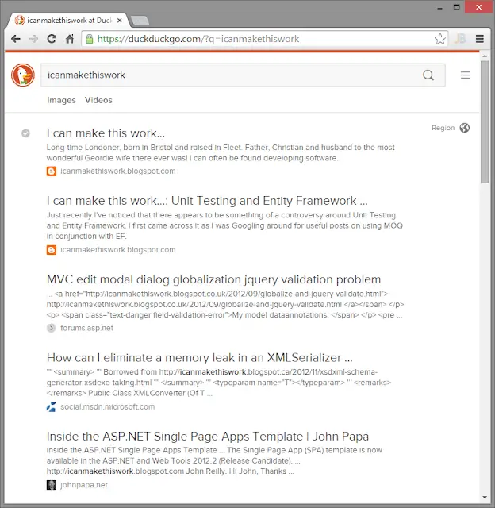

The observant amongst you may have noticed that this blog has a brand new and shiny domain name! That's right, after happily trading under "icanmakethiswork.blogspot.com" for the longest time it's now "blog.icanmakethiswork.io". Trumpets and fanfare!

<!--truncate-->

Why the change? Well let's break that question down a little. First of all, why change at all? Secondly, why change to blog.icanmakethiswork.io?

## Why do things have to change at all?

I mean, weren't we happy? Wasn't it all good? Well quite. For the record, I have no complaints of Blogger who have hosted my blog since it began. They've provided good tools and a good service and I'm happy with them.

That said, I've been toying with the idea for a while now of trying out a few other blogging solutions - possibly even hosting it myself. Whilst my plans are far from definite at the moment I'm aware that I don't own icanmakethiswork.blogspot.com - I can't take it with me. So if I want to make a move to change my blogging solution a first step is establishing my own domain name for my blog. I've done that now. If and when I up sticks, people will hopefully come with me as the URL for my blog should not change.

Also, in the back of my mind I'm aware that Google owns Blogger. Given their recent spate of closing services it's certainly possible that the Google reaper could one day call for Blogger. So it makes sense to be ready to move my blog elsewhere should that day come.

## Why blog.icanmakethiswork.io?

Why indeed? And why the ".io" suffix? Doesn't that just make you a desperate follower of fashion?

Good questions all, and "no, I hope not". My original plans were to use the domain name "icanmakethiswork.com". icanmakethiswork was the name of the blog and it made sense to keep it in the URL. So off I went to register the domain name when to my surprise I discovered this:

My domain is being [cybersquatted](https://en.wikipedia.org/wiki/Cybersquatting)! I mean.... What??!!!!

I started to wonder "is there another icanmakethiswork out there"? Am I not the [one and only](http://youtu.be/z8f2mW1GFSI)? So I checked with DuckDuckGo ("The search engine that doesn't track you.") and look what I found:

A whole screen of me. Just me.

As of June 3rd 2014 someone has been sitting on my blog name. I was actually rather outraged by this. I became even more so as I discovered that there was a mechanism (not free) by which I could try and buy it off the squatter. I could instead be like my life idol Madonna and go to court to get it back. But frankly in this sense I'm more like Rachel Green in Friends; not litigous.

So that's why I went for icanmakethiswork.io instead. Path of least resistance and all that. I'd still like icanmakethiswork.com to be mine but I'm not going to court and I'm not paying the squatter. Maybe one day I'll get it. Who knows?

Either way, from now on this is blog.icanmakethiswork.io - please stick around!

## Is anything else going to change?

Not for now, no.
