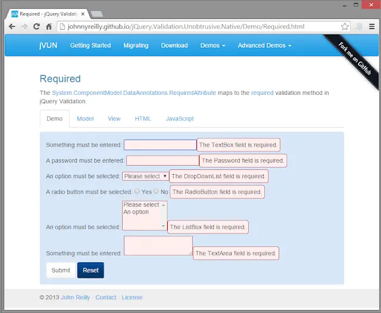

There's a small open source project I'm responsible for called [jQuery Validation Unobtrusive Native](https://github.com/johnnyreilly/jQuery.Validation.Unobtrusive.Native). (A catchy name is a must for any good open source project. Alas I'm not quite meeting my own exacting standards on this particular point... I should have gone with my gut and called it "Livingstone" instead. Too late now...)

<!--truncate-->

The project itself is fairly simple in purpose. It's essentially a bridge between ASP.Net MVC's inbuilt support for driving validation from data attributes and jQuery Validation's native support for the same. It is, in the end, a collection of ASP.Net MVC HTML helper extensions. It is not massively complicated.

I believe it was Tony Blair that said "documentation, documentation, documentation" were his priorities for open source projects. Or maybe it was someone else... Anyway, the point stands. Documentation is supremely important if you want your project to be in any way useful to anyone other than yourself. A project, no matter how fantastic, which lacks decent documentation is a missed opportunity.

Anyway I'm happy to say that jQuery Validation Unobtrusive Native _has_ documentation! And pretty good documentation at that. The documentation takes the form of the [jVUNDemo](https://github.com/johnnyreilly/jQuery.Validation.Unobtrusive.Native/tree/master/jVUNDemo) project which is part of the jQuery Validation Unobtrusive Native repo. jVUNDemo is an ASP.Net MVC web application which is built on top of the jQuery Validation Unobtrusive Native helpers. It demonstrates the helpers in action and documents how you might go about using them. It looks a bit like this:



When I first put jVUNDemo together I hosted it on Azure so the world could see it in all it's finery. And that worked just fine. However, there's something you ought to know about me:

## I'm quite cheap

No really, I am. My attention was grabbed by the essentially "free" nature of [GitHub Pages](https://pages.github.com/). I was immediately seized by the desire to somehow deploy jVUNDemo to GitHub Pages and roll around joyfully in all that lovely free hosting.

"But", I hear you cry, "you can't deploy an ASP.Net MVC application to Git Hub Pages... It only hosts static sites!" Quite right. Sort of. This is where I get to pull my ace of spades: jVUNDemo is not really an "app" so much as a static site. Yup, once the HTML that makes up each page is generated there isn't any app like business to do. It's just a collection of text and 1 screen demo's really.

That being the case, there's no reason why I shouldn't be able to make use of GitHub Pages. So that's what I decided to do. Whilst I was at it I also wanted to automate the deployment process. When I tweak jVUNDemo I don't want to have to manually push out a new version of jVUNDemo to wherever it's being hosted. No, I'm a developer so I'll automate it.

I've broken this up into 2 posts. This first one will cover how you generate a static site from an ASP.Net MVC site. The second will be about how to use [AppVeyor](http://www.appveyor.com/) to ensure that on each build your documentation is getting republished.

## You Wget me?

So, static site generation. There's a well known Unix utility called [Wget](https://en.wikipedia.org/wiki/Wget) which covers exactly that ground and so we're going to use it. It downloads and saves HTML, it recursively walks the links inside the site and grabs those pages too and it converts our routes so they are locally browsable ("Demo/Required" becomes "Demo/Required.html").

You can use [Chocolatey](https://chocolatey.org/packages/Wget) to get a copy of Wget. We're also going to need IIS Express to host jVUNDemo whilst Wget converts it. Once jVUNDemo has been built successfully you should be be able to kick off the process like so:

```ps
cd C:\projects\jquery-validation-unobtrusive-native
.\makeStatic.ps1 $pwd.path
```

This invokes the `makeStatic` Powershell script in the root of the jQuery Validation Unobtrusive Native repo:

```ps
param([string]$buildFolder)

$jVUNDemo = "$($buildFolder)\jVUNDemo"
$staticSiteParentPath = (get-item $buildFolder).Parent.FullName
$staticSite = "static-site"
$staticSitePath = "$($staticSiteParentPath)\$($staticSite)"
$wgetLogPath = "$($staticSiteParentPath)\wget.log"
$port = 57612
$servedAt = "http://localhost:$($port)/"
write-host "jVUNDemo location: $jVUNDemo"
write-host "static site parent location: $staticSiteParentPath"
write-host "static site location: $staticSitePath"
write-host "wget log path: $wgetLogPath"

write-host "Spin up jVUNDemo site at $($servedAt)"
$process = Start-Process 'C:\Program Files (x86)\IIS Express\iisexpress.exe' -NoNewWindow -ArgumentList "/path:$($jVUNDemo) /port:$($port)"

write-host "Wait a moment for IIS to startup"
Start-sleep -s 15

if (Test-Path $staticSitePath) {
    write-host "Removing $($staticSitePath)..."
    Remove-Item -path $staticSitePath -Recurse -Force
}

write-host "Create static version of demo site here: $($staticSitePath)"
Push-Location $staticSiteParentPath
# 2>&1 used to combine stderr and stdout
wget.exe --recursive --convert-links -E --directory-prefix=$staticSite --no-host-directories $servedAt > $wgetLogPath 2>&1
write-host "lastExitCode: $($lastExitCode)"
cat $wgetLogPath
Pop-Location

write-host "Shut down jVUNDemo site"
stop-process -Name iisexpress

if (Test-Path $staticSitePath) {
    write-host "Contents of $($staticSitePath)"
    ls $staticSitePath
}
```

The above Powershell does the following:

1. Starts up IIS Express serving jVUNDemo on http://localhost:57612/
2. Waits 15 seconds for IIS Express to get itself together (probably a shorter wait time would be sufficient)
3. Points Wget at jVUNDemo and bellows "go!!!!"
4. Wget downloads and saves the static version of jVUNDemo to a directory called "static-site"
5. Stops IIS Express
6. Prints out the contents of the "static-site" directory

When run, it pumps something like this out:

```
jVUNDemo location: C:\projects\jquery-validation-unobtrusive-native\jVUNDemo
static site parent location: C:\projects
static site location: C:\projects\static-site
wget log path: C:\projects\wget.log
Spin up jVUNDemo site at http://localhost:57612/
Wait a moment for IIS to startup
Create static version of demo site here: C:\projects\static-site
wget.exe : --2014-12-29 07:49:56--  http://localhost:57612/
Resolving localhost...
127.0.0.1
Connecting to localhost|127.0.0.1|:57612... connected.
HTTP request sent, awaiting response...
200 OK

..... lots of HTTP requests.....

Downloaded: 30 files, 1.0M in 0.09s (10.8 MB/s)
Converting static-site/Demo/CreditCard.html... 34-0
Converting static-site/Demo/Number.html... 34-0
Converting static-site/Demo/Range.html... 34-0
Converting static-site/Demo/Email.html... 34-0
Converting static-site/AdvancedDemo/CustomValidation.html... 35-0
Converting static-site/Demo/Date.html... 36-0
Converting static-site/Home/License.html... 27-0
Converting static-site/index.html... 29-0
Converting static-site/AdvancedDemo/Dynamic.html... 35-0
Converting static-site/Demo/MaxLengthMinLength.html... 34-0
Converting static-site/Demo/Required.html... 34-0
Converting static-site/AdvancedDemo.html... 32-0
Converting static-site/Demo/Remote.html... 35-0
Converting static-site/Demo/EqualTo.html... 34-0
Converting static-site/AdvancedDemo/Globalize.html... 38-0
Converting static-site/Demo/Url.html... 34-0
Converting static-site/Demo.html... 37-0
Converting static-site/Home/GettingStarted.html... 29-0
Converting static-site/Home/Download.html... 27-0
Converting static-site/AdvancedDemo/Tooltip.html... 34-0
Converted 20 files in 0.03 seconds.

Shut down jVUNDemo site
Contents of C:\projects\static-site


    Directory: C:\projects\static-site


Mode                LastWriteTime     Length Name
----                -------------     ------ ----
d----        12/29/2014   7:50 AM            AdvancedDemo
d----        12/29/2014   7:50 AM            Content
d----        12/29/2014   7:50 AM            Demo
d----        12/29/2014   7:50 AM            Home
d----        12/29/2014   7:50 AM            Scripts
-a---        12/29/2014   7:50 AM       5967 AdvancedDemo.html
-a---        12/29/2014   7:50 AM       6802 Demo.html
-a---        12/29/2014   7:47 AM      12862 favicon.ico
-a---        12/29/2014   7:50 AM       8069 index.html
```

And that's it for part 1 my friends! You now have a static version of the ASP.Net MVC site to dazzle the world with. I should say for the purposes of full disclosure that there are 2 pages in the site which are not entirely "static" friendly. For these 2 pages I've put messages in that are displayed when the page is served up in a static format explaining the limitations. Their full glory can still be experienced by cloning the project and running locally.

[Next time](../2015-01-07-deploying-aspnet-mvc-to-github-pages-with-appveyor-part-2/index.md) we'll take the mechanism detailed above and plug it into AppVeyor for some Continuous Integration happiness.
