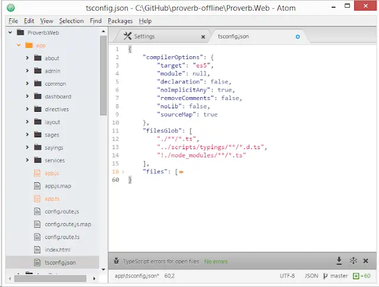

Sometimes, you just miss things. Something seismic happens and you had no idea. So it was with `tsconfig.json`.

<!--truncate-->

This blog post started life with the name "TypeScript: Some IDEs are more equal than others". I'd intended to use it summarise a discussion on the [TypeScript GitHub repo](https://github.com/Microsoft/TypeScript/issues/1066) about implicit referencing including a fist shaken at the sky at the injustice of it all. But whilst I was writing it I dicovered things had changed without my knowledge. That's a rather wonderful thing.

## Implicit Referencing

Implicit referencing, if you're not aware, is the thing that separates Visual Studio from all other IDEs / text editors. Implicit referencing means that in Visual Studio you don't need to make use of comments at the head of each TypeScript file in order to tell the compiler where it can find the related TypeScript files.

The `reference` comments aren't necessary when using Visual Studio because the VS project file is used to drive the files passed to the TypeScript compiler (tsc).

The upshot of this is that, at time of writing, you can generally look at a TypeScript codebase and tell whether it was written using Visual Studio by opening it up a file at random and eyeballing for something like this at the top:

```ts
/// <reference path="other-file.ts" />
```

_"A-ha! They're using "reference" comments Watson. From this I deduce that the individuals in question are using the internal module approach and using Visual Studio as their IDE. Elementary, my dear fellow, quite elementary."_

This has important implications. Important I tell you, yes important! Well, important if you want to reduce the barriers between Visual Studio and everyone else. And I do. Whilst I love Visual Studio - it's been my daily workhorse for many years - I also love stepping away from it and using something more stripped down. I also like working with other people without mandating that they need to use Visual Studio as well. In the words of Rodney King, "can't we all get along?".

## Cross-IDE TypeScript projects

I feel I should be clear - you can already set up TypeScript projects to work regardless of IDE. But there's friction. It's not clear cut. You can see a full on discussion around this [here](https://github.com/Microsoft/TypeScript/issues/1066) but in the end it comes down to making a choice between these 3 options:

1. Set `<TypeScriptEnabled>false</TypeScriptEnabled>` in a project file. [This flag effectively deactivates implicit referencing.](https://github.com/Microsoft/TypeScript/issues/1066#issuecomment-63727612) This approach requires that all developers (regardless of IDE) use `/// &lt;reference`s to build context. Compiler options in VS can be controlled using the project file as is.
2. Using Visual Studio without any csproj tweaks. This approach requires that all files will need `/// &lt;reference`s at their heads in order to build compilation context _outside_ of Visual Studio. It's possible that `/// &lt;reference`s and the csproj could get out of line - care is required to avoid this. Compiler options in VS can be controlled using the project file as is.
3. Using just files in Visual Studio with `/// &lt;reference`s to build compilation context. This scenario also requires that all developers (regardless of IDE) use `/// &lt;reference`s to build context. In Visual Studio there will be no control over compiler options.

As you can see - this is sub-optimal. But don't worry - there's a new sheriff in town....

## `tsconfig.json`

I'd decided to give [Atom TypeScript plugin](https://github.com/TypeStrong/atom-typescript) a go as I heard much enthusiastic noise about it. I fired it up and pointed it at a a TypeScript AngularJS project built in Visual Studio. I was mentally preparing myself for the job of adding all the /// references in when I suddenly noticed a file blinking at me:



`tsconfig.json`? What's that? Time to read [the docs](https://github.com/TypeStrong/atom-typescript#project-support):

> Supported via tsconfig.json ([read more](https://github.com/TypeStrong/atom-typescript/blob/master/docs/tsconfig/index.md)) which is going to be the defacto Project file format for the next versions of TypeScript.

"read more"? Oh yes indeedy - I think I will "read more"!

> A unified project format for TypeScript ([see merged PR on Microsoft/TypeScript](https://github.com/Microsoft/TypeScript/pull/1692)). The TypeScript compiler (1.4 and above) only cares about compilerOptions and files. We add additional features to this [with the typescript team's approval to extend the file as long as we don't conflict:](https://github.com/Microsoft/TypeScript/issues/1955)
>
> - [compilerOptions](https://github.com/TypeStrong/atom-typescript/blob/e2fa67c4715189b71430f766ed9a92d9fb3255f9/lib/main/tsconfig/tsconfig.ts#L8-L35) similar to what you would pass on the commandline to tsc.
> - [filesGlob](https://github.com/TypeStrong/atom-typescript/blob/master/docs/tsconfig/index.md#filesglob): To make it easier for you to just add / remove files in your project we add filesGlob which accepts an array of glob / minimatch / RegExp patterns (similar to grunt)to specify source files.
> - [format](https://github.com/TypeStrong/atom-typescript/blob/master/docs/tsconfig/index.md#format): Code formatting options
> - [version](https://github.com/TypeStrong/atom-typescript/blob/master/docs/tsconfig/index.md#version): The TypeScript version

That's right folks, we don't need `/// &lt;reference`s comments anymore. In a blinding flash of light it all changes. We're going from the dark end of the street, to the bright side of the road. `tsconfig.json` is here to ease away the pain and make it all better. Let's enjoy it while we can.

This change should ship with TypeScript 1.5 (hopefully) for those using Visual Studio. For those using Atom TypeScript (and as of today that's includes me) the carnival celebrations can begin now!

Thanks to [@basarat](https://github.com/basarat) who have quoted at length and [Daniel Earwicker](https://smellegantcode.wordpress.com/) who is the reason that I came to discover `tsconfig.json`.
