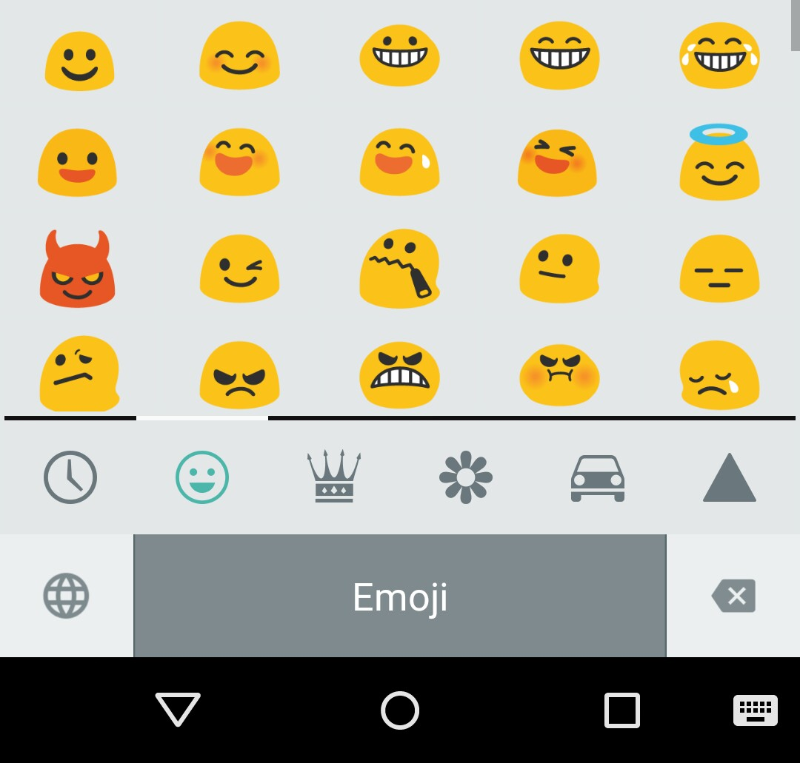

A departure from from my normal content - I need to tell you about [emoji](http://en.wikipedia.org/wiki/Emoji)! You'll probably already know about them - just imagine a emoticon but about 300,000 times better. They really add spice to to textual content. Oh and they're Japanese - which is also way cool.

<!--truncate-->

Since I've discovered emoji I've felt a pressing need to have them on my (Android) phone. This is harder than you might imagine. But totally do-able.... Here's how you get the emoji love on your Android Lollipop phone:

- goto settings (the cog)
- select "Language and Input"
- select your "Current keyboard" and then select the "Choose keyboards" option
- look for a keyboard that says "iWnn IME Japanese". Select it
- drop back to the "Language and Input" menu where you will see "iWnn IME Japanese" is now there.
- select it and deactivate "Japanese" and activate "Emoji" like this:

- now you should find your keyboard contains a little globe icon. When you select it.... Emoji!!!!

