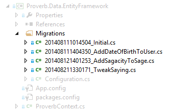
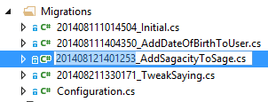
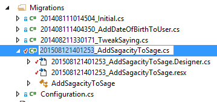
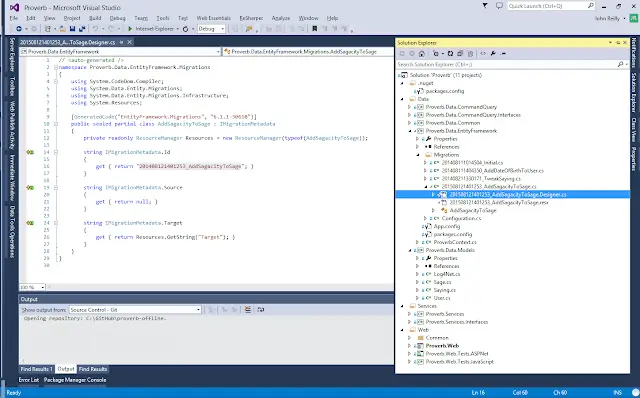

Code First Migrations. They look a little like this in Visual Studio:

<!--truncate-->

The thing I want you to notice about the image above is not the pithily named migrations. It isn't the natty opacity on everything but the migration files (which I can assure you took me to the very limits of my [GIMP](http://www.gimp.org/) expertise). No, whilst exciting in themselves what I want you to think about is _the order in which migrations are applied_. Essentially how the `__MigrationHistory` table in SQL Server ends up being populated in this manner:

Because, myself, I didn't really think about this until it came time for me to try and change the ordering of some migrations manually. Do you know how migrations end up the order they do? I bet you don't. But either way, let's watch and see what happens to the pre-enlightenment me as I attempt to take a migration which appears _before_ a migration I have created locally and move it to _after_ that same migration.

## Great Scott! It's clearly filename driven

That's right - it's blindingly obvious to me. All I need do is take the migration I want to move forwards in time and rename it in Visual Studio. So take our old migration ("2014 is so passé darling"):

And rename it to make it new and shiny ("2015! Gorgeous - I love it sweetie!"):

Perfection right? Wrong! What you've done makes not the slightest jot of difference.

## Whoa, this is heavy! Gimme the project file

How could I be so dim? I mean it makes perfect sense - before the days of [TypeScript's `tsconfig.json`](../2015-02-27-hey-tsconfigjson-where-have-you-been/index.md) the default ordering of `*.ts` files being passed to the TypeScript compiler was determined by the ordering of the `*.ts` files in the `.csproj` file. It must be the same for Code First Migrations.

So, simply spin up [Notepad++](https://notepad-plus-plus.org/) and let's play hack the XML until each file is referenced in the required order.

Well, I'm glad we sorted that out. A quick test to reassure myself of my astuteness. Drum roll.... Fail!! Things are just as they were. Shame on you John Reilly, shame on you.

## Designer.cs... Your kids are gonna love it

I want you to look very carefully at this and tell me what you see. We're looking at the mysterious `201508121401253_AddSagacityToSage.Designer.cs` file that sits underneath the main `201508121401253_AddSagacityToSage.cs` file. What could it be.... Give in?

The `IMigrationMetadata.Id` property is returning `<u>201408121401253</u>_AddSagacityToSage`. That is the _old_ date! Remember? The passé one. If you change that property to line up with the file name change you're done. It works.

Let's say it together: "Automatic Migrations? Where we're going, we don't need Automatic Migrations."
