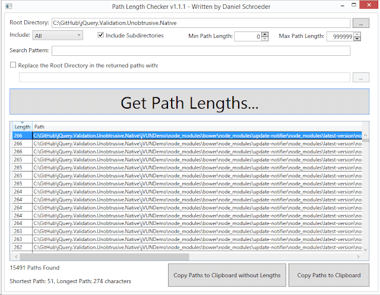

I don't know about you but I personally feel that the following sentence may well be the saddest in the English language:

<!--truncate-->

`2&gt;ASPNETCOMPILER : error ASPRUNTIME: The specified path, file name, or both are too long. The fully qualified file name must be less than 260 characters, and the directory name must be less than 248 characters.`

The message above would suggest there is some kind of ASP.Net issue going on. There isn't - the problem actually lies with Windows. It's [not the first time it's come up](../2014-12-12-gulp-npm-long-paths-and-visual-studio-fight/index.md) but for those of you not aware there is something you need to know about Windows: _It handles long paths badly._

There's a number of caveats which people may attach the above sentence. But essentially what I have said is true. And it becomes brutally apparent to you the moment you start using a few node / npm powered tools in your workflow. You will likely see that horrible message and you won't be able to get much further forward. Sigh. I thought this was the future...

This post is about how to deal with the long path issue when using npm with Visual Studio. This should very much be a short term workaround as [npm 3.0](https://github.com/npm/npm/releases/tag/v3.0.0) is planned to make long paths with npm a thing of the past. But until that golden dawn....

## The Latest Infraction

I'm a big fan of Gulp and Bower. They rock. [Steve Cadwallader](https://twitter.com/codecadwallader) wrote an excellent blog post about [integrating Gulp into your Visual Studio build](http://www.codecadwallader.com/2015/03/15/integrating-gulp-into-your-tfs-builds-and-web-deploy/). Essentially the Gist of his post is this: forget using [Task Runner Explorer](https://visualstudiogallery.msdn.microsoft.com/8e1b4368-4afb-467a-bc13-9650572db708) to trigger your Gulp / Grunt jobs. No, actually plug it into the build process by tweaking your `.csproj` file. The first time I used this approach it was a dream come true. It just worked and I was a very happy man.

Since this approach was so marvellous I took a look at the demo / docs part of [jQuery Validation Unobtrusive Native](https://github.com/johnnyreilly/jQuery.Validation.Unobtrusive.Native) with a view to applying it there. I originally wrote this back in 2013 and at the time used NuGet for both server and client side package management. I decided to migrate it to use Bower for the client side packages (which I planned to combine with a Gulp script which was going to pull out the required JS / CSS etc as needed). However it wasn't the plain sailing I'd imagined. The actual switchover from NuGet to Bower was simple. Just a case of removing NuGet packages and adding their associated Bower counterpart. The problem came when the migration was done and I hit "compile". That's when I got to see `2&gt;ASPNETCOMPILER : error ASPRUNTIME: The specified path, file name, or both are too long...` etc

For reasons that I don't fully understand, Visual Studio is really upset by the presence in the project structure of one almighty long path. Oddly enough, not a path that's actually part of the Visual Studio project in question at all. Rather one that has come along as a result of our Gulp / Bower / npm shenanigans. Quick as a flash, I whipped out Daniel Schroeder's [Path Length Checker](https://pathlengthchecker.codeplex.com/) to see where the problem lay:



And lo, the fault lay with Bower. Poor show, Bower, poor show.

## rimraf to the Rescue

[rimraf](https://github.com/isaacs/rimraf) is "the [UNIX command](<https://en.wikipedia.org/wiki/Rm_(Unix)>)`rm -rf` for node". (By the way, what is it with node and the pathological hatred of capital letters?)

What this means is: rimraf can delete. Properly. So let's get it: `npm install -g rimraf`. Then at any time at the command line we can dispose of a long path in 2 shakes of lamb's tail.

In my current situation the contents of the `node_modules` folder is causing me heartache. But with rimraf in play I can get rid of it with the magic words: `rimraf ./node_modules`. Alakazam! So let's poke this command into the extra commands that I've already shoplifted from Steve's blog post. I'll end up with the following section of XML at the end of my `.csproj`:

```xml
<PropertyGroup>
    <CompileDependsOn>
      $(CompileDependsOn);
      GulpBuild;
    </CompileDependsOn>
    <CleanDependsOn>
      $(CleanDependsOn);
      GulpClean
    </CleanDependsOn>
    <CopyAllFilesToSingleFolderForPackageDependsOn>
      CollectGulpOutput;
      $(CopyAllFilesToSingleFolderForPackageDependsOn);
    </CopyAllFilesToSingleFolderForPackageDependsOn>
    <CopyAllFilesToSingleFolderForMsdeployDependsOn>
      CollectGulpOutput;
      $(CopyAllFilesToSingleFolderForPackageDependsOn);
    </CopyAllFilesToSingleFolderForMsdeployDependsOn>
  </PropertyGroup>
  <Target Name="GulpBuild">
    <Exec Command="npm install" />
    <Exec Command="bower install" />
    <Exec Command="gulp" />
    <Exec Command="rimraf ./node_modules" />
  </Target>
  <Target Name="GulpClean">
    <Exec Command="npm install" />
    <Exec Command="gulp clean" />
    <Exec Command="rimraf ./node_modules" />
  </Target>
  <Target Name="CollectGulpOutput">
    <ItemGroup>
      <_CustomFiles Include="build\**\*" />
      <FilesForPackagingFromProject Include="%(_CustomFiles.Identity)">
        <DestinationRelativePath>build\%(RecursiveDir)%(Filename)%(Extension)</DestinationRelativePath>
      </FilesForPackagingFromProject>
    </ItemGroup>
    <Message Text="CollectGulpOutput list: %(_CustomFiles.Identity)" />
  </Target>
```

So let's focus on the important bits in the `GulpBuild` target:

- `&lt;Exec Command="npm install" /&gt;` \- install the node packages our project uses as specified in `package.json`. This will include Gulp and Bower. The latter package is going to contain super-long, Windows wrecking paths.
- `&lt;Exec Command="bower install" /&gt;` \- install the bower packages specified in `bower.json` using Bower (which was installed by npm just now).
- `&lt;Exec Command="gulp" /&gt;` \- do a little dance, make a little love, copy a few files, get down tonight.
- `&lt;Exec Command="rimraf ./node_modules" /&gt;` \- remove the `node_modules` folder populated by the `npm install` command.

With that addition of `rimraf ./node_modules` to the build phase the problem goes away. During each build a big, big Windows path is being constructed but then it's wiped again before it has chance to upset anyone. I've also added the same to the `GulpClean` target.

You are very welcome.
