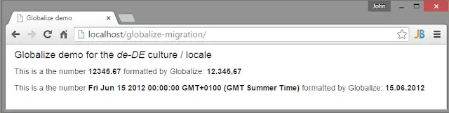
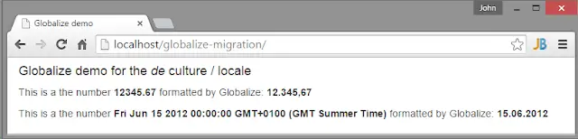

Globalize has hit 1.0. Anyone who reads my blog will likely be aware that I'm a long time user of [Globalize 0.1.x](../2012-05-07-globalizejs-number-and-date/index.md). I've been a little daunted by the leap that the move from 0.1.x to 1.x represents. It appears to be the very definition of "breaking changes". :-) But hey, this is Semantic Versioning being used correctly so how could I complain? Either way, I've decided to write up the migration here as I'm not expecting this to be easy.

<!--truncate-->

To kick things off I've set up a very [simple repo](https://github.com/johnnyreilly/globalize-migration/tree/v0.1.x) that consists of a single page that depends upon Globalize 0.1.x to render a number and a date in German. It looks like this:

```html
<html>
  <head>
    <title>Globalize demo</title>
    <link
      href="https://maxcdn.bootstrapcdn.com/bootstrap/3.3.5/css/bootstrap.min.css"
      rel="stylesheet"
    />
  </head>
  <body>
    <div class="container-fluid">
      <h4>Globalize demo for the <em id="locale"></em> culture / locale</h4>
      <p>
        This is a the number <strong id="number"></strong> formatted by
        Globalize: <strong id="numberFormatted"></strong>
      </p>
      <p>
        This is a the number <strong id="date"></strong> formatted by Globalize:
        <strong id="dateFormatted"></strong>
      </p>
    </div>

    <script src="bower_components/globalize/lib/globalize.js"></script>
    <script src="bower_components/globalize/lib/cultures/globalize.culture.de-DE.js"></script>
    <script>
      var locale = 'de-DE';
      var number = 12345.67;
      var date = new Date(2012, 5, 15);

      Globalize.culture(locale);
      document.querySelector('#locale').innerText = locale;
      document.querySelector('#number').innerText = number;
      document.querySelector('#date').innerText = date;
      document.querySelector('#numberFormatted').innerText = Globalize.format(
        number,
        'n2',
      );
      document.querySelector('#dateFormatted').innerText = Globalize.format(
        date,
        'd',
      );
    </script>
  </body>
</html>
```

When it's run it looks like this:



Let's see how we go about migrating this super simple example.

## Updated our Bower dependencies

First things first, we want to move Globalize from 0.1.x to 1.x using Bower. To do that we update our `bower.json`:

```js
"dependencies": {
    "globalize": "^1.0.0"
  }
```

Now we enter: `bower update`. And we're off!

```sh
bower globalize#^1.0.0          cached git://github.com/jquery/globalize.git#1.0.0
bower globalize#^1.0.0        validate 1.0.0 against git://github.com/jquery/globalize.git#^1.0.0
bower cldr-data#>=25            cached git://github.com/rxaviers/cldr-data-bower.git#27.0.3
bower cldr-data#>=25          validate 27.0.3 against git://github.com/rxaviers/cldr-data-bower.git#>=25
bower cldrjs#0.4.1              cached git://github.com/rxaviers/cldrjs.git#0.4.1
bower cldrjs#0.4.1            validate 0.4.1 against git://github.com/rxaviers/cldrjs.git#0.4.1
bower globalize#^1.0.0         install globalize#1.0.0
bower cldr-data#>=25           install cldr-data#27.0.3
bower cldrjs#0.4.1             install cldrjs#0.4.1

globalize#1.0.0 bower_components\globalize
├── cldr-data#27.0.3
└── cldrjs#0.4.1

cldr-data#27.0.3 bower_components\cldr-data

cldrjs#0.4.1 bower_components\cldrjs
└── cldr-data#27.0.3
```

This all looks happy enough. Except it's actually not.

## We need fuel

Or as I like to call it cldr-data. We just pulled down Globalize 1.x but we didn't pull down the data that Globalize 1.x relies upon. This is one of the differences between Globalize 0.1.x and 1.x. Globalize 1.x does not include the "culture" data. By which I mean all the `globalize.culture.de-DE.js` type files. Instead Globalize 1.x relies upon [CLDR - Unicode Common Locale Data Repository](http://cldr.unicode.org/). It does this in the form of [cldr-json](https://github.com/unicode-cldr/cldr-json).

Now before you start to worry, you shouldn't actually need to go and get this by yourself, the lovely [Rafael Xavier de Souza](https://github.com/rxaviers) has saved you a job by putting together [Bower](https://github.com/rxaviers/cldr-data-bower) and [npm](https://github.com/rxaviers/cldr-data-npm) modules to do the hard work for you.

I'm using Bower for my client side package management and so I'll use that. Looking at the Bower dependencies downloaded when I upgraded my package I can see there is a `cldr-data` package. Yay! However it appears to be missing the associated json files. Boo!

To the documentation Batman. It says you need a `.bowerrc` file in your repo which contains this:

```js
{
  "scripts": {
    "preinstall": "npm install cldr-data-downloader@0.2.x",
    "postinstall": "node ./node_modules/cldr-data-downloader/bin/download.js -i bower_components/cldr-data/index.json -o bower_components/cldr-data/"
  }
}
```

Unfortunately, because I've already upgraded to v1 adding this file alone doesn't do anything for me. To get round that I delete my `bower_components` folder and enter `bower install`. Boom!

```
bower globalize#^1.0.0          cached git://github.com/jquery/globalize.git#1.0.0
bower globalize#^1.0.0        validate 1.0.0 against git://github.com/jquery/globalize.git#^1.0.0
bower cldrjs#0.4.1                        cached git://github.com/rxaviers/cldrjs.git#0.4.1
bower cldrjs#0.4.1                      validate 0.4.1 against git://github.com/rxaviers/cldrjs.git#0.4.1
bower cldr-data#>=25                      cached git://github.com/rxaviers/cldr-data-bower.git#27.0.3
bower cldr-data#>=25                    validate 27.0.3 against git://github.com/rxaviers/cldr-data-bower.git#>=25
bower                                 preinstall npm install cldr-data-downloader@0.2.x
bower                                 preinstall cldr-data-downloader@0.2.3 node_modules\cldr-data-downloader
bower                                 preinstall ├── progress@1.1.8
bower                                 preinstall ├── q@1.0.1
bower                                 preinstall ├── request-progress@0.3.1 (throttleit@0.0.2)
bower                                 preinstall ├── nopt@3.0.3 (abbrev@1.0.7)
bower                                 preinstall ├── mkdirp@0.5.0 (minimist@0.0.8)
bower                                 preinstall ├── adm-zip@0.4.4
bower                                 preinstall ├── npmconf@2.0.9 (uid-number@0.0.5, ini@1.3.4, inherits@2.0.1, once@1.3.2, osenv@0.1.3, config-chain@1.1.9, semver@4.3.6)
bower                                 preinstall └── request@2.53.0 (caseless@0.9.0, forever-agent@0.5.2, aws-sign2@0.5.0, stringstream@0.0.4, tunnel-agent@0.4.1, oauth-sign@0.6.0, isstream@0.1.2, json-stringify-safe@5.0.1, qs@2.3.3, node-uuid@1.4.3, combined-stream@0.0.7, mime-types@2.0.14, form-data@0.2.0, tough-cookie@2.0.0, bl@0.9.4, http-signature@0.10.1, hawk@2.3.1)
bower globalize#^1.0.0                   install globalize#1.0.0
bower cldrjs#0.4.1                       install cldrjs#0.4.1
bower cldr-data#>=25                     install cldr-data#27.0.3
bower                                postinstall node ./node_modules/cldr-data-downloader/bin/download.js -i bower_components/cldr-data/index.json -o bower_components/cldr-data/
bower                                postinstall GET `https://github.com/unicode-cldr/cldr-core/archive/27.0.3.zip`
bower                                postinstall GET `https://github.com/unicode-cldr/cldr-dates-modern/archive/27.0.3.zip`
bower                                postinstall GET `https://github.com/unicode-cldr/cldr-cal-buddhist-modern/archive/27.0.3.zip`
bower                                postinstall GET `https://github.com/unicode-cldr/cldr-cal-chinese-modern/archive/27.0.3.zip`
bower                                postinstall GET `https://github.com/unicode-cldr/cldr-cal-coptic-modern/archive/27.0.3.zip`
bower                                postinstall GET `https://github.com/unicode-cldr/cldr-cal-dangi-modern/archive/27.0.3.zip`
bower                                postinstall GET `https://github.com/unicode-cldr/cldr-cal-ethiopic-modern/archive/27.0.3.zip`
bower                                postinstall GET `https://github.com/unicode-cldr/cldr-cal-hebrew-modern/archive/27.0.3.zip`
bower                                postinstall GET `https://github.com/unicode-cldr/cldr-cal-indian-modern/archive/27.0.3.zip`
bower                                postinstall GET `https://github.com/unicode-cldr/cldr-cal-islamic-modern/archive/27.0.3.zip`
bower                                postinstall GET `https://github.com/unicode-cldr/cldr-cal-japanese-modern/archive/27.0.3.zip`
bower                                postinstall GET `https://github.com/unicode-cldr/cldr-cal-persian-modern/archive/27.0.3.zip`
bower                                postinstall GET `https://github.com/unicode-cldr/cldr-cal-roc-modern/archive/27.0.3.zip`
bower                                postinstall GET `https://github.com/unicode-cldr/cldr-localenames-modern/archive/27.0.3.zip`
bower                                postinstall GET `https://github.com/unicode-cldr/cldr-misc-modern/archive/27.0.3.zip`
bower                                postinstall GET `https://github.com/unicode-cldr/cldr-numbers-modern/archive/27.0.3.zip`
bower                                postinstall GET `https://github.com/unicode-cldr/cldr-segments-modern/archive/27.0.3.zip`
bower                                postinstall GET `https://github.com/unicode-cldr/cldr-units-modern/archive/27.0.3.zip`
bower                                postinstall Received 28728K total.
bower                                postinstall Received 28753K total.
bower                                postinstall Unpacking it into `./bower_components\cldr-data`

globalize#1.0.0 bower_components\globalize
├── cldr-data#27.0.3
└── cldrjs#0.4.1

cldrjs#0.4.1 bower_components\cldrjs
└── cldr-data#27.0.3

cldr-data#27.0.3 bower_components\cldr-data
```

That's right - I'm golden. And if I didn't want to do that I could have gone straight to the command line and entered this: (look familiar?)

```
npm install cldr-data-downloader@0.2.x
node ./node_modules/cldr-data-downloader/bin/download.js -i bower_components/cldr-data/index.json -o bower_components/cldr-data/
```

## Some bitching and moaning.

If, like me, you were a regular user of Globalize 0.1.x then you know that you needed very little to get going. As you can see from our example you just serve up `Globalize.js` and the culture files you are interested in (eg `globalize.culture.de-DE.js`). That's it - you have all you need; job's a good'un. This is all very convenient and entirely lovely.

Globalize 1.x has a different approach and one that (I have to be honest) I'm not entirely on board with. The thing that you need to know about the new Globalize is that _nothing comes for free_. It's been completely modularised and [you have to include extra libraries depending on the functionality you require.](https://github.com/jquery/globalize#pick-the-modules-you-need) On top of that you then have to work out the [portions of the cldr data that you require for those modules](https://github.com/jquery/globalize#2-cldr-content) and supply them. This means that getting up and running with Globalize 1.x is much harder. Frankly I think it's a little painful.

I realise this is a little ["Who moved my cheese"](https://en.wikipedia.org/wiki/Who_Moved_My_Cheese%3F). I'll get over it. I do actually see the logic of this. It is certainly good that the culture date is not frozen in aspic but will evolve as the world does. But it's undeniable that in our brave new world Globalize is no longer a doddle to pick up. Or at least right now.

## Take the modules and run

So. What do we actually need? Well I've consulted the [documentation](https://github.com/jquery/globalize#pick-the-modules-you-need) and I think I'm clear. Our simple demo cares about dates and numbers. So I'm going to guess that means I need:

- [`globalize.js`](https://github.com/jquery/globalize#core-module)
- [`globalize/date.js`](https://github.com/jquery/globalize#date-module)
- [`globalize/number.js`](https://github.com/jquery/globalize#number-module)

On top of that I'm also going to need the various cldr dependencies too. That's not all. Given that I've decided which modules I will use I now need to acquire the associated cldr data. According to the docs [here](https://github.com/jquery/globalize#2-cldr-content) we're going to need:

- `cldr/supplemental/likelySubtags.json`
- `cldr/main/<i>locale</i>/ca-gregorian.json`
- `cldr/main/<i>locale</i>/timeZoneNames.json`
- `cldr/supplemental/timeData.json`
- `cldr/supplemental/weekData.json`
- `cldr/main/locale/numbers.json`
- `cldr/supplemental/numberingSystems.json`

Figuring that all out felt like really hard work. But I think that now we're ready to do the actual migration.

### Updated 30/08/2015: Globalize · So What'cha Want

To make working out what you need when using Globalize I've built [Globalize · So What'cha Want](http://johnnyreilly.github.io/globalize-so-what-cha-want/). You're so very welcome.

## The Actual Migration

To do this I'm going to lean heavily upon [an example put together by Rafael](https://github.com/jquery/globalize/blob/master/examples/plain-javascript/index.html). The migrated code looks like this:

```html
<html>
  <head>
    <title>Globalize demo</title>
    <link
      href="https://maxcdn.bootstrapcdn.com/bootstrap/3.3.5/css/bootstrap.min.css"
      rel="stylesheet"
    />
  </head>
  <body>
    <div class="container-fluid">
      <h4>Globalize demo for the <em id="locale"></em> culture / locale</h4>
      <p>
        This is a the number <strong id="number"></strong> formatted by
        Globalize: <strong id="numberFormatted"></strong>
      </p>
      <p>
        This is a the number <strong id="date"></strong> formatted by Globalize:
        <strong id="dateFormatted"></strong>
      </p>
    </div>

    <!-- First, we load Globalize's dependencies (`cldrjs` and its supplemental module). -->
    <script src="bower_components/cldrjs/dist/cldr.js"></script>
    <script src="bower_components/cldrjs/dist/cldr/event.js"></script>
    <script src="bower_components/cldrjs/dist/cldr/supplemental.js"></script>

    <!-- Next, we load Globalize and its modules. -->
    <script src="bower_components/globalize/dist/globalize.js"></script>
    <script src="bower_components/globalize/dist/globalize/number.js"></script>

    <!-- Load after globalize/number.js -->
    <script src="bower_components/globalize/dist/globalize/date.js"></script>

    <script>
      var locale = 'de';

      Promise.all([
        // Core
        fetch('bower_components/cldr-data/supplemental/likelySubtags.json'),

        // Date
        fetch(
          'bower_components/cldr-data/main/' + locale + '/ca-gregorian.json',
        ),
        fetch(
          'bower_components/cldr-data/main/' + locale + '/timeZoneNames.json',
        ),
        fetch('bower_components/cldr-data/supplemental/timeData.json'),
        fetch('bower_components/cldr-data/supplemental/weekData.json'),

        // Number
        fetch('bower_components/cldr-data/main/' + locale + '/numbers.json'),
        fetch('bower_components/cldr-data/supplemental/numberingSystems.json'),
      ])
        .then(function (responses) {
          return Promise.all(
            responses.map(function (response) {
              return response.json();
            }),
          );
        })
        .then(Globalize.load)
        .then(function () {
          var number = 12345.67;
          var date = new Date(2012, 5, 15);

          var globalize = Globalize(locale);
          document.querySelector('#locale').innerText = locale;
          document.querySelector('#number').innerText = number;
          document.querySelector('#date').innerText = date;
          document.querySelector('#numberFormatted').innerText =
            globalize.formatNumber(number, {
              minimumFractionDigits: 2,
              useGrouping: true,
            });
          document.querySelector('#dateFormatted').innerText =
            globalize.formatDate(date, {
              date: 'medium',
            });
        });
    </script>
  </body>
</html>
```

By the way, I'm using [fetch](http://jakearchibald.com/2015/thats-so-fetch/) and [promises](http://www.html5rocks.com/en/tutorials/es6/promises/) to load the cldr-data. This isn't mandatory - I use it because Chrome lets me. (I'm so bleeding edge.) Some standard jQuery ajax calls would do just as well. There's an example of that approach [here](https://github.com/jquery/globalize/blob/master/doc/cldr/index.md#how-do-i-load-cldr-data-into-globalize).

## Observations

We've gone from not a lot of code to... well, more than a little. A medium amount. Almost all of that extra code relates to getting Globalize 1.x to spin up so it's ready to work. We've also gone from 2 HTTP requests to 13 which is unlucky for you. 6 of them took place via ajax after the page had loaded. It's worth noting that we're not even loading all of Globalize either. On top of that there's the old order-of-loading shenanigans to deal with. All of these can be mitigated by introducing a custom build step of your own to concatenate and minify the associated cldr / Globalize files.

Loading the data via ajax isn't mandatory by the way. If you wanted to you could create your own style of `globalize.culture.de.js` files which would allow you load the page without recourse to post-page load HTTP requests. Something like this Gulp task I've knocked up would do the trick:

```js
gulp.task('make-globalize-culture-de-js', function () {
  var locale = 'de';
  var jsonWeNeed = [
    require('./bower_components/cldr-data/supplemental/likelySubtags.json'),
    require('./bower_components/cldr-data/main/' +
      locale +
      '/ca-gregorian.json'),
    require('./bower_components/cldr-data/main/' +
      locale +
      '/timeZoneNames.json'),
    require('./bower_components/cldr-data/supplemental/timeData.json'),
    require('./bower_components/cldr-data/supplemental/weekData.json'),
    require('./bower_components/cldr-data/main/' + locale + '/numbers.json'),
    require('./bower_components/cldr-data/supplemental/numberingSystems.json'),
  ];

  var jsonStringWithLoad =
    'Globalize.load(' +
    jsonWeNeed
      .map(function (json) {
        return JSON.stringify(json);
      })
      .join(', ') +
    ');';

  var fs = require('fs');
  fs.writeFile(
    './globalize.culture.' + locale + '.js',
    jsonStringWithLoad,
    function (err) {
      if (err) {
        console.log(err);
      } else {
        console.log('The file was created!');
      }
    },
  );
});
```

The above is standard node/io type code by the way; just take the contents of the function and run in node and you should be fine. If you do use this approach then you're very much back to the simplicity of Globalize 0.1.x's approach.

And here is the page in all its post migration glory:



It looks exactly the same except 'de-DE' has become simply 'de' (since that's how the cldr rolls).

The migrated code is [there for the taking](https://github.com/johnnyreilly/globalize-migration). Make sure you remember to `bower install` \- and you'll need to host the demo on a simple server since it makes ajax calls.

Before I finish off I wanted to say "well done!" to all the people who have worked on Globalize. It's an important project and I do apologise for my being a little critical of it here. I should say that I think it's just the getting started that's hard. Once you get over that hurdle you'll be fine. Hopefully this post will help people do just that. Pip, pip!
