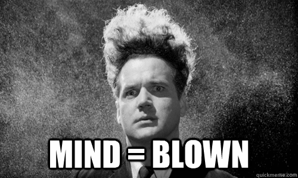

I was recently reading [a post by Jaime González García](http://www.barbarianmeetscoding.com/blog/2015/07/09/mastering-the-arcane-art-of-javascript-mancy-for-c-sharp-developers-chapter-7-using-linq-in-javascript/) which featured the following mind-bending proposition:

<!--truncate-->

> What if I told you that JavaScript has [LINQ](https://msdn.microsoft.com/en-us/library/bb397926.aspx)??

It got me thinking about one of favourite features of LINQ: [ordering using OrderBy, ThenBy...](http://www.dotnetperls.com/orderby-extension) The ability to simply expose a collection of objects in a given order with a relatively terse and descriptive syntax. It is fantastically convenient, expressive and something I've been missing in JavaScript. But if Jaime is right... Well, let's see what we can do.

## Sort

JavaScript arrays have a [sort](https://developer.mozilla.org/en-US/docs/Web/JavaScript/Reference/Global_Objects/Array/sort) method. To quote MDN:

> `arr.sort([compareFunction])`### `compareFunction`
>
> Optional. Specifies a function that defines the sort order. If omitted, the array is sorted according to each character's Unicode code point value, according to the string conversion of each element.

We want to use the `sort` function to introduce some LINQ-ish ordering goodness. Sort of. See what I did there?

Before we get going it's worth saying that LINQ's `OrderBy` and JavaScript's `sort` are not the same thing. `sort` actually changes the order of the array. However, `OrderBy` returns an `IOrderedEnumerable` which when iterated returns the items of the collection in a particular order. An important difference. If preserving the original order of my array was important to me (spoiler: mostly it isn't) then I could make a call to [`slice`](https://developer.mozilla.org/en-US/docs/Web/JavaScript/Reference/Global_Objects/Array/slice) prior to calling `sort`.

`sort` also returns the array to the caller which is nice for chaining and means we can use it in a similar fashion to the way we use `OrderBy`. With that in mind, we're going to create comparer functions which will take a lambda / arrow function (ES6 alert!) and return a function which will compare based on the supplied lambda.

## String Comparer

Let's start with ordering by string properties:

```js
function stringComparer(propLambda) {
  return (obj1, obj2) => {
    const obj1Val = propLambda(obj1) || '';
    const obj2Val = propLambda(obj2) || '';
    return obj1Val.localeCompare(obj2Val);
  };
}
```

We need some example data to sort: (I can only apologise for my lack of inspiration here)

```js
const foodInTheHouse = [
  { what: 'cake', daysSincePurchase: 2 },
  { what: 'apple', daysSincePurchase: 8 },
  { what: 'orange', daysSincePurchase: 6 },
  { what: 'apple', daysSincePurchase: 2 },
];
```

If we were doing a sort by strings in LINQ we wouldn't need to implement our own comparer. And the code we'd write would look something like this:

```js
var foodInTheHouseSorted = foodInTheHouse.OrderBy((x) => x.what);
```

With that in mind, here's how it would look to use our shiny and new `stringComparer`:

```js
const foodInTheHouseSorted = foodInTheHouse.sort(stringComparer((x) => x.what));

// foodInTheHouseSorted: [
//   { what: 'apple',  daysSincePurchase: 8 },
//   { what: 'apple',  daysSincePurchase: 2 },
//   { what: 'cake',   daysSincePurchase: 2 },
//   { what: 'orange', daysSincePurchase: 6 }
// ]

// PS Don't forget, for our JavaScript: foodInTheHouse === foodInTheHouseSorted
//    But for the LINQ:                 foodInTheHouse !=  foodInTheHouseSorted
//
//    However, if I'd done this:

const foodInTheHouseSlicedAndSorted = foodInTheHouse
  .slice()
  .sort(stringComparer((x) => x.what));

//    then:                             foodInTheHouse !== foodInTheHouseSlicedAndSorted
//
//    I shan't mention this again.
```

## Number Comparer

Well that's strings sorted (quite literally). Now, what about numbers?

```js
function numberComparer(propLambda) {
  return (obj1, obj2) => {
    const obj1Val = propLambda(obj1);
    const obj2Val = propLambda(obj2);
    if (obj1Val > obj2Val) {
      return 1;
    } else if (obj1Val < obj2Val) {
      return -1;
    }
    return 0;
  };
}
```

If we use the `numberComparer` on our original array it looks like this:

```js
const foodInTheHouseSorted = foodInTheHouse.sort(
  numberComparer((x) => x.daysSincePurchase),
);

// foodInTheHouseSorted: [
//   { what: 'cake',   daysSincePurchase: 2 },
//   { what: 'apple',  daysSincePurchase: 2 },
//   { what: 'orange', daysSincePurchase: 6 },
//   { what: 'apple',  daysSincePurchase: 8 }
// ]
```

## Descending Into the Pit of Success

Well this is all kinds of fabulous. But something's probably nagging at you... What about `OrderByDescending`? What about when I want to sort in the reverse order? May I present the `reverse` function:

```js
function reverse(comparer) {
  return (obj1, obj2) => comparer(obj1, obj2) * -1;
}
```

As the name suggests, this function takes a given comparer that's handed to it and returns a function that inverts the results of executing that comparer. Clear as mud? A comparer can return 3 types of return values:

- 0 - implies equality for `obj1` and `obj2`
- positive - implies `obj1` is greater than `obj2` by the ordering criterion
- negative - implies `obj1` is less than `obj2` by the ordering criterion

Our `reverse` function takes the comparer it is given and returns a new comparer that will return a positive value where the old one would have returned a negative and vica versa. (Equality is unaffected.) An alternative implementation would have been this:

```js
function reverse(comparer) {
  return (obj1, obj2) => comparer(obj2, obj1);
}
```

Which is more optimal and even simpler as it just swaps the values supplied to the comparer. Whatever tickles your fancy. Either way, when used it looks like this:

```js
const foodInTheHouseSorted = foodInTheHouse.sort(
  reverse(stringComparer((x) => x.what)),
);

// foodInTheHouseSorted: [
//   { what: 'orange', daysSincePurchase: 6 },
//   { what: 'cake',   daysSincePurchase: 2 },
//   { what: 'apple',  daysSincePurchase: 8 },
//   { what: 'apple',  daysSincePurchase: 2 }
// ]
```

If you'd rather not have a function wrapping a function inline then you could create `stringComparerDescending`, a `numberComparerDescending` etc implementations. Arguably it might make for a nicer API. I'm not unhappy with the present approach myself and so I'll leave it as is. But it's an option.

## `ThenBy`

So far we can sort arrays by strings, we can sort arrays by numbers and we can do either in descending order. It's time to take it to the next level people. That's right `ThenBy`; I want to be able to sort by one criteria and then by a subcriteria. So perhaps I want to eat the food in the house in alphabetical order, but if I have multiple apples I want to eat the ones I bought most recently first (because the other ones look old, brown and yukky). This may also be a sign I haven't thought my life through, but it's a choice that people make. People that I know. People I may have married.

It's time to compose our comparers together. May I present... drum roll.... the `composeComparers` function:

```js
function composeComparers(...comparers) {
  return (obj1, obj2) => {
    const comparer = comparers.find((c) => c(obj1, obj2) !== 0);
    return comparer ? comparer(obj1, obj2) : 0;
  };
}
```

This fine function takes any number of comparers that have been supplied to it. It then returns a comparer function which, when called, iterates through each of the original comparers and executes them until it finds one that returns a value that is not 0 (ie represents that the 2 items are not equal). It then sends that non-zero value back or if all was equal then sends back 0.

```js
const foodInTheHouseSorted = foodInTheHouse.sort(
  composeComparers(
    stringComparer((x) => x.what),
    numberComparer((x) => x.daysSincePurchase),
  ),
);

// foodInTheHouseSorted: [
//   { what: 'apple',  daysSincePurchase: 2 },
//   { what: 'apple',  daysSincePurchase: 8 },
//   { what: 'cake',   daysSincePurchase: 2 },
//   { what: 'orange', daysSincePurchase: 6 }
// ]
```

## `composeComparers`: The Sequel

I'm not gonna lie - I was feeling quite pleased with this approach. I shared it with my friend (and repeated colleague) [Peter Foldi](http://blog.peterfoldi.com/). The next day I found this in my inbox:

```js
function composeComparers(...comparers) {
  return (obj1, obj2) =>
    comparers.reduce((prev, curr) => prev || curr(obj1, obj2), 0);
}
```

Dammit he's improved it. It's down to 1 line of code, it doesn't execute a non-zero returning comparer twice and it doesn't rely on [`find`](https://developer.mozilla.org/en-US/docs/Web/JavaScript/Reference/Global_Objects/Array/find) which only arrives with ES6. So if you wanted to backport to ES5 then this is a better choice.

The only criticism I can make of it is that it iterates through each of the comparers even when it doesn't need to execute them. But that's just carping really.

## `composeComparers`: The Ultimate

So naturally I thought I was done. Showing Peter's improvements to the estimable Matthew Horsley I learned that this was not so. Because he reached for the keyboard and entered this:

```js
function composeComparers(...comparers) {
  // README: <a href="https://wiki.haskell.org/Function_composition">https://wiki.haskell.org/Function_composition</a>
  return comparers.reduce((prev, curr) => (a, b) => prev(a, b) || curr(a, b));
}
```

That's right, he's created a function which takes a number of comparers and reduced them up front into a single comparer function. This means that when the sort takes place there is no longer a need to iterate through the comparers, just execute them.

I know.



I'll get my coat...

```js
function composeComparers(...comparers) {
  return comparers.reduce((prev, curr) => (a, b) => prev(a, b) || curr(a, b));
}

function stringComparer(propLambda) {
  return (obj1, obj2) => {
    const obj1Val = propLambda(obj1) || '';
    const obj2Val = propLambda(obj2) || '';
    return obj1Val.localeCompare(obj2Val);
  };
}

function numberComparer(propLambda) {
  return (obj1, obj2) => {
    const obj1Val = propLambda(obj1);
    const obj2Val = propLambda(obj2);
    if (obj1Val > obj2Val) {
      return 1;
    } else if (obj1Val < obj2Val) {
      return -1;
    }
    return 0;
  };
}

function reverse(comparer) {
  return (obj1, obj2) => comparer(obj2, obj1);
}

/* - Example usage
const foodInTheHouse = [
  { what: 'cake',   daysSincePurchase: 2 },
  { what: 'apple',  daysSincePurchase: 8 },
  { what: 'orange', daysSincePurchase: 6 },
  { what: 'apple',  daysSincePurchase: 2 },
];
const foodInTheHouseSorted = foodInTheHouse.sort(composeComparers(
    stringComparer(x => x.what),
    reverse(numberComparer(x => x.daysSincePurchase))
));
console.log(foodInTheHouseSorted);
*/
```

## Updated 08/10/2018: Now TypeScript

You want to do this with TypeScript? Use this:

```ts
type Comparer<TObject> = (obj1: TObject, obj2: TObject) => number;

export function stringComparer<TObject>(
  propLambda: (obj: TObject) => string,
): Comparer<TObject> {
  return (obj1: TObject, obj2: TObject) => {
    const obj1Val = propLambda(obj1) || '';
    const obj2Val = propLambda(obj2) || '';
    return obj1Val.localeCompare(obj2Val);
  };
}

export function numberComparer<TObject>(
  propLambda: (obj: TObject) => number,
): Comparer<TObject> {
  return (obj1: TObject, obj2: TObject) => {
    const obj1Val = propLambda(obj1);
    const obj2Val = propLambda(obj2);
    if (obj1Val > obj2Val) {
      return 1;
    } else if (obj1Val < obj2Val) {
      return -1;
    }
    return 0;
  };
}

export function reverse<TObject>(comparer: Comparer<TObject>) {
  return (obj1: TObject, obj2: TObject) => comparer(obj2, obj1);
}

export function composeComparers<TObject>(...comparers: Comparer<TObject>[]) {
  return comparers.reduce((prev, curr) => (a, b) => prev(a, b) || curr(a, b));
}
```
