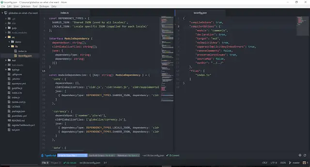

I'm a member of the Definitely Typed team - and hopefully I won't be kicked out for writing this. My point is this: `.d.ts` files should live with the package they provide typing information for, in npm / GitHub etc. Not separately.

<!--truncate-->

TypeScript 1.6 has just been released. Yay! In the [release blog post](https://blogs.msdn.com/b/typescript/archive/2015/09/16/announcing-typescript-1-6.aspx) it says this:

> We’ve changed module resolution when doing CommonJS output to work more closely to how Node does module resolution. If a module name is non-relative, we now follow these steps to find the associated typings:
>
> 1. Check in `node_modules` for `MODULE_NAME.d.ts`
> 2. Search `node_modules\MODULE_NAME\package.json` for a `typings` field
> 3. Look for `node_modules\MODULE_NAME\index.d.ts`
> 4. Then we go one level higher and repeat the process
>
> **Please note:** when we search through node_modules, we assume these are the packaged node modules which have type information and a corresponding `.js` file. As such, we resolve only `.d.ts` files (not `.ts` file) for non-relative names.
>
> Previously, we treated all module names as relative paths, and therefore we would never properly look in node_modules... We will continue to improve module resolution, including improvements to AMD, in upcoming releases.

The TL;DR is this: consuming npm packages which come with definition files should JUST WORK™... npm is now a first class citizen in TypeScriptLand. So everyone who has a package on npm should now feel duty bound to include a `.d.ts` when they publish and Definitely Typed can shut up shop. Simple right?

## Wrong!

Yeah, it's never going to happen. Surprising as it is, there are many people who are quite happy without TypeScript in their lives (I know - mad right?). These poor unfortunates are unlikely to ever take the extra steps necessary to write definition files. For this reason, there will probably _always_ be a need for a provider of typings such as Definitely Typed. As well as that, the vast majority of people using TypeScript probably don't use npm to manage dependencies. There are, however, an increasing number of users who are using npm. Some (like me) may even be using tools like [Browserify](http://browserify.org/) (with the [TSIFY plugin](https://github.com/smrq/tsify)) or [webpack](https://webpack.github.io/) (with the [ts-loader](https://github.com/TypeStrong/ts-loader)) to bring it all together. My feeling is that, over time, using npm will become more common; particularly given the improvements being made to module resolution in the language.

An advantage of shipping typings with an npm package is this: those typings should accurately describe their accompanying package. In Definitely Typed we only aim to support the latest and greatest typings. So if you find yourself looking for the typings of an older version of a package you're going to have to pick your way back through the history of a `.d.ts` file and hope you happen upon the version you're looking for. Not a fantastic experience.

So I guess what I'm saying is this: if you're an npm package author then it would be fantastic to start shipping a package with typings in the box. If you're using npm to consume packages then using Definitely Typed ought to be the second step you might take after installing a package; the step you only need to take if the package doesn't come with typings. Using DT should be a fallback, not a default.

## Authoring npm modules with TypeScript

Yup - that's what this post is actually about. See how I lured you in with my mild trolling and pulled the old switcheroo? That's edutainment my friend. So, how do we write npm packages in TypeScript and publish them with their typings? Apparently Gandhi [didn't actually say](http://www.nytimes.com/2011/08/30/opinion/falser-words-were-never-spoken.html?_r=0) "Be the change you wish to see in the world." Which is a shame. But anyway, I'm going to try and embrace the sentiment here.

Not so long ago I wrote a small npm module called [globalize-so-what-cha-want](https://www.npmjs.com/package/globalize-so-what-cha-want). It is used to determine what parts of Globalize 1.x you need depending on the modules you're planning to use. It also, contains a little demo UI / online tool written in React which powers [this](http://johnnyreilly.github.io/globalize-so-what-cha-want/).

For this post, the purpose of the package is rather irrelevant. And even though I've just told you about it, I want you to pretend that the online tool doesn't exist. Pretend I never mentioned it.

What is relevant, and what I want you to think about, is this: I wrote globalize-so-what-cha-want in plain old, honest to goodness JavaScript. Old school.

[But, my love of static typing could be held in abeyance for only so long.](https://www.youtube.com/watch?v=V4YPFHyGWaY&feature=youtu.be&t=49s) Once the initial package was written, unit tested and published I got the itch. THIS SHOULD BE WRITTEN IN TYPESCRIPT!!! Well, it didn't have to be but I wanted it to be. Despite having used TypeScript since the early days I'd only been using it for front end work; not for writing npm packages. My mission was clear: port globalize-so-what-cha-want to TypeScript and re-publish to npm.

## Port, port, port!!!

At this point globalize-so-what-cha-want consisted of a single `index.js` file in the root of the package. My end goal was to end up with that file still sat there, but now generated from TypeScript. Alongside it I wanted to see a `index.d.ts` which was generated from the same TypeScript.

[`index.js` before](https://github.com/johnnyreilly/globalize-so-what-cha-want/tree/6cce84289134a555fe8462247b43eddb051303e3) looked like this:

```js
/* jshint varstmt: false, esnext: false */
var DEPENDENCY_TYPES = {
  SHARED_JSON: 'Shared JSON (used by all locales)',
  LOCALE_JSON: 'Locale specific JSON (supplied for each locale)',
};

var moduleDependencies = {
  core: {
    dependsUpon: [],
    cldrGlobalizeFiles: [
      'cldr.js',
      'cldr/event.js',
      'cldr/supplemental.js',
      'globalize.js',
    ],
    json: [
      {
        dependencyType: DEPENDENCY_TYPES.SHARED_JSON,
        dependency: 'cldr/supplemental/likelySubtags.json',
      },
    ],
  },

  currency: {
    dependsUpon: ['number', 'plural'],
    cldrGlobalizeFiles: ['globalize/currency.js'],
    json: [
      {
        dependencyType: DEPENDENCY_TYPES.LOCALE_JSON,
        dependency: 'cldr/main/{locale}/currencies.json',
      },
      {
        dependencyType: DEPENDENCY_TYPES.SHARED_JSON,
        dependency: 'cldr/supplemental/currencyData.json',
      },
    ],
  },

  date: {
    dependsUpon: ['number'],
    cldrGlobalizeFiles: ['globalize/date.js'],
    json: [
      {
        dependencyType: DEPENDENCY_TYPES.LOCALE_JSON,
        dependency: 'cldr/main/{locale}/ca-gregorian.json',
      },
      {
        dependencyType: DEPENDENCY_TYPES.LOCALE_JSON,
        dependency: 'cldr/main/{locale}/timeZoneNames.json',
      },
      {
        dependencyType: DEPENDENCY_TYPES.SHARED_JSON,
        dependency: 'cldr/supplemental/timeData.json',
      },
      {
        dependencyType: DEPENDENCY_TYPES.SHARED_JSON,
        dependency: 'cldr/supplemental/weekData.json',
      },
    ],
  },

  message: {
    dependsUpon: ['core'],
    cldrGlobalizeFiles: ['globalize/message.js'],
    json: [],
  },

  number: {
    dependsUpon: ['core'],
    cldrGlobalizeFiles: ['globalize/number.js'],
    json: [
      {
        dependencyType: DEPENDENCY_TYPES.LOCALE_JSON,
        dependency: 'cldr/main/{locale}/numbers.json',
      },
      {
        dependencyType: DEPENDENCY_TYPES.SHARED_JSON,
        dependency: 'cldr/supplemental/numberingSystems.json',
      },
    ],
  },

  plural: {
    dependsUpon: ['core'],
    cldrGlobalizeFiles: ['globalize/plural.js'],
    json: [
      {
        dependencyType: DEPENDENCY_TYPES.SHARED_JSON,
        dependency: 'cldr/supplemental/plurals.json',
      },
      {
        dependencyType: DEPENDENCY_TYPES.SHARED_JSON,
        dependency: 'cldr/supplemental/ordinals.json',
      },
    ],
  },

  relativeTime: {
    dependsUpon: ['number', 'plural'],
    cldrGlobalizeFiles: ['globalize/relative-time.js'],
    json: [
      {
        dependencyType: DEPENDENCY_TYPES.LOCALE_JSON,
        dependency: 'cldr/main/{locale}/dateFields.json',
      },
    ],
  },
};

function determineRequiredCldrData(globalizeOptions) {
  return determineRequired(
    globalizeOptions,
    _populateDependencyCurrier('json', function (json) {
      return json.dependency;
    }),
  );
}

function determineRequiredCldrGlobalizeFiles(globalizeOptions) {
  return determineRequired(
    globalizeOptions,
    _populateDependencyCurrier(
      'cldrGlobalizeFiles',
      function (cldrGlobalizeFile) {
        return cldrGlobalizeFile;
      },
    ),
  );
}

function determineRequired(globalizeOptions, populateDependencies) {
  var modules = Object.keys(globalizeOptions);
  modules.forEach(function (module) {
    if (!moduleDependencies[module]) {
      throw new TypeError("There is no '" + module + "' module");
    }
  });

  var requireds = [];
  modules.forEach(function (module) {
    if (globalizeOptions[module]) {
      populateDependencies(module, requireds);
    }
  });

  return requireds;
}

function _populateDependencyCurrier(requiredArray, requiredArrayGetter) {
  var popDepFn = function (module, requireds) {
    var dependencies = moduleDependencies[module];

    dependencies.dependsUpon.forEach(function (requiredModule) {
      popDepFn(requiredModule, requireds);
    });

    dependencies[requiredArray].forEach(function (required) {
      var newRequired = requiredArrayGetter(required);
      if (requireds.indexOf(newRequired) === -1) {
        requireds.push(newRequired);
      }
    });

    return requireds;
  };

  return popDepFn;
}

module.exports = {
  determineRequiredCldrData: determineRequiredCldrData,
  determineRequiredCldrGlobalizeFiles: determineRequiredCldrGlobalizeFiles,
};
```

You can even kind of tell that it was written in JavaScript thanks to the jshint rules at the top.

I fired up Atom and created a new folder `src/lib` and inside there I created `index.ts` (yes, `index.js` renamed) and `tsconfig.json`. By the way, you'll notice I'm not leaving Atom - I'm making use of the magnificent [atom-typescript](https://atom.io/packages/atom-typescript) which you should totally be using too. It rocks.



Now I'm not going to bore you with what I had to do to port the JS to TS (not much). If you're interested, the source is [here](https://github.com/johnnyreilly/globalize-so-what-cha-want/blob/master/src/lib/index.ts). What's more interesting is the `tsconfig.json` \- as it's this that is going to lead the generation of the JS and TS that we need:

```json
{
  "compileOnSave": true,
  "compilerOptions": {
    "module": "commonjs",
    "declaration": true,
    "target": "es5",
    "noImplicitAny": true,
    "suppressImplicitAnyIndexErrors": true,
    "removeComments": false,
    "preserveConstEnums": true,
    "sourceMap": false,
    "outDir": "../../"
  },
  "files": ["index.ts"]
}
```

The things to notice are:

<dl><dt>module</dt><dd>Publishing a commonjs module means it will play well with npm</dd><dt>declaration</dt><dd>This is what makes TypeScript generate <code>index.d.ts</code></dd><dt>outDir</dt><dd>We want to regenerate the <code>index.js</code> in the root (2 directories above this)</dd></dl>

So now, what do we get when we build in Atom? Well, we're generating an [`index.js`](https://github.com/johnnyreilly/globalize-so-what-cha-want/blob/master/index.js) file which looks like this:

```js
var DEPENDENCY_TYPES = {
  SHARED_JSON: 'Shared JSON (used by all locales)',
  LOCALE_JSON: 'Locale specific JSON (supplied for each locale)',
};
var moduleDependencies = {
  core: {
    dependsUpon: [],
    cldrGlobalizeFiles: [
      'cldr.js',
      'cldr/event.js',
      'cldr/supplemental.js',
      'globalize.js',
    ],
    json: [
      {
        dependencyType: DEPENDENCY_TYPES.SHARED_JSON,
        dependency: 'cldr/supplemental/likelySubtags.json',
      },
    ],
  },
  currency: {
    dependsUpon: ['number', 'plural'],
    cldrGlobalizeFiles: ['globalize/currency.js'],
    json: [
      {
        dependencyType: DEPENDENCY_TYPES.LOCALE_JSON,
        dependency: 'cldr/main/{locale}/currencies.json',
      },
      {
        dependencyType: DEPENDENCY_TYPES.SHARED_JSON,
        dependency: 'cldr/supplemental/currencyData.json',
      },
    ],
  },
  date: {
    dependsUpon: ['number'],
    cldrGlobalizeFiles: ['globalize/date.js'],
    json: [
      {
        dependencyType: DEPENDENCY_TYPES.LOCALE_JSON,
        dependency: 'cldr/main/{locale}/ca-gregorian.json',
      },
      {
        dependencyType: DEPENDENCY_TYPES.LOCALE_JSON,
        dependency: 'cldr/main/{locale}/timeZoneNames.json',
      },
      {
        dependencyType: DEPENDENCY_TYPES.SHARED_JSON,
        dependency: 'cldr/supplemental/timeData.json',
      },
      {
        dependencyType: DEPENDENCY_TYPES.SHARED_JSON,
        dependency: 'cldr/supplemental/weekData.json',
      },
    ],
  },
  message: {
    dependsUpon: ['core'],
    cldrGlobalizeFiles: ['globalize/message.js'],
    json: [],
  },
  number: {
    dependsUpon: ['core'],
    cldrGlobalizeFiles: ['globalize/number.js'],
    json: [
      {
        dependencyType: DEPENDENCY_TYPES.LOCALE_JSON,
        dependency: 'cldr/main/{locale}/numbers.json',
      },
      {
        dependencyType: DEPENDENCY_TYPES.SHARED_JSON,
        dependency: 'cldr/supplemental/numberingSystems.json',
      },
    ],
  },
  plural: {
    dependsUpon: ['core'],
    cldrGlobalizeFiles: ['globalize/plural.js'],
    json: [
      {
        dependencyType: DEPENDENCY_TYPES.SHARED_JSON,
        dependency: 'cldr/supplemental/plurals.json',
      },
      {
        dependencyType: DEPENDENCY_TYPES.SHARED_JSON,
        dependency: 'cldr/supplemental/ordinals.json',
      },
    ],
  },
  relativeTime: {
    dependsUpon: ['number', 'plural'],
    cldrGlobalizeFiles: ['globalize/relative-time.js'],
    json: [
      {
        dependencyType: DEPENDENCY_TYPES.LOCALE_JSON,
        dependency: 'cldr/main/{locale}/dateFields.json',
      },
    ],
  },
};
function determineRequired(globalizeOptions, populateDependencies) {
  var modules = Object.keys(globalizeOptions);
  modules.forEach(function (module) {
    if (!moduleDependencies[module]) {
      throw new TypeError("There is no '" + module + "' module");
    }
  });
  var requireds = [];
  modules.forEach(function (module) {
    if (globalizeOptions[module]) {
      populateDependencies(module, requireds);
    }
  });
  return requireds;
}
function _populateDependencyCurrier(requiredArray, requiredArrayGetter) {
  var popDepFn = function (module, requireds) {
    var dependencies = moduleDependencies[module];
    dependencies.dependsUpon.forEach(function (requiredModule) {
      popDepFn(requiredModule, requireds);
    });
    dependencies[requiredArray].forEach(function (required) {
      var newRequired = requiredArrayGetter(required);
      if (requireds.indexOf(newRequired) === -1) {
        requireds.push(newRequired);
      }
    });
    return requireds;
  };
  return popDepFn;
}
/**
 * The string array returned will contain a list of the required cldr json data you need. I don't believe ordering matters for the json but it is listed in the same dependency order as the cldr / globalize files are.
 *
 * @param options The globalize modules being used.
 */
function determineRequiredCldrData(globalizeOptions) {
  return determineRequired(
    globalizeOptions,
    _populateDependencyCurrier('json', function (json) {
      return json.dependency;
    }),
  );
}
exports.determineRequiredCldrData = determineRequiredCldrData;
/**
 * The string array returned will contain a list of the required cldr / globalize files you need, listed in the order they are required.
 *
 * @param options The globalize modules being used.
 */
function determineRequiredCldrGlobalizeFiles(globalizeOptions) {
  return determineRequired(
    globalizeOptions,
    _populateDependencyCurrier(
      'cldrGlobalizeFiles',
      function (cldrGlobalizeFile) {
        return cldrGlobalizeFile;
      },
    ),
  );
}
exports.determineRequiredCldrGlobalizeFiles =
  determineRequiredCldrGlobalizeFiles;
```

Aside from one method moving internally and me adding some JSDoc, the only really notable change is the end of the file. TypeScript, when generating commonjs, doesn't use the `module.exports = {}` approach. Rather, it drops exported functions onto the `exports` object as functions are exported. Functionally this is _identical_.

Now for our big finish: happily sat alongside is `index.js` is the [`index.d.ts`](https://github.com/johnnyreilly/globalize-so-what-cha-want/blob/master/index.d.ts) file:

```ts
export interface Options {
  currency?: boolean;
  date?: boolean;
  message?: boolean;
  number?: boolean;
  plural?: boolean;
  relativeTime?: boolean;
}
/**
 * The string array returned will contain a list of the required cldr json data you need. I don't believe ordering matters for the json but it is listed in the same dependency order as the cldr / globalize files are.
 *
 * @param options The globalize modules being used.
 */
export declare function determineRequiredCldrData(
  globalizeOptions: Options,
): string[];
/**
 * The string array returned will contain a list of the required cldr / globalize files you need, listed in the order they are required.
 *
 * @param options The globalize modules being used.
 */
export declare function determineRequiredCldrGlobalizeFiles(
  globalizeOptions: Options,
): string[];
```

We're there, huzzah! This has been now published to npm - anyone consuming this package can use TypeScript straight out of the box. I really hope that publishing npm packages in this fashion becomes much more commonplace. Time will tell.

## PS I'm not the only one

I was just about to hit "publish" when I happened upon [Basarat](https://twitter.com/basarat)'s [ts-npm-module](https://github.com/basarat/ts-npm-module) which is a project on GitHub which demo's how to publish and consume TypeScript using npm. I'd say great minds think alike but I'm pretty sure Basarat's mind is far greater than mine! (Cough, atom-typescript, cough.) Either way, it's good to see validation for the approach I'm suggesting.

## PPS Update 23/09/2015 09:51

One of the useful things about writing a blog is that you get to learn. Since I published I've become aware of a few things somewhat relevant to this post. First of all, there is still work ongoing in TypeScript land around this topic. Essentially there are problems resolving dependency conflicts when different dependencies have different versions - you can take part in the ongoing discussion [here](https://github.com/Microsoft/TypeScript/issues/4665). There's also some useful resources to look at:

- [https://github.com/Microsoft/TypeScript/wiki/Typings-for-npm-packages](https://github.com/Microsoft/TypeScript/wiki/Typings-for-npm-packages)
- [https://basarat.gitbooks.io/typescript/content/docs/node/nodejs.html](https://basarat.gitbooks.io/typescript/content/docs/node/nodejs.html)
