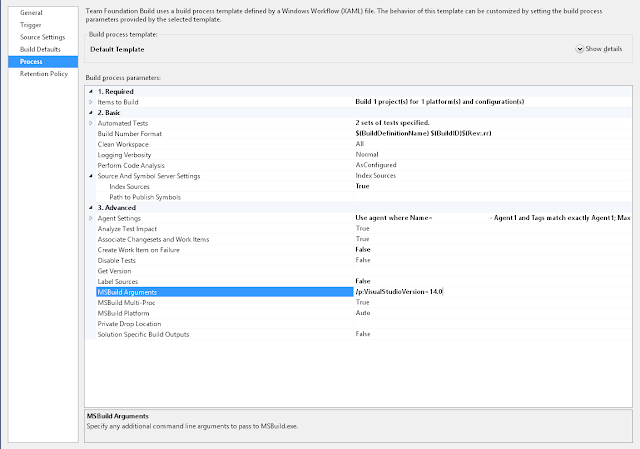

So, you want to use C# 6 language features and you’re working on an older project that’s still rocking .NET 4.5. Well, with [some caveats](<http://stackoverflow.com/a/28921749/761388>), you can.

 The new compiler will compile targeting older framework versions. Well that’s all lovely; let’s all go home.

Now. What say you’ve got an old, old build server? It’s TFS 2012 Update 2, creaking away, still glad to alive and kind of wondering why it hasn’t been upgraded or retired. This is where you want to compile .NET 4.5 from C# 6. Well it can be done. Here’s how it’s done:

1. Install Visual Studio 2015 on the build server (I’m told this can be achieved using [Microsoft Build Tools 2015](<https://www.microsoft.com/en-us/download/details.aspx?id=48159>) but I haven’t tried it myelf so caveat emptor)
2. set the `MSBuild Arguments` in the build definition to `/p:VisualStudioVersion=14.0` (i.e. Visual Studio 2015 mode) 

3. in each project that uses C# 6 syntax, install the NuGet package [Microsoft.Net.Compilers](<https://www.nuget.org/packages/Microsoft.Net.Compilers>) with a quick `install-package Microsoft.Net.Compilers`

That’s it; huzzah! String interpolation here I come…

