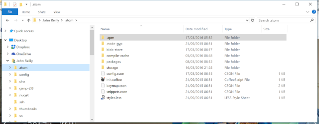

Every now and then when I try and update my packages in [Atom](https://atom.io/) I find this glaring back at me:

 

Ug. The problem is that my atom packages have become corrupt. Quite how I couldn't say. But that's the problem. Atom, as I know from bitter experience, will not recover from this. It just sits there feeling sorry for itself. However, getting back to where you belong is simpler than you imagine:

1. Shutdown Atom
2. In the file system go to `[Your name]/.atom` (and bear in mind this is Windows; Macs / Linux may be different) 

3. You'll see an `.apm` folder that contains all your packages. Delete this.

When you next fire up Atom these packages will automagically come back but this time they shouldn't be corrupt. Instead you should see the happiness of normality restored:

