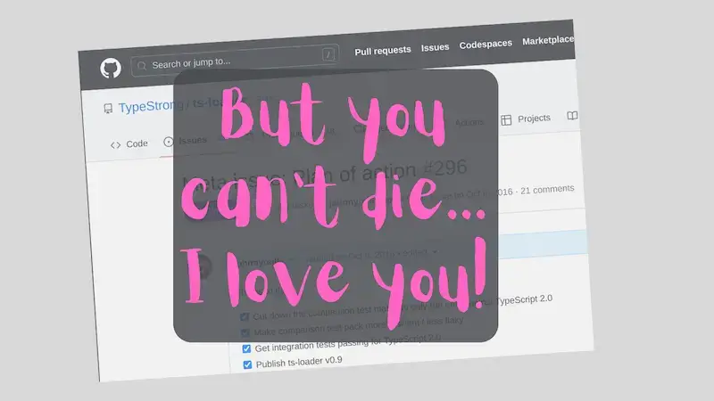
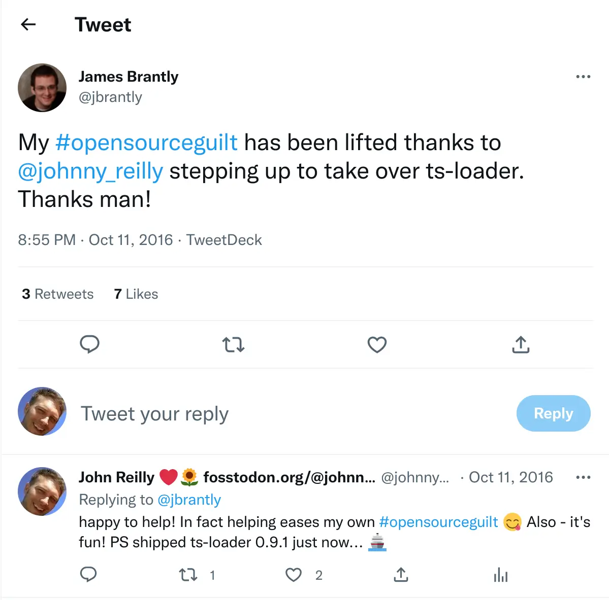

That's how I was feeling on the morning of October 6th 2016. I'd been feeling that way for some time. The target of my concern? [ts-loader](https://github.com/TypeStrong/ts-loader). ts-loader is a loader for [webpack; the module bundler](https://webpack.github.io/). ts-loader allows you use TypeScript with webpack. I'd been a merry user of it for at least a year or so. But, at that point, all was not well in the land of ts-loader. Come with me and I'll tell you a story...

<!--truncate-->

## Going Red

At some point, I became a member of the [TypeStrong](https://github.com/TypeStrong) organisation on GitHub. I'm honestly not entirely sure how. I think it may have been down to the very excellent [Basarat](https://youtube.com/basaratali) (he of [ALM](http://alm.tools/) / [atom-typescript](https://github.com/TypeStrong/atom-typescript) / the list goes on fame) but I couldn't clearly say.

Either way, [James Brantly](https://github.com/jbrantly)'s ts-loader was also one of TypeStrong's projects. Since I used it, I occasionally contributed. Not much to be honest; mostly it was documentation tweaks. I mean I never really looked at the main code at all. It worked (thanks to other people). I just plugged it into my projects and ploughed on my merry way. I liked it. It was well established; with friendly maintainers. It had a continuous integration test pack that ran against multiple versions of TypeScript on both Windows and Linux. I trusted it. Then one day the continuous integration tests went red. And stayed red.

This is where we came in. On the morning of October 6th I was mulling what to do about this. I knew there was another alternative out there (awesome-typescript-loader) but I was a little wary of it. My understanding of ATL was that it targeted webpack 2.0 which has long been in beta. Where I ply my trade (mostly developing software for the financial sector in the City of London) beta is not a word that people trust. They don't do beta. What's more I was quite happy with ts-loader; I didn't want to switch if I didn't have to. I also rather suspected (rightly) that there wasn't much wrong; ts-loader just needed a little bit of love. So I thought: I bet I can help here.

## The Statement of Intent

So that evening I raised [an issue against ts-loader](https://github.com/TypeStrong/ts-loader/issues/296). Not a "sort it out chap" issue. No. That wouldn't be terribly helpful. I raised a "here's how I can help" issue. I present an abridged version below:

> Okay here's the deal; I've been using ts-loader for a long time but my contributions up until now have mostly been documentation. Fixing of tests etc. As the commit history shows this is [@jbrantly](https://github.com/jbrantly)'s baby and kudos to him.
>
> He's not been able to contribute much of late and since he's the main person who's worked on ts-loader not much has happened for a while; the code is a bit stale. As I'm a member of TypeStrong I'm going to have a go at improving the state of the project. I'm going to do this as carefully as I can. This issue is intended as a meta issue to make it visible what I'm plannning to do / doing.
>
> My immediate goal is to get a newer version of ts-loader built and shipped. Essentially all the bug fixes / tweaks since the last release should ship.
>
> ...
>
> I don't have npm publish rights for ts-loader. Fortunately both [@jbrantly](https://github.com/jbrantly) and [@blakeembrey](https://github.com/blakeembrey) do - and hopefully one of them will either be able to help out with a publish or let me have the requisite rights to do it.
>
> I can't promise this is all going to work; I've got a limited amount of spare time I'm afraid. Whatever happens it's going to take me a little while. But I'm going to see where I can take this. Best foot forward! Please bear with me...

I did wonder what would happen next. This happened next:

## Caretaker, not [BDFL](https://en.wikipedia.org/wiki/Benevolent_dictator_for_life)

So that's how it came to pass that I became the present main caretaker of ts-loader. James very kindly gave me the rights to publish to npm and soon enough I did. I fixed up the existing integration test pack; made it less brittle. I wrote a new integration test pack (that performs a different sort of testing; execution rather than comparison). I merged pull requests, I closed issues. I introduced a regression (whoops!), a community member helped me fix it (thanks [Mike Mazmanyan](https://github.com/dopare)!). In the last month ts-loader has shipped 6 times.

The thing that matters most in the last paragraph are the phrases "I merged pull requests" and "a community member helped me fix it". I'm wary of one man bands; you should be to. I want projects to be a thing communally built and maintained. If I go under a bus I want someone else to be able to carry on without me. So be part of this; I want you to help!

I've got plans to do a lot more. I'm in the process of [refactoring ts-loader to make it more modular and hence easier for others to contribute](https://github.com/TypeStrong/ts-loader/pull/343). (Also it must be said, refactoring something is an excellent way to try and learn a codebase.) Version 1.0 of ts-loader should ship this week.

I'm working with [Herrington Darkholme](https://github.com/HerringtonDarkholme) (awesome name BTW!) to [add a hook-in point](https://github.com/TypeStrong/ts-loader/issues/270) that will allow ts-loader to support [vuejs](http://vuejs.org/). Stuff is happening and will continue to. But don't be shy; be part of this! ts-loader awaits your PRs and is happy to have as many caretakers as possible!

