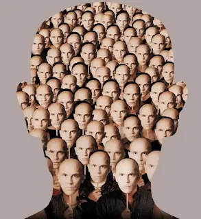

Occasionally I flatter myself that I'm alright at this development lark. Such egotistical talk is foolish. What makes me pause even more when I consider the proposition is this: my subconscious is a better developer than I am.

<!--truncate-->

What's this fellow talking about?

There's two of me. Not identical twins; masquerading as a single man (spoiler: I am not a Christopher Nolan movie). No. There's me, the chap who's tapping away at his keyboard and solving a problem. And there's the other chap too.

I have days when I'm working away at something and I'll hit a brick wall. I produce solutions that work but are not elegant. I'm not proud of them. Or worse, I fail to come up with something that solves the problem I'm facing. So I go home. I see my family, I have some food, I do something else. I context switch. I go to sleep.

When I awake, sometimes (not always) I'll have waiting in my head a better solution. I can see the solution in my head. I can turn it over and compare it to what, if anything, I currently have and see the reasons the new approach is better. Great, right? Up to a point.

What concerns me is this: I didn't work this out from first principles. The idea arrived sight unseen in my head. It totally works but whose work actually is it? I feel like I'm taking credit for someone else's graft. This is probably why I'm so keen on the MIT License. Don't want to be caught out.

I think I'd like it better if I was a better developer than my subconscious. I'd come up with the gold and mock the half baked ideas he shows me in the morning. Alas it is not to be.

I draw some comfort from the knowledge that I'm not alone in my experience. I've chatted to other devs in the same boat. There's probably two of you as well. Amarite? There's probably three of Jon Skeet; each more brilliant than the last...

PS I posted this to Hacker News and [the comments left by people are pretty fascinating](https://news.ycombinator.com/item?id=12942461).
