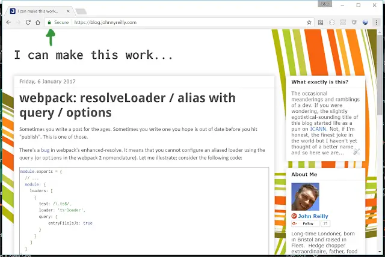

I have had a \***great**\* week. You? Take a look at this blog. Can you see what I can see? Here's a clue:

<!--truncate-->

Yup, look at the top left hand corner.... see that beautiful padlock? Yeah - that's what's thrilled me. You see I have a dream; that one day on the red hills of the internet, the sons of former certificates and the sons of former certificate authorities will be able to sit down together at the table of HTTPS. Peace, love and TLS for all.

The world is turning and slowly but surely HTTPS is becoming the default of the web. [Search results get ranked higher if they're HTTPS.](https://security.googleblog.com/2014/08/https-as-ranking-signal_6.html)[HTTP/2 is, to all intents and purposes, a HTTPS-only game.](https://en.wikipedia.org/wiki/HTTP/2#Encryption)[Service Workers are HTTPS-only.](https://developer.mozilla.org/en/docs/Web/API/Service_Worker_API)

I care about all of these. So it's _essential_ that I have HTTPS. But. But. But... Certificates, the administration that goes with them. It's boring. I mean, it just is. I want to be building interesting apps, I don't want to be devoting my time to acquiring certificates and fighting my way through the (never simple) administration of them. I'm dimly aware that there's free certificates to be had thanks to the fine work of [LetsEncrypt](https://letsencrypt.org/). I believe that work is being done on reduce the onerous admin burden as well. And that's great. But I'm still avoiding it...

What if I told you you could have HTTPS on your blog, on your Azure websites, on your anywhere.... _FOR FREE. IN FIVE MINUTES?_. Well, you can thanks to [CloudFlare](https://www.cloudflare.com/). I did; you should too.

This is where I point you off to a number of resources to help you on your HTTPS way:

1. [Read Troy Hunt's "How to get your SSL for free on a Shared Azure website with CloudFlare"](https://www.troyhunt.com/how-to-get-your-ssl-for-free-on-shared/)
2. [Watch Troy Hunt's Pluralsight course "Getting Started with CloudFlare™ Security"](https://www.pluralsight.com/courses/cloudflare-security-getting-started)
3. [Go to Cloudflare's website and sign up](https://www.cloudflare.com/)

It just works. And that makes me very happy indeed.
