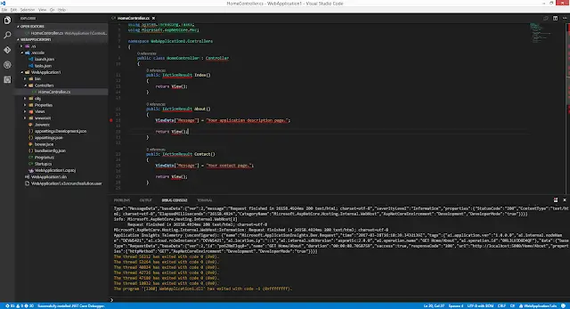
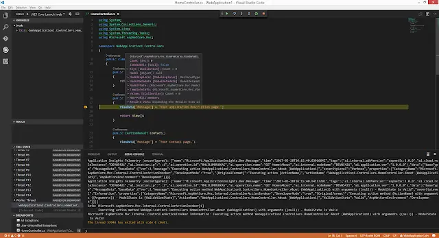

I've been using Visual Studio for a long time. Very good it is too. However, it is heavyweight; it does far more than I need. What I really want when I'm working is a fast snappy editor, with intellisense and debugging. What I've basically described is [VS Code](https://code.visualstudio.com/). It rocks and has long become my go-to editor for TypeScript.

<!--truncate-->

Since I'm a big C# fan as well I was delighted that editing C# was also possible in Code. What I want now is to be able to debug ASP.Net Core in Visual Studio OR VS Code. Can it be done? Let's see....

I fire up Visual Studio and `File -&gt; New Project` (yes it's a verb now). Select .NET Core and then ASP.Net Core Web Application. OK. We'll go for a Web Application. Let's not bother with authentication. OK. Wait a couple of seconds and Visual Studio serves up a new project. Hit F5 and we're debugging in Visual Studio.

So far, so straightforward. What will VS Code make of this?

I cd my way to the root of my new ASP.Net Core Web Application and type the magical phrase "code .". Up it fires. I feel lucky, let's hit "F5". Huh, a dropdown shows up saying `"Select Environment"` and offering me the options of Chrome and Node. Neither do I want. It's about this time I remember this is a clean install of VS Code and doesn't yet have the C# extension installed. In fact, if I open a C# file it up it tells me and recommends that I install. Well that's nice. I take it up on the kind offer; install and reload.

When it comes back up I see the following entries in the "output" tab:

```ts
Updating C# dependencies...
Platform: win32, x86_64 (win7-x64)

Downloading package 'OmniSharp (.NET 4.6 / x64)' (20447 KB) .................... Done!
Downloading package '.NET Core Debugger (Windows / x64)' (39685 KB) .................... Done!

Installing package 'OmniSharp (.NET 4.6 / x64)'
Installing package '.NET Core Debugger (Windows / x64)'

Finished
```

Note that mention of "debugger" there? Sounds super-promising. There's also some prompts: `"There are unresolved dependencies from 'WebApplication1/WebApplication1.csproj'. Please execute the restore command to continue"`

So it wants me to `dotnet restore`. It's even offering to do that for me! Have at you; I let it.

```ts
Welcome to .NET Core!
---------------------
Learn more about .NET Core @ https://aka.ms/dotnet-docs. Use dotnet --help to see available commands or go to https://aka.ms/dotnet-cli-docs.

Telemetry
--------------
The .NET Core tools collect usage data in order to improve your experience. The data is anonymous and does not include command-line arguments. The data is collected by Microsoft and shared with the community.
You can opt out of telemetry by setting a DOTNET_CLI_TELEMETRY_OPTOUT environment variable to 1 using your favorite shell.
You can read more about .NET Core tools telemetry @ https://aka.ms/dotnet-cli-telemetry.

Configuring...
-------------------
A command is running to initially populate your local package cache, to improve restore speed and enable offline access. This command will take up to a minute to complete and will only happen once.
Decompressing Decompressing 100% 4026 ms
Expanding 100% 34814 ms
  Restoring packages for c:\Source\Debugging\WebApplication1\WebApplication1\WebApplication1.csproj...
  Restoring packages for c:\Source\Debugging\WebApplication1\WebApplication1\WebApplication1.csproj...
  Restore completed in 734.05 ms for c:\Source\Debugging\WebApplication1\WebApplication1\WebApplication1.csproj.
  Generating MSBuild file c:\Source\Debugging\WebApplication1\WebApplication1\obj\WebApplication1.csproj.nuget.g.props.
  Writing lock file to disk. Path: c:\Source\Debugging\WebApplication1\WebApplication1\obj\project.assets.json
  Restore completed in 1.26 sec for c:\Source\Debugging\WebApplication1\WebApplication1\WebApplication1.csproj.

  NuGet Config files used:
      C:\Users\johnr\AppData\Roaming\NuGet\NuGet.Config
      C:\Program Files (x86)\NuGet\Config\Microsoft.VisualStudio.Offline.config

  Feeds used:
      https://api.nuget.org/v3/index.json
      C:\Program Files (x86)\Microsoft SDKs\NuGetPackages\
Done: 0.
```

The other prompt says `"Required assets to build and debug are missing from 'WebApplication1'. Add them?"`. This also sounds very promising and I give it the nod. This creates a `.vscode` directory and 2 enclosed files; `launch.json` and `tasks.json`.

So lets try that F5 thing again... http://localhost:5000/ is now serving the same app. That looks pretty good. So lets add a breakpoint to the `HomeController` and see if we can hit it:



Well I can certainly add a breakpoint but all those red squigglies are unnerving me. Let's clean the slate. If you want to simply do that in VS Code hold down `CTRL+SHIFT+P` and then type "reload". Pick "Reload window". A couple of seconds later we're back in and Code is looking much happier. Can we hit our breakpoint?



Yes we can! So you're free to develop in either Code or VS; the choice is yours. I think that's pretty awesome - and well done to all the peeople behind Code who've made this a pretty seamless experience!
