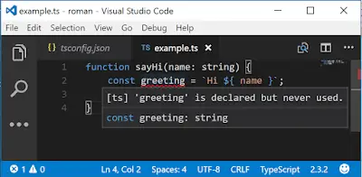

I've recently started a new role. Perhaps unsurprisingly, part of the technology stack is TypeScript. A couple of days into the new codebase I found a bug. Well, I say I found a bug, TypeScript and VS Code found the bug - I just let everyone else know.

<!--truncate-->

The flexibility that TypeScript offers in terms of compiler settings is second to none. You can turn up the dial of strictness to your hearts content. Or down. I'm an "up" man myself.

The project that I am working on has the dial set fairly low; it's pretty much using the default compiler values which are (sensibly) not too strict. I have to say this makes sense for helping people get on board with using TypeScript. Start from a point of low strictness and turn it up when you're ready. As you might have guessed, I cranked the dial up on day one on my own machine. I should say that as I did this, I didn't foist this on the project at large - I kept it just to my build... I'm not \***that**\* guy!

I made the below changes to the `tsconfig.json` file. Details of what each of these settings does can be found in the documentation [here](https://www.typescriptlang.org/docs/handbook/compiler-options.html).

```json
"noImplicitAny": true,
    "noImplicitThis": true,
    "noUnusedLocals": true,
    "noImplicitReturns": true,
    "noUnusedParameters": true,
```

I said I found a bug. The nature of the bug was an unused variable; a variable was created in a function but then not used. Here's a super simple example:

```ts
function sayHi(name: string) {
  const greeting = `Hi ${name}`;
  return name;
}
```

It's an easy mistake to make. I've made this mistake before myself. But with the `noUnusedLocals` compiler setting in place it's now an easy mistake to catch; VS Code lets you know loud and clear:



The other compiler settings will similarly highlight simple mistakes it's possible to make and I'd recommend using them. I should say I've written this from the perspective of a VS Code user, but this really applies generally to TypeScript usage. So whether you're an [alm.tools](http://alm.tools/) guy, a WebStorm gal or something else entirely then this too can be yours!

I'd also say that the `strictNullChecks` compiler setting is worth looking into. However, switching an already established project to using that can involve fairly extensive code changes and will also require a certain amount of education of, and buy in from, your team. So whilst I'd recommend it too, I'd save that one until last.
