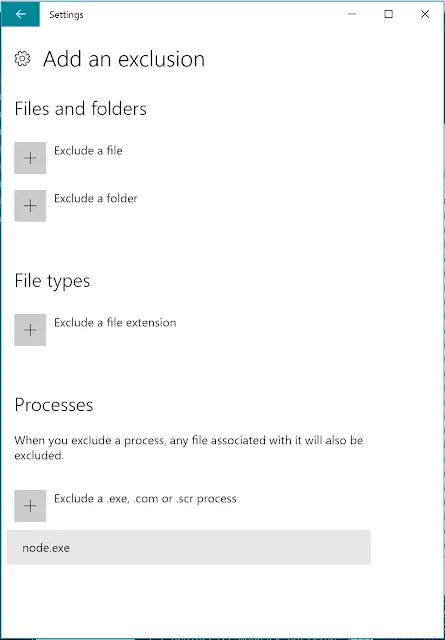

## Updated 18/06/2017

Whilst things did improve by fiddling with Windows Defender it wasn't a 100% fix which makes me wary. Interestingly, VS Code was always open when I did experience the issue and I haven't experienced it when it's been closed. So it may be the cause. I've opened [an issue for this against the VS Code repo](https://github.com/Microsoft/vscode/issues/28593) \- it sounds like other people may be affected as I was. Perhaps this is VS Code and not Windows Defender. Watch that space...

## Updated 12/07/2017

The issue was VS Code. The bug has now been fixed and shipped last night with [VS Code 1.14.0](https://code.visualstudio.com/updates/v1_14). Yay!

<!--truncate-->

I've recently experienced many of my `npm install`s failing for no consistent reason. The error message would generally be something along the lines of:

```sh
npm ERR! Error: EPERM: operation not permitted, rename 'C:\dev\training\drrug\node_modules\.staging\@exponent\ngrok-fc327f2a' -> 'C:\dev\training\drrug\node_modules\@exponent\ngrok'
```

I spent a good deal of time changing the versions of node and npm I was running; all seemingly to no avail. Regular flakiness which I ascribed to node / npm. I was starting to give up when I read of [other people experiencing similar issues](https://github.com/react-community/create-react-native-app/issues/191#issuecomment-304073970). Encouragingly [Fernando Meira](https://github.com/fmeira) suggested a solution:

> I got the same problem just doing an npm install. Run with antivirus disabled (if you use Windows Defender, turn off Real-Time protection and Cloud-based protection). That worked for me!

I didn't really expect this to work - Windows Defender has been running in the background of my Windows 10 laptop since I've had it. There's been no problems with npm installs up until a week or so ago. But given the experience I and others have had I thought I should put it out there: it looks like Windows Defender has it in for npm. Go figure.

Alas Windows Defender doesn't stay dead for long; it's like a zombie that rises from the grave no matter how many times you kill it. So you might want to try configuring it to ignore node.exe:



Or switching to Linux...
