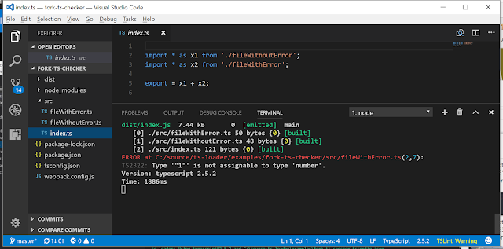
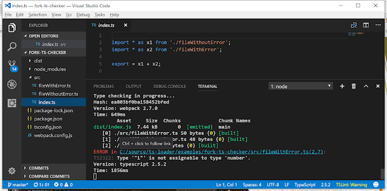

My name is John Reilly and I'm a VS Code addict. There I said it. I'm also a big fan of TypeScript and webpack. I've recently switched to using the awesome [`fork-ts-checker-webpack-plugin`](https://www.npmjs.com/package/fork-ts-checker-webpack-plugin) to speed up my builds.

 One thing I love is using VS Code both as my editor and my terminal. Using the fork-ts-checker-webpack-plugin I noticed a problem when TypeScript errors showed up in the terminal:



Take a look at the red file location in the console above. What's probably not obvious from the above screenshot is that it is **not clickable**. I'm used to being able to click on link in the console and bounce straight to the error location. It's a really productive workflow; see a problem, click on it, be taken to the cause, fix it.

I want to click on "`C:/source/ts-loader/examples/fork-ts-checker/src/fileWithError.ts(2,7)`" and have VS Code open up `fileWithError.ts`, ideally at line 2 and column 7. But here it's not working. Why?

Well, I initially got this slightly wrong; I thought it was about the formatting of the file path. It is. I thought that having the line number and column number in parentheses after the path (eg `"(2,7)"`) was screwing over VS Code. It isn't. Something else is. Look closely at the screenshot; what do you see? Do you notice how the colour of the line number / column number is different to the path? In the words of [Delbert Wilkins](https://youtu.be/281jMxOvP5k): that's crucial.

Yup, the colour change between the path and the line number / column number is the problem. I've submitted a [PR to fix this](https://github.com/Realytics/fork-ts-checker-webpack-plugin/pull/48) that I hope will get merged. In the meantime you can avoid this issue by dropping this code into your `webpack.config.js`:

```js
var chalk = require("chalk");
var os = require("os");

function clickableFormatter(message, useColors) {
    var colors = new chalk.constructor({ enabled: useColors });
    var messageColor = message.isWarningSeverity() ? colors.bold.yellow : colors.bold.red;
    var fileAndNumberColor = colors.bold.cyan;
    var codeColor = colors.grey;
    return [
        messageColor(message.getSeverity().toUpperCase() + " in ") +
        fileAndNumberColor(message.getFile() + "(" + message.getLine() + "," + message.getCharacter() + ")") +
        messageColor(':'),

        codeColor(message.getFormattedCode() + ': ') + message.getContent()
    ].join(os.EOL);
};

module.exports = {
    // Other config...
    module: {
        rules: [
            {
                test: /\.tsx?$/,
                loader: 'ts-loader',
                options: { transpileOnly: true }
            }
        ]
    },
    resolve: {
        extensions: [ '.ts', '.tsx', 'js' ]
    },
    plugins: [
        new ForkTsCheckerWebpackPlugin({ formatter: clickableFormatter }) // Here we get our clickability back
    ]
};
```

With that in place, what do you we have? This:



VS Code clickability; it's a beautiful thing.


