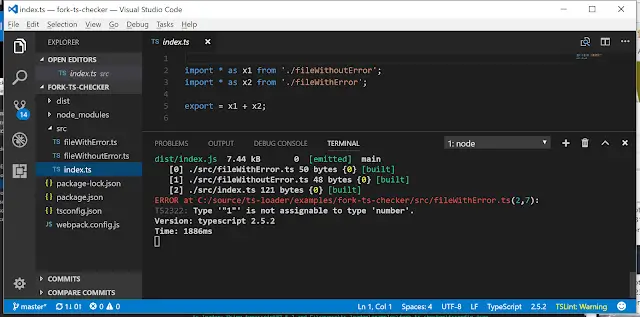
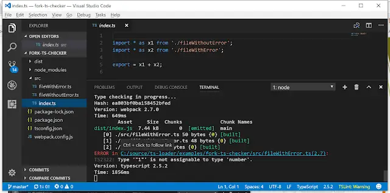

My name is John Reilly and I'm a VS Code addict. There I said it. I'm also a big fan of TypeScript and webpack. I've recently switched to using the awesome [`fork-ts-checker-webpack-plugin`](https://www.npmjs.com/package/fork-ts-checker-webpack-plugin) to speed up my builds.

<!--truncate-->

One thing I love is using VS Code both as my editor and my terminal. Using the fork-ts-checker-webpack-plugin I noticed a problem when TypeScript errors showed up in the terminal:



Take a look at the red file location in the console above. What's probably not obvious from the above screenshot is that it is **not clickable**. I'm used to being able to click on link in the console and bounce straight to the error location. It's a really productive workflow; see a problem, click on it, be taken to the cause, fix it.

I want to click on "`C:/source/ts-loader/examples/fork-ts-checker/src/fileWithError.ts(2,7)`" and have VS Code open up `fileWithError.ts`, ideally at line 2 and column 7. But here it's not working. Why?

Well, I initially got this slightly wrong; I thought it was about the formatting of the file path. It is. I thought that having the line number and column number in parentheses after the path (eg `"(2,7)"`) was screwing over VS Code. It isn't. Something else is. Look closely at the screenshot; what do you see? Do you notice how the colour of the line number / column number is different to the path? In the words of [Delbert Wilkins](https://youtu.be/281jMxOvP5k): that's crucial.

Yup, the colour change between the path and the line number / column number is the problem. I've submitted a [PR to fix this](https://github.com/Realytics/fork-ts-checker-webpack-plugin/pull/48) that I hope will get merged. In the meantime you can avoid this issue by dropping this code into your `webpack.config.js`:

```js
var chalk = require('chalk');
var os = require('os');

function clickableFormatter(message, useColors) {
  var colors = new chalk.constructor({ enabled: useColors });
  var messageColor = message.isWarningSeverity()
    ? colors.bold.yellow
    : colors.bold.red;
  var fileAndNumberColor = colors.bold.cyan;
  var codeColor = colors.grey;
  return [
    messageColor(message.getSeverity().toUpperCase() + ' in ') +
      fileAndNumberColor(
        message.getFile() +
          '(' +
          message.getLine() +
          ',' +
          message.getCharacter() +
          ')',
      ) +
      messageColor(':'),

    codeColor(message.getFormattedCode() + ': ') + message.getContent(),
  ].join(os.EOL);
}

module.exports = {
  // Other config...
  module: {
    rules: [
      {
        test: /\.tsx?$/,
        loader: 'ts-loader',
        options: { transpileOnly: true },
      },
    ],
  },
  resolve: {
    extensions: ['.ts', '.tsx', 'js'],
  },
  plugins: [
    new ForkTsCheckerWebpackPlugin({ formatter: clickableFormatter }), // Here we get our clickability back
  ],
};
```

With that in place, what do you we have? This:



VS Code clickability; it's a beautiful thing.
