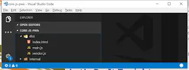
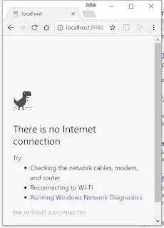
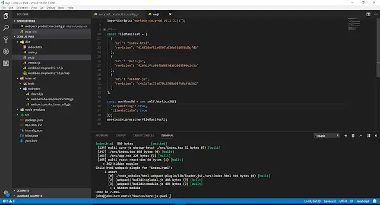
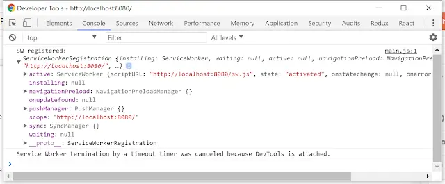
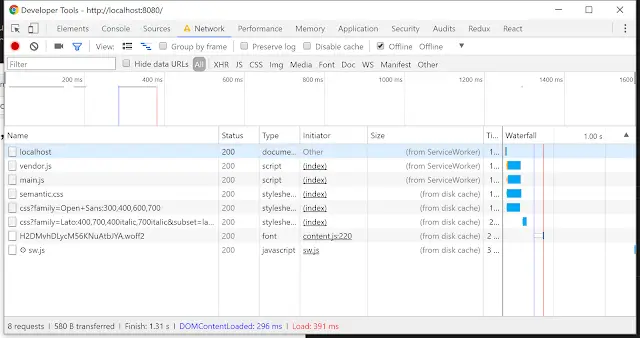

So, there you sit, conflicted. You've got a lovely build setup; it's a thing of beauty. Precious, polished like a diamond, sharpened like a circular saw. There at the core of your carefully crafted setup sits webpack. Heaving, mysterious... powerful.

<!--truncate-->

There's more. Not only are you sold on webpack, you're all in TypeScript too. But now you've heard tell of "Progressive Web Applications" and "Service Workers".... And you want to be dealt in. You want to build web apps that work offline. It can't work can it? Your build setup's going to be like the creature in the episode where they've taken one too many jumps and it's gone into the foetal position.

So this is the plan kids. Let's take a simple TypeScript, webpack setup and make it a PWA. Like Victoria Wood said...

## [Let's Do It Tonight](https://youtu.be/lNU5KVa_Tu8)

How to begin? Well first comes the plagiarism; [here's a simple TypeScript webpack setup](https://github.com/TypeStrong/ts-loader/tree/master/examples/core-js). Rob it. Stick a gun to its head and order it onto your hard drive. `yarn install` to pick up your dependencies and then `yarn start` to see what you've got. Something like this:


Beautiful right? And if we `yarn build` we end up with a simple output:



To test what we've built out we want to use a simple web server to serve up the `dist` folder. I've got the npm package [http-server](https://www.npmjs.com/package/http-server) installed globally for just such an eventuality. So let's `http-server ./dist` and I'm once again looking at our simple app; it looks exactly the same as when I `yarn start`. Smashing. What would we see if we were offline? Well thanks to the magic of Chrome DevTools we can find out. Offline and refresh our browser...



Not very user friendly. Once we're done, we should be able to refresh and still see our app.

## [Work(box) It](https://youtu.be/UODX_pYpVxk)

[Workbox](https://developers.google.com/web/tools/workbox/) is a project that makes the setting up of Service Workers (aka the magic that powers PWAs) easier. It supports webpack use cases through the [workbox-webpack-plugin](https://www.npmjs.com/package/workbox-webpack-plugin); so let's give it a whirl. Incidentally, there's a [cracking example](https://developers.google.com/web/tools/workbox/get-started/webpack) on the Workbox site.

`yarn add workbox-webpack-plugin --dev` adds the plugin to our project. To make use of it, punt your way over to the `webpack.production.config.js` and add an entry for the plugin. We also need to set the `hash` parameter of the html-webpack-plugin to be false; if it's true it'll cause problems for the ServiceWorker.

```js
const WorkboxPlugin = require('workbox-webpack-plugin');

//...

module.exports = {
  //...

  plugins: [
    //...

    new HtmlWebpackPlugin({
      hash: false,
      inject: true,
      template: 'src/index.html',
      minify: {
        removeComments: true,
        collapseWhitespace: true,
        removeRedundantAttributes: true,
        useShortDoctype: true,
        removeEmptyAttributes: true,
        removeStyleLinkTypeAttributes: true,
        keepClosingSlash: true,
        minifyJS: true,
        minifyCSS: true,
        minifyURLs: true,
      },
    }),

    new WorkboxPlugin({
      // we want our service worker to cache the dist directory
      globDirectory: 'dist',
      // these are the sorts of files we want to cache
      globPatterns: ['**/*.{html,js,css,png,svg,jpg,gif,json}'],
      // this is where we want our ServiceWorker to be created
      swDest: path.resolve('dist', 'sw.js'),
      // these options encourage the ServiceWorkers to get in there fast
      // and not allow any straggling "old" SWs to hang around
      clientsClaim: true,
      skipWaiting: true,
    }),
  ],

  //...
};
```

With this in place, `yarn build` will generate a ServiceWorker. Now to alter our code to register it. Open up `index.tsx` and add this to the end of the file:

```js
if ('serviceWorker' in navigator) {
  window.addEventListener('load', () => {
    navigator.serviceWorker
      .register('/sw.js')
      .then((registration) => {
        // tslint:disable:no-console
        console.log('SW registered: ', registration);
      })
      .catch((registrationError) => {
        console.log('SW registration failed: ', registrationError);
      });
  });
}
```

Put it together and...

## What Have We Got?

Let's `yarn build` again.



Oooohh look! A service worker is with us. Does it work? Let's find out... `http-server ./dist` Browse to [http://localhost:8080](http://localhost:8080) and let's have a look at the console.



Looks very exciting. So now the test; let's go offline and refresh:



You are looking at the 200s of success. You're now running with webpack and TypeScript and you have built a Progressive Web Application. Feel good about life.
