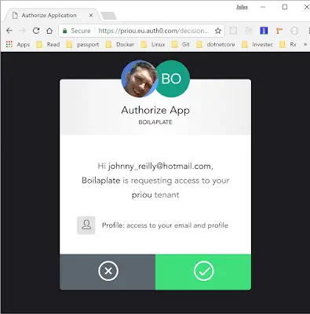
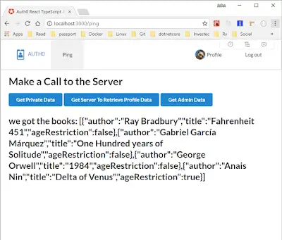
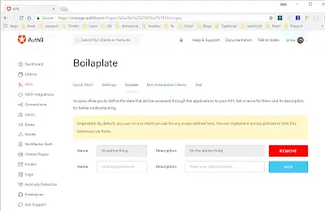
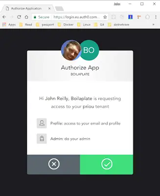

Most applications I write have some need for authentication and perhaps authorisation too. In fact, most apps most people write fall into that bracket. Here's the thing: Auth done well is a \*big\* chunk of work. And the minute you start thinking about that you almost invariably lose focus on the thing you actually want to build and ship.

<!--truncate-->

So this Christmas I decided it was time to take a look into offloading that particular problem onto someone else. I knew there were third parties who provided Auth-As-A-Service - time to give them a whirl. On the recommendation of a friend, I made Auth0 my first port of call. Lest you be expecting a full breakdown of the various players in this space, let me stop you now; I liked Auth0 so much I strayed no further. Auth0 kicks AAAS. (I'm so sorry)

## What I wanted to build

My criteria for "auth success" was this:

- I want to build a SPA, specifically a React SPA. Ideally, I shouldn't need a back end of my own at all
- I want to use TypeScript on my client.

But, for when I do implement a back end:

- I want that to be able to use the client side's Auth tokens to allow access to Auth routes on my server.
- ‎I want to able to identify the user, given the token, to provide targeted data
- Oh, and I want to use .NET Core 2 for my server.

And in achieving all of the I want to add minimal code to my app. Not War and Peace. My code should remain focused on doing what it does.

## Boil a Plate

I ended up with unqualified ticks for all my criteria, but it took some work to find out. I will say that Auth0 do travel the extra mile in terms of getting you up and running. When you create a new Client in Auth0 you're given the option to download a quick start using the technology of your choice.

This was a massive plus for me. I took the quickstart provided and ran with it to get me to the point of meeting my own criteria. You can use this boilerplate for your own ends. Herewith, a walkthrough:

## The Walkthrough

Fork and clone the repo at this location: [https://github.com/johnnyreilly/auth0-react-typescript-asp-net-core](https://github.com/johnnyreilly/auth0-react-typescript-asp-net-core).

What have we got? 2 folders, ClientApp contains the React app, Web contains the ASP.NET Core app. Now we need to get setup with Auth0 and customise our config.

## Setup Auth0

Here's how to get the app set up with Auth0; you're going to need to sign up for a (free) Auth0 account. Then login into Auth0 and go to the management portal.

### Client

- Create a Client with the name of your choice and use the Single Page Web Applications template.
- From the new Client Settings page take the Domain and Client ID and update the similarly named properties in the `appsettings.Development.json` and `appsettings.Production.json` files with these settings.
- To the Allowed Callback URLs setting add the URLs: `http://localhost:3000/callback,http://localhost:5000/callback` \- the first of these faciliates running in Debug mode, the second in Production mode. If you were to deploy this you'd need to add other callback URLs in here too.

### API

- Create an API with the name of your choice (I recommend the same as the Client to avoid confusion), an identifier which can be anything you like; I like to use the URL of my app but it's your call.
- From the new API Settings page take the Identifier and update the Audience property in the `appsettings.Development.json` and `appsettings.Production.json` files with that value.

## Running the App

### Production build

Build the client app with `yarn build` in the `ClientApp` folder. (Don't forget to `yarn install` first.) Then, in the `Web` folder `dotnet restore`, `dotnet run` and open your browser to [`http://localhost:5000`](http://localhost:5000)

### Debugging

Run the client app using webpack-dev-server using `yarn start` in the `ClientApp` folder. Fire up VS Code in the root of the repo and hit F5 to debug the server. Then open your browser to [`http://localhost:3000`](http://localhost:3000)

## The Tour

When you fire up the app you're presented with "you are not logged in!" message and the option to login. Do it, it'll take you to the Auth0 "lock" screen where you can sign up / login. Once you do that you'll be asked to confirm access:



All this is powered by Auth0's [auth0-js](https://www.npmjs.com/package/auth0-js) npm package. (Excellent type definition files are available from Definitely Typed; I'm using the [@types/auth0-js](https://www.npmjs.com/package/@types/auth0-js) package DT publishes.) Usage of which is super simple; it exposes an `authorize` method that when called triggers the Auth0 lock screen. Once you've "okayed" you'll be taken back to the app which will use the `parseHash` method to extract the access token that Auth0 has provided. Take a look at how our `authStore` makes use of auth0-js: (don't be scared; it uses mobx - but you could use anything)

### authStore.ts

```ts
import { Auth0UserProfile, WebAuth } from 'auth0-js';
import { action, computed, observable, runInAction } from 'mobx';
import { IAuth0Config } from '../../config';
import { StorageFacade } from '../storageFacade';

interface IStorageToken {
  accessToken: string;
  idToken: string;
  expiresAt: number;
}

const STORAGE_TOKEN = 'storage_token';

export class AuthStore {
  @observable.ref auth0: WebAuth;
  @observable.ref userProfile: Auth0UserProfile;
  @observable.ref token: IStorageToken;

  constructor(
    config: IAuth0Config,
    private storage: StorageFacade,
  ) {
    this.auth0 = new WebAuth({
      domain: config.domain,
      clientID: config.clientId,
      redirectUri: config.redirectUri,
      audience: config.audience,
      responseType: 'token id_token',
      scope: 'openid email profile do:admin:thing', // the do:admin:thing scope is custom and defined in the scopes section of our API in the Auth0 dashboard
    });
  }

  initialise() {
    const token = this.parseToken(this.storage.getItem(STORAGE_TOKEN));
    if (token) {
      this.setSession(token);
    }
    this.storage.addEventListener(this.onStorageChanged);
  }

  parseToken(tokenString: string) {
    const token = JSON.parse(tokenString || '{}');
    return token;
  }

  onStorageChanged = (event: StorageEvent) => {
    if (event.key === STORAGE_TOKEN) {
      this.setSession(this.parseToken(event.newValue));
    }
  };

  @computed get isAuthenticated() {
    // Check whether the current time is past the
    // access token's expiry time
    return this.token && new Date().getTime() < this.token.expiresAt;
  }

  login = () => {
    this.auth0.authorize();
  };

  handleAuthentication = () => {
    this.auth0.parseHash((err, authResult) => {
      if (authResult && authResult.accessToken && authResult.idToken) {
        const token = {
          accessToken: authResult.accessToken,
          idToken: authResult.idToken,
          // Set the time that the access token will expire at
          expiresAt: authResult.expiresIn * 1000 + new Date().getTime(),
        };

        this.setSession(token);
      } else if (err) {
        // tslint:disable-next-line:no-console
        console.log(err);
        alert(`Error: ${err.error}. Check the console for further details.`);
      }
    });
  };

  @action
  setSession(token: IStorageToken) {
    this.token = token;
    this.storage.setItem(STORAGE_TOKEN, JSON.stringify(token));
  }

  getAccessToken = () => {
    const accessToken = this.token.accessToken;
    if (!accessToken) {
      throw new Error('No access token found');
    }
    return accessToken;
  };

  @action
  loadProfile = async () => {
    const accessToken = this.token.accessToken;
    if (!accessToken) {
      return;
    }

    this.auth0.client.userInfo(accessToken, (err, profile) => {
      if (err) {
        throw err;
      }

      if (profile) {
        runInAction(() => (this.userProfile = profile));
        return profile;
      }

      return undefined;
    });
  };

  @action
  logout = () => {
    // Clear access token and ID token from local storage
    this.storage.removeItem(STORAGE_TOKEN);

    this.token = null;
    this.userProfile = null;
  };
}
```

Once you're logged in the app offers you more in the way of navigation options. A "Profile" screen shows you the details your React app has retrieved from Auth0 about you. This is backed by the `client.userInfo` method on `auth0-js`. There's also a "Ping" screen which is where your React app talks to your ASP.NET Core server. The screenshot below illustrates the result of hitting the "Get Private Data" button:



The "Get Server to Retrieve Profile Data" button is interesting as it illustrates that the server can get access to your profile data as well. There's nothing insecure here; it gets the details using the access token retrieved from Auth0 by the ClientApp and passed to the server. It's the API we set up in Auth0 that is in play here. The app uses the Domain and the access token to talk to Auth0 like so:

### UserController.cs

```cs
// Retrieve the access_token claim which we saved in the OnTokenValidated event
    var accessToken = User.Claims.FirstOrDefault(c => c.Type == "access_token").Value;

    // If we have an access_token, then retrieve the user's information
    if (!string.IsNullOrEmpty(accessToken))
    {
        var domain = _config["Auth0:Domain"];
        var apiClient = new AuthenticationApiClient(domain);
        var userInfo = await apiClient.GetUserInfoAsync(accessToken);

        return Ok(userInfo);
    }
```

We can also access the `sub` claim, which uniquely identifies the user:

### UserController.cs

```cs
// We're not doing anything with this, but hey! It's useful to know where the user id lives
    var userId = User.Claims.FirstOrDefault(c => c.Type == System.Security.Claims.ClaimTypes.NameIdentifier).Value; // our userId is the sub value
```

The reason our ASP.NET Core app works with Auth0 and that we have access to the access token here in the first place is because of our startup code:

### Startup.cs

```cs
public void ConfigureServices(IServiceCollection services)
    {
        var domain = $"https://{Configuration["Auth0:Domain"]}/";
        services.AddAuthentication(options =>
        {
            options.DefaultAuthenticateScheme = JwtBearerDefaults.AuthenticationScheme;
            options.DefaultChallengeScheme = JwtBearerDefaults.AuthenticationScheme;
        }).AddJwtBearer(options =>
        {
            options.Authority = domain;
            options.Audience = Configuration["Auth0:Audience"];
            options.Events = new JwtBearerEvents
            {
                OnTokenValidated = context =>
                {
                    if (context.SecurityToken is JwtSecurityToken token)
                    {
                        if (context.Principal.Identity is ClaimsIdentity identity)
                        {
                            identity.AddClaim(new Claim("access_token", token.RawData));
                        }
                    }

                    return Task.FromResult(0);
                }
            };
        });

        // ....
```

## Authorization

We're pretty much done now; just one magic button to investigate: "Get Admin Data". If you presently try and access the admin data you'll get a `403 Forbidden`. It's forbidden because that endpoint relies on the `"do:admin:thing"` scope in our claims:

### UserController.cs

```cs
[Authorize(Scopes.DoAdminThing)]
    [HttpGet("api/userDoAdminThing")]
    public IActionResult GetUserDoAdminThing()
    {
        return Ok("Admin endpoint");
    }
```

### Scopes.cs

```cs
public static class Scopes
    {
         // the do:admin:thing scope is custom and defined in the scopes section of our API in the Auth0 dashboard
        public const string DoAdminThing = "do:admin:thing";
    }
```

This wired up in our ASP.NET Core app like so:

### Startup.cs

```cs
services.AddAuthorization(options =>
    {
        options.AddPolicy(Scopes.DoAdminThing, policy => policy.Requirements.Add(new HasScopeRequirement(Scopes.DoAdminThing, domain)));
    });

    // register the scope authorization handler
    services.AddSingleton<iauthorizationhandler, hasscopehandler="">();
</iauthorizationhandler,>
```

### HasScopeHandler.cs

```cs
public class HasScopeHandler : AuthorizationHandler<hasscoperequirement>
    {
        protected override Task HandleRequirementAsync(AuthorizationHandlerContext context, HasScopeRequirement requirement)
        {
            // If user does not have the scope claim, get out of here
            if (!context.User.HasClaim(c => c.Type == "scope" && c.Issuer == requirement.Issuer))
                return Task.CompletedTask;

            // Split the scopes string into an array
            var scopes = context.User.FindFirst(c => c.Type == "scope" && c.Issuer == requirement.Issuer).Value.Split(' ');

            // Succeed if the scope array contains the required scope
            if (scopes.Any(s => s == requirement.Scope))
                context.Succeed(requirement);

            return Task.CompletedTask;
        }
    }
</hasscoperequirement>
```

The reason we're 403ing at present is because when our `HasScopeHandler` executes, `requirement.Scope` has the value of `"do:admin:thing"` and our `scopes` do not contain that value. To add it, go to your API in the Auth0 management console and add it:



Note that you can control how this scope is acquired using "Rules" in the Auth0 management portal.

You won't be able to access the admin endpoint yet because you're still rocking with the old access token; pre-newly-added scope. But when you next login to Auth0 you'll see a prompt like this:



Which demonstrates that you're being granted an extra scope. With your new shiny access token you can now access the oh-so-secret Admin endpoint.

I had some more questions about Auth0 as I'm still new to it myself. To see my question (and the very helpful answer!) go here: [https://community.auth0.com/questions/13786/get-user-data-server-side-what-is-a-good-approach](https://community.auth0.com/questions/13786/get-user-data-server-side-what-is-a-good-approach)
