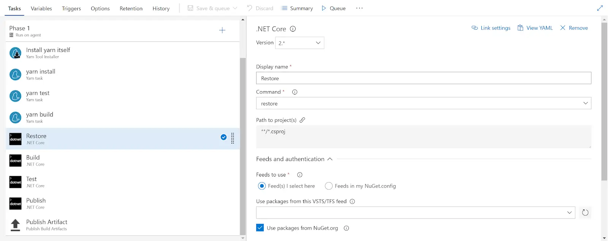

For the longest time I've been using the likes of [Travis](https://travis-ci.org/) and [AppVeyor](https://www.appveyor.com/) to build open source projects that I work on. They rock. I've also recently been dipping my toes back in the water of [Visual Studio Team Services](https://www.visualstudio.com/team-services/). VSTS offers a whole stack of stuff, but my own area of interest has been the Continuous Integration / Continuous Deployment offering.

<!--truncate-->

Historically I have been underwhelmed by the CI proposition of Team Foundation Server / VSTS. It was difficult to debug, difficult to configure, difficult to understand. If it worked... Great! If it didn't (and it often didn't), you were toast. But things done changed! I don't know when it happened, but VSTS is now super configurable. You add tasks / configure them, build and you're done! It's really nice.

However, there's been something I've been missing from Travis, AppVeyor et al. Keeping my build script with my code. Travis has `.travis.yml`, AppVeyor has `appveyor.yml`. VSTS, what's up?

## The New Dawn

Up until now, really not much. It just wasn't possible. Until it was:

> If you prefer a build definition in YAML then we’re currently hard at work on that. You can enable it as a preview feature: [https://t.co/hau9Sv8brf](https://t.co/hau9Sv8brf)
>
> — Martin Woodward (@martinwoodward) [March 4, 2018](https://twitter.com/martinwoodward/status/970250739510534144?ref_src=twsrc%5Etfw)

When I started testing it out I found things to like and some things I didn't understand. Crucially, my CI now builds based upon `.vsts-ci.yml`. YAML baby!

## It Begins!

You can get to "Hello World" by looking at [the docs here](https://docs.microsoft.com/en-us/vsts/pipelines/build/yaml?view=vsts) and [the examples here](https://github.com/Microsoft/vsts-agent/blob/master/docs/preview/yamlgettingstarted/index.md). But what you really want is your existing build, configured in the UI, exported to YAML. That doesn't seem to quite exist, but there's something that gets you part way. Take a look:



If you notice, in the top right of the screen, each task now allows you click on a new "View YAML" button. It's kinda [Ronseal](https://en.wikipedia.org/wiki/Ronseal):


Using this hotness you can build yourself a `.vsts-ci.yml` file task by task.

## A Bump in the Road

If you look closely at the message above you'll see there's a message about an undefined variable.

```yml
#Your build definition references an undefined variable named ‘Parameters.RestoreBuildProjects’. Create or edit the build definition for this YAML file, define the variable on the Variables tab. See https://go.microsoft.com/fwlink/?linkid=865972
steps:
  - task: DotNetCoreCLI@2
    displayName: Restore
    inputs:
      command: restore
      projects: '$(Parameters.RestoreBuildProjects)'
```

Try as I might, I couldn't locate `Parameters.RestoreBuildProjects`. So no working CI build for me. Then I remembered [Zoltan Erdos](https://github.com/zerdos). He's hard to forget. Or rather, I remembered an idea of his which I will summarise thusly: "Have a `package.json` in the root of your repo, use the `scripts` for individual tasks and you have a cross platform task runner".

This is a powerful idea and one I decided to put to work. My project is React and TypeScript on the front end, and ASP.Net Core on the back. I wanted a `package.json` in the root of the repo which I could install dependencies, build, test and publish my whole app. I could call into that from my `.vsts-ci.yml` file. Something like this:

```json
{
  "name": "my-amazing-project",
  "version": "1.0.0",
  "author": "John Reilly <johnny_reilly@hotmail.com>",
  "license": "MIT",
  "private": true,
  "scripts": {
    "preinstall": "yarn run install:clientapp && yarn run install:web",
    "install:clientapp": "cd MyAmazingProject.ClientApp && yarn install",
    "install:web": "dotnet restore",
    "prebuild": "yarn install",
    "build": "yarn run build:clientapp && yarn run build:web",
    "build:clientapp": "cd MyAmazingProject.ClientApp && yarn run build",
    "build:web": "dotnet build --configuration Release",
    "postbuild": "yarn test",
    "test": "yarn run test:clientapp && yarn run test:web",
    "test:clientapp": "cd MyAmazingProject.ClientApp && yarn test",
    "test:web": "cd MyAmazingProject.Web.Tests && dotnet test",
    "publish:web": "cd MyAmazingProject.Web && dotnet publish MyAmazingProject.Web.csproj --configuration Release"
  }
}
</johnny_reilly@hotmail.com>
```

It doesn't matter if I have "an undefined variable named ‘Parameters.RestoreBuildProjects’". I now have no need to use all the individual tasks in a build. I can convert them into a couple of scripts in my `package.json`. So here's where I've ended up for now. I've a `.vsts-ci.yml` file which looks like this:

```yml
queue: Hosted VS2017

steps:
  - task: geeklearningio.gl-vsts-tasks-yarn.yarn-installer-task.YarnInstaller@2
    displayName: install yarn itself
    inputs:
      checkLatest: true
  - task: geeklearningio.gl-vsts-tasks-yarn.yarn-task.Yarn@2
    displayName: yarn build and test
    inputs:
      Arguments: build
  - task: geeklearningio.gl-vsts-tasks-yarn.yarn-task.Yarn@2
    displayName: yarn publish:web
    inputs:
      Arguments: 'run publish:web --output $(build.artifactstagingdirectory)/MyAmazingProject'
  - task: PublishBuildArtifacts@1
    displayName: publish build artifact
    inputs:
      PathtoPublish: '$(build.artifactstagingdirectory)'
```

This file does the following:

1. Installs yarn. (By the way VSTS, what's with not having yarn installed by default? I'll say this for the avoidance of doubt: in the npm cli space: yarn has won.)
2. Install our dependencies, build the front end and back end, run all the tests. Effectively `yarn build`.
3. Publish our web app to a directory. Effectively `yarn run publish:web`. This is only separate because we want to pass in the output directory and so it's just easier for it to be a separate step.
4. Publish the build artefact to TFS. (This will go on to be picked up by the continuous deployment mechanism and published out to Azure.)

I much prefer this to what I had before. I feel there's much more that can be done here as well. I'm looking forward to the continuous deployment piece becoming scriptable too.

Thanks to Zoltan and props to the TFVS team!
