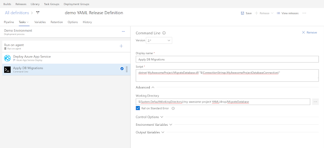
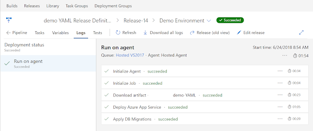

Let me start by telling you a dirty secret. I have an ASP.Net Core project that I build with VSTS. It is deployed to Azure through a CI / CD setup in VSTS. That part I'm happy with. Proud of even. Now to the sordid hiddenness: try as I might, I've never found a nice way to deploy Entity Framework database migrations as part of the deployment flow. So I have [blushes with embarrassment] been using the `Startup` of my ASP.Net core app to run the migrations on my database. There. I said it. You all know. Absolutely filthy. Don't judge me.

 If you care to google, you'll find various discussions around this, and various ways to tackle it. Most of which felt like too much hard work and so I never attempted.

It's also worth saying that being on VSTS made me less likely to give these approaches a go. Why? Well, the feedback loop for debugging a CI / CD setup is truly sucky. Make a change. Wait for it to trickle through the CI / CD flow (10 mins at least). Spot a problem, try and fix. Start waiting again. Repeat until you succeed. Or, if you're using the free tier of VSTS, repeat until you run out of build minutes. You have a limited number of build minutes per month with VSTS. Last time I fiddled with the build, I bled my way through a full month's minutes in 2 days. I have now adopted the approach of only playing with the setup in the last week of the month. That way if I end up running out of minutes, at least I'll roll over to the new allowance in a matter of days.

Digression over. I could take the guilt of my EF migrations secret no longer, I decided to try and tackle it another way. I used the approach suggested by [Andre Broers](https://github.com/broersa)[here](https://github.com/aspnet/EntityFrameworkCore/issues/9841#issuecomment-395712061):

> I worked around by adding a dotnetcore consoleapp project where I run the migration via the Context. In the Build I build this consoleapp in the release I execute it.

## Console Yourself

First things first, we need a console app added to our solution. Fire up PowerShell in the root of your project and:

```console
md MyAwesomeProject.MigrateDatabase
cd .\MyAwesomeProject.MigrateDatabase\
dotnet new console
```

Next we need that project to know about Entity Framework and also our DbContext (which I store in a dedicated project):

```console
dotnet add package Microsoft.EntityFrameworkCore.Design
dotnet add package Microsoft.EntityFrameworkCore.SqlServer
dotnet add reference ..\MyAwesomeProject.Database\MyAwesomeProject.Database.csproj
```

Add our new project to our solution: (I always forget to do this)

```console
cd ../
dotnet sln add .\MyAwesomeProject.MigrateDatabase\MyAwesomeProject.MigrateDatabase.csproj
```

You should now be the proud possessor of a `.csproj` file that looks like this:

```xml
<Project Sdk="Microsoft.NET.Sdk">

  <PropertyGroup>
    <OutputType>Exe</OutputType>
    <TargetFramework>netcoreapp2.1</TargetFramework>
  </PropertyGroup>

  <ItemGroup>
    <PackageReference Include="Microsoft.EntityFrameworkCore.Design" Version="2.1.1" />
    <PackageReference Include="Microsoft.EntityFrameworkCore.SqlServer" Version="2.1.1" />
  </ItemGroup>

  <ItemGroup>
    <ProjectReference Include="..\MyAwesomeProject.Database\MyAwesomeProject.Database.csproj" />
  </ItemGroup>

</Project>
```

Replace the contents of the `Program.cs` file with this:

```cs
using System;
using System.IO;
using MyAwesomeProject.Database;
using Microsoft.EntityFrameworkCore;

namespace MyAwesomeProject.MigrateDatabase {
    class Program {
        // Example usage:
        // dotnet MyAwesomeProject.MigrateDatabase.dll "Server=(localdb)\\mssqllocaldb;Database=MyAwesomeProject;Trusted_Connection=True;"
        static void Main(string[] args) {
            if (args.Length == 0)
                throw new Exception("No connection string supplied!");

            var myAwesomeProjectConnectionString = args[0];

            // Totally optional debug information
            Console.WriteLine("About to migrate this database:");
            var connectionBits = myAwesomeProjectConnectionString.Split(";");
            foreach (var connectionBit in connectionBits) {
                if (!connectionBit.StartsWith("Password", StringComparison.CurrentCultureIgnoreCase))
                    Console.WriteLine(connectionBit);
            }

            try {
                var optionsBuilder = new DbContextOptionsBuilder<MyAwesomeProjectContext>();
                optionsBuilder.UseSqlServer(myAwesomeProjectConnectionString);

                using(var context = new MyAwesomeProjectContext(optionsBuilder.Options)) {
                    context.Database.Migrate();
                }
                Console.WriteLine("This database is migrated like it's the Serengeti!");
            } catch (Exception exc) {
                var failedToMigrateException = new Exception("Failed to apply migrations!", exc);
                Console.WriteLine($"Didn't succeed in applying migrations: {exc.Message}");
                throw failedToMigrateException;
            }
        }
    }
}
```

This code takes the database connection string passed as an argument, spins up a db context with that, and migrates like it's the Serengeti.

## Build It!

The next thing we need is to ensure that this is included as part of the build process in VSTS. The following commands need to be run during the build to include the MigrateDatabase project in the build output in a `MigrateDatabase` folder:

```cs
cd MyAwesomeProject.MigrateDatabase
dotnet build
dotnet publish --configuration Release --output $(build.artifactstagingdirectory)/MigrateDatabase
```

There's various ways to accomplish this which I wont reiterate now. [I recommend YAML](https://blog.johnnyreilly.com/2018/06/vsts-yaml-up.html).

## Deploy It!

Now to execute our console app as part of the deployment process we need to add a CommandLine task to our VSTS build definition. It should execute the following command:

```cs
dotnet MyAwesomeProject.MigrateDatabase.dll "$(ConnectionStrings.MyAwesomeProjectDatabaseConnection)"
```

In the following folder:

```cs
$(System.DefaultWorkingDirectory)/my-awesome-project-YAML/drop/MigrateDatabase
```

Do note that the command uses the `ConnectionStrings.MyAwesomeProjectDatabaseConnection` variable which you need to create and set to the value of your connection string.



## Give It A Whirl

Let's find out what happens when the rubber hits the road. I'll add a new entity to my database project:

```cs
using System;

namespace MyAwesomeProject.Database.Entities {
    public class NewHotness {
        public Guid NewHotnessId { get; set; }
    }
}
```

And reference it in my DbContext:

```cs
using MyAwesomeProject.Database.Entities;
using Microsoft.EntityFrameworkCore;

namespace MyAwesomeProject.Database {
    public class MyAwesomeProjectContext : DbContext {
        public MyAwesomeProjectContext(DbContextOptions<MyAwesomeProjectContext> options) : base(options) { }

        // ...
  
        public DbSet<NewHotness> NewHotnesses { get; set; }

        // ...
    }
}
```

Let's let EF know by adding a migration to my project:


```cs
dotnet ef migrations add TestOurMigrationsApproach
```

Commit my change, push it to VSTS, wait for the build to run and a deployment to take place.... Okay. It's done. Looks good.



Let's take a look in the database:

```console
select * from NewHotnesses
go
```


It's there! We are migrating our database upon deployment; and not in our ASP.Net Core app itself. I feel a burden lifted.

## Wrapping Up

The EF Core team are aware of the lack of guidance around deploying migrations and have recently announced plans to fix that in the docs. You can track the progress of this issue [here](https://github.com/aspnet/EntityFramework.Docs/issues/691). There's good odds that once they come out with this I'll find there's a better way than the approach I've outlined in this post. Until that glorious day!


