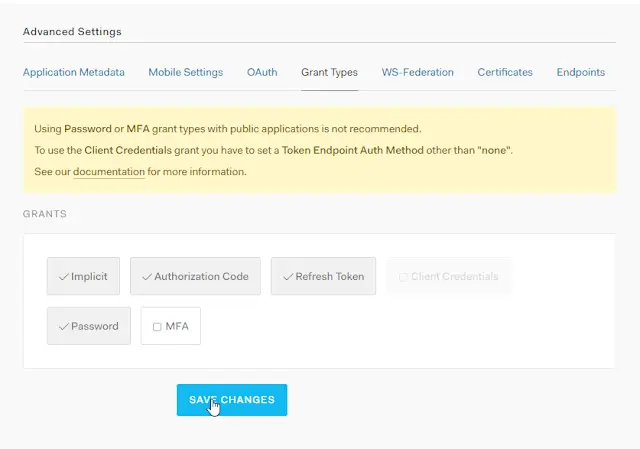

[Cypress](https://www.cypress.io/) is a fantastic way to write UI tests for your web apps. Just world class. Wait, no. Galaxy class. I'm going to go one further: universe class. You get my drift.

<!--truncate-->

Here's a pickle for you. You have functionality that lies only behind the walled garden of authentication. You want to write tests for these capabilities. Assuming that authentication takes place within your application that's no great shakes. Authentication is part of your app; it's no big deal using Cypress to automate logging in.

Auth is a serious business and, as Cypress is best in class for UI testing, I'll say that Auth0 is romping home with the same title in the auth-as-a-service space. My app is using Auth0 for authentication. What's important to note about this is the flow. Typically when using auth-as-a-service, the user is redirected to the auth provider's site to authenticate and then be redirected back to the application post-login.

[Brian Mann](https://github.com/brian-mann) (of Cypress fame) has been [fairly clear when talking about testing with this sort of authentication flow](https://github.com/cypress-io/cypress/issues/1342#issuecomment-366747803):

> You're trying to test SSO - and we have recipes showing you exactly how to do this.
>
> Also best practice is never to visit or test 3rd party sites not under your control. You don't control `microsoftonline`, so there's no reason to use the UI to test this. You can programmatically test the integration between it and your app with `cy.request` \- which is far faster, more reliable, and still gives you 100% confidence.

I want to automate logging into Auth0 from my Cypress tests. But hopefully in a good way. Not a bad way. Wouldn't want to make Brian sad.

## Commanding Auth0

To automate our login, we're going to use the [auth0-js client library](https://github.com/auth0/auth0.js). This is the same library the application uses; but we're going to do something subtly different with it.

The application uses [`authorize`](https://github.com/auth0/auth0.js#api) to log users in. This function redirects the user into the Auth0 lock screen, and then, post authentication, redirects the user back to the application with a token in the URL. The app parses the token (using the auth0 client library) and sets the token and the expiration of said token in the browser sessionStorage.

What we're going to do is automate our login by using `login` instead. First of all, we need to add `auth0-js` as a dependency of our e2e tests:

```js
yarn add auth0-js --dev
```

Next, we're going to create ourselves a custom command called loginAsAdmin:

```js
const auth0 = require('auth0-js');

Cypress.Commands.add('loginAsAdmin', (overrides = {}) => {
  Cypress.log({
    name: 'loginAsAdminBySingleSignOn',
  });

  const webAuth = new auth0.WebAuth({
    domain: 'my-super-duper-domain.eu.auth0.com', // Get this from https://manage.auth0.com/#/applications and your application
    clientID: 'myclientid', // Get this from https://manage.auth0.com/#/applications and your application
    responseType: 'token id_token',
  });

  webAuth.client.login(
    {
      realm: 'Username-Password-Authentication',
      username: 'mytestemail@something.co.uk',
      password: 'SoVeryVeryVery$ecure',
      audience: 'myaudience', // Get this from https://manage.auth0.com/#/apis and your api, use the identifier property
      scope: 'openid email profile',
    },
    function (err, authResult) {
      // Auth tokens in the result or an error
      if (authResult && authResult.accessToken && authResult.idToken) {
        const token = {
          accessToken: authResult.accessToken,
          idToken: authResult.idToken,
          // Set the time that the access token will expire at
          expiresAt: authResult.expiresIn * 1000 + new Date().getTime(),
        };

        window.sessionStorage.setItem(
          'my-super-duper-app:storage_token',
          JSON.stringify(token),
        );
      } else {
        console.error('Problem logging into Auth0', err);
        throw err;
      }
    },
  );
});
```

This command logs in using the `auth0-js` API and then sets the result into `sessionStorage` in the same way that our app does. This allows our app to read the value out of `sessionStorage` and use it. We're also going to put together one other command:

```js
Cypress.Commands.add('visitHome', (overrides = {}) => {
  cy.visit('/', {
    onBeforeLoad: (win) => {
      win.sessionStorage.clear();
    },
  });
});
```

This visits the root of our application and wipes the `sessionStorage`. This is necessary because Cypress doesn't clear down `sessionStorage` between tests. ([That's going to change though.](https://github.com/cypress-io/cypress/issues/413))

## Using It

Let's write a test that uses our new commands to see if it gets access to our admin functionality:

```js
describe('access secret admin functionality', () => {
  it('should be able to navigate to', () => {
    cy.visitHome()
      .loginAsAdmin()
      .get('[href="/secret-adminny-stuff"]') // This link should only be visible to admins
      .click()
      .url()
      .should('contain', 'secret-adminny-stuff/'); // non-admins should be redirected away from this url
  });
});
```

Well, the test looks good but it's failing. If I fire up the Chrome Dev Tools in Cypress (did I mention that Cypress is absolutely fabulous?) then I see this response tucked away in the network tab:

```json
{error: "unauthorized_client",…} error : "unauthorized_client" error_description : "Grant type 'http://auth0.com/oauth/grant-type/password-realm' not allowed for the client."
```

Hmmm... So sad. If you go to [https://manage.auth0.com/#/applications](https://manage.auth0.com/#/applications), select your application, `Show Advanced Settings` and `Grant Types` you'll see a `Password` option is unselected.

Select it, Save Changes and try again.



You now have a test which automates your Auth0 login using Cypress and goes on to test your application functionality with it!

## One More Thing...

It's worth saying that it's worth setting up different tenants in Auth0 to support your testing scenarios. This is generally a good idea so you can separate your testing accounts from Production accounts. Further to that, you don't need to have your Production setup supporting the `Password``Grant Type`.

Also, if you're curious about what the application under test is like then read [this](../2018-01-14-auth0-typescript-and-aspnet-core/index.md).
