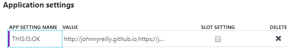
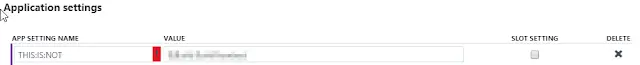

How can we configure an ASP.NET application with nested properties [Azure App Service Web App for Containers](https://azure.microsoft.com/en-gb/services/app-service/containers/) using Application Settings in Azure? Colons don't work.

<!--truncate-->

## Containers on App Service

App Services have long been a super simple way to spin up a web app in Azure. The barrier to entry is low, maintenance is easy. It just works. App Services recently got a turbo boost in the form of [Azure App Service on Linux](https://docs.microsoft.com/en-us/azure/app-service/containers/app-service-linux-intro). Being able to deploy to Linux is exciting enough; but another reason this is notable because [you can deploy Docker images that will be run as app services](https://docs.microsoft.com/en-us/azure/app-service/containers/tutorial-custom-docker-image).

I cannot over-emphasise just how easy this makes getting a Docker image into Production. Yay Azure!

## The Mystery of Configuration

Applications need configuration. ASP.Net Core applications are typically configured by an `appsettings.json` file which might look like so:

```json
{
  "Parent": {
    "ChildOne": "I'm a little teapot",
    "ChildTwo": "Short and stout"
  }
}
```

With a classic App Service you could override a setting in the `appsettings.json` by updating "Application settings" within the Azure portal. You'd do this in the style of creating an Application setting called `Parent:ChildOne` or `Parent:ChildTwo`. To be clear: using colons to target a specific piece of config.


You can read about this approach [here](https://blogs.msdn.microsoft.com/waws/2018/06/12/asp-net-core-settings-for-azure-app-service/). Now there's something I want you to notice; consider the colons below:



If you try and follow the same steps when you're using Web App for Containers / i.e. [a Docker image deployed to an Azure App Service on Linux ](https://docs.microsoft.com/en-us/azure/app-service/containers/app-service-linux-intro) you **cannot** use colons:



When you hover over the error you see this message: `This field can only contain letters, numbers (0-9), periods ("."), and underscores ("_")`. Using `.` does not work alas.

## How do we configure without colons?

It's simple. Where you would use `:` on a classic App Service, you should use a `__` (double underscore) on an App Service with containers. So `Parent__ChildOne` instead of `Parent:ChildOne`. It's as simple as that.
