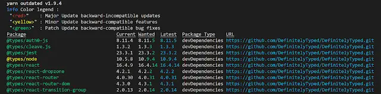

This a tale of things that are and things that aren't. It's a tale of semantic versioning, the lack thereof and heartbreak. It's a story of terror and failing builds. But it has a bittersweet ending wherein our heroes learn a lesson and understand the need for compromise. We all come out better and wiser people. Hopefully there's something for everybody; let's start with an exciting opener and see where it goes...

<!--truncate-->

## Definitely Typed

This is often the experience people have of using type definitions from Definitely Typed:


Specifically, people are used to the idea of semantic versioning and expect it from types published to npm by Definitely Typed. They wait in vain. [I've written before about the Definitely Typed / @types semantic version compromise.](../2017-02-14-typescript-types-and-repeatable-builds/index.md) And I wanted to talk about it a little further as (watching the issues raised on DT) I don't think the message has quite got out there. To summarise:

1. npm is built on top of [semantic versioning](http://semver.org/) and they [take it seriously](https://docs.npmjs.com/getting-started/semantic-versioning). When a package is published it should be categorised as a major release (breaking changes), a minor release (extra functionality which is backwards compatible) or a patch release (backwards compatible bug fixes).

2. Definitely Typed publishes type definitions to npm under the `@types` namespace

3. To make consumption of type definitions easier, the versioning of a type definition package will seek to emulate the versioning of the npm package it supports. For example, right now [`react-router`](https://www.npmjs.com/package/react-router)'s latest version is `4.3.1`. The corresponding type definition [`@types/react-router`](https://www.npmjs.com/package/@types/react-router)'s latest version is `4.0.31`. (It's fairly common for type definition versions to lag behind the package they type.)

If there's a breaking change to the `react-router` type definition then the new version published will have a version number that begins `"4.0."`. If you are relying on semantic versioning this will break you.

## I Couldn't Help But Notice Your Pain

If you're reading this and can't quite believe that @types would be so inconsiderate as to break the conventions of the ecosystem it lives in, I understand. But hopefully you can see there are reasons for this. In the end, being able to use npm as a delivery mechanism for versioned type definitions associated with another package has a cost; that cost is semantic versioning for the type definitions themselves. It wasn't a choice taken lightly; it's a pragmatic compromise.

"But what about my failing builds? Fine, people are going to change type definitions, but why should I burn because of their choices?"

Excellent question. Truly. Well here's my advice: don't expect semantic versioning where there is none. Use specific package versions. You can do that directly with your `package.json`. For example replace something like this: `"@types/react-router": "^4.0.0"` with a specific version number: `"@types/react-router": "4.0.31"`. With this approach it's a specific activity to upgrade your type definitions. A chore if you will; but a chore that guarantees builds will not fail unexpectedly due to changing type defs.

My own personal preference is [yarn](https://yarnpkg.com/lang/en/). Mother, I'm in love with a `yarn.lock` file. It is the alternative npm client that came out of Facebook. It pins the exact versions of all packages used in your `yarn.lock` file and guarantees to install the same versions each time. Problem solved; and it even allows me to keep the semantic versioning in my `package.json` as is.

This has some value in that when I upgrade I probably want to upgrade to a newer version following the semantic versioning convention. I should just expect that I'll need to check valid compilation when I do so. yarn even has it's own built in utility that tells you when things are out of date: `yarn outdated`:



So lovely.

## You Were Already Broken - I Just Showed You How

Before I finish I wanted to draw out one reason why breaking changes can be a reason for happiness. Because sometimes your code is wrong. An update to a type definition may highlight that. This is analogous to when the TypeScript compiler ships a new version. When I upgrade to a newer version of TypeScript it lights up errors in my codebase that I hadn't spotted. Yay compiler!

An example of this is [a PR I submitted to DefinitelyTyped earlier this week](https://github.com/DefinitelyTyped/DefinitelyTyped/pull/28868). This PR changed how `react-router` models the parameters of a `Match`. Until now, an object was expected; the user could define any object they liked. However, `react-router` will only produce `string` values for a parameter. [If you look at the underlying code it's nothing more than an `exec` on a regular expression.](https://github.com/ReactTraining/react-router/blob/34ff1f8077d95edf01e9d5ca8ea4708b8d0290e2/packages/react-router/modules/matchPath.js#L36)

My PR enforces this at type level by changing this:

```ts
export interface match<P> {
  params: P;
  // ...
}
```

To this

```ts
export interface match<Params extends { [K in keyof Params]?: string } = {}> {
  params: Params;
  // ...
}
```

So any object definition supplied must have `string` values (and you don't actually need to supply an object definition; that's optional now).

I expected this PR to break people [and it did](https://github.com/DefinitelyTyped/DefinitelyTyped/issues/28894). But this is a useful break. If they were relying upon their parameters to be types other than strings they would be experiencing some unexpected behaviour. In fact, it's exactly this that prompted my PR in the first place. A colleague had defined his parameters as `number`s and couldn't understand why they weren't behaving like `number`s. Because they weren't `number`s! And wonderfully, this will now be caught at compile time; not runtime. Yay!
