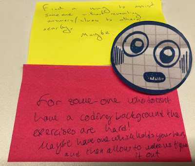
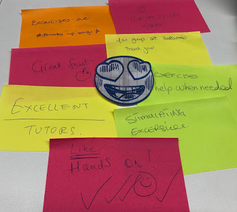

I recently had the good fortune to help run a coding bootcamp. The idea was simple: there are many people around us who are interested in programming but don't know where to start. Let's take some folk who do and share the knowledge.

<!--truncate-->

The bootcamp went tremendously! (Well, I say that... Frankly I had a blast. 😀 )

Coding padawans walked in at the start with laptops and questions, and six weeks later they left with the groundwork of development experience. We ran a session for an hour during lunchtime once a week. Between that, people would have the opportunity to learn online, do exercises and reach out to the facilitators and their fellow apprentices for help.

We'd never done this before. We were student teachers; learning how to teach as we ran the course. So what did we do? Are you curious? Read on, Macduff!

## Code Review

It's worth saying now that we started our course with a plan: the plan was that we would be ready to change the plan. Or to put it another way, we were ready to pivot as we went.

We (by which I mean myself and the other course organisers) are interested in feedback. Sitting back and saying "Hey! We did this thing.... What do you think about it?" Because sometimes your plans are great. Do more of that hotness! But also, not all your ideas pan out... Maybe bail on those guys. Finally, never forget: other folk have brain tickling notions too.... We're with Picasso on this: good artists copy; great artists steal.

We're heavily invested in feedback in both what we build and how we build it. So we were totally going to apply this to doing something we'd never done before. So seized were we of this that we made feedback part of the session. For the last five minutes each week we'd run a short retrospective. We'd stick up happy, sad and "meh" emojis to the wall, hand out post-its and everyone got to stick up their thoughts.

From that we learned what was working, what wasn't and when we were very lucky there were suggestions too. We listened to all the feedback and the next week's session would be informed by what we'd just learned.

## Merging to Master

So, what did we end up with? What did our coding bootcamp look like?

Well, to start each session we kicked off with an icebreaker. We very much wanted the sessions to be interactive experiences; we wanted them to feel playful and human. So an icebreaker was a good way to get things off on the right foot.

The IBs were connected with the subject at hand. For example: Human FizzBuzz. We took the classic interview question and applied it to wannabe coders. We explained the rules, and went round in a circle, each person was the next iteration of the loop. As each dev-in-training opened their mouths they had to say a number or "Fizz" or "Buzz" or "FizzBuzz". (It turns out this is harder than you think; and makes for a surprisingly entertaining parlour game. I intend to do this at my next dinner party.)

After that we covered the rules of the game. (Yup, learning is a game and it's a good 'un.) Certainly the most important rule was this: <u>there are <strong>_no_</strong> stupid questions</u>

. If people think there are, then they might be hesitant to ask. And any question benched is a learning opportunity lost. We don't want that.

"Ask any question!" we said each week. Kudos to the people who have the courage to pipe up. We salute you! You're likely putting voice to a common area of misunderstanding.

Then we'd move onto the main content. The initial plan was to make use of the excellent [EdX Python course](https://www.edx.org/learn/python) Between each session our learners would do a module and then we'd come together and talk around that topic somewhat. Whilst this was a good initial plan it did make the learning experience somewhat passive and less interactive than we'd hoped.

One week we tried something different. It turns out that the amazing [JMac](https://twitter.com/foldr) has quite the skill for writing programming exercises. Small coding challenges that people can tackle independently. JMac put together a [repl.it](https://repl.it/) of exercises and encouraged the class to get stuck in. They did. So much so that at the end of the session it was hard to get everyone's attention to let them know the session was over. They were in the zone. When we did finally disrupt their flow, the feedback was pretty unanimous: we'd hit paydirt.

Consequently, that was the format going onwards. JMac would come up with a number of exercises for the class. Wisely they were constructed so that they gently levelled up in terms of complexity as you went on. You'd get the dopamine hit of satisfaction as you did the earliest challenges that would give you the confidence to tackle the more complex later problems. If peeps got stuck they could ask someone to advise them, a facilitator or a peer. Or they could google it.... Like any other dev.

Having the chance to talk with others when you're stuck is fantastic. You can talk through a problem. The act of doing that is a useful exercise. When you talk through a problem out loud you can unlock your understanding and often get to the point where you can tackle this yourself. This is [rubber duck debugging](https://en.wikipedia.org/wiki/Rubber_duck_debugging). Any dev does this in their everyday; it makes complete sense to have it as part of a coding bootcamp.

We learned that it was useful, very useful, to have repitition in the exercises. Repitition. Repitition. Repitition. As the exercises started each week they would typically begin by recapping and repeating the content covered the previous week. The best way to learn is to practice. It's not for nothing the Karate Kid had to "wax on, wax off".

Finally, we did this together. The course wasn't run by one person; we had a gang! We had three facilitators who helped to run the sessions; JMac, Jonesy and myself. We also had the amazing [Janice](https://twitter.com/janicewarden) who handled the general organisation and logistics. And made us laugh. A lot. This was obviously great from a camaraderie and sharing the load perspective. It turns out that having that number of facilitators in the session meant that everyone who needed help could get it. It's worth noting that having more than a single facilitator is useful in terms of the dynamic it creates. You can bounce things off one another; you can use each other for examples and illustrations. You can crack each other up. Done well it reduces the instructor / learner divide and that breaking down of barriers is something worth seeking.

## RTM

We've run a bootcamp once now. Where we are is informed by the experience we've just had. A different group of learners may well have resulted in a slightly different format; though I have a feeling not overly dissimilar. We feel pretty sure that what we've got is pretty solid. That said, just as the attendees are learning about development, we're still learning about learning!
