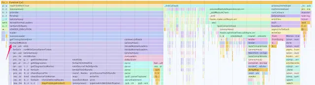

It all started with a GitHub issue. [Ernst Ammann reported](https://github.com/namics/webpack-config-plugins/issues/24):

<!--truncate-->

> Without the thread-loader, compilation takes three to four times less time on changes. We could remove it.

If you're not aware of the [`webpack-config-plugins`](https://github.com/namics/webpack-config-plugins) project then I commend it to you. Famously, webpack configuration can prove tricky. `webpack-config-plugins` borrows the idea of presets from Babel. It provides a number of pluggable webpack configurations which give a best practice setup for different webpack use cases. So if you're no expert with webpack and you want a good setup for building your TypeScript / Sass / JavaScript then `webpack-config-plugins` has got your back.

One of the people behind the project is the very excellent [Jan Nicklas](https://github.com/jantimon) who is well known for his work on the [`html-webpack-plugin`](https://github.com/jantimon/html-webpack-plugin).

It was Jan who responded to Ernst's issue and decided to look into it.

## All I Want For Christmas is Faster Builds

Everyone wants fast builds. I do. You do. We all do. `webpack-config-plugins` is about giving these to the user in a precooked package.

There's a webpack loader called [`thread-loader`](https://github.com/webpack-contrib/thread-loader) which spawns multiple processes and splits up work between them. It was originally inspired by the work in the happypack project which does a similar thing.

I wrote [a blog post](https://medium.com/p/83cc568dea79) some time ago which gave details about ways to speed up your TypeScript builds by combining the [`ts-loader`](https://github.com/TypeStrong/ts-loader) project (which I manage) with the [`fork-ts-checker-webpack-plugin`](https://github.com/Realytics/fork-ts-checker-webpack-plugin) project (which I'm heavily involved with).

That post was written back in the days of webpack 2 / 3. It advocated use of both `happypack` / `thread-loader` to drop your build times even further. As you'll see, now that we're well into the world of webpack 4 (with webpack 5 waiting in the wings) the advantage of `happypack` / `thread-loader` are no longer so profound.

`webpack-config-plugins` follows the advice I set out in my post; it uses `thread-loader` in its pluggable configurations. Now, back to Ernst's issue.

## `thread-loader`: Infinity War

Jan quickly identified the problem. He did that rarest of things; he read the documentation which said:

```js
// timeout for killing the worker processes when idle
      // defaults to 500 (ms)
      // can be set to Infinity for watching builds to keep workers alive
      poolTimeout: 2000,
```

The `webpack-config-plugins` configurations (running in watch mode) were subject to the thread loaders being killed after 500ms. They got resurrected when they were next needed; but that's not as instant as you might hope. Jan then did a test:

```sh
(default pool - 30 runs - 1000 components ) average: 2.668068965517241
(no thread-loader - 30 runs - 1000 components ) average: 1.2674137931034484
(Infinity pool - 30 runs - 1000 components ) average: 1.371827586206896
```

This demonstrates that using `thread-loader` in watch mode with `poolTimeout: Infinity` performs significantly better than when it defaults to 500ms. But perhaps more significantly, not using `thread-loader` performs even better still.

## "Maybe You've Thread Enough"

When I tested using `thread-loader` in watch mode with `poolTimeout: Infinity` on my own builds I got the same benefit Jan had. I also got _even_ more benefit from dropping `thread-loader` entirely.

A likely reason for this benefit is that typically when you're developing, you're working on one file at a time. Hence you only transpile one file at a time:



So there's not a great deal of value that `thread-loader` can add here; mostly it's twiddling thumbs and adding an overhead. [To quote the docs:](https://github.com/webpack-contrib/thread-loader/blob/master/README/index.md#usage)

> Each worker is a separate node.js process, which has an overhead of \~600ms. There is also an overhead of inter-process communication.
>
> Use this loader only for expensive operations!

Now, my build is not your build. I can't guarantee that you'll get the same results as Jan and I experienced; but I would encourage you to investigate if you're using `thread-loader` correctly and whether it's actually helping you. In these days of webpack 4+ perhaps it isn't.

There are still scenarios where `thread-loader` still provides an advantage. It can speed up production builds. It can speed up the initial startup of watch mode. [In fact Jan has subsequently actually improved the `thread-loader` to that specific end.](https://github.com/webpack-contrib/thread-loader/pull/52) Yay Jan!

If this is all too much for you, and you want to hand off the concern to someone else then perhaps all of this serves as a motivation to just sit back, put your feet up and start using [`webpack-config-plugins`](https://github.com/namics/webpack-config-plugins) instead of doing your own configuration.
