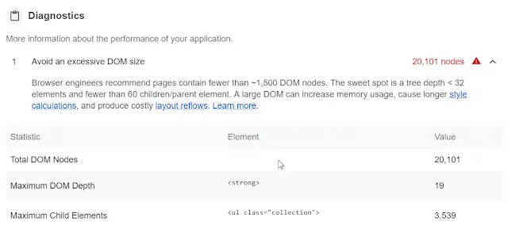

I'm somewhat into code golf. Placing restrictions on what you're "allowed" to do in code and seeing what the happens as a result. I'd like to share with you something that came out of some recent dabblings.

<!--truncate-->

Typically I spend a good amount of time playing with TypeScript. Either working on build tools or making web apps with it. (Usually with a portion of React on the side.) This is something different.

I have a side project on the go which is essentially a mini analytics dashboard. For the purposes of this piece let's call it "StatsDash". When I was starting it I thought: let's try something different. Let's build StatsDash with HTML _only_. The actual HTML is hand cranked by me and generated in ASP.Net Core / C# using a combination of LINQ and string interpolation. (Who needs Razor? 😎) I'll say it's pretty fun - but the back end is not what I want to focus on.

I got something up and running pretty quickly in pure HTML. The first lesson I learned was this: HTML alone is hella ugly. So I relaxed my criteria; I allowed CSS to come play as long as I didn't have to write any / much myself. There followed some experimentation with different CSS frameworks. For a while I rolled with Bootstrap (old school!), then Bulma and finally I settled on [Materialized](https://materializecss.com/). Materialized is a heavily inspired by Google's Material Design and is hence quite beautiful. With my HTML and Materialize's CSS we were rolling. Beautiful stats - no JS.

## "Oh All Right; Just a Splash"

Lovely as things were, StatsDash quickly got to the point where there was too much information on the screen. It was time to make some changes. If data is to convey a message, it must first be comprehensible.

I needed a way to hide and show data as people interacted with StatsDash. I wanted to achieve this _without_ starting to render on the client side and also without going back to the server each time.

If you want interactions in your UI all roads lead to JS. It's certainly possible to do some tricks with CSS but that's a round of code golf I'm ill equipped to play. So, I took a look at what Materialized had to offer. Usefully it has a [Modal](https://materializecss.com/modals.html) component. With that in play I'd be able to separate the detailed information into different modals which the users could show and hide as required. Perfect!

It required a little JS. What's a line or two between friends? Dear reader, I compromised once more.

## The DOM Bunker

With my handy modals, StatsDash was now a one stop shop for a great deal of information. Info which took the form of DOM nodes. Lots of them. And by "lots of them" I want you to think along the lines of "space is big, really big...".

This was impacting users. Clicking to open a modal resulted in a noticeable lag. It would take 2+ seconds for the browser to respond. Users found themselves clicking multiple times; wondering why nothing seemed to occur. In the end the modal would shuffle into view. However, this wasn't the best experience. The lack of responsiveness was getting in the way of users enjoying all StatsDash had to offer.

Running an audit of StatsDash in Chrome DevTools there was no doubt we had a DOM problem:



What to do? I still didn't want to go back to the server on each click in StatsDash. And I didn't want to start writing rendering code on the client as well either. I have in the past mixed client and server side rendering and I know well that it's a first class ticket to a confusing codebase.

## Smuggling DOM in Templates

There's a mechanism that supports this use case directly: the `&lt;template&gt;` element. [To quote MDN](https://developer.mozilla.org/en-US/docs/Web/HTML/Element/template):

> The HTML Content Template (`&lt;template&gt;`) element is a mechanism for holding client-side content that is not to be rendered when a page is loaded but may subsequently be instantiated during runtime using JavaScript.

> Think of a template as a content fragment that is being stored for subsequent use in the document.

This is _exactly_ what I'm after. I can keep my rendering server side, but instead wrap content that isn't immediately visible to users inside a `&lt;template&gt;` element and render that only when users need it.

So in the case of my modals (where most of my DOM lives), I can tuck the contents of each modal into a `&lt;template&gt;` element. Then, when the user clicks to open a modal we move that template content into the DOM so they can see it. Likewise, as they close a modal we can clear out the modal's DOM content to ease the load on the dear old browser.

## "That Sounds Complicated..."

It's not. Let me show you how easily this is accomplished. First of all, wrap all your modal contents into `&lt;template&gt;` elements. They should look a little something like this:

```html
<div>
  <button data-target="modalId" class="btn modal-trigger">
    Open the Modal!
  </button>

  <template>
    <!--
        loads of DOM nodes
        -->
  </template>

  <div id="modalId" class="modal modal-fixed-footer"></div>
</div>
```

Next, where you initialise your modals you need to make a little tweak:

```js
document.addEventListener('DOMContentLoaded', function () {
  M.Modal.init(document.querySelectorAll('.modal'), {
    onOpenStart: (modalDiv) => {
      const template = modalDiv.parentNode.querySelector('template');

      modalDiv.appendChild(document.importNode(template.content, true));
    },
    onCloseEnd: (modalDiv) => {
      while (modalDiv.firstChild) {
        modalDiv.removeChild(modalDiv.firstChild);
      }
    },
  });
});
```

That's it! As you can see, before we open our modals, the `onOpenStart` callback will fire which creates the actual DOM elements based upon the `template`. And when the modals finish closing the `onCloseEnd` callback runs to remove those DOM elements once more.

For this minimal change, the client gets a dramatically different user experience. StatsDash went from super laggy to satisfyingly fast. Using `template`s, The number of initial DOM nodes dropped from more than _20,000_ to _200_. That's right 💯 times smaller!

## Do It Yourself

The code examples above rely upon the Materialize modals. However the principles used here are broadly applicable. It's easy for you to take the approach outlined here and apply it in a different situation.

If you're interested in some of the other exciting things you can do with templates then I recommend [Eric Bidelman's post on the topic](https://www.html5rocks.com/en/tutorials/webcomponents/template/).
