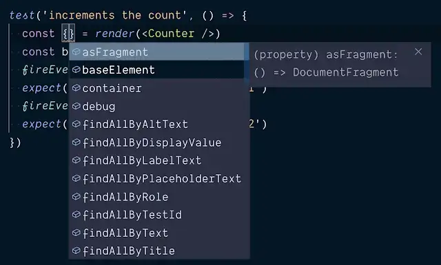

I did ponder calling this post "how to enable a good TypeScript developer experience for npm modules that aren't written in TypeScript"... Not exactly pithy though.

<!--truncate-->

Definitely Typed is the resource which allows developers to use TypeScript with existing JavaScript libraries that ship without their own type definitions.

DT began as a way to enable interop between JS and TS. When DT started, everything on npm was JavaScript. Over time it has become more common for libraries (eg [Mobx](https://github.com/mobxjs/mobx) / [Angular](https://github.com/angular/angular)) to be written (or rewritten) in TypeScript. For publishing, they are compiled down to JS with perfect type definitions generated from the TypeScript alongside the compiled JavaScript. These libraries do not need to exist in Definitely Typed anymore.

Another pattern that has emerged over time is that of type definitions being removed from Definitely Typed to live and be maintained alongside the libraries they support. An example of this is [MomentJS](https://github.com/moment/moment).

This week, I think for the first time, there emerged another approach. [Kent C Dodds](https://kentcdodds.com/)' `react-testing-library` had started out with the MomentJS approach of hosting type definitions alongside the JavaScript source code. [Alex Krolic raised a PR which proposed removing the type definitions from the RTL repo in favor of having the community maintain them at DefinitelyTyped.](https://github.com/testing-library/react-testing-library/pull/437)

I'll directly quote Kent's explanation of the motivation for this:

> We were getting a lot of drive-by contributions to the TypeScript typings and many pull requests would either sit without being reviewed by someone who knows TypeScript well enough, or be merged by a maintainer who just hoped the contributor knew what they were doing. This resulted in a poor experience for TypeScript users who could experience type definition churn and delays, and it became a burden on project maintainers as well (most of us don't know TypeScript very well). Moving the type definitions to DefinitelyTyped puts the maintenance in much more capable hands.

I have to admit I was reticent about this idea in the first place. I like the idea that types ship with the package they support. It's a good developer experience; users install your package and it works with TypeScript straight out of the box. However Alex's PR addressed a real issue: what do you do when the authors of a package aren't interested / equipped / don't have the time to support TypeScript? Or don't want to deal with the noise of TypeScript related PRs which aren't relevant to them. What then?

Alex was saying, let's not force it. Let the types and the library be maintained separately. This can and is done well already; React is a case in point. The React team does not work on the type definitions for React, that's done (excellently) by a crew of dedicated React lovers in Definitely Typed.

It's a fair point. The thing that was sad about this move was that the developer experience was going to have more friction. Users would have to `yarn add -D @testing-library/react` and then subsequently `yarn add -D @types/testing-library__react` to get the types.

This two step process isn't the end of the world, but it does make it marginally harder for TypeScript users to get up and running. It reduces the developer joy. As a side note, this is made more unlovely by `@testing-library/react` being a scoped package. [Types for a scoped package have a quirky convention for publishing.](https://stackoverflow.com/questions/47296731/how-can-i-install-typescript-declarations-for-scoped-namespaced-packages-via-ty) A fictional scoped package of `@foo/bar` would be published to npm as: `@types/foo__bar`. This is functional but non-obvious; it's tricky to discover. A two step process instead of a one step process is a non-useful friction that it would be great to eliminate.

Fortunately, Kent and [Daniel K](https://github.com/FredyC) had one of these moments:


Kent suggested that at the same time as dropping the type definitions that were shipped with the library, we try making `@types/testing-library__react` a dependency of `@testing-library/react`. This would mean that people installing `@testing-library/react` would get `@types/testing-library__react` installed _automatically_. So from the developers point of view, it's as though the type definitions shipped with the package directly.

To cut a long story short reader, that's what happened. If you're using `@testing-library/react` from 9.1.2 you're getting Definitely Typed under the covers. This was [nicely illustrated by Kent](https://github.com/testing-library/react-testing-library/pull/437#issuecomment-521763117) showing what the TypeScript consumption experience looked like before the Definitely Typed switch:



And here's what it looked like after:


Identical! i.e it worked. I grant you this is one of the more boring before / after comparisons there is… But hopefully you can see it demonstrates that this is giving us exactly what we need.

To quote Kent once more:

> By adding the type definitions to the dependencies of React Testing Library, the experience for users is completely unchanged. So it's a huge improvement for the maintenance of the type definitions without any breaking changes for the users of those definitions.

This is clearly an approach that's useful; it adds value. It would be tremendous to see other libraries that aren't written in TypeScript but would like to enable a good TypeScript experience for those people that do use TS also adopting this approach.

## Update: Use a Loose Version Range in `package.json`

When I [tweeted this article](https://twitter.com/johnny_reilly/status/1162843916661592064) it prompted this helpful response from [Andrew Branch](https://twitter.com/atcb) of the TypeScript team:

> \> use a loose version range This is my advice as well and should probably be mentioned in the article TBH.
>
> — Kent C. Dodds (@kentcdodds) [August 18, 2019](https://twitter.com/kentcdodds/status/1162876792287293440?ref_src=twsrc%5Etfw)

Andrew makes the useful point that if you are adding support for TypeScript via an `@types/...` dependency then it's wise to do so with a loose version range. [In the case of RTL we did it like this:](https://github.com/testing-library/react-testing-library/blob/c4ba755e42938018ec67dbc716037cfafca15e03/package.json#L46)

```json
"@types/testing-library__react": "^9.1.0"
```

i.e. Any type definition with a version of `9.1` or greater (whilst still lower than `10.0.0`) is considered valid. You could go even looser than that. If you really don't want to think about TypeScript beyond adding the dependency then a completely loose version range would do:

```json
"@types/testing-library__react": "*"
```

This will always install the latest version of the `@types/testing-library__react` dependency and (importantly) allow users to override if there's a problematic `@types/testing-library__react` out there. This level of looseness is not really advised though. As in the scenario when a library (and associated type definitions) do a major release, users of the old major would get the wrong definitions by default when installing or upgrading (in range).

Probably the most helpful approach is the approach followed by RTL; fixing the major version but allowing all minor and patch releases _inside_ a major version.

## Updated 2: Further Discussions!

The technique used in this blog post sparked an interesting conversation with members of the TypeScript team when it was applied to [`https://github.com/testing-library/jest-dom`](https://github.com/testing-library/jest-dom). [The conversation can be read here](https://github.com/testing-library/jest-dom/issues/123#issuecomment-523586977).
