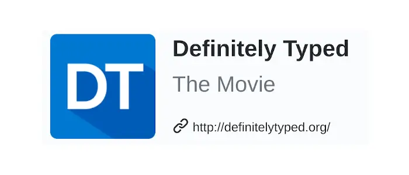
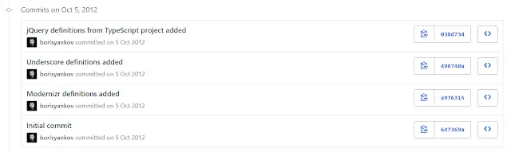
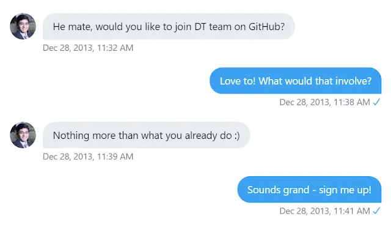
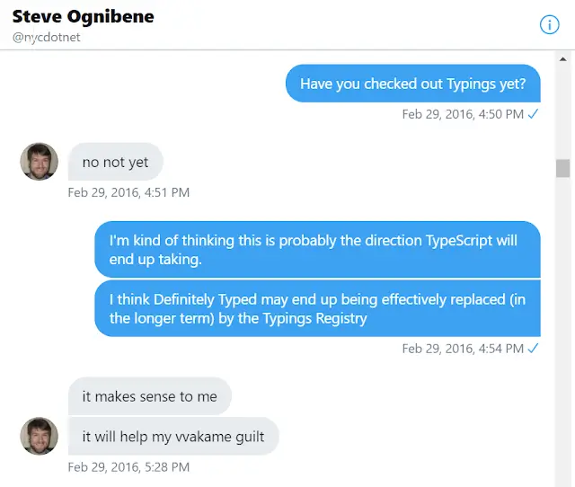
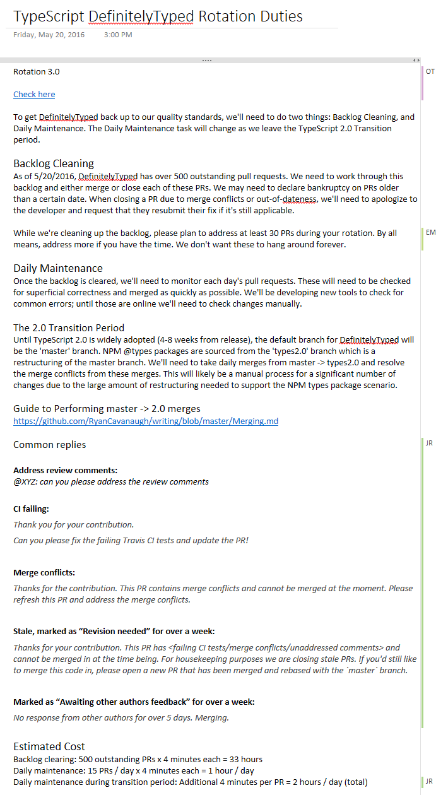
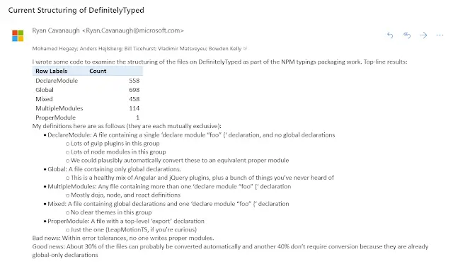
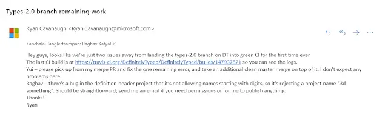

This post is a a little different from most that sit on my site. It's the story of the Definitely Typed project, of which I was an early member. It had a seismic impact on the development of TypeScript. When exchanging messages with [Andrew Branch](https://github.com/andrewbranch) (member of the TypeScipt team), I realised it was an untold story, and perhaps I should tell it, before I forget! So I did, and this is it.

I named it "Definitely Typed: The Movie" as the name entertained me. Little did I know, that a few years later, a documentary would be made about TypeScript, and I'd be in it; in part thanks to writing this history. You can see [more about that here](../2023-09-20-typescript-documentary/index.md).

For now, back to Definitely Typed...



<!--truncate-->

## Preface

I'd like to tell you a story. It's the tale of the ecosystem that grew up around a language: TypeScript. TypeScript is, for want of a better description, JavaScript after a trip to Saville Row. Essentially the same language, but a little more together, a little less wild west. JS with a decent haircut and a new suit. These days, the world seems to be written in TypeScript. And when you pause to consider just how young the language is, well, that's kind of amazing.

Who could have predicted it would end up like this? When I was a boy I remember coming down the stairs in my childhood home. Shuffling to the edge of each step on my bottom before thumping down to the one beneath. When I look at those same stairs now they're so small. I barely notice the difference between one step and the next. But back then each step seemed giant, each one so far apart. Definitely Typed had any number of steps in its evolution. They all seemed so significant then; whereas now they're just a memory. Let's remember together…

## Prolog(ue)

When it was first unveiled to the world by Anders Hejlsberg back in 2012, there was nothing to suggest TypeScript was going to be seismic in its effects. The language brought two important things to the table. First of all, the ability to write JavaScript with optional static typing (imagine this as "belts and braces" for JS). The second feature was interoperability with existing JavaScript.

The reason TypeScript has the traction that it does, is a consequence of the latter feature. The JavaScript ecosystem was already a roaring success by 2012. Many useful libraries were out there, authored in vanilla JavaScript. jQuery, Backbone, Knockout were all going concerns. People were building things.

Wisely, having TypeScript able to work with existing JavaScript libraries was a goal of the language right from the off. This made sense; otherwise it would have been like unveiling Netflix to the world whilst saying "sorry you can't use a television set to watch this". Remember, JS was great as is - people wanted static typing so they could be more productive and so they could sleep better at night. ("Oh wait, did I write that unit test to check all the properties? Dammit, it's 3am!") If TypeScript had hove onto the scene requiring that everything was written _in_ TypeScript then I would not be writing this. It didn't.

Interoperability was made possible by the concept of "type definitions". Analogous to header files in C, these are TypeScript files with a `.d.ts` suffix that tell the compiler about an existing JavaScript library which is in scope. This means you can write TypeScript and use jQuery or [insert your favourite library name here]. Even though they are not written in TypeScript.

At the time of the initial TypeScript announcement (v0.8.1) there was no concept of a repository of type definitions. I mean, there was every chance that TypeScript wasn't going to be a big deal. Success wasn't guaranteed. But it happened. You're reading this in a world where Definitely Typed is one of the most popular repos on GitHub and where type definitions from it are published out to npm for consumption by developers greedy for static types. A world where the TypeScript team has pretty much achieved its goal of "types on every desk".

I want to tell you the story of the history of type definitions in the TypeScript world. I'm pretty well placed to do this since I've been involved since the early days. Others involved have been kind enough to give me their time and tell me their stories. There's likely to be errors and omissions, and that's on me. It's an amazing tale though; I'm fortunate to get to tell it.

## The First Type Definition

I was hanging out for something like TypeScript. I'd been busily developing rich client applications in JS and, whilst I loved the language, I was dearly missing static typing. All the things broke all of the time and I wanted help. I wanted a compiler to take me by the hand and say "hey John, you just did a silly thing. Don't do it John; you'll only be filled with regret...". The TypeScript team wrote that compiler.

When TypeScript was announced, it was important that the world could see that interop with JS was a first class citizen. Accordingly, a jQuery type definition was demonstrated as well. At the time, jQuery was the number one JavaScript library downloaded on the internet. So naturally it was the obvious choice for a demo. The type definition was fairly rough and ready but it worked. [You can see Anders Hejlsberg showing off the jQuery definition 43 minutes into this presentation introducing TypeScript.](https://youtu.be/3dqZW_DqHIQ?t=2584)

Consumption was straightforward, if perhaps quirky. You took the `jquery.d.ts` file, copied it into your project location. Back then, to let the compiler know that a JS library had come to the party you had to use a kind of comment pragma in the header of your TypeScript files. For example: `/// <reference path="jquery/jquery.d.ts" />`. This let TypeScript know that the type definition living at that path was relevant for the current script and it should scope it in.

There was no discussion of “how do we type the world”? Even if they wanted to, the TypeScript team didn't really have the resources at that point to support this. They'd got as far as they had on the person power of four or five developers and some testers as well. There was a problem clearly waiting to be solved. As luck would have it, in Bulgaria a man named Boris Yankov had been watching the TypeScript announcement.

## Boris Yankov


Boris Yankov was a handsome thirty year old man, living in the historic Bulgarian city of Plovdiv. He was swarthy with dark hair; like Ben Affleck if had been hanging out in Eastern Europe for a couple of years.

Boris was a backend developer who'd found himself doing more and more frontend. More JavaScript. He was accustomed to C# on the backend with static typing a-gogo. From his point of view JS was brittle. It was super easy to break things and have no idea until runtime that you'd done so. It seemed so backward. He was ready for something TypeScript shaped.

"What people forget is how different it was back then. Microsoft made this announcement, but probably most of the people that were listening were part of the MS ecosystem. I certainly was. Remember, back then if you had a Mac or did Linux you probably didn't think about MS too much."

Boris thought TypeScript just seemed like this interesting and weird thing that Microsoft were doing. He was excited by types; he was missing them and there was a real need there. A problem to solve. There were already people trying to address this. But the attempts so far had been underwhelming. Boris had encountered Google Closure Compiler; a tool built by Google which, amongst other things, introduces some measure of type safety to JavaScript by reading annotations in JSDoc format. Boris viewed GCC as a tentative first step. [One which lead the way for things like TypeScript and Flow to follow.](https://github.com/google/closure-compiler/wiki/Annotating-JavaScript-for-the-Closure-Compiler)

The other aspect of TypeScript that excited Boris was transpilation. Transpilation is the term coined to describe what TypeScript does when it comes to emit output. It takes in TypeScript and pumps out JavaScript. The question is: what sort of JavaScript? One choice the TypeScript team could have made was just having the compiler stripping out types from the codebase. If it worked that way then you'd get out the JavaScript equivalent of the TypeScript you wrote. You wrote a `class`? TypeScript emits a `class`; just; one shorn of types and interfaces.

The TypeScript team made a different choice. They wrote the compiler such that the user could write ES6 style TypeScript syntax and have the TypeScript compiler transpile that down to ES5 or even ES3 syntax. This made TypeScript a much more interesting proposition than it already was, for a couple of reasons.

ES6 had been in the works for some time at this point. The release was shaping up to be the biggest incremental change to JavaScript that had so far happened. Or that would ever happen. Prior to this, JavaScript had experienced no small amount of tension and disagreement as it sought to evolve and develop. These played out in the form of the abandoned fourth edition of the language. There were arguments, harsh words, public disagreements and finally a failure to ship ECMAScript 4. In an alternate universe this was the end of the road for JavaScript. However, in our universe JavaScript got another throw of the dice.

It's telling that ES5 was for a long time known also as ES3.1; reflecting that it was initially planned to be the stepping stone between ES3 and ES4. In reality it ended up being the stepping stone between ES3 and ES6. As it turned out, it was a vital one too, [it allowed the TC39 to recalibrate after a very public shelving of plans.](https://en.m.wikipedia.org/wiki/ECMAScript)

The band was back together (albeit with a new rhythm section) and ES6 was going to be _massive_. JavaScript was going to get new constructs such as `Map`, `Set`, new scoping possibilities with `let` and `const`, `Promise`s which paved the way for new kinds of async programming, the contentious `class`es…. And who can forget where they were when they first heard about "fat" arrow functions?

People salivated at the idea of it all. Such new shiny toys! But how could we use them? Whilst all this new hotness was on the way, where could you actually run your new style code? Complete browser implementations of ES6 wouldn't start to materialise until 2018. Given the slowness of people to upgrade and the need to support the lowest common denominator of browser this could have meant that all the excitement was trapped in a never tomorrow situation.

Back to TypeScript. The team had a solution for this issue. In their wisdom, the TypeScript team allowed us to write ES6 TypeScript and the compiler could (with some limitations) transpile it down to ES3 JavaScript. The audacity of this was immense. The TypeScript team brought the future back to the past. What's more, they made it work in Internet Explorer 6. Now that's rock'n'roll. It's nothing short of miraculous!

The significance of transpilation to TypeScript cannot be overstated.

You might be thinking to yourself, "that's just Babel, right?" Right. It's just that Babel didn't exist then. 6to5 was still an idea waiting for Sebastian McKenzie to think of. Even if you were kind of "meh" on types, the attraction of using a tool which allowed you to use new JavaScript constructs without breaking your customers was a significant draw. People may have come for types, but once they'd experienced the joy of a lexically bound `this` in a fat arrow function they were _never_ going back.

Success has many parents. TypeScript is a successful project. One reason for this is that it's an excellent product that fills a definite need. Another reason is one that can't be banked upon; timing. TypeScript has enjoyed phenomenal timing. Appearing just when JavaScript was going off like a rocket and having the twin benefits of types and future JS today when nothing else offered anything close, that's perfect timing. It got people's curiosity. Now it got Boris's attention.

## Definitely Typed


Boris had been feeling unproductive. He would build applications in JS and watch them unaccountably break as he made simple tweaks to them. He was constantly changing things, breaking them, fixing them and hoping he hadn't broken something else along the way. It was exhausting. He saw the promise in what TypeScript was offering and decided to give it a go.

It was great. He fired up Visual Studio and converted a `.js` file to end with the mystical TypeScript suffix of `.ts`. In front of his eyes, red squiggly lines started to appear here and there in his code. As he looked at the visual noise he could see this was TypeScript delivering on its promise. It was finding the bugs he hadn't spotted. These migrations were also addictive; the more information you could feed the compiler, the more problems it found. Boris felt it was time to start writing type definitions, whatever they were.

Boris quickly learned how to write a type definition and set to work. Most libraries weren't well documented and so he found himself reading the source code of libraries he used in order that he could write the definitions. At first, the definitions were just files dropped in his ASP.NET MVC projects that he copied around. That wasn't going to scale; there needed to be somewhere he could go to grab type definitions when he needed them. And so on October 5th 2012 he created a repository under his profile at GitHub called "DefinitelyTyped": [https://github.com/DefinitelyTyped/DefinitelyTyped/commit/647369a322be470d84f8d226e297267a7d1a0796](https://github.com/DefinitelyTyped/DefinitelyTyped/commit/647369a322be470d84f8d226e297267a7d1a0796)

Boris took his type definitions and put them into this repository. Were you ever curious what the first definition added was? Close your eyes and think... You might imagine it was the (then number one JavaScript library on the web) jQuery. In fact it was Modernizr. Then Underscore followed, and then jQuery. Take a look:

[https://github.com/DefinitelyTyped/DefinitelyTyped/commits?after=4a4cf23ff4301835a45bb138bbb62bf5f0759255+699&author=borisyankov](https://github.com/DefinitelyTyped/DefinitelyTyped/commits?after=4a4cf23ff4301835a45bb138bbb62bf5f0759255+699&author=borisyankov)



It wasn't complicated; it was just a folder with subfolders underneath; each folder representing a project. One for jQuery, one for jQuery UI, one for Knockout.... You get the idea. It's not so different now.

Boris had laid simple but dependable foundations. Definitely Typed had been born.

## How Do You Test a Type Definition?

Boris was careful too. Right from the first type definition he added tests alongside them. Now tests for a type definition were a conundrum. How do you write a test for interfaces that don't exist in the runtime environment? Code that is expunged as part of the compilation process. Well, the answer Boris came to was this: a compilation test.

Someone once said: compilation is the first unit test... But it's a doozy. They're right. The value you get from compilation, from a computer checking the assertions your code makes, is significant. Simply put, it takes a large amount of tests to get the same level of developer confidence. Computers are wonderful at attention to detail in a way that puts even the most anally retentive human being to shame.

So if Boris had written a definition called `mylib.d.ts`, he'd write a file that exercises this type definition. A `mylib.tests.ts` if you will. This file would contain code that exercises the type definition in the way that it should correctly be used. This is code that will never be executed in the way that tests normally are; a test program is never actually run. Rather these tests exist solely for compilation time. (In much the same way that TypeScript types only exist for compilation time.) Boris's plan was this: no compilation errors in `mylib.tests.ts` represents passing tests. Compilation errors in `mylib.tests.ts` represents failing tests. It was functional, brutal and also beautiful in it's simplicity.

So, imagine your definition looked like this:

```ts
declare function turnANumberIntoAString(
  numberToMakeStringOutOf: number,
): string;
```

You might write a compilation test that looks like this:

```ts
const itIsAString: string = turnANumberIntoAString(42);
```

This test ensures that you can use your function in the way you'd expect. It returns the types you'd desire (a `string` in this case) and it accepts the parameters you'd expect (a single `number` for this example). If someone changed the definition in future, such that a different type was returned or a different set of parameters was required it would break the test. The test code wouldn't compile anymore. That's the nature of our "test". It's blunt but effective.

This is the very first test committed to Definitely Typed; a test for Modernizr.

[https://github.com/DefinitelyTyped/DefinitelyTyped/blob/a976315cacbcfc151d5f57b25f4325dc7deca6f2/Tests/modernizr.ts](https://github.com/DefinitelyTyped/DefinitelyTyped/blob/a976315cacbcfc151d5f57b25f4325dc7deca6f2/Tests/modernizr.ts)

This idea represents what tests look like throughout Definitely Typed today. They're now "run" as part of Continuous Integration and type definitions are tested in concert with one another to ensure that a change to one type definition doesn't break another. But there is nothing fundamentally different in place today to what Boris originally came up with.

## Independence

Very quickly, Definitely Typed became a known project. People like Steve Fenton (author of the first book about TypeScript) were vocal supporters of the project. The TypeScript team talked up the project and were entirely supportive of its existence. In fact, at every given opportunity Anders Hejlsberg would sing its praises. For a while you could guarantee that any TypeScript talk by Anders would include a variant of "this guy called Boris started a project called Definitely Typed". The impression he gave was that he was kind of amazed, and thoroughly delighted, the project existed.

The TypeScript team were completely uninvolved with Definitely Typed. That in itself is worth considering. The perception of Microsoft by developers generally in 2012 was at best, highly suspicious. "Embrace, extend, extinguish" - a strategy attributed to MS was very much a current perspective. This was born out in online comments and conversations at meetups. [The Hacker News comments on the TypeScript release were a mixed bag.](https://news.ycombinator.com/item?id=4597716) The reaction on social media was rather less generous. Certainly it was harsh enough to prompt Scott Hanselman to write something of [a defence of TypeScripts right to exist](https://www.hanselman.com/blog/WhyDoesTypeScriptHaveToBeTheAnswerToAnything.aspx).

Given that TypeScript had arrived with the promise of transforming the JavaScript developer experience, the developer community was understandably cautious. Was Microsoft doing a good or ill? Could they be trusted? There were already signs that MS was changing. For example, it had been shipping open source libraries such as jQuery with ASP.Net MVC for some time. Microsoft was starting to engage with the world of open source software.

How Microsoft interacted with the (very open source driven) JS community was going to be key to the success (or not) of TypeScript. What happened with the establishment of Definitely Typed very much indicated TypeScripts direction of travel.

On day one of its existence, Boris took type definitions written by Microsoft and made them available via Definitely Typed. A ballsy move. It would have been completely possible for MS to object to this. They didn't.

People like Diullei Gomes started submitting pull requests to improve the existing definitions and add new ones. Diullei even wrote the first command line tooling which allowed people to install type definitions: TSD. Within a surprisingly short period, DT had become the default home of type definitions on the web. There were briefly alternative Definitely Typed styled collections of type definitions elsewhere on GitHub but they didn't last.

This all happened completely independently of the TypeScript team. Definitely Typed existing actually allowed TypeScript itself to prosper. It was worth persevering with this bleeding edge language because of the interoperability Definitely Typed was providing to the community. So the hands off attitude of MS was both surprising and encouraging. It showed trust of the community; something that hadn't hitherto been a commonly noted characteristic of MS.

Boris started adding contributors to Definitely Typed to help him with the work. Definitely Typed was no longer a one man band, it had taken an important step. It was built and maintained by an increasing number of creative and generous people. All motivated by a simple aim: the best developer experience when working with TypeScript and existing JS libraries.

## Basarat Ali Syed


Basarat Ali Syed was a 27 year old who had recently moved to Melbourne, Australia from Pakistan. You might know of him for a number of reasons, not least being the TypeScript equivalent of Jon Skeet. That, incidentally, is not a coincidence. Basarat had watched Jon Skeet's impressive work, being _the_ gold standard in C# answers and thought "there's something worth emulating here".

Bas was working for a startup who had a JS frontend. About six months before TypeScript was announced to the world he watched Anders Hejlsberg do a presentation on JavaScript which included Anders saying to the audience "don't you just wish you had type safety?" with a twinkle in his eye. TypeScript was of course well underway by this time; just not yet public. Bas remembered the comment and, when TypeScript was announced, he was ready. He made it his personal mission to be the goto person answering questions about TypeScript on Stack Overflow.

In those early days of TypeScript, if you put a question about TypeScript onto Stack Overflow there was a very good chance that Bas would answer it. And Bas was more helpful than your typical SO answerer. Not only would he provide helpful commentary and useful guidance, he would often find him answering "yeah, the problem isn't your code, it's the type definition. It needs improvement. In fact, I've raised a PR to fix it here…"

Boris saw the drip, drip of Basarat PRs turning into a flood. So, very quickly, he invited Basarat join Definitely Typed. Now Bas could not just suggest changes, he could ensure they were made. Step by step the quality of type definitions improved.

Basarat describes himself as a "serial OSS contributor and mover on-er". It's certainly true. As well as his Stack Overflow work, he's been someone involved in the early days of any number of open source projects. Not just Definitely Typed. Bas also worked on the TypeScript port of the JavaScript task runner; Grunt TS. He met up with Pete Hunt (he of React) at a Decompress conference and together they hacked together a POC webpack TypeScript loader. (That POC ultimately lead to James Brantly creating ts-loader which I maintain.) Bas wrote the atom-typescript plugin which offers first class support for TypeScript in Atom. Not content with that he went on to write a full blown editor of his own called alm-tools.

This is not an exhaustive list of his achievements and already I'm tired. Besides this he wrote the TypeScript Deep Dive book and the VS Code TypeScript God extension. And more.

Bas had the level of self knowledge required to realise that getting others involved was key to the success of open source projects. Particularly given that he knew he had a predilection to eventually move on, to work on other things. So Bas kept his eyes open and welcomed in new maintainers for projects he was working on. Bas' actions in particular were to be crucial. Bas grew the Definitely Typed team; he invited others in, he got people involved.

On December 28th 2013 Basarat decided that a regular contributor to Definitely Typed might be a potential team member. Bas opened up Twitter and sent a Direct Message to John Reilly.



## John Reilly


That's me. Or [johnny_reilly on Twitter](https://twitter.com/johnny_reilly), [johnny_reilly on Fosstodon](https://fosstodon.org/@johnny_reilly) and [johnnyreilly on GitHub](https://github.com/johnnyreilly). Relatively few people call me Johnny. I'm named that online because back when I applied for an email address, someone had already bagsied `johnreilly@hotmail.com`. (Hotmail was what everyone used back when I came online - I am _that_ old.) So rather than sully my handle with a number or a middle name I settled for `johnny_reilly` and went with the underscore as someone already had the email address without one. I haven't looked back and have generally tried to keep that nom de plume wherever I lay my hat online. I have learned to my chagrin that GitHub doesn't support the `_` character in usernames. This bothers me more than is reasonable.

In contrast to others I was a relatively late starter to TypeScript. I was intrigued right from the initial announcement, but held off from properly getting my hands dirty until generics was added to the language in 0.9. (This predisposition towards generics in a language perhaps explains why I didn't get too far with Golang.)

At that point I was working in London for a private equity house. It was based in the historic and affluent area of St James. St James is an interesting part of London, caught midway between the Government, Buckingham Palace and the heart of the West End. It's old fashioned, dripping with money and physically delightful. It's the sort of place film crews dash towards when they're called upon to show old fashioned London in all its pomp. It rocks.

My team hated JavaScript. Absolutely loathed it. I was the solo voice saying "but it's really cool!" whilst they all but burned effigies of Brendan Eich in each code review. However, to my delight (and their abject horror) the project we were working on could only be implemented using JS. Essentially the house wanted an application offering rich interactivity which had to be a web app. So… JS. We were coding then with a combination of jQuery and Knockout JS. And, in large part due to the majority of the team being unfamiliar with JS, we were shipping bugs. The kind of bugs that could be caught by a compiler. By static typing. Not to put too fine a point on it; by TypeScript.

So I proposed an experiment: "Let's take one screen and develop it with TypeScript. Let's leave the rest of the app as is; JavaScript as usual. And then once we're done with that screen let's see how we feel about it. TypeScript might not be that great. But that's fine, if it isn't we'll take the generated JS, keep that and throw away the TypeScript. Deal?"

The team were on board and, one sprint review later, we decided that all future JS functionality would be implemented with TypeScript. We were in!

From day one of using TypeScript I was in love. I had the functionality of JavaScript, the future semantics of JavaScript and I was making less mistakes. Our team had become more productive. We were shipping faster and more reliably with fewer errors. People were noticing; our reputation as a team was improving, in part due to our usage of TypeScript. We had a jetpack.

However. I wasn't satisfied. As I tapped away at my keyboard I found type definitions to be… imperfect. And that niggled. Did it ever niggle. By then [Jason Jarrett](https://github.com/staxmanade) had wired up Definitely Typed packages to be published out to Nuget. Devs using ASP.NET MVC 4 (as I then was) were busily installing type definitions alongside AutoFac and other dependencies. Whilst most of those dependencies arrived like polished diamonds, finished products ready to be plugged into the project and start adding value. The type definitions by contrast felt very beta. And of course, they were. TypeScript was beta. The definitions reflected the newness of the language.

I could make it better.

I started submitting pull requests. The first problem I decided to solve was IntelliSense. I wanted IntelliSense for jQuery. If you went to [https://api.jquery.com](https://api.jquery.com) there was rich documentation for every method jQuery exposed. I wanted to see that documentation inside Visual Studio as I coded. If I keyed in `$.appendTo(` I wanted VS to be filled with the content from [https://api.jquery.com/appendTo/](https://api.jquery.com/appendTo/) . That was my mission. For each overload of the method I'd add something akin to this to the type definition file:

```ts
/**
 * Insert every element in the set of matched elements to the end of the target.
 *
 * @param value A selector, element, HTML string, array of elements, or jQuery
 *              object; the matched set of elements will be inserted at the end
 *              of the element(s) specified by this parameter.
 */
appendTo(target: string): JQuery;
```

It was a tedious task plugging it all in, but the pleasure I got from having rich IntelliSense in VS more than made up for it to me. Along the way I added and fixed sections of the jQuery API that hadn't been implemented, or had been implemented incorrectly. It got to a point where jQuery was a good example of what a type definition should look like. That remains the case to this day; surprisingly few type definitions enjoy the JSDoc richness of jQuery. [I have tried to encourage more use of this with blog posts code reviews and the like, but it's never got the traction I'd hoped.](../2014-05-05-typescript-jsdoc-and-intellisense/index.md)

I'm fairly relentless when I put my mind to something. I work very hard to make things come to pass. What this meant at one point was the Definitely Typed maintainers receiving multiple PRs a day. Which prompted Bas to wonder "I wonder if he'd like to join us?"

I happily accepted Bas' invitation and soon found myself reading this email:

> From: Bas
>
> Sent: 28 December 2013 11:47
>
> To: Boris Yankov; johnny\_reilly@hotmail.com; Bas; vvakame; Bart van der Schoor; Diullei Gomes; steve fenton; Jason Jarret Subject: DefinitelyTyped team introduction
>
> Dear All,
>
> Meet John Reilly (github : https://github.com/johnnyreilly , twitter : https://twitter.com/johnny\_reilly) who will be helping with Definitely Typed definitions.
>
> Boris manages the project and he can add you as a collaborator.
>
> Additional team member introductions:
>
> Admin : Boris Yankov
>
> TSD package manager : https://github.com/DefinitelyTyped/tsd : Diullei / Bart van der Schoor
>
> NUGET: https://github.com/DefinitelyTyped/NugetAutomation : Json Jarret
>
> Passionate TypeScript users like yourself: Wakame, Myself and SteveFenton .
>
> Cheers, Bas (Basarat)

Some of those names you'll recognise; some perhaps not. Jason Jarrett wrote the Nuget distribution mechanism for type definitions that ended up existing for far longer than anyone (least of all Jason) anticipated. Steve Fenton was largely a cheerleader for Definitely Typed in its early days. Diullei and Bart, amongst other things, worked on the initial command line tooling for DT: TSD.

After being powered up in Definitely Typed, my contributions only increased. Anything that I was using in my day to day work, I wanted to have an amazing TypeScript experience. I wanted the language to thrive and I was pretty sure I could help by trying to get users the best-in-class developer experience as they used JS libraries. I've always found good developer experience a strong motivation; the idea being, if someone loves their tools, they'll do great work. The end customer (of whatever they're building) gets a better product sooner. Great developer experience is a force multiplier for building software.

## Policy time

TypeScript was now at version 0.9.1. Still very much beta. Back then every release was breaking. Breaking. Very much with a capital "B".

TypeScript had, since the very early days, made a commitment to track the ECMAScript standard. All JavaScript is valid TypeScript. However, there was briefly a period where this might not have been so. One of the things people most remember from the initial release is that they could now write classes. These were already the standardised classes of ES6 but it almost wasn't to be. For a brief period there had been consideration of doing something subtly different. In fact Anders would describe the TypeScript team's journey towards embracing the standards as a tale tinged with regret. In doing so they'd had to say goodbye to a different implementation of classes which he'd preferred but which they'd ditched because they weren't standard.

Alongside differences like this there were other delineations. Types had different names in the past which, as time went by, were renamed to align with standards. `boolean` was originally `bool` for instance; likely a reflection of Anders involvement with C#.

These sorts of changes, alongside any number of others, meant that each release of TypeScript sometimes entirely broke the definitions in Definitely Typed. Most notable was the 0.9.1 -> 0.9.5 migration. This was both an exercise in serious pain endurance and also a testament to the already strong commitment to TypeScript that existed. The reason people were willing to put the effort in to keep these migrations going was because they believed it was worth it. They believed in TypeScript. This PR is testament to that: [https://github.com/DefinitelyTyped/DefinitelyTyped/pull/1385](https://github.com/DefinitelyTyped/DefinitelyTyped/pull/1385)

A level of flux meant that for a long time Definitely Typed committed only to support the latest version of TypeScript and the latest version of packages therein. These days it's not so brutal, but then it had to be as a matter of necessity.

The compiler was changing too fast and there were too few people involved to allow for any realistic alternative. As is often the case in software development, it was "good enough". Any other choice would probably have increased the workload of maintainers to a point where the project would no longer be a going concern. It was a choice with downsides; trade-offs. But it was the choice that best served the future of Definitely Typed and TypeScript.

## Masahiro Wakame


Time passed. Autumn turned into winter, winter into spring. TypeScript reached 1.0. It wasn't beta anymore. As each release came, the changes in the compiler became more gradual. This was a blessing for the Definitely Typed team. The projects popularity was ticking up and up. New definitions were added each day. The trickle of issues and PRs had become a stream, then a river. A river very much ready to burst its banks.

It was taking its toll. Inside Definitely Typed roles were shifting. Boris was starting to step back from day to day reviewing of PRs. New members were joining the project, like Igor Oleinikov. But the pace was insatiable.

Some people left the project entirely, burned out by the never ending issues and PRs. Basarat started contributing less, beginning to turn his attention to one of his many sidejams. Fortunately, it turned out that before Basarat stepped back, he had done a very fine thing. In Tokyo, Japan was a 28 year old developer named Masahiro Wakame.

Mas was using JS to build the web applications he worked on. But ECMAScript 5 wasn't hitting the mark for him. For a time Masahiro used CoffeeScript (Jeremy Ashkenas Ruby style JS alternative). He liked it, but, as he put it: "I was shooting my foot everyday". Looking out for that elusive solution he landed on Dart. It looked amazing. But it wasn't ECMAScript. Masahiro worried he'd be locked in. He'd built some libraries and a testing framework using Dart. But he didn't feel he could suggest that his company adopted it; it was too different and only he knew it. He was left with the "what if I go under a bus?" problem. If he left the company, his colleagues would find it hard to move away from using Dart. This made him very hesitant. He didn't feel he could justify the choice.

Then Masahiro heard about TypeScript. Like Goldilocks and the three bears, this third language sounded just right. He loved the type safety. It also had a compelling proposition: the transpiled JS that TypeScript generated was human readable and idiomatic. Generating idiomatic JS as opposed to some kind of strange byte code was a goal of the language from the early days, as Anders Hejlsberg would repeatedly explain. This generation of "real JS" made test driving TypeScript a low risk proposition. One that appealed to the likes of Masahiro. No lock-in. You decide TypeScript isn't for you? Fine. Take the generated JS files and shake the TypeScript dust off your sandals. Masahiro consequently went all in on TypeScript. This was his bet. And he was going to cover his bet by trying to make the ecosystem even stronger.

Masahiro started out trying to improve the testing framework in DT; sending in pull requests. Before too long, Basarat messaged him to say "do you wanna become a committer?" [Masahiro became a committer.](https://github.com/DefinitelyTyped/DefinitelyTyped/pull/1358)

It turned out that MH had a special qualities that DT was going to sorely need: he was willing and able to review PR after PR, day after day. His stamina was incredible.

Whilst it may not have been obvious from the outside, by now Definitely Typed was a slightly troubled project. The speed at which issues and PRs landed was relentless. Anyone who had once set GitHub to "watching" for Definitely Typed soon unsubscribed. It was becoming unmanageable. And whilst almost everyone else in the project was in the process of burning out / moving on / stepping back and similar, Masahiro kept going. He kept showing up. He kept reviewing. He kept merging. At his peek he was spending 2 hours a day, every day, glued to his screen in Tokyo and reviewing PRs for GitHub. The pulse of Definitely Typed may have slowed. But Masahiro kept the heart beating.

As Masahiro kept the lights on, in a hotel room in Buenos Aires an Australian named Blake Embrey was making plans...

## Blake Embrey


Blake was a 21 year old Australian. He was a nomadic developer, travelling around the world and working remotely. He travelled from country to country armed with a suitcase and his trusty MacBook in search of WiFi. He found himself dialing into standups from cafés in Vietnam at 1am to provide Jira updates, coding from airports as he criss-crossed the globe. It was an unusual life.

A friend showed Blake TypeScript somewhere around the TypeScript 1.2 era. He was interested. He was mostly working on backend NodeJS at the time. He could see the potential that TypeScript had to help him. Around the TypeScript 1.5 era Blake started to take a really good look at what was possible. From his vantage point, there was good and there was also bad. And he thought he could help.

As a module author and developer, he loved TypeScript. It allowed him to write, publish and consume 100% type-safe JavaScript. Features like autocompletion, type validation and ES6 features became part of his typical workflow. It was so good!

However, one step in this development lifecycle was broken to his mind. The problem was module shaped. Yeah, modules. Wade into the controversy!

Thanks again to Basarat, Blake soon became a DT contributor. Of all the contributors to Definitely Typed, Blake was the first one who was looking hard at the module problem. This was because whilst he wanted TypeScript to solve the same problems as everyone else, he wanted to solve them in a world of package dependencies. He wanted to solve for Node.

Now it's worth taking a moment to draw a comparison between web development then, and web development now. Because it's changed. The phrase "web development fatigue" exists with good reason. Web development in 2014 as compared to web development in 2019 is a very different proposition. Historically, JavaScript has not had a good story around modularisation. The language meandered forwards without ever gaining an official approach to modularisation until ES6. So for twenty years, if you wanted to write a large JS application you had to think hard about how to solve this problem. And even when modules were nailed down it was longer still until module loading was standardised.

But that didn't stop us. JavaScript apps were still being built on the frontend and the backend. On the frontend an approach to modularisation emerged called the Asynchronous Module Definition. It had some adoption but in the main that wasn't how people rolled. The frontend was generally a sea of global variables. People would write programs that depended upon global variables and worked hard to make sure that they didn’t collide. Everything did this. Everything. Underscore? It was a global variable called `_`. jQuery? It was two global variables: `$` and `jQuery`. That's just what people did. I'm a person. I did that. If you were there you probably did too.

On the server side, in Node JS land, a different standard had emerged: CommonJS. Unlike AMD, CommonJS was simply how the Node JS community worked. Everything was a CommonJS module. Alongside Node, npm was growing and growing. Exposing Node developers to a rich ecosystem of modules or packages that they could drop into their apps with merely a tap tap tap of `npm install super-cool-package` and then `var scp = require('super-cool-package')`.

And therein, as the Bard would have it, lay the rub. You see, in the frontend it was simpler. Uglier but simpler. By and large, the global variables were fine. They weren't beautiful but they were functional. It may have impaired the development of frontend apps, but it certainly didn't stop it.

And since a design goal of TypeScript was to meet JavaScript developers where they were and try and make their lives better, the initial focus of Definitely Typed was necessarily types that existed in the global namespace. So `jquery.d.ts` would declare global `$` and `jQuery` variables and underneath them all the jQuery methods and variables that were implemented. Alongside jQuery, maybe an application would have jQuery UI which would extend the `$` variable and add extra functionality. In addition maybe there'd be a couple of jQuery plugins in play too. (It's worth saying that jQuery was the crack cocaine of web development back in the day. People just couldn't get enough.)

TypeScript catered for this world by allowing type definitions to extend interfaces created by other definition files. The focus of most of the Definitely Typed contributors up to this point was frontend and hence DT was an ocean of global type definitions.

Of course, this is not what the frontend world looks like these days. The frontend now is all about npm thanks to tools like Browserify, webpack, Rollup and the like. Client and server side development is mighty similar these days. Or at least, it's swimming in more of the same waters. There's a good TypeScript story to tell about this as well. But there wasn't always. Back to Blake.

Blake had published a bunch of modules on npm. But no one had ever been able to consume the type definitions from them. Why was that? Well, without delving into great detail it comes down to type definitions of a package generally conflicting with type definitions that a user installs themselves.

This essentially came down to how TSD worked and what Definitely Typed contained. TSD was a pretty simple tool; by and large it worked by copying files from Definitely Typed into a users project. The files copied would contain type definitions which contained global types. So even though you cared solely about external modules, because of Definitely Typed you found yourself installing globals alongside which lead to conflicts between different type definitions. Different type definitions punching it out whilst the TypeScript compiler stood in between ineffectually shouting "leave it alone mate - it's not worth it!"

How could we have a world where external modules and global were treated distinctly? Blake had ideas… Plan one was to rewrite TSD to support external modules; the type of modules that were standard in Node land. After working hard on that for some time, Blake came to conclusion that solving global variables alongside external modules was a hard problem. A very hard problem. And perhaps that just running with external modules, [a new start if you will, represented the best way forwards](https://github.com/DefinitelyTyped/tsd/issues/150).

## Typings


Blake made [typings](https://github.com/typings/typings). Typings was a number of things; it was a new command line tool to replace TSD, it was a new approach to distributing type definitions and it was a registry. But Typings was a registry which pointed out to the web. Typings installation was entirely decentralized and the typings themselves could be downloaded from almost anywhere - GitHub, NPM, Bower and even over HTTP or the filesystem. Those type definitions could be external modules or globals.

It was radical. From centralisation to decentralisation. As Blake described it:

> This decentralization solves the biggest pain point I see with maintaining DefinitelyTyped. How does an author of one typings package maintain their file in DefinitelyTyped when they get notifications on thousands of others? How do you make sure typings maintain quality when you have 1000s to review? The solution in typings is you don’t, the community does. If typings are incorrect, I can just write and install my own from wherever I want, something that TSD doesn’t really allow. There’s no merge or review process you need to wait for (300+ open pull requests!).
>
> However, decentralization comes with the cost of discoverability. To solve this, a registry exists that maintains locations of where the best typing can currently be installed from, for any version. If there’s a newer typing, patches, or the old typing author has somehow disappeared, you can replace the entry with your own so people will be directed to your typings from now on.

The world started to use Typings as the default CLI for type definitions. `typings.json` files started appearing in people's repos. Typings allowed consumption of types both from the Typings registry and from Definitely Typed and so there was an easy on ramp for people to start using Typings.

Little by little, people started consuming type definitions that came from the typings registry rather than from Definitely Typed. Typings began to thrive whilst DT continued to choke. The community was beginning to diverge.

## The TypeScript Team


Over in Seattle, the TypeScript team was thinking hard about the type definition ecosystem. About Definitely Typed and Typings. And about tooling and distribution.

At this point, there wasn't a dedicated registry for type definitions. There was GitHub. By and large, all type definitions lived in GitHub. Since GitHub is a git based source control provider it was possible for it to be used as a makeshift registry. So that's exactly what Definitely Typed and Typings were doing; piggy backing on GitHub and MacGyvering "infrastructure". It worked.

There wasn't a great versioning story. Definitely Typed just didn't do versioning. The latest and greatest was supported. Nothing else. The Typings approach was more nuanced. It did have an approach for versioning. It supported it by dint of allowing a version number in the registry to point to a specific git hash in a repo. It was an elegant and smart approach. Blake Embrey was one sharp cat.

Innovative though it was, the decentralised Typings approach presented potential security risks as it pointed out to the web making auditing harder. Alongside this, The TypeScript team was pondering ways they could reduce friction for developers that wanted to use TypeScript.

By now, the JavaScript ecosystem had started to coalesce around npm as the registry du jour. Bower and jspm were starting to fade in popularity. NuGet (the .NET package manager) was no longer being encouraged as a place to house JS. npm was standard. TypeScript users found themselves using npm to install jQuery and reaching for tsd or Typings to install the associated type definitions. That's two commands. With two package managers. Each with subtly different syntax. And then perhaps you had to fiddle with the `tsconfig.json` to get the compiler looking in the right places. It worked. But it didn't feel …. idiomatic. It didn't feel like TypeScript was meeting their users where they were.

The likes of Daniel Rosenwasser, Mohamed Hegazy and Ryan Cavanaugh found themselves pondering the problem. Alongside this, they were thinking more about what a first class module support experience in TypeScript would look like, motivated in part by the critical mass around npm, which was entirely module / package based.

That wasn’t the only thing on their minds; there was also the testing story. Definitely Typed had a straightforward testing story due to being a real mega-repo. Everything lived together and could be tested together. Thanks to the hard work of the Definitely Typed team this was already in place; every PR spun up Travis and tested all the type definitions individually and in concert with one another. Typings didn’t have this. What’s more, it would be hard to build. The decentralised nature of Typings meant that you’d need to build infrastructure to crawl the Typings registry, download the type definitions and then perform the tests. It was non-trivial and unlikely to be speedy.

There was one more factor in play. The TypeScript team were aware that for the longest time they'd been working on the language. But they'd become distant from one of the most significant aspects of how the language was used. They weren’t well enough informed about the rough edges in the type definition space. They weren’t feeling their users pain. They needed to address this and really there was only one thing to do... It was time for the TypeScript team to start eating their own dogfood.

## A Plan Emerges

The TypeScript team reached out to Blake Embrey and started to talk about ways forward. They started collaborating over Slack.


The TypeScript team had also been in contact with the Definitely Typed team. They were, at this point, aware that Definitely Typed was being kept going mainly due to the hard graft of Masahiro Wakame. As Daniel observed “vvakame was a champ”.

At this point I have to stick my own hand up and confess to thinking that Definitely Typed was not long for this world. Steve Ognibene (another DT member) and others were all feeling similarly. It seemed inevitable.



The TypeScript team were about to change that. After talking, thinking, thinking and talking they put together a plan. It was going to change TypeScript and change Definitely Typed. It was also going to effectively end Typings.

It’s worth saying at this point that the TypeScript team didn’t enter into this lightly. They were hugely impressed by Typings. It was, to quote Daniel Rosenwasser, “an impressive piece of work”. It also had the most amazing command line experience. Everyone on the team felt that it was an incredible endeavour and had their proverbial hats off to Blake Embrey. But Definitely Typed had critical mass and, whilst it had known problems, they were problems that could be likely solved (or ameliorated) through automation. The Typings approach was very innovative, but it presented other issues which seemed harder to solve. The TypeScript team made a bet. They placed their money on Definitely Typed.

To remove friction in the type acquisition space they decided to change the compiler. It would now look out for a special scoped namespace on npm named @types. Type definitions from Definitely Typed would be published out to @types. They would land as type definition packages that matched the non @types package. This meant that TypeScript was now sharing the same infrastructure as the rest of the JS ecosystem: npm. And consequently, installation of a package like jQuery in a TypeScript workflow now looked like this: `npm install jquery @types/jquery`. One command, one tool, one registry.

They published their plans here: [https://github.com/Microsoft/TypeScript/issues/9184](https://github.com/Microsoft/TypeScript/issues/9184)

There was more. The TypeScript team had really enjoyed knowing that this open source project which ran completely independently from the TypeScript team existed. And whilst they were focused directly on the language that was reasonable. But with the changes that were being planned, TypeScript was about to start explicitly depending upon Definitely Typed. It had been unofficially true up until that point. But now it was different; TypeScript were going to automate publishing Definitely Typed packages to the special @types scope in npm which the TypeScript compiler gave preference to. TypeScript and Definitely Typed were going from dating to being engaged.

It was time for the TypeScript team to get involved.

The team committed to doing weekly rotations of a TypeScript team member working on Definitely Typed. Reviewing PRs, merging them and, crucially, helping with automation and testing.

TypeScript was now part of Definitely Typed. Definitely Typed was part of TypeScript.

## TypeScript 2.0 / Definitely Typed 2.0

Blake was immensely disappointed. He'd put his heart and soul into Typings. It was a massive amount of work and he'd not only started a project, he'd started a community that he felt responsible for.

Although that work had arguably kickstarted the discussion of what the future of type acquisition in TypeScript should look like, Typings wouldn't be coming along for the ride. It was a burner rocket, carrying the good ship TypeScript into outer orbit, dropping back to Earth once it's job was done.

Very much, Blake had in mind all the people that had contributed to Typings. That all their work was going to be abandoned. He felt a sense of responsibility. It was both frustrating and heartbreaking.

When TypeScript 2.0 shipped, in the release announcement was the following statement: [https://devblogs.microsoft.com/typescript/announcing-typescript-2-0/](https://devblogs.microsoft.com/typescript/announcing-typescript-2-0/)

> We’d like to thank Blake Embrey for his work on Typings and helping us bring this solution forward.

Blake really appreciated the recognition. In years to come Blake would come to feel that the decisions made were the right ones. That they lead to TypeScripts continued success and served the community well. But he has regrets. He says now "I am disappointed we didn't get to integrate the two philosophies for managing types. It hurt Typings registry contributors without a story in place, I didn’t want to let down and alienate potential contributors of type definitions."

A young Australian man had helped change the direction of TypeScript. It was time for him to take a well earned rest.

In the meantime, the TypeScript team was starting to get stuck into the work of giving Definitely Typed a make-over.



At this point, Definitely Typed had more than 500 open pull requests. Most of which had been open for a very long time. The most urgent and pressing problem was getting that down. The TypeScript team committed to, in perpetuity, a weekly rotation where one team member would review PRs. This would, in future, mean that PRs were handled in a timely fashion and that the number of open PRs was generally kept beneath 100.

Alongside this, changes were being made to the TypeScript compiler. In large part these related to enabling automatic type acquisition through the @types scope. To make that work, the TypeScript team realised pretty quickly that many of the type definitions would not work as is. Ryan wrote up this report:



At this point in time there were around 1700 type definitions. Pretty much all of them required some massaging. Roughly speaking, with TS 2.0, the language was going to move from a name based type acquisition approach to a file based one. New features were added to TypeScript 2.0 such as the `export as namespace` syntax to support a type definition supporting both being used in modules (where there are `import` / `export`s) but also in script files (where there aren't)

Ryan Cavanaugh put together scripts that migrated 1200 of the type definitions to TypeScript 2.0 syntax. The remaining 500 were delicately transitioned by hand by diligent TypeScript team members. It was a task of utter drudgery that still sparks flickers of PTSD in those who were involved. It was like being in the digital equivalent of a Dickensian workhouse.

This was one of the reasons why going with the centralised approach of Definitely Typed instead of the decentralised one of Typings was necessary. Because the TypeScript team were involved in DT they could help make things happen. They could do the hard work. In a decentralised world that wouldn't be possible; everything would constantly be held up, waiting.

It took a long time to get the types 2.0 branch to a point where CI went green. All this time, merges we're taking place between the master branch and the future one. It was hard, unglamorous work. As Ryan put it, "I partied hard when CI went green for the first time on types 2.0."



The first and most obvious addition was the automation of TypeScript definitions being published out to npm.

Next came a solution for the "notification flood" issue. It was no longer feasible for a user to have Definitely Typed set up as "watching" in GitHub. That way lead an unstoppable deluge of information about issues and pull requests. The result of that was that users were generally unaware of changes / issues and so on. People, as much as they wanted to be, were becoming disconnected from the type definitions they were interested in in DT.

The solution for this problem was, as with so many problems, a bot. It would send notifications to the users who had historically worked on a type definition when someone sent a PR. This was hugely useful. It made it possible for people to become effective stewards of the type definitions they knew about. It meant people could effectively remain involved with DT; giving them targeted information. It was the solution to a communications problem.

As Ryan Cavanaugh put it when he looked back upon TypeScripts story, he had this to say: “Definitely Typed is the best thing that could exist from our perspective”.

He was speaking from the perspective of a TypeScript team member. He could as well be speaking for the developer world at large. Definitely Typed is an organic monster of open source goodness; bringing types to the world thanks to nearly 10,000 contributors. Each person of which has donated at least an hour or their time for the greater good. Far more than that in many cases. It’s incredible. I’m glad I get to be part of it. I never would have guessed it would have turned out like this.
