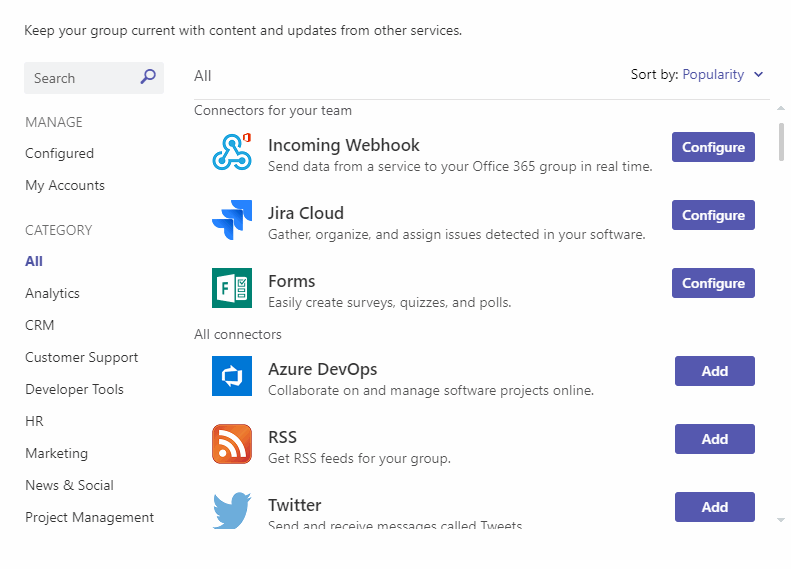
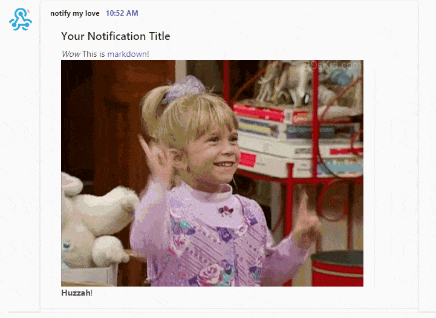

Teams notifications are mighty useful. You can send them using Markdown via a webhook.

<!--truncate-->

This post will explain the following:

1. How you can automate the sending of notifications using Teams.
2. How Teams supports Markdown in notifications.
3. How you can use ASP.Net Core to automate sending notifications.

## Notifications via Webhooks

Now, it's not obvious from Teams that there is a simple webhooks integration for Teams, but there is. It's tucked away under "Connectors". If you want to create a webhook of your own, find your team, your channel, click on the menu, then connectors and create a hook. Like so:



With the URL you've just obtained, you are now free to send notifications to that channel via a simple `curl`:

```shell
curl -H "Content-Type: application/json" -d "{\"text\": \"Hello World\"}" https://outlook.office.com/webhook/big-long-guid1/IncomingWebhook/big-long-guid2
```

## Markdown

Let's see if we can make this more interesting. It turns out that the the webhook can receive JSON as the body of the payload. And there's 3 properties we'd like our JSON to contain:

1. `title` - this is optional and is the title of your notification if supplied.
2. `textFormat` - provide the value `"markdown"` and then...
3. `text` - provide your markdown notification content!

So if we have a notification payload file called `down.json`:

```json
{
  "title": "Your Notification Title",
  "textFormat": "markdown",
  "text": "*Wow*\nThis is [markdown](https://en.wikipedia.org/wiki/Markdown)!\n\n**Huzzah**!"
}
```

We can trigger it with this `curl`:

```shell
curl -H "Content-Type: application/json" -d @down.json https://outlook.office.com/webhook/big-long-guid1/IncomingWebhook/big-long-guid2
```

As you can see from the example above, you can use all the qualities of Markdown that you know and love. Text, bold text, italics, links and even images too. It's _great_!



## ASP.Net Core

Finally, I wanted to illustrate just how simple the WebHooks API makes plugging notifications into an existing app. In our case we're going to use ASP.Net Core, but really there's nothing particular about how we're going to do this.

Here's a class called `TeamsNotificationService`. It exposes 2 methods:

- `SendNotification` which allows the consumer to just provide a `title` and a `message` - you could consume this from anywhere in your app and use it to publish the notification of your choice.
- `SendExcitingNotification` which actually uses `SendNotification` and illustrates how you might provide an exciting notification to publish out.

```cs
using System;
using System.Collections.Generic;
using System.Net.Http;
using System.Net.Http.Headers;
using System.Threading.Tasks;

namespace My.Services {
    public interface ITeamsNotificationService {
        Task SendNotification(string title, string message);
        Task SendExcitingNotification(Guid someAppId, string person);
    }

    public class TeamsNotificationService : ITeamsNotificationService {

        // in Startup.ConfigureServices you're going to want to add this line:
        // services.AddHttpClient(TeamsNotificationService.TEAMS_NOTIFIER_CLIENT);

        public const string TEAMS_NOTIFIER_CLIENT = "TEAMS_NOTIFIER_CLIENT";

        private readonly ILogger<TeamsNotificationService> logger;
        private readonly IHttpClientFactory _clientFactory;


        public TeamsNotificationService(
            ILogger<TeamsNotificationService> logger,
            IHttpClientFactory clientFactory
        ) {
            _logger = logger;
            _clientFactory = clientFactory;
        }

        private HttpClient CreateClient() {
            var client = _clientFactory.CreateClient(TEAMS_NOTIFIER);

            client.DefaultRequestHeaders.Clear();
            client.DefaultRequestHeaders.Accept.Clear();
            client.DefaultRequestHeaders.Accept.Add(new MediaTypeWithQualityHeaderValue("application/json"));

            return client;
        }

        public async Task SendNotification(string title, string message) {
            try {
                var client = CreateClient();

                var messageContents = string.IsNullOrEmpty(title)
                    ? new JsonContent(new { text = message, textFormat = "markdown" })
                    : new JsonContent(new { title = title, text = message, textFormat = "markdown" });

                var webhookUrl = "https://outlook.office.com/webhook/big-long-guid1/IncomingWebhook/big-long-guid2";
                var response = await client.PostAsync(webhookUrl, messageContents);

                _logger.LogInformation("Sent {title} notification to Teams using {url}; received this response: {responseStatusCode}", title, url, response.StatusCode);
            }
            catch (Exception exc) {
                _logger.LogError(exc, $"Failed to send {title} notification to Teams");
            }
        }

        public async Task SendExcitingNotification(Guid someAppId, string person) {
            var celebration = GetCelebration();
            await SendNotification(
                title: "Incredible Thing Alert!",
                message: $@"**{person}** has done something incredible! &#x1F44B;


[Go see for yourself](https://my.app/some-page/{someAppId})"
            );
        }

        string GetCelebration() => GetRandomItem(_celebrations);
        string GetRandomItem(string[] arrayOfStrings) => arrayOfStrings[new Random().Next(0, arrayOfStrings.Length)];

        string[] _celebrations = new string[] {
            "https://media.giphy.com/media/KYElw07kzDspaBOwf9/giphy.gif",
            "https://media.giphy.com/media/GStLeae4F7VIs/giphy.gif",
            "https://media.giphy.com/media/NbXTwsoD7hvag/giphy.gif",
            "https://media.giphy.com/media/d86kftzaeizO8/giphy.gif",
            "https://media.giphy.com/media/YJ5OlVLZ2QNl6/giphy.gif",
            "https://media.giphy.com/media/kyLYXonQYYfwYDIeZl/giphy.gif",
            "https://media.giphy.com/media/KYElw07kzDspaBOwf9/giphy.gif",
            "https://media.giphy.com/media/6nuiJjOOQBBn2/giphy.gif",
            "https://media.giphy.com/media/hZj44bR9FVI3K/giphy.gif",
            "https://media.giphy.com/media/31lPv5L3aIvTi/giphy.gif"
        };
    }
}
```

It's as simple as that 😄
