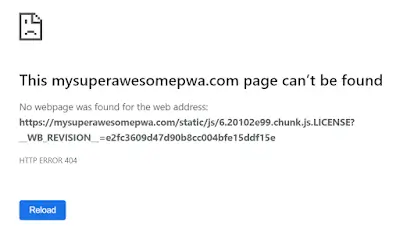

## Update: 26/01/2020 - LICENSE to kill revoked!

<!--truncate-->

Following the original publication of this post I received this tweet suggesting we should change the behaviour of the underlying `terser-webpack-plugin`:

> Send a PR to change the name to .LICENSE.txt by default.
>
> — Tobias Koppers (@wSokra) [January 22, 2020](https://twitter.com/wSokra/status/1220069497660411904?ref_src=twsrc%5Etfw)

That seemed like an excellent idea! I raised [this PR](https://github.com/webpack-contrib/terser-webpack-plugin/pull/210) which changes the behaviour such that instead of `.LICENSE` files being produced, `.LICENSE.txt` files are pumped out instead. Crucially they are IIS (and other servers) friendly. The great news is that future users of webpack / create-react-app etc will not face this problem at all; result!

## The tragedy

Recently my beloved PWA died. I didn't realise it at first. It wasn't until a week or so after the tragedy that I realised he'd gone. In his place was the stale memory of service workers gone by. Last week's code; cached and repeatedly served up to a disappointed audience. Terrible news.

What had happened? What indeed. The problem was quirky and (now that I know the answer) I'm going to share it with you. Because it's entirely non-obvious.

## The mystery

Once I realised that I was repeatedly being served up an old version of my PWA, I got to wondering.... Why? What's happening? What's wrong? What did I do? I felt bad. I stared at the ceiling. I sighed and opened my Chrome devtools. With no small amount of sadness I went to the `Application` tab, hit `Service Workers` and then `Unregister`.

Then I hit refresh and took a look at console. I saw this:


What does this mean? Something about a "bad-precaching-response". And apparently this was happening whilst trying to load this resource: `/static/js/6.20102e99.chunk.js.LICENSE?__WB_REVISION__=e2fc36`

This `404` was preventing pre-caching from executing successfully. This was what was killing my PWA. This was the perpetrator. How to fix this? Read on!

## The investigation

Time to find out what's going on. I dropped that URL into my browser to see what would happen. `404` city man:



So, to disk. I took a look at what was actually on the server in that location. Sure enough, the file existed. When I opened it up I found this:

```js
/**
 * A better abstraction over CSS.
 *
 * @copyright Oleg Isonen (Slobodskoi) / Isonen 2014-present
 * @website https://github.com/cssinjs/jss
 * @license MIT
 */

/*
object-assign
(c) Sindre Sorhus
@license MIT
*/

/** @license React v16.12.0
 * react.production.min.js
 *
 * Copyright (c) Facebook, Inc. and its affiliates.
 *
 * This source code is licensed under the MIT license found in the
 * LICENSE file in the root directory of this source tree.
 */

/** @license React v16.12.0
 * react-dom.production.min.js
 *
 * Copyright (c) Facebook, Inc. and its affiliates.
 *
 * This source code is licensed under the MIT license found in the
 * LICENSE file in the root directory of this source tree.
 */

/** @license React v0.18.0
 * scheduler.production.min.js
 *
 * Copyright (c) Facebook, Inc. and its affiliates.
 *
 * This source code is licensed under the MIT license found in the
 * LICENSE file in the root directory of this source tree.
 */

/** @license React v16.12.0
 * react-is.production.min.js
 *
 * Copyright (c) Facebook, Inc. and its affiliates.
 *
 * This source code is licensed under the MIT license found in the
 * LICENSE file in the root directory of this source tree.
 */
```

What is this? Well, as the name of the file suggests, it's licenses. For some reason, my build was scraping the licenses from the head of some of my files and placing them in a separate `6.20102e99.chunk.js.LICENSE` file. Doing some more digging I happened upon [this discussion against the `create-react-app`](https://github.com/facebook/create-react-app/issues/6441) project. It's worth saying, that my PWA was an ejected `create-react-app` project.

It turned out the the issue was related to the [`terser-webpack-plugin`](https://github.com/webpack-contrib/terser-webpack-plugin). The default behaviour performs this kind of license file extraction. The app was being served by an IIS server and it wasn't configured to support the `.LICENSE` file type.

## The resolution

The simplest solution was simply this: wave goodbye to `LICENSE` files. If you haven't ejected from your `create-react-app` then this might be a problem. But since I had, I was able to make this tweak to the terser settings in the `webpack.config.js`:

```js
new TerserPlugin({
    /* TURN OFF LICENSE FILES - SEE https://github.com/facebook/create-react-app/issues/6441 */
    extractComments: false,
    /* TURN OFF LICENSE FILES - Tweak by John Reilly */
    terserOptions: {
        // ....
```

And with this we say goodbye to our `404`s and hello to a resurrected PWA!
