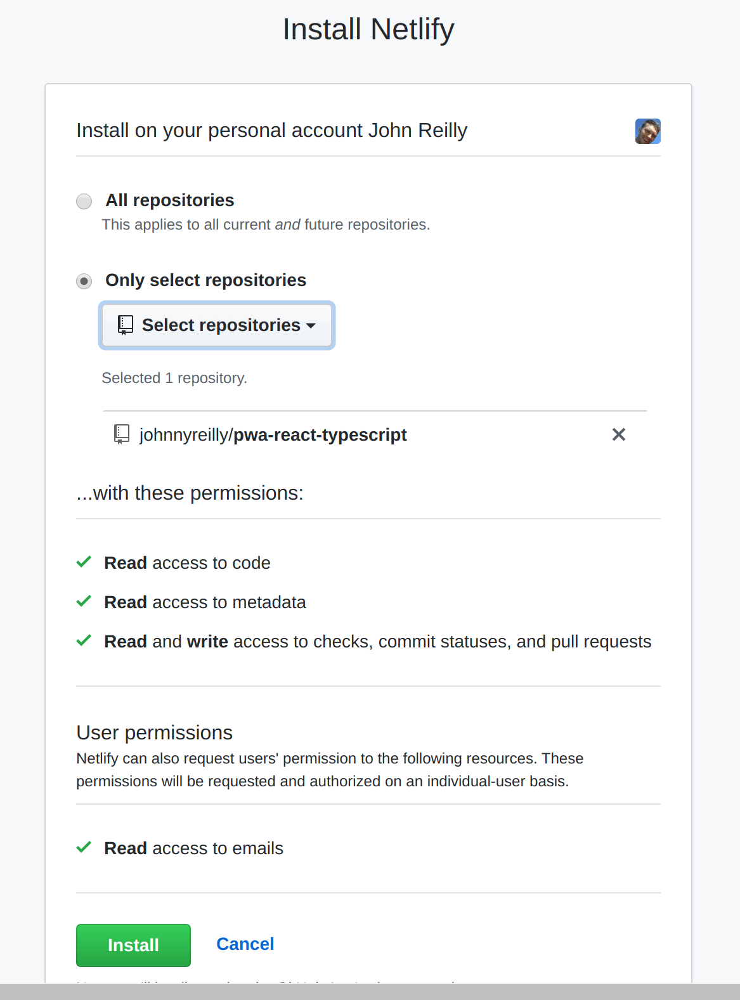
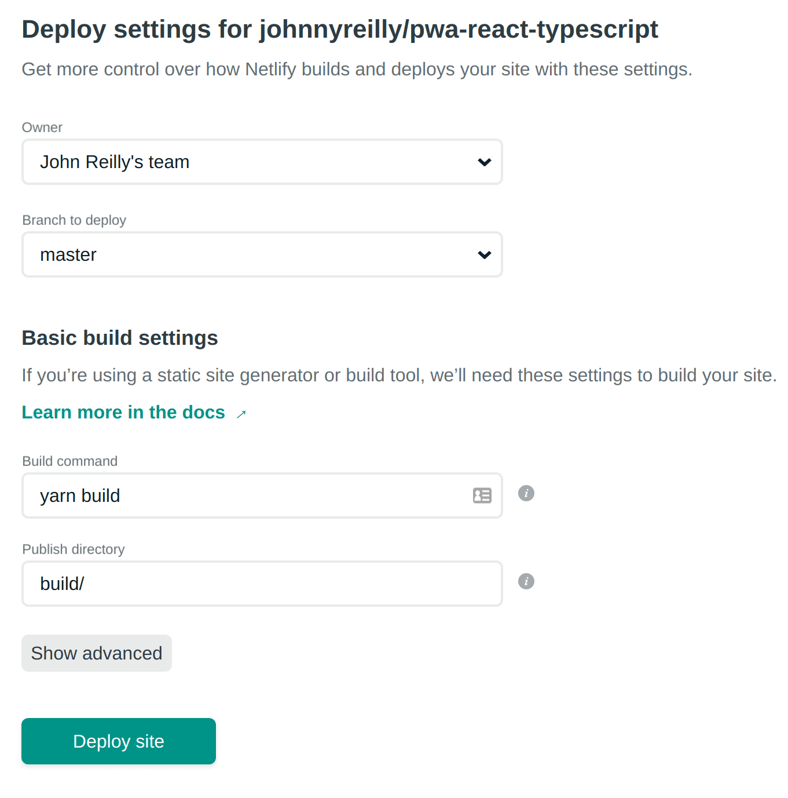
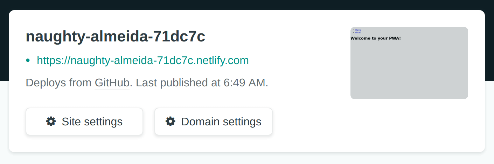
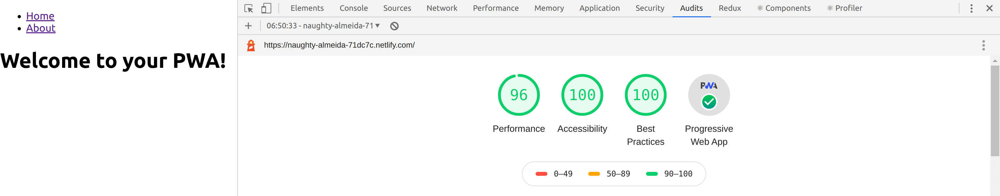

Progressive Web Apps are a (terribly named) wonderful idea. You can build an app _once_ using web technologies which serves all devices and form factors. It can be accessible over the web, but also surface on the home screen of your Android / iOS device. That app can work offline, have a splash screen when it launches and have notifications too.

<!--truncate-->

PWAs can be a money saver for your business. The alternative, should you want an app experience for your users, is building the same application using three different technologies (one for web, one for Android and one for iOS). When you take this path it's hard to avoid a multiplication of cost and complexity. It often leads to dividing up the team as each works on a different stack. It's common to lose a certain amount of focus as a consequence. PWAs can help here; they are a compelling alternative, not just from a developers standpoint, but from a resourcing one too.

However, the downside of PWAs is that they are more complicated than normal web apps. Writing one from scratch is just less straightforward than a classic web app. There are easy onramps to building a PWA that help you fall into the pit of success. This post will highlight one of these. How you can travel from zero to a PWA of your very own using React and TypeScript.

This post presumes knowledge of:

- React
- TypeScript
- Node

## From console to web app

To create our PWA we're going to use [`create-react-app`](https://create-react-app.dev/). This excellent project has long had inbuilt support for making PWAs. In recent months that support has matured to a very satisfactory level. To create ourselves a TypeScript React app using `create-react-app` enter this `npx` command at the console:

```shell
npx create-react-app pwa-react-typescript --template typescript
```

This builds you a react web app built with TypeScript; it can be tested locally with:

```shell
cd pwa-react-typescript
yarn start
```

## From web app to PWA

From web app to PWA is incredibly simple; it’s just a question of opting in to offline behaviour. If you open up the `index.tsx` file in your newly created project you'll find this code:

```ts
// If you want your app to work offline and load faster, you can change
// unregister() to register() below. Note this comes with some pitfalls.
// Learn more about service workers: https://bit.ly/CRA-PWA
serviceWorker.unregister();
```

As the hint suggests, swap `serviceWorker.unregister()` for `serviceWorker.register()` and you now have a PWA. Amazing! What does this mean? Well to [quote the docs](https://create-react-app.dev/docs/making-a-progressive-web-app/#why-opt-in):

> - All static site assets are cached so that your page loads fast on subsequent visits, regardless of network connectivity (such as 2G or 3G). Updates are downloaded in the background.
> - Your app will work regardless of network state, even if offline. This means your users will be able to use your app at 10,000 feet and on the subway.
>
> ... it will take care of generating a service worker file that will automatically precache all of your local assets and keep them up to date as you deploy updates. The service worker will use a [cache-first strategy](https://developers.google.com/web/fundamentals/instant-and-offline/offline-cookbook/#cache-falling-back-to-network)for handling all requests for local assets, including [navigation requests](https://developers.google.com/web/fundamentals/primers/service-workers/high-performance-loading#first_what_are_navigation_requests) for your HTML, ensuring that your web app is consistently fast, even on a slow or unreliable network.

Under the bonnet, `create-react-app` is achieving this through the use of technology called ["Workbox"](https://developers.google.com/web/tools/workbox). Workbox describes itself as:

> a set of libraries and Node modules that make it easy to cache assets and take full advantage of features used to build [Progressive Web Apps](https://developers.google.com/web/progressive-web-apps/).

The good folks of Google are aware that writing your own PWA can be tricky. There's much new behaviour to configure and be aware of; it's easy to make mistakes. Workbox is there to help ease the way forward by implementing default strategies for caching / offline behaviour which can be controlled through configuration.

A downside of the usage of `Workbox` in `create-react-app` is that (as with most things `create-react-app`) there's little scope for configuration of your own if the defaults don't serve your purpose. This may change in the future, indeed [there's an open PR that adds this support](https://github.com/facebook/create-react-app/pull/5369).

## Icons and splash screens and A2HS, oh my!

But it's not just an offline experience that makes this a PWA. Other important factors are:

- That the app can be added to your home screen (A2HS AKA "installed").
- That the app has a name and an icon which can be customised.
- That there's a splash screen displayed to the user as the app starts up.

All of the above is "in the box" with `create-react-app`. Let's start customizing these.

First of all, we'll give our app a name. Fire up `index.html` and replace `&lt;title&gt;React App&lt;/title&gt;` with `&lt;title&gt;My PWA&lt;/title&gt;`. (Feel free to concoct a more imaginative name than the one I've suggested.) Next open up `manifest.json` and replace:

```json
"short_name": "React App",
  "name": "Create React App Sample",
```

with:

```json
"short_name": "My PWA",
  "name": "My PWA",
```

Your app now has a name. The question you might be asking is: what is this `manifest.json` file? Well to [quote the good folks of Google](https://developers.google.com/web/fundamentals/web-app-manifest):

> The [web app manifest](https://developer.mozilla.org/en-US/docs/Web/Manifest) is a simple JSON file that tells the browser about your web application and how it should behave when 'installed' on the user's mobile device or desktop. Having a manifest is required by Chrome to show the [Add to Home Screen prompt](https://developers.google.com/web/fundamentals/app-install-banners/).
>
> A typical manifest file includes information about the app name, icons it should use, the start_url it should start at when launched, and more.

So the `manifest.json` is essentially metadata about your app. Here's what it should look like right now:

```json
{
  "short_name": "My PWA",
  "name": "My PWA",
  "icons": [
    {
      "src": "favicon.ico",
      "sizes": "64x64 32x32 24x24 16x16",
      "type": "image/x-icon"
    },
    {
      "src": "logo192.png",
      "type": "image/png",
      "sizes": "192x192"
    },
    {
      "src": "logo512.png",
      "type": "image/png",
      "sizes": "512x512"
    }
  ],
  "start_url": ".",
  "display": "standalone",
  "theme_color": "#000000",
  "background_color": "#ffffff"
}
```

You can use the above properties (and others not yet configured) to control how your app behaves. For instance, if you want to replace icons your app uses then it's a simple matter of:

- placing new logo files in the `public` folder
- updating references to them in the `manifest.json`
- finally, for older Apple devices, updating the `&lt;link rel="apple-touch-icon" ... /&gt;` in the `index.html`.

## Where are we?

So far, we have a basic PWA in place. It's installable. You can run it locally and develop it with `yarn start`. You can build it for deployment with `yarn build`.

What this isn't, is recognisably a web app. In the sense that it doesn't have support for different pages / URLs. We're typically going to want to break up our application this way. Let's do that now. We're going to use [`react-router`](https://github.com/ReactTraining/react-router); the de facto routing solution for React. To add it to our project (and the required type definitions for TypeScript) we use:

```
yarn add react-router-dom @types/react-router-dom
```

Now let's split up our app into a couple of pages. We'll replace the existing `App.tsx` with this:

```tsx
import React from 'react';
import { BrowserRouter as Router, Switch, Route, Link } from 'react-router-dom';
import About from './About';
import Home from './Home';

const App: React.FC = () => (
  <Router>
    <nav>
      <ul>
        <li>
          <Link to="/">Home</Link>
        </li>
        <li>
          <Link to="/about">About</Link>
        </li>
      </ul>
    </nav>
    <Switch>
      <Route path="/about">
        <About />
      </Route>
      <Route path="/">
        <Home />
      </Route>
    </Switch>
  </Router>
);

export default App;
```

This will be our root page. It has the responsiblity of using `react-router` to render the pages we want to serve, and also to provide the links that allow users to navigate to those pages. In making our changes we'll have broken our test (which checked for a link we've now deleted), so we'll fix it like so:

Replace the `App.test.tsx` with this:

```tsx
import React from 'react';
import { render } from '@testing-library/react';
import App from './App';

test('renders about link', () => {
  const { getByText } = render(<App />);
  const linkElement = getByText(/about/i);
  expect(linkElement).toBeInTheDocument();
});
```

You'll have noticed that in our new `App.tsx` we import two new components (or pages); `About` and `Home`. Let's create those. First `About.tsx`:

```tsx
import React from 'react';

const About: React.FC = () => <h1>This is a PWA</h1>;

export default About;
```

Then `Home.tsx`:

```tsx
import React from 'react';

const Home: React.FC = () => <h1>Welcome to your PWA!</h1>;

export default Home;
```

## Code splitting

Now we've split up our app into multiple sections, we're going to split the code too. A good way to improve loading times for PWAs is to ensure that the code is not built into big files. At the moment our app builds a `single-file.js`. If you run `yarn build` you'll see what this looks like:

```
47.88 KB  build/static/js/2.89bc6648.chunk.js
  784 B     build/static/js/runtime-main.9c116153.js
  555 B     build/static/js/main.bc740179.chunk.js
  269 B     build/static/css/main.5ecd60fb.chunk.css
```

Notice the `build/static/js/main.bc740179.chunk.js` file. This is our `single-file.js`. It represents the compiled output of building the TypeScript files that make up our app. It will grow and grow as our app grows, eventually becoming problematic from a user loading speed perspective.

`create-react-app` is built upon webpack. There is excellent support for code splitting in webpack and hence [create-react-app supports it by default](https://reactjs.org/docs/code-splitting.html#code-splitting). Let's apply it to our app. Again we're going to change `App.tsx`.

Where we previously had:

```tsx
import About from './About';
import Home from './Home';
```

Let's replace with:

```tsx
const About = lazy(() => import('./About'));
const Home = lazy(() => import('./Home'));
```

This is the syntax to lazily load components in React. You'll note that it internally uses the [dynamic `import()` syntax](https://github.com/tc39/proposal-dynamic-import) which webpack uses as a "split point".

Let's also give React something to render whilst it waits for the dynamic imports to be resolved. Just inside our `&lt;Router&gt;` component we'll add a `&lt;Suspense&gt;` component too:

```tsx
<Router>
  <Suspense fallback={<div>Loading...</div>}>{/*...*/}</Suspense>
</Router>
```

The `&lt;Suspense&gt;` component will render the `&lt;div&gt;Loading...&lt;/div&gt;` whilst it waits for a routes code to be dynamically loaded. So our final `App.tsx` component ends up looking like this:

```tsx
import React, { lazy, Suspense } from 'react';
import { BrowserRouter as Router, Switch, Route, Link } from 'react-router-dom';
const About = lazy(() => import('./About'));
const Home = lazy(() => import('./Home'));

const App: React.FC = () => (
  <Router>
    <Suspense fallback={<div>Loading...</div>}>
      <nav>
        <ul>
          <li>
            <Link to="/">Home</Link>
          </li>
          <li>
            <Link to="/about">About</Link>
          </li>
        </ul>
      </nav>
      <Switch>
        <Route path="/about">
          <About />
        </Route>
        <Route path="/">
          <Home />
        </Route>
      </Switch>
    </Suspense>
  </Router>
);

export default App;
```

This is now a code split application. How can we tell? If we run `yarn build` again we'll see something like this:

```
47.88 KB          build/static/js/2.89bc6648.chunk.js
  1.18 KB (+428 B)  build/static/js/runtime-main.415ab5ea.js
  596 B (+41 B)     build/static/js/main.e60948bb.chunk.js
  269 B             build/static/css/main.5ecd60fb.chunk.css
  233 B             build/static/js/4.0c85e1cb.chunk.js
  228 B             build/static/js/3.eed49094.chunk.js
```

Note that we now have multiple `*.chunk.js` files. Our initial `main.*.chunk.js` and then `3.*.chunk.js` representing `Home.tsx` and `4.*.chunk.js` representing `About.tsx`.

As we continue to build out our app from this point we'll have a great approach in place to ensure that users load files as they need to and that those files should not be too large. Great performance which will scale.

## Deploy your PWA

Now that we have our basic PWA in place, let's deploy it so the outside world can appreciate it. We're going to use [Netlify](https://www.netlify.com/) for this.

The source code of our PWA lives on GitHub here: https://github.com/johnnyreilly/pwa-react-typescript

We're going to log into Netlify, click on the "Create a new site" option and select GitHub as the provider. We'll need to authorize Netlify to access our GitHub.


You may need to click the "Configure Netlify on GitHub" button to grant permissions for Netlify to access your repo like so:



Then you can select your repo from within Netlify. All of the default settings that Netlify provides should work for our use case:



Let's hit the magic "Deploy site" button! In a matter of minutes you'll find that Netlify has deployed your PWA.



If we browse to the URL provided by Netlify we'll be able to see the deployed PWA in action. (You also have the opportunity to set up a custom domain name that you would typically want outside of a simple demo such as this.) Importantly this will be served over HTTPS which will allow our Service Worker to operate.

Now that we know it's there, let's see how what we've built holds up according to the professionals. We're going to run the Google Chrome Developer Tools Audit against our PWA:



That is a good start for our PWA!

[This post was originally published on LogRocket.](https://blog.logrocket.com/from-create-react-app-to-pwa/)

<head>
    <link rel="canonical" href="https://blog.logrocket.com/from-create-react-app-to-pwa/" />
</head>

[The source code for this project can be found here.](https://github.com/johnnyreilly/pwa-react-typescript)
