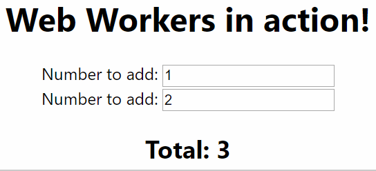

JavaScript is famously single threaded. However, if you're developing for the web, you may well know that this is not quite accurate. There are [`Web Workers`](https://developer.mozilla.org/en-US/docs/Web/API/Web_Workers_API/Using_web_workers):

> A worker is an object created using a constructor (e.g. `Worker()`) that runs a named JavaScript file — this file contains the code that will run in the worker thread; workers run in another global context that is different from the current window.

If you're using Vite to build your React app, you may [prefer to read this post](../2024-06-23-web-workers-comlink-vite-tanstack-query/index.md).

<!--truncate-->

Given that there is a way to use other threads for background processing, why doesn't this happen all the time? Well there's a number of reasons; not the least of which is the ceremony involved in interacting with Web Workers. Consider the following example that illustrates moving a calculation into a worker:

```js
// main.js
function add2NumbersUsingWebWorker() {
  const myWorker = new Worker('worker.js');

  myWorker.postMessage([42, 7]);
  console.log('Message posted to worker');

  myWorker.onmessage = function (e) {
    console.log('Message received from worker', e.data);
  };
}

add2NumbersUsingWebWorker();

// worker.js
onmessage = function (e) {
  console.log('Worker: Message received from main script');
  const result = e.data[0] * e.data[1];
  if (isNaN(result)) {
    postMessage('Please write two numbers');
  } else {
    const workerResult = 'Result: ' + result;
    console.log('Worker: Posting message back to main script');
    postMessage(workerResult);
  }
};
```

_This is not simple._ It's hard to understand what's happening. Also, this approach only supports a single method call. I'd much rather write something that looked more like this:

```js
// main.js
function add2NumbersUsingWebWorker() {
  const myWorker = new Worker('worker.js');

  const total = myWorker.add2Numbers([42, 7]);
  console.log('Message received from worker', total);
}

add2NumbersUsingWebWorker();

// worker.js
export function add2Numbers(firstNumber, secondNumber) {
  const result = firstNumber + secondNumber;
  return isNaN(result) ? 'Please write two numbers' : 'Result: ' + result;
}
```

There's a way to do this using a library made by Google called [comlink](https://github.com/GoogleChromeLabs/comlink). This post will demonstrate how we can use this. We'll use TypeScript and webpack. We'll also examine how to integrate this approach into a React app.

## A use case for a Web Worker

Let's make ourselves a TypeScript web app. We're going to use `create-react-app` for this:

```shell
npx create-react-app webworkers-comlink-typescript-react --template typescript
```

Create a `takeALongTimeToDoSomething.ts` file alongside `index.tsx`:

```ts
export function takeALongTimeToDoSomething() {
  console.log('Start our long running job...');
  const seconds = 5;
  const start = new Date().getTime();
  const delay = seconds * 1000;

  while (true) {
    if (new Date().getTime() - start > delay) {
      break;
    }
  }
  console.log('Finished our long running job');
}
```

To `index.tsx` add this code:

```ts
import { takeALongTimeToDoSomething } from './takeALongTimeToDoSomething';

// ...

console.log('Do something');
takeALongTimeToDoSomething();
console.log('Do another thing');
```

When our application runs we see this behaviour:


The app starts and logs `Do something` and `Start our long running job...` to the console. It then blocks the UI until the `takeALongTimeToDoSomething` function has completed running. During this time the screen is empty and unresponsive. This is a poor user experience.

## Hello `worker-plugin` and `comlink`

To start using comlink we're going to need to eject our `create-react-app` application. The way `create-react-app` works is by giving you a setup that handles a high percentage of the needs for a typical web app. When you encounter an unsupported use case, you can run the `yarn eject` command to get direct access to the configuration of your setup.

Web Workers are not that commonly used in day to day development at present. Consequently there isn't yet a "plug'n'play" solution for workers supported by `create-react-app`. There's a number of potential ways to support this use case and you can track the various discussions happening against `create-react-app` that covers this. For now, let's eject with:

```bash
yarn eject
```

Then let's install the packages we're going to be using:

- [`worker-plugin`](https://github.com/GoogleChromeLabs/worker-plugin) \- this webpack plugin automatically compiles modules loaded in Web Workers
- `comlink` - this library provides the RPC-like experience that we want from our workers

```bash
yarn add comlink worker-plugin
```

We now need to tweak our `webpack.config.js` to use the `worker-plugin`:

```js
const WorkerPlugin = require('worker-plugin');

// ....

    plugins: [
      new WorkerPlugin(),

// ....
```

Do note that there's a number of `plugins` statements in the `webpack.config.js`. You want the top level one; look out for the `new HtmlWebpackPlugin` statement and place your `new WorkerPlugin(),` before that.

## Workerize our slow process

Now we're ready to take our long running process and move it into a worker. Inside the `src` folder, create a new folder called `my-first-worker`. Our worker is going to live in here. Into this folder we're going to add a `tsconfig.json` file:

```json
{
  "compilerOptions": {
    "strict": true,
    "target": "esnext",
    "module": "esnext",
    "lib": ["webworker", "esnext"],
    "moduleResolution": "node",
    "noUnusedLocals": true,
    "sourceMap": true,
    "allowJs": false,
    "baseUrl": "."
  }
}
```

This file exists to tell TypeScript that this is a Web Worker. Do note the `"lib": [ "webworker"` usage which does exactly that.

Alongside the `tsconfig.json` file, let's create an `index.ts` file. This will be our worker:

```ts
import { expose } from 'comlink';
import { takeALongTimeToDoSomething } from '../takeALongTimeToDoSomething';

const exports = {
  takeALongTimeToDoSomething,
};
export type MyFirstWorker = typeof exports;

expose(exports);
```

There's a number of things happening in our small worker file. Let's go through this statement by statement:

```ts
import { expose } from 'comlink';
```

Here we're importing the `expose` method from comlink. Comlink’s goal is to make *expose*d values from one thread available in the other. The `expose` method can be viewed as the comlink equivalent of `export`. It is used to export the RPC style signature of our worker. We'll see it's use later.

```ts
import { takeALongTimeToDoSomething } from '../takeALongTimeToDoSomething';
```

Here we're going to import our `takeALongTimeToDoSomething` function that we wrote previously, so we can use it in our worker.

```ts
const exports = {
  takeALongTimeToDoSomething,
};
```

Here we're creating the public facing API that we're going to expose.

```ts
export type MyFirstWorker = typeof exports;
```

We're going to want our worker to be strongly typed. This line creates a type called `MyFirstWorker` which is derived from our `exports` object literal.

```ts
expose(exports);
```

Finally we expose the `exports` using comlink. We're done; that's our worker finished. Now let's consume it. Let's change our `index.tsx` file to use it. Replace our import of `takeALongTimeToDoSomething`:

```ts
import { takeALongTimeToDoSomething } from './takeALongTimeToDoSomething';
```

With an import of `wrap` from comlink that creates a local `takeALongTimeToDoSomething` function that wraps interacting with our worker:

```ts
import { wrap } from 'comlink';

function takeALongTimeToDoSomething() {
  const worker = new Worker('./my-first-worker', {
    name: 'my-first-worker',
    type: 'module',
  });
  const workerApi = wrap<import('./my-first-worker').MyFirstWorker>(worker);
  workerApi.takeALongTimeToDoSomething();
}
```

Now we're ready to demo our application using our function offloaded into a Web Worker. It now behaves like this:


There's a number of exciting things to note here:

1. The application is now non-blocking. Our long running function is now not preventing the UI from updating
2. The functionality is lazily loaded via a `my-first-worker.chunk.worker.js` that has been created by the `worker-plugin` and `comlink`.

## Using Web Workers in React

The example we've showed so far demostrates how you could use Web Workers and why you might want to. However, it's a far cry from a real world use case. Let's take the next step and plug our Web Worker usage into our React application. What would that look like? Let's find out.

We'll return `index.tsx` back to it's initial state. Then we'll make a simple adder function that takes some values and returns their total. To our `takeALongTimeToDoSomething.ts` module let's add:

```ts
export function takeALongTimeToAddTwoNumbers(number1: number, number2: number) {
  console.log('Start to add...');
  const seconds = 5;
  const start = new Date().getTime();
  const delay = seconds * 1000;
  while (true) {
    if (new Date().getTime() - start > delay) {
      break;
    }
  }
  const total = number1 + number2;
  console.log('Finished adding');
  return total;
}
```

Let's start using our long running calculator in a React component. We'll update our `App.tsx` to use this function and create a simple adder component:

```tsx
import React, { useState } from 'react';
import './App.css';
import { takeALongTimeToAddTwoNumbers } from './takeALongTimeToDoSomething';

const App: React.FC = () => {
  const [number1, setNumber1] = useState(1);
  const [number2, setNumber2] = useState(2);

  const total = takeALongTimeToAddTwoNumbers(number1, number2);

  return (
    <div className="App">
      <h1>Web Workers in action!</h1>

      <div>
        <label>Number to add: </label>
        <input
          type="number"
          onChange={(e) => setNumber1(parseInt(e.target.value))}
          value={number1}
        />
      </div>
      <div>
        <label>Number to add: </label>
        <input
          type="number"
          onChange={(e) => setNumber2(parseInt(e.target.value))}
          value={number2}
        />
      </div>
      <h2>Total: {total}</h2>
    </div>
  );
};

export default App;
```

When you try it out you'll notice that entering a single digit locks the UI for 5 seconds whilst it adds the numbers. From the moment the cursor stops blinking to the moment the screen updates the UI is non-responsive:



So far, so classic. Let's Web Workerify this!

We'll update our `my-first-worker/index.ts` to import this new function:

```ts
import { expose } from 'comlink';
import {
  takeALongTimeToDoSomething,
  takeALongTimeToAddTwoNumbers,
} from '../takeALongTimeToDoSomething';

const exports = {
  takeALongTimeToDoSomething,
  takeALongTimeToAddTwoNumbers,
};
export type MyFirstWorker = typeof exports;

expose(exports);
```

Alongside our `App.tsx` file let's create an `App.hooks.ts` file.

```ts
import { wrap, releaseProxy } from 'comlink';
import { useEffect, useState, useMemo } from 'react';

/**
 * Our hook that performs the calculation on the worker
 */
export function useTakeALongTimeToAddTwoNumbers(
  number1: number,
  number2: number,
) {
  // We'll want to expose a wrapping object so we know when a calculation is in progress
  const [data, setData] = useState({
    isCalculating: false,
    total: undefined as number | undefined,
  });

  // acquire our worker
  const { workerApi } = useWorker();

  useEffect(() => {
    // We're starting the calculation here
    setData({ isCalculating: true, total: undefined });

    workerApi
      .takeALongTimeToAddTwoNumbers(number1, number2)
      .then((total) => setData({ isCalculating: false, total })); // We receive the result here
  }, [workerApi, setData, number1, number2]);

  return data;
}

function useWorker() {
  // memoise a worker so it can be reused; create one worker up front
  // and then reuse it subsequently; no creating new workers each time
  const workerApiAndCleanup = useMemo(() => makeWorkerApiAndCleanup(), []);

  useEffect(() => {
    const { cleanup } = workerApiAndCleanup;

    // cleanup our worker when we're done with it
    return () => {
      cleanup();
    };
  }, [workerApiAndCleanup]);

  return workerApiAndCleanup;
}

/**
 * Creates a worker, a cleanup function and returns it
 */
function makeWorkerApiAndCleanup() {
  // Here we create our worker and wrap it with comlink so we can interact with it
  const worker = new Worker('./my-first-worker', {
    name: 'my-first-worker',
    type: 'module',
  });
  const workerApi = wrap<import('./my-first-worker').MyFirstWorker>(worker);

  // A cleanup function that releases the comlink proxy and terminates the worker
  const cleanup = () => {
    workerApi[releaseProxy]();
    worker.terminate();
  };

  const workerApiAndCleanup = { workerApi, cleanup };

  return workerApiAndCleanup;
}
```

The `useWorker` and `makeWorkerApiAndCleanup` functions make up the basis of a shareable worker hooks approach. It would take very little work to paramaterise them so this could be used elsewhere. That's outside the scope of this post but would be extremely straightforward to accomplish.

Time to test! We'll change our `App.tsx` to use the new `useTakeALongTimeToAddTwoNumbers` hook:

```tsx
import React, { useState } from 'react';
import './App.css';
import { useTakeALongTimeToAddTwoNumbers } from './App.hooks';

const App: React.FC = () => {
  const [number1, setNumber1] = useState(1);
  const [number2, setNumber2] = useState(2);

  const total = useTakeALongTimeToAddTwoNumbers(number1, number2);

  return (
    <div className="App">
      <h1>Web Workers in action!</h1>

      <div>
        <label>Number to add: </label>
        <input
          type="number"
          onChange={(e) => setNumber1(parseInt(e.target.value))}
          value={number1}
        />
      </div>
      <div>
        <label>Number to add: </label>
        <input
          type="number"
          onChange={(e) => setNumber2(parseInt(e.target.value))}
          value={number2}
        />
      </div>
      <h2>
        Total:{' '}
        {total.isCalculating ? (
          <em>Calculating...</em>
        ) : (
          <strong>{total.total}</strong>
        )}
      </h2>
    </div>
  );
};

export default App;
```

Now our calculation takes place off the main thread and the UI is no longer blocked!


[This post was originally published on LogRocket.](https://blog.logrocket.com/integrating-web-workers-in-a-react-app-with-comlink/)

<head>
    <link rel="canonical" href="https://blog.logrocket.com/integrating-web-workers-in-a-react-app-with-comlink/" />
</head>

[The source code for this project can be found here.](https://github.com/johnnyreilly/webworkers-comlink-typescript-react)
