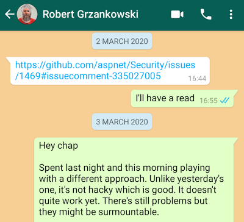

This is a post about having two kinds of authentication working at the same time in ASP.Net Core. But choosing which authentication method to use dynamically at runtime; based upon the criteria of your choice.

<!--truncate-->

Already this sounds complicated; let's fix that. Perhaps I should describe my situation to you. I've an app which has two classes of user. One class, let's call them "customers" (because... uh... they're customers). The customers access our application via a public facing website. Traffic rolls through Cloudflare and into our application. The public facing URL is something fancy like [https://mega-app.com](https://mega-app.com). That's one class of user.

The other class of user we'll call "our peeps"; because they are _us_. We use the app that we build. Traffic from "us" comes from a different hostname; only addressable on our network. So URLs from requests that we make are more along the lines of [https://strictly4mypeeps.io](https://strictly4mypeeps.io).

So far, so uncontroversial. Now it starts to get interesting. Our customers log into our application using their super secret credentials. It's [cookie based authentication](https://docs.microsoft.com/en-us/aspnet/core/security/authentication/cookie?view=aspnetcore-3.1#create-an-authentication-cookie). But for our peeps we do something different. Having to enter your credentials each time you use the app is friction. It gets in the way. So for us we have [Azure AD](https://docs.microsoft.com/en-us/aspnet/core/security/authentication/azure-active-directory/?view=aspnetcore-3.1) in the mix. Azure AD is how we authenticate ourselves; and that means we don't spend 5% of each working day entering credentials.

## Let us speak of the past

Now our delightful little application grew up in a simpler time. A time where you went to the marketplace, picked out some healthy looking servers, installed software upon them, got them attached to the internet, deployed an app onto them and said "hey presto, we're live!".

Way back when, we had some servers on the internet, that's how our customers got to our app. Our peeps, us, we went to other servers that lived on our network. So we had multiple instances of our app, deployed to different machines. The ones on the internet were configured to use cookie based auth, the ones on our internal network were Azure AD.

As I said, a simpler time.

## A new hope

We've been going through the process of cloudifying our app. Bye, bye servers, hello [Docker](https://www.docker.com/) and [Kubernetes](https://kubernetes.io/). So exciting! As we change the way our app is built and deployed; we've been thinking about whether the choices we make still make sense.

When it came to authentication, my initial thoughts were to continue the same road we're travelling; just in containers and pods. So where we had "internal" servers, we'd have "internal" pods, and where we'd have "external" servers we'd have external pods. I had the good fortune to be working with the amazingly talented [Robski](https://uk.linkedin.com/in/robert-grzankowski-53618114). Robski knows far more about K8s and networking than I'm ever likely to. He'd regularly say things like "ingress" and "MTLS" whilst I stared blankly at him. He definitely knows stuff.

Robski challenged my plans. "We don't need it. Have one pod that does both sorts of auth. If you do that, your implementation is simpler and scaling is more straightforward. You'll only need half the pods because you won't need internal _and_ external ones; one pod can handle both sets of traffic. You'll save money."

I loved the idea but I didn't think that ASP.Net Core supported it. "It's just not a thing Robski; ASP.Net Core doesn't suppport it." Robski didn't believe me. That turned out to a _very good thing_. There followed a period of much googling and experimentation. One day of hunting in, I was still convinced there was no way to do it that would allow me to look in the mirror without self loathing. Then Robski sent me this:



It was a link to the amazing [David Fowler](https://twitter.com/davidfowl) talking about [some API I'd never heard of called `SchemeSelector`](https://github.com/aspnet/Security/issues/1469#issuecomment-335027005). It turned out that this was the starting point for exactly what we needed; a way to dynamically select an authentication scheme at runtime.

## Show me the code

This API did end up landing in ASP.Net Core, but with the name `ForwardDefaultSelector`. Not the most descriptive of names and I've struggled to find any documentation on it at all. What I did discover was [an answer on StackOverflow by the marvellous Barbara Post](https://stackoverflow.com/a/51897159/761388). I was able to take the approach Barbara laid out and use it to my own ends. I ended up with this snippet of code added to my `Startup.ConfigureServices`:

```cs
services
    .AddAuthentication(sharedOptions => {
        sharedOptions.DefaultScheme = "WhichAuthDoWeUse";
        sharedOptions.DefaultAuthenticateScheme = "WhichAuthDoWeUse";
        sharedOptions.DefaultChallengeScheme = "WhichAuthDoWeUse";
    })
    .AddPolicyScheme("WhichAuthDoWeUse", "Azure AD or Cookies", options => {
        options.ForwardDefaultSelector = context => {
            var (isExternalRequest, requestUrl) = context.Request.GetIsExternalRequestAndDomain();
            if (isExternalRequest) {
                _logger.LogInformation(
                    "Request ({RequestURL}) has come from external domain ({Domain}) so using Cookie Authentication",
                    requestUrl, ExternalBaseUrl);

                return CookieAuthenticationDefaults.AuthenticationScheme;
           }

           _logger.LogInformation(
               "Request ({RequestURL}) has not come from external domain ({Domain}) so using Azure AD Authentication",
               requestUrl, ExternalBaseUrl);

            return AzureADDefaults.AuthenticationScheme;
        };
    })
    .AddAzureAD(options => {
        Configuration.Bind("AzureAd", options);
    })
    .AddCookie(options => {
        options.Cookie.SecurePolicy = CookieSecurePolicy.Always;
        options.Cookie.SameSite = SameSiteMode.Strict;
        options.Cookie.HttpOnly = true;
        options.Events.OnRedirectToAccessDenied = (context) => {
            context.Response.StatusCode = Microsoft.AspNetCore.Http.StatusCodes.Status401Unauthorized;
            return Task.CompletedTask;
        };

        options.Events.OnRedirectToLogin = (context) => {
            context.Response.StatusCode = Microsoft.AspNetCore.Http.StatusCodes.Status401Unauthorized;
            return Task.CompletedTask;
        };
    });
```

If you look at this code it's doing these things:

1. Registering three types of authentication: Cookie, Azure AD and "WhichAuthDoWeUse"
2. Registers the default `Scheme` to be "WhichAuthDoWeUse".

"WhichAuthDoWeUse" is effectively an `if` statement that says, _"if this is an external `Request` use Cookies authentication, otherwise use Azure AD"_. Given that "WhichAuthDoWeUse" is the default scheme, this code runs for each request, to determine which authentication method to use.

Alongside this mechanism I added these extension methods:

```cs
using System;
using Microsoft.AspNetCore.Http;
using Microsoft.AspNetCore.Http.Extensions;

namespace My.App.Auth {
    public static class AuthExtensions {
        public const string ExternalBaseUrl = "https://mega-app.com";
        public const string InternalBaseUrl = "https://strictly4mypeeps.io";

        /// <summary>
        /// Determines if a request is an "external" URL (eg begins "https://mega-app.com")
        /// or an "internal" URL (eg begins "https://strictly4mypeeps.io")
        /// </summary>
        public static (bool, string) GetIsExternalRequestAndDomain(this HttpRequest request) {
            var (requestUrl, domain) = GetRequestUrlAndDomain(request);

            var isExternalUrl = domain == ExternalBaseUrl;

            var isUnknownPath = domain == null; // This scenario is extremely unlikely but has been observed once during testing so we will cater for it

            var isExternalRequest = isExternalUrl || isUnknownPath; // If unknown we'll treat as "external" for a safe fallback

            return (isExternalRequest, requestUrl);
        }

        /// <summary>
        /// Determines if a request is an "external" URL (eg begins "https://mega-app.com")
        /// or an "internal" URL (eg begins "https://strictly4mypeeps.io")
        /// </summary>
        public static (bool, string) GetIsInternalRequestAndDomain(this HttpRequest request) {
            var (requestUrl, domain) = GetRequestUrlAndDomain(request);

            var isInternalRequest = domain == InternalBaseUrl;

            return (isInternalRequest, requestUrl);
        }

        private static (string, string) GetRequestUrlAndDomain(HttpRequest request) {
            string requestUrl = null;
            string domain = null;
            if (request.Host.HasValue) {
                requestUrl = request.GetEncodedUrl();
                domain = new Uri(requestUrl).GetLeftPart(UriPartial.Authority);
            }

            return (requestUrl, domain);
        }
    }
}
```

Finally, I updated the `SpaController.cs` (which serves initial requests to our Single Page Application) to cater for having two types of Auth in play:

```cs
        /// <summary>
        /// ASP.NET will try and load the index.html using the FileServer if we don't have a route
        /// here to match `/`. These attributes can't be on Index or the spa fallback doesn't work
        /// Note: this is almost perfect except that if someone actually calls /index.html they'll get
        /// the FileServer one, not the one from this file.
        /// </summary>
        [HttpGet("/")]
        [AllowAnonymous]
        public async Task<IActionResult> SpaFallback([FromQuery] string returnUrl) {
            var redirectUrlIfUserIsInternalAndNotAuthenticated = GetRedirectUrlIfUserIsInternalAndNotAuthenticated(returnUrl);

            if (redirectUrlIfUserIsInternalAndNotAuthenticated != null)
                return LocalRedirect(redirectUrlIfUserIsInternalAndNotAuthenticated);

            return await Index(); // Index just serves up our SPA index.html
        }

        /// <summary>
        /// SPA landing with authorisation - this endpoint will typically not be directly navigated to by a user;
        /// rather it will be redirected to from the IndexWithoutAuthorisation and SpaFallback actions above
        /// in the case where a user is *not* authenticated but has come from an internal URL eg https://strictlyformypeeps.io
        /// </summary>
        [HttpGet("/login-with-azure-ad")]
        [Authorize]
        public async Task<IActionResult> IndexWithAuthorisation()
        {
            return await Index(); // Index just serves up our SPA index.html
        }

        /// <summary>
        /// This method returns a RedirectURL if a request is coming from an internal URL
        /// eg https://int.prd.our.cloud and is not authenticated.  In this case
        /// we likely want to trigger authentication by redirecting to an authorized endpoint
        /// </summary>
        string GetRedirectUrlIfUserIsInternalAndNotAuthenticated(string returnUrl)
        {
            // If a user is authenticated then we don't need to trigger authentication
            var isAuthenticated = User?.Identity?.Name != null;
            if (isAuthenticated)
                return null;

            // This scenario is extremely unlikely but has been observed once during testing so we will cater for it
            var (isInternalRequest, requestUrl) = Request.GetIsInternalRequestAndDomain();

            if (isInternalRequest) {
                var redirectUrl = $"/login-with-azure-ad{(string.IsNullOrEmpty(returnUrl) ? "" : "?returnUrl=" + WebUtility.UrlEncode(returnUrl))}";
                _logger.LogInformation(
                    "Request ({RequestURL}) has come from internal domain ({InternalDomain}) but is not authenticated; redirecting to {RedirectURL}",
                    requestUrl, AuthExtensions.InternalBaseUrl, redirectUrl);

                return redirectUrl;
            }

            return null;
        }
```

The code above allows anonymous requests to land in our app through the `AllowAnonymous` attribute. However, it checks the request when it comes in to see if:

1. It's an internal request (i.e. the Request URL starts "[https://strictly4mypeeps.io/"](https://strictly4mypeeps.io/"))
2. The current user is _not_ authenticated.

In this case the user is redirected to the [https://strictly4mypeeps.io/login-with-azure-ad](https://strictly4mypeeps.io/login-with-azure-ad) route which is decorated with the `Authorize` attribute. This will trigger authentication for our unauthenticated internal users and drive them through the Azure AD login process.

## The mystery of no documentation

I'm so surprised that this approach hasn't yet been better documented on the (generally superb) ASP.Net Core docs. It's such a potentially useful approach; and in our case, money saving too! I hope the official docs feature something on this in future. If they do, and I've just missed it (possible!) then please hit me up in the comments.
