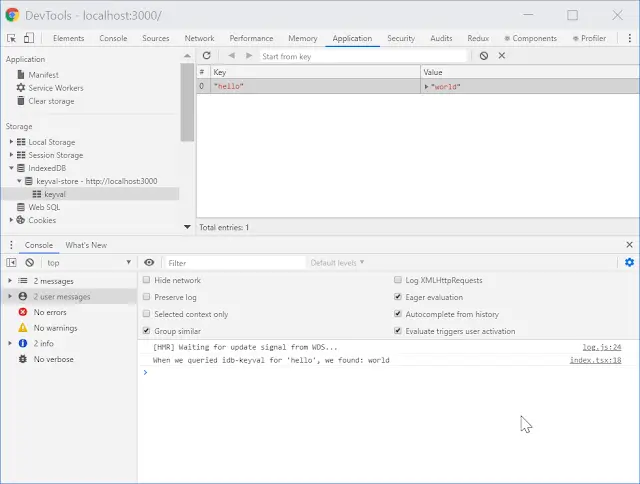

When you are building any kind of application it's typical to want to store information which persists beyond a single user session. Sometimes that will be information that you'll want to live in some kind of centralised database, but not always.

<!--truncate-->

Also, you may want that data to still be available if your user is offline. Even if they can't connect to the network, the user may still be able to use the app to do meaningful tasks; but the app will likely require a certain amount of data to drive that.

How can we achieve this in the context of a PWA?

## The problem with `localStorage`

If you were building a classic web app you'd probably be reaching for [`Window.localStorage`](https://developer.mozilla.org/en-US/docs/Web/API/Window/localStorage) at this point. `Window.localStorage` is a long existing API that stores data beyond a single session. It has a simple API and is very easy to use. However, it has a couple of problems:

1. `Window.localStorage` is synchronous. Not a tremendous problem for every app, but if you're building something that has significant performance needs then this could become an issue.
2. `Window.localStorage` cannot be used in the context of a `Worker` or a `ServiceWorker`. The APIs are not available there.
3. `Window.localStorage` stores only `string`s. Given [`JSON.stringify`](https://developer.mozilla.org/en-US/docs/Web/JavaScript/Reference/Global_Objects/JSON/stringify) and [`JSON.parse`](https://developer.mozilla.org/en-US/docs/Web/JavaScript/Reference/Global_Objects/JSON/parse) that's not a big problem. But it's an inconvenience.

The second point here is the significant one. If we've a need to access our offline data in the context of a `ServiceWorker` (and if you're offline you'll be using a `ServiceWorker`) then what do you do?

## IndexedDB to the rescue?

Fortunately, `localStorage` is not the only game in town. There's alternative offline storage mechanism available in browsers with the curious name of [IndexedDB](https://developer.mozilla.org/en-US/docs/Web/API/IndexedDB_API). To quote the docs:

> IndexedDB is a transactional database system, like an SQL-based RDBMS. However, unlike SQL-based RDBMSes, which use fixed-column tables, IndexedDB is a JavaScript-based object-oriented database. IndexedDB lets you store and retrieve objects that are indexed with a key; any objects supported by the structured clone algorithm can be stored. You need to specify the database schema, open a connection to your database, and then retrieve and update data within a series of transactions.

It's clear that IndexedDB is _very_ powerful. But it doesn't sound very simple. A further look at the [MDN example](https://github.com/mdn/to-do-notifications/blob/8b3e1708598e42062b0136608b1c5fbb66520f0a/scripts/todo.js#L48) of how to interact with IndexedDB does little to remove that thought.

We'd like to be able to access data offline; but in a simple fashion. Like we could with `localStorage` which has a wonderfully straightforward API. If only someone would build an astraction on top of IndexedDB to make our lives easier...

Someone did.

## IDB-Keyval to the rescue!

The excellent [Jake Archibald](https://twitter.com/jaffathecake) of Google has written [IDB-Keyval](https://github.com/jakearchibald/idb-keyval) which is:

> A super-simple-small promise-based keyval store implemented with IndexedDB

The API is essentially equivalent to `localStorage` with a few lovely differences:

1. The API is promise based; all functions return a `Promise`; this makes it a non-blocking API.
2. The API is not restricted to `string`s as `localStorage` is. To quote the docs: _this is IDB-backed, you can store anything structured-clonable (numbers, arrays, objects, dates, blobs etc)_
3. Because this is abstraction built on top of IndexedDB, it can be used both in the context of a typical web app and also in a `Worker` or a `ServiceWorker` if required.

## Simple usage

Let's take a look at what usage of `IDB-Keyval` might be like. For that we're going to need an application. It would be good to be able to demonstrate both simple usage and also how usage in the context of an application might look.

Let's spin up a TypeScript React app with [Create React App](https://create-react-app.dev/):

```shell
npx create-react-app offline-storage-in-a-pwa --template typescript
```

This creates us a simple app. Now let's add IDB-Keyval to it:

```shell
yarn add idb-keyval
```

Then, let's update the `index.tsx` file to add a function that tests using IDB-Keyval:

```tsx
import React from 'react';
import ReactDOM from 'react-dom';
import { set, get } from 'idb-keyval';
import './index.css';
import App from './App';
import * as serviceWorker from './serviceWorker';

ReactDOM.render(<App />, document.getElementById('root'));

serviceWorker.register();

async function testIDBKeyval() {
  await set('hello', 'world');
  const whatDoWeHave = await get('hello');
  console.log(
    `When we queried idb-keyval for 'hello', we found: ${whatDoWeHave}`,
  );
}

testIDBKeyval();
```

As you can see, we've added a `testIDBKeyval` function which does the following:

1. Adds a value of `'world'` to IndexedDB using IDB-Keyval for the key of `'hello'`
2. Queries IndexedDB using IDB-Keyval for the key of `'hello'` and stores it in the variable `whatDoWeHave`
3. Logs out what we found.

You'll also note that `testIDBKeyval` is an `async` function. This is so that we can use `await` when we're interacting with IDB-Keyval. Given that its API is `Promise` based, it is `await` friendly. Where you're performing more than an a single asynchronous operation at a time, it's often valuable to use `async` / `await` to increase the readability of your codebase.

What happens when we run our application with `yarn start`? Let's do that and take a look at the devtools:



We successfully wrote something into IndexedDB, read it back and printed that value to the console. Amazing!

## Usage in React

What we've done so far is slightly abstract. It would be good to implement a real-world use case. Let's create an application which gives users the choice between using a "Dark mode" version of the app or not. To do that we'll replace our `App.tsx` with this:

```tsx
import React, { useState } from 'react';
import './App.css';

const sharedStyles = {
  height: '30rem',
  fontSize: '5rem',
  textAlign: 'center',
} as const;

function App() {
  const [darkModeOn, setDarkModeOn] = useState(true);
  const handleOnChange = ({ target }: React.ChangeEvent<HTMLInputElement>) =>
    setDarkModeOn(target.checked);

  const styles = {
    ...sharedStyles,
    ...(darkModeOn
      ? {
          backgroundColor: 'black',
          color: 'white',
        }
      : {
          backgroundColor: 'white',
          color: 'black',
        }),
  };

  return (
    <div style={styles}>
      <input
        type="checkbox"
        value="darkMode"
        checked={darkModeOn}
        id="darkModeOn"
        name="darkModeOn"
        style={{ width: '3rem', height: '3rem' }}
        onChange={handleOnChange}
      />
      <label htmlFor="darkModeOn">Use dark mode?</label>
    </div>
  );
}

export default App;
```

When you run the app you can see how it works:


Looking at the code you'll be able to see that this is implemented using React's `useState` hook. So any user preference selected will be lost on a page refresh. Let's see if we can take this state and move it into IndexedDB using `IDB-Keyval`.

We'll change the code like so:

```tsx
import React, { useState, useEffect } from 'react';
import { set, get } from 'idb-keyval';
import './App.css';

const sharedStyles = {
  height: '30rem',
  fontSize: '5rem',
  textAlign: 'center',
} as const;

function App() {
  const [darkModeOn, setDarkModeOn] = useState<boolean | undefined>(undefined);

  useEffect(() => {
    get<boolean>('darkModeOn').then((value) =>
      // If a value is retrieved then use it; otherwise default to true
      setDarkModeOn(value ?? true),
    );
  }, [setDarkModeOn]);

  const handleOnChange = ({ target }: React.ChangeEvent<HTMLInputElement>) => {
    setDarkModeOn(target.checked);

    set('darkModeOn', target.checked);
  };

  const styles = {
    ...sharedStyles,
    ...(darkModeOn
      ? {
          backgroundColor: 'black',
          color: 'white',
        }
      : {
          backgroundColor: 'white',
          color: 'black',
        }),
  };

  return (
    <div style={styles}>
      {darkModeOn === undefined ? (
        <>Loading preferences...</>
      ) : (
        <>
          <input
            type="checkbox"
            value="darkMode"
            checked={darkModeOn}
            id="darkModeOn"
            name="darkModeOn"
            style={{ width: '3rem', height: '3rem' }}
            onChange={handleOnChange}
          />
          <label htmlFor="darkModeOn">Use dark mode?</label>
        </>
      )}
    </div>
  );
}

export default App;
```

The changes here are:

1. `darkModeOn` is now initialised to `undefined` and the app displays a loading message until `darkModeOn` has a value.
2. The app attempts to app load a value from IDB-Keyval with the key `'darkModeOn'` and set `darkModeOn` with the retrieved value. If no value is retrieved then it sets `darkModeOn` to `true`.
3. When the checkbox is changed, the corresponding value is both applied to `darkModeOn` and saved to IDB-Keyval with the key `'darkModeOn'`

As you can see, this means that we are persisting preferences beyond page refresh in a fashion that will work both online _and_ offline!


## Usage as a React hook

Finally it's time for bonus points. Wouldn't it be nice if we could move this functionality into a reusable React hook? Let's do it!

Let's create a new `usePersistedState.ts` file:

```ts
import { useState, useEffect, useCallback } from 'react';
import { set, get } from 'idb-keyval';

export function usePersistedState<TState>(
  keyToPersistWith: string,
  defaultState: TState,
) {
  const [state, setState] = useState<TState | undefined>(undefined);

  useEffect(() => {
    get<TState>(keyToPersistWith).then((retrievedState) =>
      // If a value is retrieved then use it; otherwise default to defaultValue
      setState(retrievedState ?? defaultState),
    );
  }, [keyToPersistWith, setState, defaultState]);

  const setPersistedValue = useCallback(
    (newValue: TState) => {
      setState(newValue);
      set(keyToPersistWith, newValue);
    },
    [keyToPersistWith, setState],
  );

  return [state, setPersistedValue] as const;
}
```

This new hook is modelled after the API of [`useState`](https://reactjs.org/docs/hooks-reference.html#usestate) and is named `usePersistentState`. It requires that a key be supplied which is the key that will be used to save the data. It also requires a default value to use in the case that nothing is found during the lookup.

It returns (just like `useState`) a stateful value, and a function to update it. Finally, let's switch over our `App.tsx` to use our shiny new hook:

```tsx
import React from 'react';
import './App.css';
import { usePersistedState } from './usePersistedState';

const sharedStyles = {
  height: '30rem',
  fontSize: '5rem',
  textAlign: 'center',
} as const;

function App() {
  const [darkModeOn, setDarkModeOn] = usePersistedState<boolean>(
    'darkModeOn',
    true,
  );

  const handleOnChange = ({ target }: React.ChangeEvent<HTMLInputElement>) =>
    setDarkModeOn(target.checked);

  const styles = {
    ...sharedStyles,
    ...(darkModeOn
      ? {
          backgroundColor: 'black',
          color: 'white',
        }
      : {
          backgroundColor: 'white',
          color: 'black',
        }),
  };

  return (
    <div style={styles}>
      {darkModeOn === undefined ? (
        <>Loading preferences...</>
      ) : (
        <>
          <input
            type="checkbox"
            value="darkMode"
            checked={darkModeOn}
            id="darkModeOn"
            name="darkModeOn"
            style={{ width: '3rem', height: '3rem' }}
            onChange={handleOnChange}
          />
          <label htmlFor="darkModeOn">Use dark mode?</label>
        </>
      )}
    </div>
  );
}

export default App;
```

## Conclusion

This post has demonstrate how a web application or a PWA can safely store data that is persisted between sessions using native browser capabilities easily. IndexedDB powered the solution we've built. We used used [IDB-Keyval](https://github.com/jakearchibald/idb-keyval) for the delightful and familiar abstraction it offers over IndexedDB. It's allowed us to come up with a solution with a similarly lovely API. It's worth knowing that there are alternatives to IDB-Keyval available such as [localForage](https://github.com/localForage/localForage). If you are building for older browsers which may lack good IndexedDB support then this would be a good choice. But be aware that with greater backwards compatibility comes greater download size. Do consider this and make the tradeoffs that make sense for you.

Finally, I've finished this post illustrating what usage would look like in a React context. Do be aware that there's nothing React specific about our offline storage mechanism. So if you're rolling with Vue, Angular or something else entirely: _this is for you too_! Offline storage is a feature that provide much greater user experiences. Please do consider making use of it in your applications.

[This post was originally published on LogRocket.](https://blog.logrocket.com/offline-storage-for-pwas/)

<head>
    <link rel="canonical" href="https://blog.logrocket.com/offline-storage-for-pwas/" />
</head>

[The source code for this project can be found here.](https://github.com/johnnyreilly/offline-storage-in-a-pwa)
